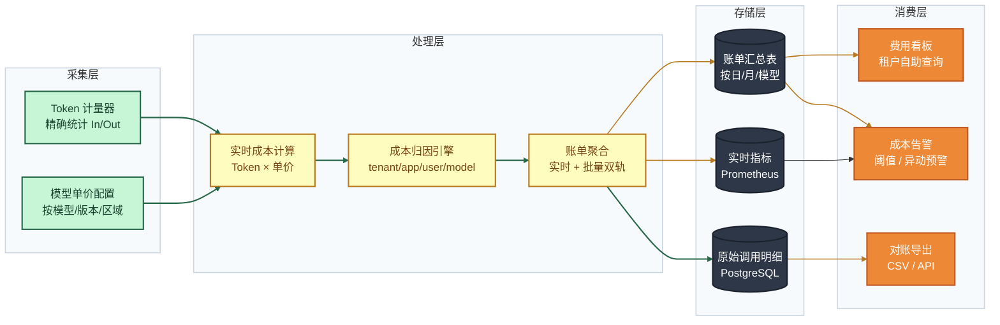
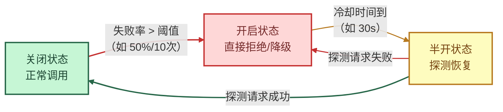

### 5.1 LLM Gateway 设计

#### 架构定位

LLM Gateway 位于 API 网关与模型调用之间，作为**统一模型调用入口**，向上对所有业务服务暴露一致的标准接口（OpenAI 兼容协议），向下透明屏蔽 OpenAI、Azure OpenAI、Claude、Gemini、通义千问、文心一言、私有部署模型等多厂商差异。它是平台成本管控、流量治理、合规审计的核心枢纽。

#### 整体架构图

```mermaid
flowchart LR
    classDef clientStyle  fill:#bee3f8,stroke:#3182ce,stroke-width:2px,color:#1a365d
    classDef pipeStyle    fill:#c6f6d5,stroke:#276749,stroke-width:2px,color:#1c4532
    classDef routeStyle   fill:#fefcbf,stroke:#b7791f,stroke-width:2px,color:#744210
    classDef modelStyle   fill:#4299e1,stroke:#2b6cb0,stroke-width:2px,color:#fff
    classDef obsStyle     fill:#ed8936,stroke:#c05621,stroke-width:2px,color:#fff
    classDef storeStyle   fill:#2d3748,stroke:#1a202c,stroke-width:2px,color:#fff
    classDef subgraphStyle fill:#f7fafc,stroke:#cbd5e0,stroke-width:1.5px

    %% ── 请求入口 ────────────────────────────────────────────────
    subgraph caller["调用方"]
        C1[Agent Runtime]:::clientStyle
        C2[工作流引擎]:::clientStyle
        C3[外部 API 调用]:::clientStyle
    end
    class caller subgraphStyle

    %% ── 请求处理管道 ────────────────────────────────────────────
    subgraph pipeline["请求处理管道（串行执行）"]
        P1[① 鉴权认证<br/>API Key / JWT / 签名]:::pipeStyle
        P2[② 身份解析<br/>租户 / 应用 / 用户]:::pipeStyle
        P3[③ 配额预检<br/>日月上限 / 模型配额]:::pipeStyle
        P4[④ 限流判定<br/>令牌桶 / 滑动窗口]:::pipeStyle
        P5[⑤ 内容安全<br/>输入注入检测 / 敏感词]:::pipeStyle
        P6[⑥ 路由决策<br/>策略选型 + 负载均衡]:::pipeStyle
    end
    class pipeline subgraphStyle

    %% ── 路由与执行 ──────────────────────────────────────────────
    subgraph routing["路由与执行层"]
        R1[模型路由器<br/>质量 / 成本 / 时延策略]:::routeStyle
        R2[流式代理<br/>SSE / Chunk 透传]:::routeStyle
        R3[熔断器<br/>状态机 + 半开探测]:::routeStyle
        R4[重试调度器<br/>指数退避 + Jitter]:::routeStyle
    end
    class routing subgraphStyle

    %% ── 模型供应商 ──────────────────────────────────────────────
    subgraph models["模型供应商"]
        M1[OpenAI / Azure]:::modelStyle
        M2[Claude / Gemini]:::modelStyle
        M3[通义 / 文心]:::modelStyle
        M4[私有部署模型]:::modelStyle
        M5[兜底模型<br/>规则 / 模板响应]:::modelStyle
    end
    class models subgraphStyle

    %% ── 后置处理 ────────────────────────────────────────────────
    subgraph postproc["后置处理管道"]
        Q1[Token 计量<br/>In / Out 精确统计]:::pipeStyle
        Q2[成本归因<br/>租户 / 应用 / 模型]:::pipeStyle
        Q3[输出安全审查<br/>PII 脱敏 / 合规过滤]:::pipeStyle
        Q4[审计落库<br/>全字段异步写入]:::pipeStyle
    end
    class postproc subgraphStyle

    %% ── 可观测性旁路 ────────────────────────────────────────────
    subgraph obs["可观测性（旁路采集）"]
        O1[Metrics<br/>QPS / 延迟 / 错误率]:::obsStyle
        O2[Tracing<br/>全链路 Trace ID]:::obsStyle
        O3[告警引擎<br/>阈值 / 异动告警]:::obsStyle
    end
    class obs subgraphStyle

    %% ── 存储层 ──────────────────────────────────────────────────
    subgraph store["存储层"]
        S1[(Redis<br/>限流计数器<br/>配额缓存)]:::storeStyle
        S2[(PostgreSQL<br/>账单 / 审计日志)]:::storeStyle
        S3[(配置中心<br/>路由策略 / 模型配置)]:::storeStyle
    end
    class store subgraphStyle

    %% ── 主流程连线 ──────────────────────────────────────────────
    C1 & C2 & C3 -->|统一 OpenAI 兼容协议| P1
    P1 --> P2 --> P3 --> P4 --> P5 --> P6
    P6 --> R1
    R1 -->|主路由| R2
    R2 -->|流式/非流式| M1 & M2 & M3 & M4
    R3 -->|熔断触发| M5
    R4 -->|重试| R2

    M1 & M2 & M3 & M4 -->|响应流| Q1 --> Q2 --> Q3 --> Q4
    R1 & R2 & R3 -.->|指标采集| O1 & O2
    O1 & O2 --> O3

    P3 & P4 <-->|读写| S1
    Q2 & Q4 -->|写入| S2
    R1 <-->|读取| S3

    linkStyle 0,1,2 stroke:#3182ce,stroke-width:2px
    linkStyle 3,4,5,6,7,8,9,10 stroke:#276749,stroke-width:2px
    linkStyle 11,12,13 stroke:#b7791f,stroke-width:2px
    linkStyle 14,15 stroke:#c05621,stroke-width:1.5px,stroke-dasharray:4 4
```



#### 执行顺序（精细版）

```
请求入口（OpenAI 兼容协议）
  → ① 鉴权认证（API Key / JWT / 租户签名）
  → ② 身份解析（提取 tenant_id / app_id / user_id）
  → ③ 配额预检（读 Redis，超限则 429）
  → ④ 限流判定（滑动窗口 QPS + Token 速率双轨判定）
  → ⑤ 输入安全（注入检测 / 敏感词拦截）
  → ⑥ 路由决策（策略选型 → 目标模型）
  → ⑦ 调用执行（流式代理 / 非流式转发 / 重试 / 熔断）
  → ⑧ Token 计量（精确统计 prompt_tokens / completion_tokens）
  → ⑨ 成本归因（按模型单价计算，写入账单队列）
  → ⑩ 输出安全（PII 脱敏 / 合规内容过滤）
  → ⑪ 审计落库（全字段异步写入 PostgreSQL）
  → 响应返回调用方
```

---

#### 5.1.1 多模型鉴权设计

LLM Gateway 需同时管理对**上游调用方**的鉴权（谁可以调用网关）和对**下游模型供应商**的凭证管理（网关如何访问各模型）。

##### 上游鉴权（调用方 → 网关）

| 鉴权方式 | 适用场景 | 实现机制 |
|----------|----------|----------|
| **API Key** | 服务间调用、SDK 接入 | HMAC-SHA256 签名，支持 Key 轮换与过期策略 |
| **JWT Bearer** | 用户侧 Web/App 调用 | RS256 非对称验签，Claims 携带 tenant/app/role |
| **租户签名** | 企业客户 OpenAPI 调用 | 请求参数 + 时间戳 + 密钥三要素签名防重放 |
| **内部 Service Token** | 平台内部服务调用 | mTLS + 短生命周期 Token，Sidecar 自动刷新 |

**Key 生命周期管理**：

```
创建 → 激活 → [使用中] → 临近过期预警（T-7天）→ 轮换（新旧双活7天）→ 失效
                              ↑                                        ↓
                         主动吊销（泄露 / 离职 / 违规）           审计归档
```

##### 下游凭证管理（网关 → 模型供应商）

| 机制 | 描述 |
|------|------|
| **集中密钥库** | 所有模型 API Key / 访问令牌统一存储于 Vault（HashiCorp Vault 或云 KMS），网关动态读取，不硬编码 |
| **按供应商隔离** | 每个模型供应商维护独立凭证池，支持多 Key 轮询分压（避免单 Key 触及供应商速率上限） |
| **凭证自动轮换** | 支持定时轮换与告警触发轮换，轮换期间无损切换（双活窗口） |
| **访问审计** | 凭证每次读取均记录操作人、时间戳、用途，满足安全合规审计要求 |

---

#### 5.1.2 流式限流设计

流式请求（SSE / Chunked）的特殊性在于：**请求开始时 Token 数量未知**，传统 QPS 限流无法精确控制 Token 消耗速率，需要双轨限流机制。

##### 限流维度矩阵

| 维度 | 限流指标 | 算法 | 存储 |
|------|----------|------|------|
| **租户级** | QPS + 并发数 + 日 Token 上限 | 滑动窗口 + 令牌桶 | Redis Cluster |
| **应用级** | QPS + 并发数 + 模型级配额 | 滑动窗口 | Redis |
| **用户级** | QPS + 分钟 Token 速率 | 漏桶 | Redis |
| **模型级** | 全局并发上限（保护下游供应商配额） | 信号量计数器 | Redis |

##### 流式 Token 速率限流（核心机制）

```
请求到达
  → 预扣 min_tokens（如 100 Token 作为启动额度）
  → 建立流式连接，开始接收 Chunk
  → 每 N 个 Chunk（或每 K ms）执行一次速率检测：
      当前实际消耗速率 > 限制速率？
        是 → 暂停消费（背压），等待令牌补充
        否 → 继续透传
  → 流结束后，精确结算实际 Token，补偿预扣差额
  → 更新 Redis 计数器（滑动窗口 + 配额）
```

**令牌桶参数示例**（可按租户等级差异化配置）：

| 等级 | Token/min | Burst 上限 | 并发数 |
|------|-----------|------------|--------|
| 免费版 | 20,000 | 5,000 | 3 |
| 专业版 | 200,000 | 50,000 | 20 |
| 企业版 | 2,000,000 | 500,000 | 200 |
| 私有部署 | 无上限（可配）| 无上限（可配）| 无上限（可配）|

##### 限流响应规范

| 场景 | HTTP 状态 | 响应头 | 说明 |
|------|-----------|--------|------|
| QPS 超限 | `429 Too Many Requests` | `Retry-After: N` | 告知客户端等待时间 |
| 配额耗尽 | `429` | `X-Quota-Reset: timestamp` | 告知配额重置时间 |
| 并发超限 | `429` | `X-Concurrent-Limit: N` | 告知当前并发上限 |
| 模型过载 | `503 Service Unavailable` | `X-Fallback-Model: xxx` | 触发降级，返回备选模型标识 |

---

#### 5.1.3 计费监控设计

##### 计费数据流



##### 成本归因字段模型

每笔调用记录以下字段，支持多维度切片分析：

```
tenant_id       租户标识
app_id          应用标识
user_id         用户标识（可匿名化）
request_id      请求唯一 ID（全链路追踪）
model           模型标识（openai/gpt-4o、anthropic/claude-3-5-sonnet 等）
model_version   模型版本
prompt_tokens   输入 Token 数
completion_tokens 输出 Token 数
total_tokens    总 Token 数
price_in        输入单价（USD/1K Token）
price_out       输出单价（USD/1K Token）
cost_usd        本次调用成本（美元）
cost_cny        本次调用成本（人民币，按汇率换算）
latency_ms      端到端延迟（毫秒）
ttft_ms         首 Token 延迟（流式场景）
is_stream       是否流式调用
is_fallback     是否触发降级
fallback_model  降级目标模型（触发时填写）
status          调用状态（success / error / timeout / fallback）
error_code      错误码（失败时）
timestamp       调用时间戳（UTC）
```

##### 成本预警规则

| 预警类型 | 触发条件 | 通知方式 |
|----------|----------|----------|
| **消耗速率异常** | 1小时内消耗 > 日均值 × 3 | 站内消息 + 邮件 |
| **配额临近耗尽** | 月配额使用率 ≥ 80% | 站内消息 + 邮件 + Webhook |
| **配额即将耗尽** | 月配额使用率 ≥ 95% | 站内消息 + 邮件 + 短信 |
| **单次调用超费** | 单次 cost > 阈值（可配置）| 实时告警 + 日志标记 |
| **模型单价变动** | 供应商调价检测 | 管理员通知 |

---

#### 5.1.4 降级策略设计

##### 熔断器状态机



##### 降级决策树

```
模型调用异常触发
  ├─ [超时] latency > timeout_ms
  │    → 重试 1 次（指数退避 + Jitter）
  │    → 仍超时 → 切换同质量备选模型
  │    → 无备选 → 返回 503 + 降级标记
  │
  ├─ [限速] 供应商返回 429
  │    → 切换同租户下其他 Key（Key 池轮询）
  │    → Key 池耗尽 → 切换备选模型
  │    → 计入限速事件，触发告警
  │
  ├─ [服务不可用] 5xx / 连接失败
  │    → 熔断器计数 +1
  │    → 达到阈值 → 熔断器开启，转备选模型
  │    → 无备选 → 兜底响应（规则模板 / 静态回复）
  │
  └─ [内容违规] 供应商返回内容审核拒绝
       → 不重试，直接返回安全提示语
       → 记录违规日志，触发安全审计
```

##### 备选模型优先级配置

| 主模型 | 第一备选 | 第二备选 | 兜底 |
|--------|----------|----------|------|
| GPT-4o | Claude 3.5 Sonnet | Gemini 1.5 Pro | GPT-4o-mini |
| GPT-4o-mini | 通义 Qwen-Plus | 文心4.0 Turbo | 规则模板响应 |
| Claude 3.5 Sonnet | GPT-4o | Gemini 1.5 Pro | GPT-4o-mini |
| 私有部署模型 | 通义 Qwen-Plus | GPT-4o-mini | 规则模板响应 |

> **配置原则**：备选模型按「能力相近 → 成本可控 → 供应商多样化」三原则排序，避免主备同源导致级联故障。

---

#### 5.1.5 核心能力总览

| 能力域 | 核心能力 | 关键指标 |
|--------|----------|----------|
| **鉴权认证** | API Key / JWT / 租户签名 / mTLS | 鉴权失败率 < 0.01% |
| **流量治理** | 租户/应用/用户/模型四维限流，令牌桶+滑动窗口双算法 | 限流准确率 > 99.9% |
| **配额管理** | 日/月/突发配额，模型级独立配额池，实时扣减 | 配额超用率 < 0.1% |
| **计费计量** | Token 精确统计，多维归因，实时+批量双轨账单 | 计费误差 < 0.5% |
| **路由策略** | 质量优先 / 成本优先 / 时延优先，支持 A/B 分流 | 路由决策延迟 < 5ms |
| **熔断降级** | 三态熔断器，多级备选链路，兜底规则响应 | 降级覆盖率 100% |
| **流式支持** | SSE/Chunked 全链路透传，流式背压，首 Token 延迟监控 | TTFT P95 < 800ms |
| **安全审计** | 全字段异步落库，Trace ID 全链路串联 | 审计覆盖率 100% |

#### 审计数据字段（完整版）

每次模型调用异步写入审计库，包含以下字段：

`tenant_id` · `app_id` · `user_id` · `request_id` · `trace_id` · `model` · `model_version` · `prompt_tokens` · `completion_tokens` · `cost_usd` · `latency_ms` · `ttft_ms` · `is_stream` · `is_fallback` · `fallback_model` · `status` · `error_code` · `timestamp`

---

