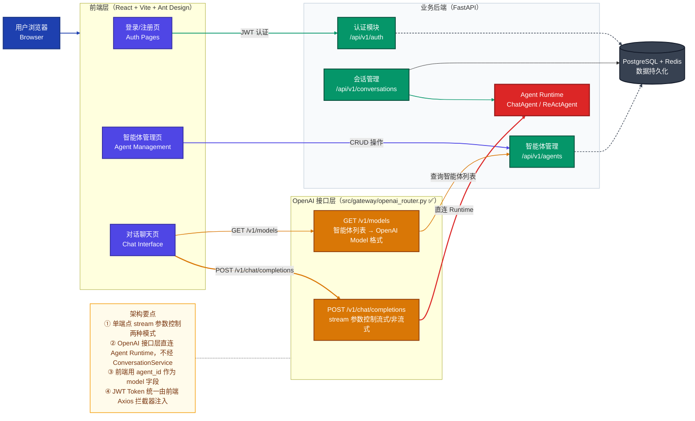
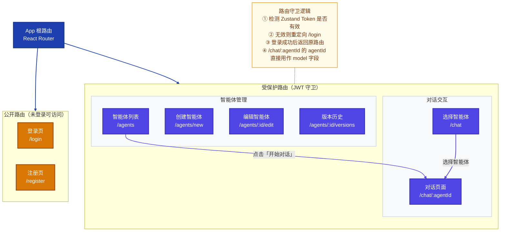
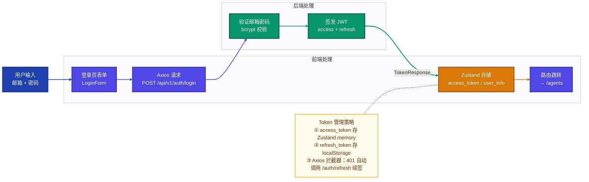
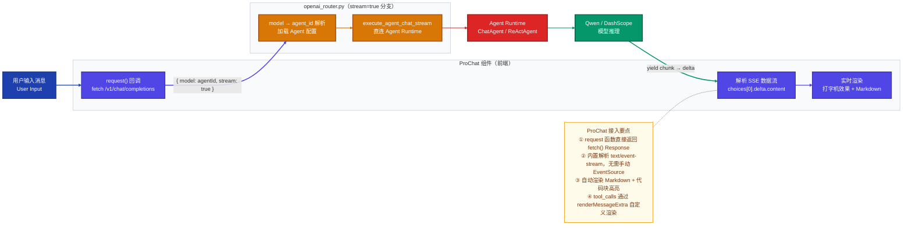

# AgentBasePlatform MVP 前端可视化方案设计

> **文档版本**：v1.1  
> **适用阶段**：Phase 1 — MVP 闭环  
> **核心目标**：在现有后端基础上实现 OpenAI 兼容接口层（`src/gateway/openai_router.py`），并实现轻量原生前端，完整展示"智能体管理 + 对话交互"核心链路  
> **更新说明**：v1.1 同步 OpenAI 接口层实际实现 — 单端点统一 stream 参数、直连 Agent Runtime、旧 `/chat` 双接口已移除

---

## 一、整体方案架构



---

## 二、OpenAI 兼容接口层（✅ 已实现）

### 2.1 设计原则

在 `src/gateway/openai_router.py` 中实现，注册路径前缀 `/v1`，**直接调用 `runtime.engine`**，不经过 `ConversationService`，无会话持久化开销，专为前端对话交互优化。

| 原则 | 说明 |
|------|------|
| **单端点双模式** | `POST /v1/chat/completions` 一个接口，`stream` 参数控制返回完整 JSON 还是 SSE 流，与标准 OpenAI 行为完全一致 |
| **model = agent_id** | 请求中的 `model` 字段填写 `agent_id`（UUID），通过 `GET /v1/models` 获取可用列表 |
| **直连 Runtime** | 绕过 ConversationService，直接调用 `execute_agent_chat_with_meta` / `execute_agent_chat_stream` |
| **平台扩展字段** | 响应中附加 `agent_id / agent_name / agent_type / tool_calls`，前端可直接展示工具调用信息 |

### 2.2 接口规范

| 接口 | 说明 |
|------|------|
| `POST /v1/chat/completions` | `stream: false` → 完整 `chat.completion` JSON；`stream: true` → SSE，每 chunk 为 `chat.completion.chunk` 格式，终止符 `data: [DONE]` |
| `GET /v1/models` | 返回当前租户所有智能体，`id` 字段即为 `model` 字段的值，含扩展字段 `name` / `agent_type` |

### 2.3 请求/响应流程

```mermaid
flowchart LR
    %% ── 配色定义 ────────────────────────────────────────────────
    classDef clientStyle   fill:#1e40af,stroke:#1e3a8a,stroke-width:2.5px,color:#fff
    classDef gatewayStyle  fill:#d97706,stroke:#92400e,stroke-width:2px,color:#fff
    classDef runtimeStyle  fill:#dc2626,stroke:#991b1b,stroke-width:2.5px,color:#fff
    classDef llmStyle      fill:#059669,stroke:#064e3b,stroke-width:2px,color:#fff
    classDef noteStyle     fill:#fffbeb,stroke:#f59e0b,stroke-width:1.5px,color:#78350f
    classDef layerStyle    fill:#f8fafc,stroke:#cbd5e0,stroke-width:1.5px

    %% ── 请求入口 ─────────────────────────────────────────────────
    REQ["POST /v1/chat/completions<br>{ model, messages, stream }"]:::clientStyle

    %% ── OpenAI 接口层处理 ────────────────────────────────────────
    subgraph Gateway["openai_router.py"]
        direction LR
        GW1["解析 model → agent_id<br>UUID 校验 + DB 查询"]:::gatewayStyle
        GW2{"stream<br>参数判断"}:::gatewayStyle
        GW3["非流式<br>execute_agent_chat_with_meta"]:::gatewayStyle
        GW4["流式<br>execute_agent_chat_stream"]:::gatewayStyle
    end
    class Gateway layerStyle

    %% ── Agent Runtime ────────────────────────────────────────────
    subgraph Runtime["Agent Runtime"]
        direction LR
        RT1["ChatAgent<br>直接对话"]:::runtimeStyle
        RT2["ReActAgent<br>工具调用 + MCP"]:::runtimeStyle
    end
    class Runtime layerStyle

    LLM["Qwen / DashScope<br>模型推理"]:::llmStyle

    %% ── 响应输出 ─────────────────────────────────────────────────
    RESP_JSON["chat.completion JSON<br>choices[0].message.content"]:::clientStyle
    RESP_SSE["SSE 流<br>choices[0].delta.content<br>→ data: [DONE]"]:::clientStyle

    %% ── 主流程 ───────────────────────────────────────────────────
    REQ --> GW1
    GW1 --> GW2
    GW2 -->|"false"| GW3
    GW2 -->|"true"| GW4
    GW3 --> Runtime
    GW4 --> Runtime
    Runtime --> LLM
    LLM -->|"完整响应"| RESP_JSON
    LLM -->|"yield chunk"| RESP_SSE

    %% ── 注记 ─────────────────────────────────────────────────────
    NOTE["平台扩展字段（两种模式均包含）<br>agent_id / agent_name / agent_type<br>tool_calls（ReActAgent 工具调用记录）"]:::noteStyle
    NOTE -.- RESP_JSON

    %% 边索引：0-8，共 9 条
    linkStyle 0 stroke:#1e40af,stroke-width:2px
    linkStyle 1 stroke:#d97706,stroke-width:2px
    linkStyle 2 stroke:#d97706,stroke-width:2px
    linkStyle 3 stroke:#d97706,stroke-width:2px
    linkStyle 4 stroke:#dc2626,stroke-width:2px
    linkStyle 5 stroke:#dc2626,stroke-width:2px
    linkStyle 6 stroke:#059669,stroke-width:2px
    linkStyle 7 stroke:#059669,stroke-width:2px
    linkStyle 8 stroke:#059669,stroke-width:2.5px
```



### 2.4 响应格式规范

**非流式响应（stream: false）：**
```json
{
  "id": "chatcmpl-<uuid>",
  "object": "chat.completion",
  "created": 1743000000,
  "model": "qwen-max",
  "choices": [{
    "index": 0,
    "message": { "role": "assistant", "content": "回复内容" },
    "finish_reason": "stop"
  }],
  "usage": { "prompt_tokens": 0, "completion_tokens": 0, "total_tokens": 0 },
  "agent_id": "<uuid>",
  "agent_name": "我的助手",
  "agent_type": "react",
  "tool_calls": [{ "name": "execute_python_code", "arguments": {}, "result": "..." }]
}
```

**流式响应（stream: true），每个 SSE chunk：**
```
data: {"id":"chatcmpl-xxx","object":"chat.completion.chunk","created":1743000000,"model":"qwen-max","choices":[{"index":0,"delta":{"content":"Hello"},"finish_reason":null}]}

data: {"id":"chatcmpl-xxx","object":"chat.completion.chunk","created":1743000000,"model":"qwen-max","choices":[{"index":0,"delta":{},"finish_reason":"stop"}]}

data: [DONE]
```

**models 接口响应：**
```json
{
  "object": "list",
  "data": [
    { "id": "<agent_id>", "object": "model", "created": 1743000000,
      "owned_by": "<tenant_id>", "name": "我的助手", "agent_type": "chat" }
  ]
}
```

---

## 三、前端工程设计

### 3.1 技术栈

| 层级 | 技术选型 | 用途 |
|------|---------|------|
| 构建工具 | **Vite 5** | 秒级热更新，开箱即用 TypeScript |
| UI 框架 | **React 18** | 组件化，生态完善 |
| 组件库 | **Ant Design 5** | Table / Form / Layout 等业务组件 |
| 聊天组件 | **@ant-design/pro-chat** | 原生支持 SSE 流式对话，Markdown 渲染 |
| 路由 | **React Router 6** | 页面路由与权限守卫 |
| 状态管理 | **Zustand** | 轻量全局状态（Token / 用户信息） |
| HTTP 请求 | **Axios** | 请求拦截器统一注入 JWT |
| 样式 | **Tailwind CSS** | 局部样式补充，与 Ant Design 配合 |

### 3.2 前端页面结构



### 3.3 工程目录结构

```
frontend/
├── src/
│   ├── api/
│   │   ├── auth.ts           # POST /api/v1/auth/login|register|refresh
│   │   ├── agents.ts         # GET/POST/PUT/DELETE /api/v1/agents
│   │   └── openai.ts         # POST /v1/chat/completions  GET /v1/models
│   ├── store/
│   │   └── auth.ts           # Zustand：access_token / user_info
│   ├── pages/
│   │   ├── Login/
│   │   ├── Register/
│   │   ├── Agents/           # 智能体列表、创建、编辑、版本历史
│   │   └── Chat/             # 智能体选择 + 对话页
│   ├── components/
│   │   ├── Layout/           # 侧边栏 + 顶部导航
│   │   ├── AgentCard/        # 智能体卡片（含 agent_type Badge）
│   │   └── ToolCallPanel/    # tool_calls 折叠展示面板
│   └── router/
│       └── index.tsx         # 路由配置 + JWT 守卫
```

---

## 四、核心交互流程

### 4.1 登录鉴权流程



### 4.2 对话 SSE 流式交互流程



---

## 五、关键页面说明

### 5.1 智能体列表页（/agents）

- 使用 Ant Design **ProTable** 展示智能体列表，列：名称、类型（chat/react）、状态、版本号、创建时间、操作
- 支持按名称搜索过滤、分页
- 操作列：编辑、发布版本、查看版本历史、**直接进入对话**（跳转 `/chat/:agentId`）
- 新建按钮跳转创建页

### 5.2 创建/编辑智能体页（/agents/new 或 /agents/:id/edit）

- 使用 Ant Design **ProForm** 构建表单
- 字段：名称、描述、类型（Radio 选择 chat/react）、System Prompt（TextArea）、模型配置（model_name / temperature / max_tokens）
- react 类型额外展示工具配置区（builtin_tools / MCP server 配置）

### 5.3 对话页（/chat/:agentId）

- URL 中的 `agentId` 直接作为 `POST /v1/chat/completions` 的 `model` 字段
- 顶部：通过 `GET /v1/models` 获取智能体信息，展示名称和类型 Badge
- 主区域：**ProChat** 聊天组件
  - 消息区自动渲染 Markdown、代码块高亮
  - react 类型对话在 AI 消息下方折叠展示**工具调用面板**（来自响应扩展字段 `tool_calls`）
  - 底部输入框支持换行（Shift+Enter）、发送按钮、停止生成

---

## 六、实施路径

| 阶段 | 任务 | 状态 |
|------|------|------|
| **OpenAI 接口层** | `src/gateway/openai_router.py`，实现 `/v1/chat/completions`（stream 双模式）和 `/v1/models` | ✅ 已完成 |
| **前端脚手架** | Vite + React + Ant Design + ProChat 初始化，配置 Axios 拦截器、路由守卫、Zustand | 预计 0.5 天 |
| **登录/注册页** | 对接 `/api/v1/auth/login` 和 `/api/v1/auth/register` | 预计 0.5 天 |
| **智能体管理页** | 列表、创建、编辑、版本历史，对接 `/api/v1/agents/` | 预计 1 天 |
| **对话聊天页** | ProChat 接入 `/v1/chat/completions`，工具调用面板，路由跳转 | 预计 1 天 |
| **联调与收尾** | CORS 配置、错误提示、基础样式打磨 | 预计 0.5 天 |
| **前端合计** | — | **约 3.5 天** |

---

## 七、设计约束与注意事项

| 约束 | 说明 |
|------|------|
| **无会话持久化** | `/v1/chat/completions` 直连 Agent Runtime，不写入 `conversations` / `messages` 表；多轮上下文由前端通过 `messages` 数组传递 |
| **model 字段** | 必须是有效的 `agent_id`（UUID），无效时返回 404；通过 `GET /v1/models` 枚举可用列表 |
| **CORS 配置** | FastAPI 已有 `CORSMiddleware`（DEBUG 模式 `allow_origins=["*"]`），前端开发期使用 Vite `proxy` 转发，生产由 Nginx 统一处理 |
| **ProChat 兼容性** | `request` 回调直接返回原生 `fetch()` 的 `Response` 对象，ProChat 自动处理 `text/event-stream` 解析，无需手动 EventSource |
| **tool_calls 展示** | 来自响应扩展字段，通过 `renderMessageExtra` 自定义渲染，不影响主对话消息流 |
| **MVP 不做的事** | 不实现用户设置页、多租户管理、API Key 管理、RAG 知识库（Phase 2 补充） |
