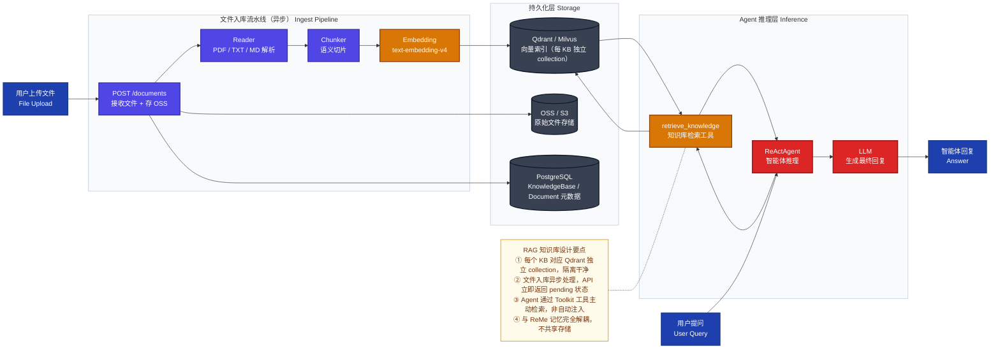

现在我对项目有了完整认识。你们已经有了：
- `agentscope.rag`（`SimpleKnowledge` + `QdrantStore` + `TextReader/PDFReader`）作为 RAG 底层能力
- FastAPI 后端（`src/` 目录，已有 `agent`/`conversation`/`auth` 模块）
- ReMe 做记忆管理（短期/长期，绑定会话）

下面给你完整的 RAG 知识库模块设计方案。

---

## 核心区分：记忆 vs 知识库

| 维度 | ReMe 记忆模块 | RAG 知识库模块 |
|------|--------------|---------------|
| **数据来源** | 对话历史自动产生 | 用户主动上传文件 |
| **生命周期** | 绑定会话/用户，自动压缩 | 独立持久存在，手动管理 |
| **写入方式** | 自动（对话后异步写入） | 主动（文件上传 → 解析 → 入库）|
| **归属** | 用户级（个人记忆） | 知识库级（可共享给多个 Agent）|
| **检索触发** | 推理前钩子自动检索 | Agent 显式调用 `retrieve_knowledge` 工具 |
| **存储** | Markdown 文件 + FileStore | 向量数据库（Qdrant/Milvus）+ 元数据库 |

---

## 设计方案

### 一、模块结构（贴合现有 `src/` 风格）

```
src/
├── knowledge/               ← 新增 RAG 知识库模块
│   ├── __init__.py
│   ├── models.py            ← DB 模型（KnowledgeBase, Document）
│   ├── schemas.py           ← Pydantic 请求/响应 Schema
│   ├── router.py            ← API 路由
│   ├── service.py           ← 业务逻辑
│   └── pipeline.py          ← 解析→分块→向量化→入库 流水线
├── agent/
│   └── models.py            ← 新增 AgentKnowledge 关联表
```

### 二、数据库模型设计

```python
# src/knowledge/models.py

class KnowledgeBase(BaseModel):
    __tablename__ = "knowledge_bases"

    tenant_id: UUID          # 多租户隔离
    creator_id: UUID
    name: str                # "产品手册知识库"
    description: str
    status: str              # building / ready / error
    embed_model: str         # "text-embedding-v4"
    vector_store_config: dict  # Qdrant 连接配置（collection_name 等）
    doc_count: int           # 文档数量（冗余字段，方便展示）
    chunk_count: int         # 切片总数

class Document(BaseModel):
    __tablename__ = "kb_documents"

    kb_id: UUID              # 所属知识库
    filename: str            # 原始文件名
    file_type: str           # pdf / txt / md / docx
    file_size: int           # 字节数
    object_key: str          # OSS/S3 存储路径
    status: str              # pending / parsing / indexed / error
    chunk_count: int         # 该文档切片数
    error_msg: str           # 解析失败原因
    metadata: dict           # 自定义元数据（如文档标签）

# src/agent/models.py（新增关联）
class AgentKnowledge(BaseModel):
    __tablename__ = "agent_knowledge_bases"

    agent_id: UUID
    kb_id: UUID
    priority: int            # 多知识库时的检索优先级
```

### 三、API 端点设计

```
# 知识库管理
POST   /knowledge-bases                    创建知识库
GET    /knowledge-bases                    列表（分页）
GET    /knowledge-bases/{kb_id}            详情
PATCH  /knowledge-bases/{kb_id}            更新
DELETE /knowledge-bases/{kb_id}            删除（含清理向量）

# 文档管理
POST   /knowledge-bases/{kb_id}/documents  上传文件（multipart）
GET    /knowledge-bases/{kb_id}/documents  文档列表
DELETE /knowledge-bases/{kb_id}/documents/{doc_id}  删除文档

# Agent 绑定
POST   /agents/{agent_id}/knowledge-bases  绑定知识库
DELETE /agents/{agent_id}/knowledge-bases/{kb_id}  解绑

# 检索（调试用）
POST   /knowledge-bases/{kb_id}/retrieve   直接检索测试
```

### 四、核心流水线（`pipeline.py`）

```python
# src/knowledge/pipeline.py
# 文件上传后的异步处理流程

async def index_document(doc_id: UUID):
    # 1. 从 OSS/S3 下载文件
    file_bytes = await storage.download(doc.object_key)

    # 2. 按文件类型选择 Reader（复用 agentscope.rag）
    reader = {
        "pdf":  PDFReader(chunk_size=512, split_by="sentence"),
        "txt":  TextReader(chunk_size=512),
        "md":   TextReader(chunk_size=512),
    }[doc.file_type]

    # 3. 解析 → 切片
    chunks = await reader(file_path=tmp_path)

    # 4. 写入向量库（复用 agentscope.rag.SimpleKnowledge）
    knowledge = get_knowledge_instance(kb_id)  # 每个 KB 对应独立 collection
    await knowledge.add_documents(chunks)

    # 5. 更新 Document.status = "indexed"
```

### 五、与 Agent 的集成方式

```python
# Agent 推理时，自动注入绑定的知识库作为 tool
async def build_agent_with_knowledge(agent_id):
    kb_list = await get_agent_knowledge_bases(agent_id)

    toolkit = Toolkit()
    for kb in kb_list:
        knowledge = get_knowledge_instance(kb.kb_id)
        toolkit.register_tool_function(
            knowledge.retrieve_knowledge,
            func_description=f"从《{kb.name}》知识库检索相关内容",
        )

    return ReActAgent(
        ...,
        toolkit=toolkit,   # 知识库作为工具，Agent 自主决策何时检索
    )
```

---

### 六、整体架构流程图



---

### 七、关键决策点

**向量库选型**（推荐按场景）：

| 场景 | 推荐 | 理由 |
|------|------|------|
| 开发/小规模 | `QdrantStore(location=":memory:")` 或 MilvusLite | 零依赖，agentscope 已有示例 |
| 生产/持久化 | Qdrant Docker 或 阿里云 OpenSearch | 项目已有 `alibabacloud_mysql_vector` 示例 |
| 已有 PostgreSQL | pgvector 扩展 | 减少基础设施，统一到现有 PG |

**文件解析**（`agentscope.rag` 已内置）：

```python
from agentscope.rag import TextReader, PDFReader
# 后续可扩展 DOCX → 自定义 Reader
```

**异步入库**：文件上传接口立即返回 `doc_id + status=pending`，后台用 Celery/ARQ 异步执行解析入库流程，前端轮询 `GET /documents/{doc_id}` 查状态。

这样知识库作为 Agent 的一个「可插拔工具」存在，记忆归记忆（ReMe 管），知识库归知识库（自建 RAG 管），职责完全分离。