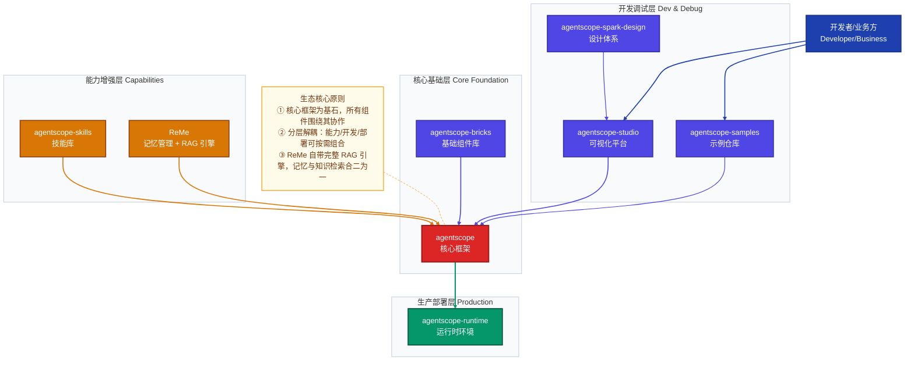
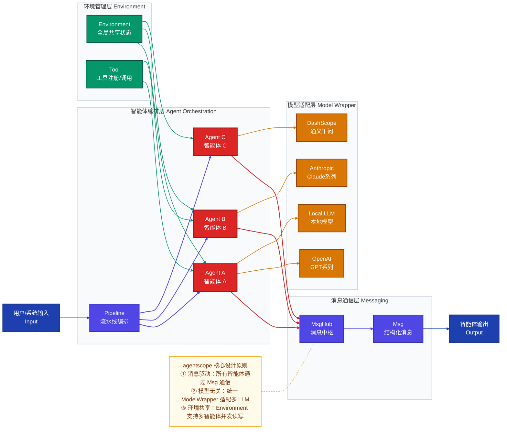
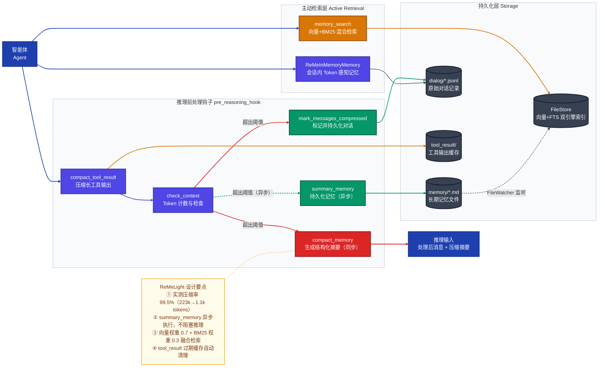
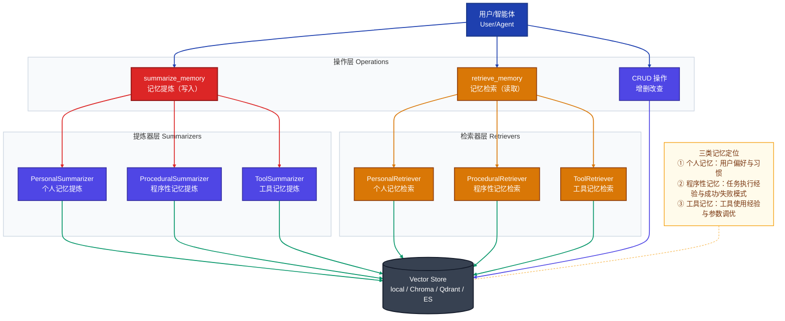
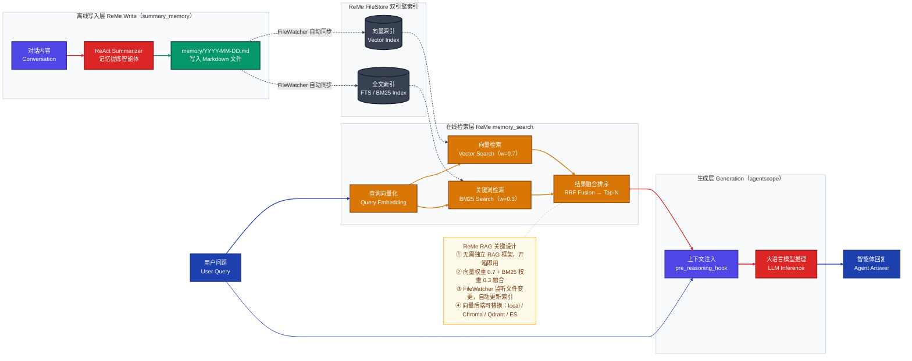
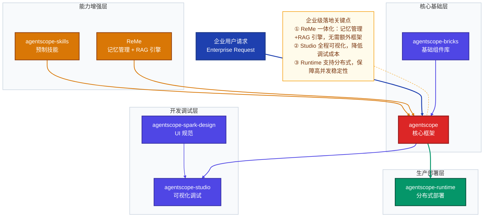

## AgentScope 生态体系全解析（2026 重整版）

> 本文系统梳理 AgentScope 开源生态的核心构成，涵盖核心框架、记忆管理（ReMe，自带完整 RAG 引擎）、可视化平台、运行时部署等关键模块，并以 Mermaid 架构图辅助理解各模块定位与协作关系。

---

## 一、AgentScope 生态核心定位

AgentScope 是面向**多智能体（Multi-Agent）应用开发**的一站式开源生态体系，核心目标是降低多智能体系统的开发、调试、部署、运维门槛，覆盖从「基础开发」到「生产落地」的全生命周期。

**生态演进方向**：从「多智能体框架」向「完整智能体基础设施」升级。新增的 ReMe 记忆管理套件自带完整 RAG 引擎（FileStore 向量+FTS 双引擎 + `memory_search` 混合检索），**知识库 RAG 能力由 ReMe 原生提供**，无需额外引入独立的 RAG 框架，形成「框架 + 记忆/RAG + 工具 + 部署」四位一体的完整能力矩阵。

---

## 二、生态核心仓库及功能定位

| 仓库 | 组件名称 | 层次 | 核心功能 |
|------|----------|------|----------|
| [agentscope](https://github.com/agentscope-ai/agentscope) | 核心框架 | 生态基石 | 智能体定义与管理、多智能体消息通信/协作机制、LLM 适配与调用、Environment 管理 |
| [agentscope-bricks](https://github.com/agentscope-ai/agentscope-bricks) | 基础组件库 | 基础支撑 | 消息解析、模型适配器、配置管理器、日志/监控工具、跨组件复用基础模块 |
| [ReMe](https://github.com/agentscope-ai/ReMe) | 记忆管理套件<br>**（含完整 RAG 引擎）** | 能力增强 | 文件型长期记忆（ReMeLight）+ 向量型记忆（Vector Based）；**自带完整 RAG 能力**：FileStore 提供向量+FTS 双引擎索引，`memory_search` 实现向量（权重 0.7）+BM25（权重 0.3）混合检索，向量存储支持 local/Chroma/Qdrant/ES；LoCoMo 基准综合得分 86.23，优于所有对比方法 |
| [agentscope-skills](https://github.com/agentscope-ai/agentscope-skills) | 技能库 | 能力增强 | 预制技能（文本总结、代码生成、工具调用等）、技能注册/调用标准化，无需重复开发通用能力 |
| [agentscope-studio](https://github.com/agentscope-ai/agentscope-studio) | 可视化开发平台 | 开发工具 | 图形化配置智能体、实时调试多智能体交互过程、可视化监控消息流转/日志 |
| [agentscope-samples](https://github.com/agentscope-ai/agentscope-samples) | 示例仓库 | 开发工具 | 覆盖客服、代码助手、多智能体协作任务等典型案例，可直接运行，快速理解多智能体开发模式 |
| [agentscope-runtime](https://github.com/agentscope-ai/agentscope-runtime) | 运行时环境 | 生产部署 | 多智能体应用部署调度、单机/分布式运行、应用生命周期监控与故障恢复 |
| [agentscope-spark-design](https://github.com/agentscope-ai/agentscope-spark-design) | 设计体系 | 体验规范 | 统一 UI 组件库与视觉风格规范，适配 Studio 等生态产品定制化开发，保障交互一致性 |

---

## 三、生态全局架构图

> 展示 AgentScope 生态各组件分层定位与核心协作关系，新增 ReMe 记忆层与知识库 RAG 模块



---

## 四、核心框架（agentscope）能力架构

agentscope 作为生态基石，提供四大核心能力支柱：

| 能力支柱 | 关键模块 | 说明 |
|----------|----------|------|
| **智能体管理** | Agent / Pipeline | 智能体定义、生命周期管理、流水线编排 |
| **消息通信** | Msg / MsgHub | 结构化消息格式、多智能体广播/点对点通信 |
| **模型适配** | ModelWrapper | 统一接口适配 OpenAI、Claude、通义等主流 LLM |
| **环境管理** | Environment | 全局共享状态管理，支持多智能体并发访问 |



---

## 五、ReMe 记忆管理模块

### 5.1 ReMe 两大子系统对比

ReMe（Remember Me, Refine Me）是专为 AI 智能体设计的记忆管理框架，解决两大核心痛点：**上下文窗口受限**（长对话早期信息截断/丢失）与**无状态会话**（新会话无法继承历史）。

| 维度 | ReMeLight（文件型） | ReMe Vector Based（向量型） |
|------|--------------------|-----------------------------|
| 存储形式 | Markdown 文件（可读可编辑） | 向量数据库（语义索引） |
| 迁移方式 | 文件复制即迁移 | 需导出/导入 |
| 记忆类型 | 对话摘要 + 用户偏好 | 个人记忆 / 程序性记忆 / 工具记忆 |
| 检索方式 | 向量（权重 0.7）+ BM25（权重 0.3）混合 | 向量相似度检索 |
| 典型场景 | 个人助手、长期陪伴型智能体 | 多用户企业级、任务自动化 |
| 实测压缩率 | 223,838 tokens → 1,105 tokens（**99.5%**） | — |

### 5.2 ReMeLight 文件存储结构

```
working_dir/
├── MEMORY.md              # 长期记忆：用户偏好等持久化信息
├── memory/
│   └── YYYY-MM-DD.md      # 每日日志：每次对话后自动写入
├── dialog/                # 原始对话记录（压缩前的完整对话）
│   └── YYYY-MM-DD.jsonl   # 每日对话消息（JSONL 格式）
└── tool_result/           # 长工具输出缓存（自动管理，过期自动清理）
    └── <uuid>.txt
```

### 5.3 ReMeLight 推理前处理流程图

> 展示智能体每次推理前的上下文压缩、记忆持久化、主动检索完整链路



### 5.4 ReMe Vector Based 三类记忆管理架构

> 展示向量型记忆系统中个人记忆、程序性记忆、工具记忆的分层管理与统一存储



### 5.5 ReMe 基准测评成绩

**LoCoMo 基准**（LLM-as-a-Judge，GPT-4o-mini 评分）：

| 方法 | 单跳 | 多跳 | 时序 | 开放域 | **综合** |
|------|------|------|------|--------|---------|
| Mem0 | 66.71 | 58.16 | 55.45 | 40.62 | 61.00 |
| MemOS | 81.45 | 69.15 | 72.27 | 60.42 | 75.87 |
| Zep | 88.11 | 71.99 | 74.45 | 66.67 | 81.06 |
| **ReMe** | **89.89** | **82.98** | **83.80** | **71.88** | **86.23** |

---

## 六、ReMe 内置 RAG 引擎详解

> **核心结论**：知识库 RAG 能力由 ReMe 原生提供，**无需独立引入第三方 RAG 框架**。ReMe 的 FileStore + `memory_search` 构成一套完整的 RAG Pipeline，涵盖文档索引、混合检索到上下文注入的全链路。

### ReMe 作为 RAG 引擎的技术依据

| 传统 RAG 所需组件 | ReMe 对应实现 | 说明 |
|------------------|--------------|------|
| **文档向量化** | Embedding 模型（DashScope / OpenAI） | 通过环境变量配置 `EMBEDDING_API_KEY` |
| **向量索引** | FileStore vector 引擎 | 本地持久化，支持增量更新 |
| **全文检索** | FileStore FTS 引擎（BM25） | `fts_enabled=True` 开启 |
| **混合检索** | `memory_search`（向量 0.7 + BM25 0.3） | 内置 RRF 融合，开箱即用 |
| **向量数据库后端** | local / Chroma / Qdrant / Elasticsearch | Vector Based ReMe 可切换后端 |
| **上下文注入** | `pre_reasoning_hook` 自动注入检索结果 | 与记忆压缩流程统一入口 |
| **跨会话持久化** | `memory/*.md` + `dialog/*.jsonl` | 文件型存储，FileWatcher 自动同步索引 |

### 6.1 ReMe RAG 核心组件

| 组件 | 功能 | 支持后端 |
|------|------|----------|
| **文档写入** | `summary_memory` 将对话内容提炼写入 `memory/*.md` | ReAct Agent + FileIO 工具 |
| **向量索引** | FileStore vector 引擎实时索引 Markdown 文件 | 本地 / Chroma / Qdrant / ES |
| **全文索引** | FileStore FTS（BM25）对文件内容建全文索引 | 内置 |
| **混合检索** | `memory_search` 融合向量+BM25，返回 Top-N | 向量权重 0.7，BM25 权重 0.3 |
| **上下文注入** | `pre_reasoning_hook` 将检索结果拼入推理上下文 | 与记忆压缩流程统一触发 |
| **RAG 生成** | agentscope 核心框架调用 LLM，基于上下文生成回复 | 模型无关 |

### 6.2 ReMe RAG 端到端流程图

> 展示以 ReMe 为 RAG 引擎时，文档写入（离线）与用户查询（在线检索生成）两条完整链路



---

## 七、从开发到生产的全生命周期

> 展示一个完整的多智能体应用从原型开发到生产部署的完整工作流，标注各阶段使用的生态工具

```mermaid
flowchart LR
    %% ── 配色定义 ────────────────────────────────────────────────────
    classDef userStyle     fill:#1e40af,stroke:#1e3a8a,stroke-width:2.5px,color:#fff
    classDef routeStyle    fill:#4f46e5,stroke:#3730a3,stroke-width:2px,color:#fff
    classDef retrieveStyle fill:#d97706,stroke:#92400e,stroke-width:2px,color:#fff
    classDef llmStyle      fill:#dc2626,stroke:#991b1b,stroke-width:2.5px,color:#fff
    classDef storeStyle    fill:#059669,stroke:#064e3b,stroke-width:2px,color:#fff
    classDef dbStyle       fill:#374151,stroke:#111827,stroke-width:2px,color:#fff
    classDef noteStyle     fill:#fffbeb,stroke:#f59e0b,stroke-width:1.5px,color:#78350f
    classDef layerStyle    fill:#f8fafc,stroke:#cbd5e0,stroke-width:1.5px

    START["需求/业务目标<br>Business Goal"]:::userStyle

    subgraph LearnLayer["学习参考阶段  Learn"]
        direction LR
        L1["agentscope-samples<br>运行示例理解逻辑"]:::routeStyle
        L2["agentscope-bricks<br>了解基础组件"]:::routeStyle
    end
    class LearnLayer layerStyle

    subgraph DevLayer["应用开发阶段  Develop"]
        direction LR
        D1["agentscope<br>定义智能体与流水线"]:::llmStyle
        D2["agentscope-skills<br>集成预制技能"]:::retrieveStyle
        D3["ReMe<br>记忆管理 + RAG 检索"]:::retrieveStyle
    end
    class DevLayer layerStyle

    subgraph DebugLayer["调试验证阶段  Debug"]
        direction LR
        B1["agentscope-studio<br>可视化调试消息流转"]:::routeStyle
        B2["agentscope-spark-design<br>定制 UI 交互规范"]:::routeStyle
    end
    class DebugLayer layerStyle

    subgraph ProdLayer["生产部署阶段  Deploy"]
        direction LR
        P1["agentscope-runtime<br>分布式部署与调度"]:::storeStyle
        P2["监控告警<br>生命周期监控与故障恢复"]:::storeStyle
    end
    class ProdLayer layerStyle

    END["上线运行<br>Production Live"]:::userStyle

    START --> L1
    START --> L2
    L1 --> D1
    L2 --> D1
    D1 --> D2
    D1 --> D3
    D2 --> B1
    D3 --> B1
    B1 --> B2
    B2 --> P1
    P1 --> P2
    P2 --> END

    NOTE["全生命周期工具覆盖<br>① 学习 → Samples + Bricks<br>② 开发 → Core + Skills + ReMe（含 RAG）<br>③ 调试 → Studio + Design<br>④ 部署 → Runtime"]:::noteStyle
    NOTE -.- D1

    %% 边索引：0-12，共 13 条
    linkStyle 0 stroke:#1e40af,stroke-width:2px
    linkStyle 1 stroke:#1e40af,stroke-width:2px
    linkStyle 2 stroke:#4f46e5,stroke-width:2px
    linkStyle 3 stroke:#4f46e5,stroke-width:2px
    linkStyle 4 stroke:#d97706,stroke-width:2px
    linkStyle 5 stroke:#d97706,stroke-width:2px
    linkStyle 6 stroke:#4f46e5,stroke-width:1.5px
    linkStyle 7 stroke:#4f46e5,stroke-width:1.5px
    linkStyle 8 stroke:#4f46e5,stroke-width:2px
    linkStyle 9 stroke:#059669,stroke-width:2px
    linkStyle 10 stroke:#059669,stroke-width:2px
    linkStyle 11 stroke:#059669,stroke-width:2.5px
    linkStyle 12 stroke:#f59e0b,stroke-width:1px,stroke-dasharray:4 3
```



---

## 八、生态组件搭配使用场景

### 场景 1：新手快速入门（0 基础上手）

1. 克隆 `agentscope-samples`，运行示例（简单对话智能体、多智能体协作任务），理解核心逻辑；
2. 基于 `agentscope` 核心库，参考 Samples 改写出第一个多智能体应用；
3. 用 `agentscope-studio` 可视化调试（直观看到消息流转，无需手动查日志）。

### 场景 2：长期记忆个人助手

1. 基于 `agentscope` 搭建对话智能体基础框架；
2. 集成 `ReMe`（ReMeLight），启用 `pre_reasoning_hook` 自动管理上下文压缩与记忆持久化；
3. 开启 `memory_search` 主动检索历史记忆，实现跨会话记忆继承；
4. 可选集成向量型记忆（ReMe Vector Based）管理用户个人偏好与任务经验。

### 场景 3：知识问答 / RAG 应用（直接使用 ReMe 内置 RAG 引擎）

1. 集成 `ReMe`（ReMeLight），配置 `fts_enabled=True`、`vector_enabled=True` 开启双引擎索引；
2. 调用 `summary_memory` 将领域文档/对话内容提炼写入 `memory/*.md`，FileWatcher 自动触发索引更新；
3. 调用 `memory_search(query=..., max_results=5)` 执行向量+BM25 混合检索，无需额外配置；
4. 检索结果通过 `pre_reasoning_hook` 自动注入推理上下文，`agentscope` 核心框架调用 LLM 生成回复；
5. 如需更大规模向量存储，将后端切换为 Chroma/Qdrant/ES（仅修改配置，接口不变）。

### 场景 4：企业级多智能体应用（生产落地）



---

## 九、总结

### 关键点回顾

1. **核心基石**：`agentscope` 是整个生态的核心，`bricks` 提供基础组件复用，二者构成多智能体开发的底层能力；
2. **记忆管理 + RAG**：`ReMe` 自带完整 RAG 引擎，**无需独立引入第三方 RAG 框架**；FileStore 提供向量+FTS 双引擎，`memory_search` 实现开箱即用的混合检索；ReMeLight 适合个人助手，Vector Based 适合企业多用户场景；LoCoMo 基准综合得分 86.23 排名第一；
4. **效率提升**：`studio`（可视化调试）+ `samples`（示例参考）+ `skills`（预制技能）大幅降低开发成本；
5. **生产落地**：`runtime` 负责应用部署运维，`spark-design` 保障定制化开发体验一致性，覆盖从开发到落地的全流程。

**AgentScope 生态的设计核心是「分层解耦、复用提效、记忆驱动」**，无论新手入门还是企业级落地，都能找到适配的组件组合方式。ReMe 的加入尤为关键——它将记忆管理与 RAG 检索合二为一，让智能体既能「记住过去」，又能「检索知识」，是构建有记忆、有知识的智能体应用的最短路径。

---

*参考资料*
- [AgentScope 核心框架](https://github.com/agentscope-ai/agentscope)
- [ReMe 记忆管理套件](https://github.com/agentscope-ai/ReMe)（2.3k Stars，2026.3 最新版 v0.3.1.1）
- [AgentScope Studio](https://github.com/agentscope-ai/agentscope-studio)
