# agent 模块关键流程与架构说明

## 1. 文档目标

本文面向 `examples/agent` 目录，系统讲清楚：

- AgentScope 中常见 agent 的能力边界与适用场景
- 每类 agent 的关键流程与核心概念
- 从工程视角理解每类 agent 的架构分层

并且为每个 agent 提供两张 Mermaid 图：

- 一张**架构图**（组件关系）
- 一张**流程图**（端到端执行路径）

---

## 2. 范围与分类

本文覆盖以下 8 类 agent：

1. `react_agent`
2. `meta_planner_agent`
3. `deep_research_agent`
4. `browser_agent`
5. `voice_agent`
6. `realtime_voice_agent`
7. `a2a_agent`
8. `a2ui_agent`

---

## 3. 通用概念（先看这一节）

### 3.1 ReAct 基本循环

大多数 agent 都遵循 ReAct 的闭环：

1. **Reasoning**：模型决定下一步
2. **Acting**：调用工具或外部能力
3. **Observation**：读取工具结果并写入记忆
4. **Convergence**：满足完成条件后结束

### 3.2 Toolkit 与 Tool

- `Toolkit` 是工具注册和执行中枢
- 工具来源可以是本地函数、MCP 客户端、Skill 包装函数
- 工具返回结构化 `ToolResponse`，可支持流式输出

### 3.3 Session 与 Memory

- `InMemoryMemory`：会话内短期记忆
- `JSONSession`：会话持久化，支持中断恢复
- 多代理场景中通常通过 session id 关联上下文

### 3.4 MCP（Model Context Protocol）

- 将浏览器、搜索、地图、GitHub 等外部能力标准化为“可调用工具”
- 常见接入方式：
  - `StdIOStatefulClient`
  - `HttpStatelessClient`

---

## 4. Agent 总览架构

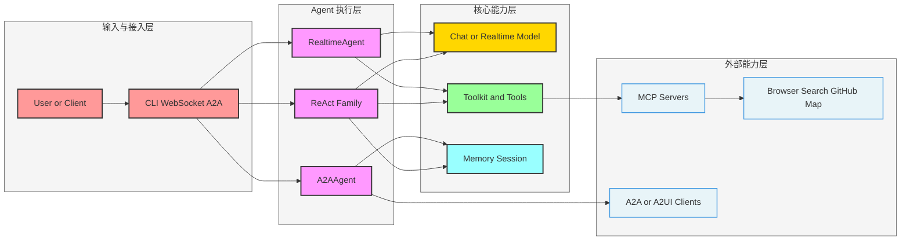

---

## 5. `react_agent`

### 5.1 关键概念

- 典型单体 ReAct Agent，强调“推理 + 工具调用”
- 默认注册 `execute_shell_command`、`execute_python_code`、`view_text_file`
- 适合作为最小可运行智能体基座

### 5.2 架构图

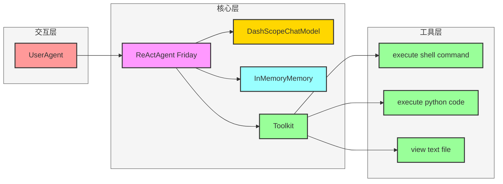

### 5.3 流程图

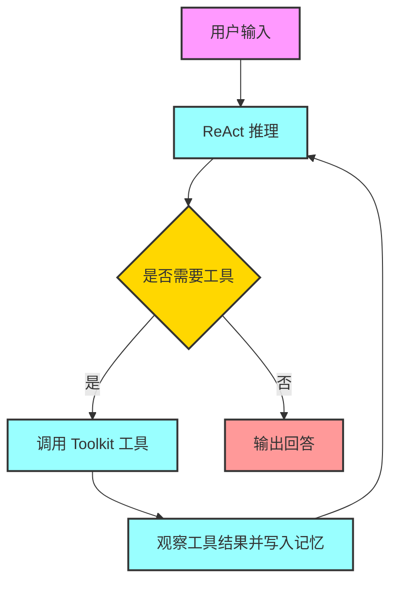

---

## 6. `meta_planner_agent`

### 6.1 关键概念

- 主 Agent 负责规划，不直接做重执行
- 通过 `create_worker` 动态创建 Worker 子 Agent
- 使用 `PlanNotebook` 管理任务分解与推进
- 子 Agent 的流式输出回传到 Planner，形成统一交互窗口

### 6.2 架构图

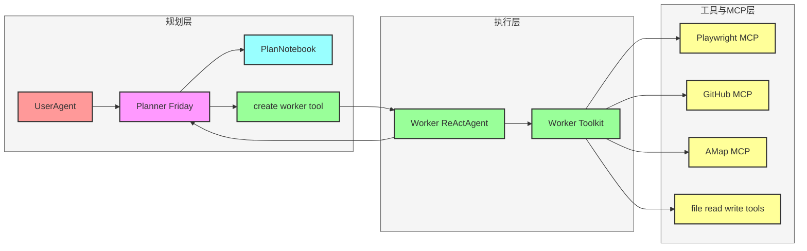

### 6.3 流程图

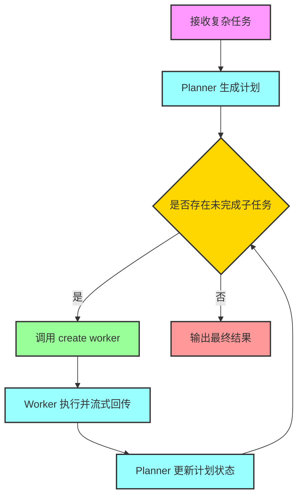

---

## 7. `deep_research_agent`

### 7.1 关键概念

- 面向复杂研究任务，强调多轮搜索、提取、总结与报告生成
- 通过 Tavily MCP 做搜索与抽取
- 内置“子任务递进 + 失败反思 + 中间报告沉淀”机制
- 最终可产出结构化报告和落盘文件

### 7.2 架构图

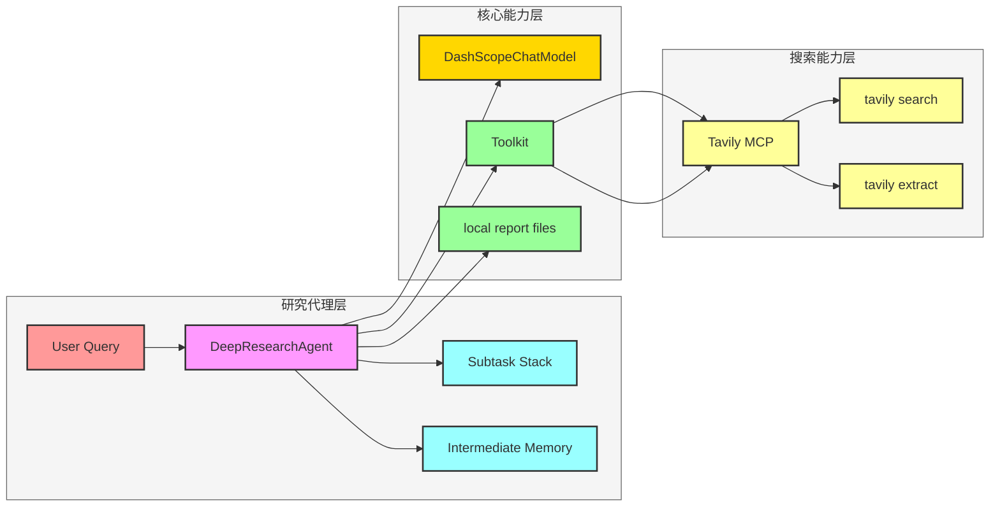

### 7.3 流程图

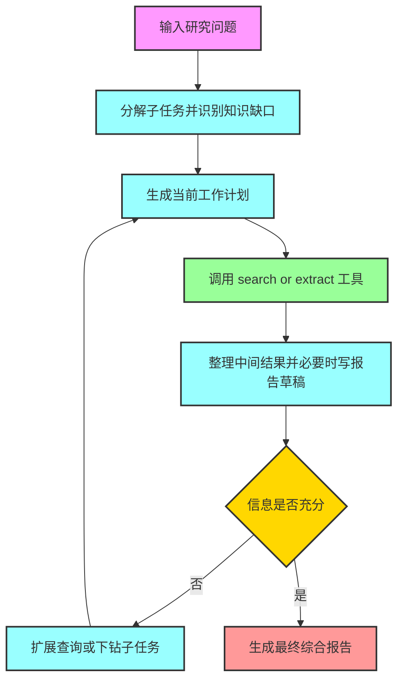

---

## 8. `browser_agent`

### 8.1 关键概念

- 基于 ReAct 的网页自动化智能体
- 先任务拆解，再执行子任务
- 对 `browser_snapshot` 支持分块观察推理
- 通过 `browser_subtask_manager` 控制子任务推进与修订
- 通过 `browser_generate_final_response` 收敛结构化输出

### 8.2 架构图

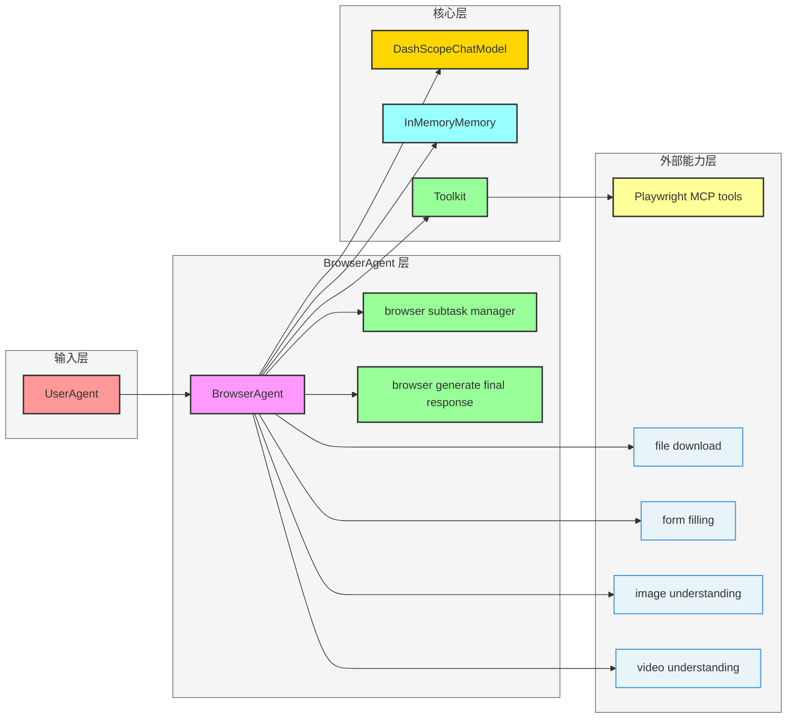

### 8.3 流程图

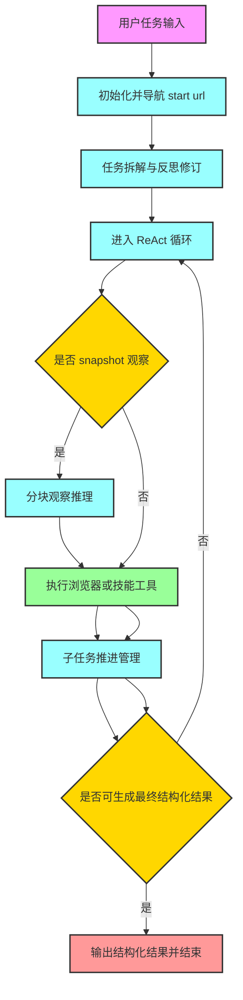

---

## 9. `voice_agent`

### 9.1 关键概念

- 本质是启用音频输出能力的 ReActAgent
- 模型 `generate_kwargs` 指定 `modalities: [text, audio]`
- 适合“文本输入 + 语音回复”的对话场景
- 开启音频输出时，工具调用能力可能受模型限制

### 9.2 架构图

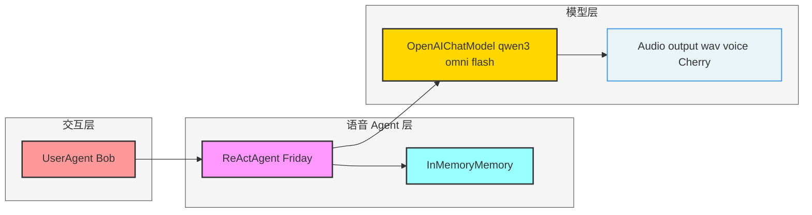

### 9.3 流程图

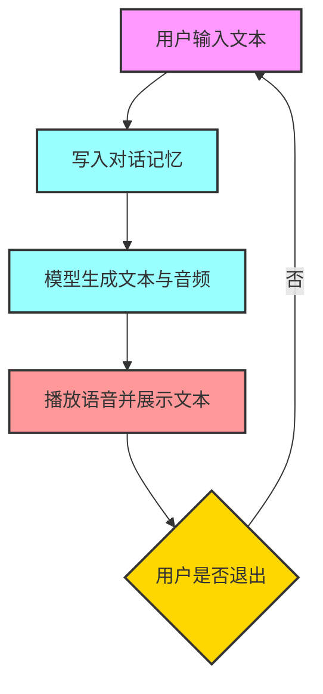

---

## 10. `realtime_voice_agent`

### 10.1 关键概念

- 基于 `RealtimeAgent` 的双向流式语音会话
- FastAPI + WebSocket 负责前后端实时事件转发
- 支持 DashScope/Gemini/OpenAI 实时模型切换
- 对 Gemini/OpenAI 可额外挂载工具

### 10.2 架构图

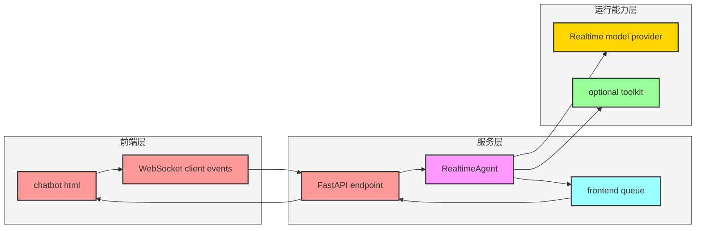

### 10.3 流程图

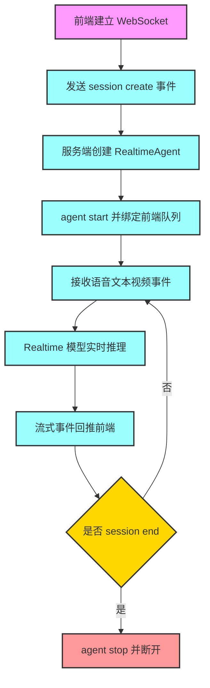

---

## 11. `a2a_agent`

### 11.1 关键概念

- `A2AAgent` 是 A2A 协议客户端，连接外部 A2A Server
- Server 端可承载普通 ReActAgent 并通过 A2A 协议返回消息
- 适合跨 Agent 系统的标准化互联
- 当前能力限制：偏 chatbot 场景，不支持实时中断与 agentic structured output

### 11.2 架构图

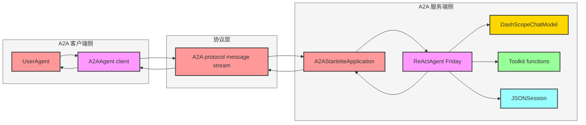

### 11.3 流程图

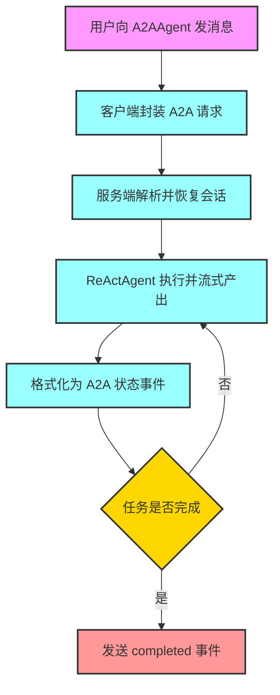

---

## 12. `a2ui_agent`

### 12.1 关键概念

- 在 A2A 通道上输出 A2UI 协议 UI 消息
- Agent 不仅回答文本，还生成可渲染的交互式 UI JSON
- 通过 Skill 逐步暴露 schema 与模板，提升 UI 生成稳定性
- 服务端会对 UI 事件做前后处理，形成“交互闭环”

### 12.2 架构图

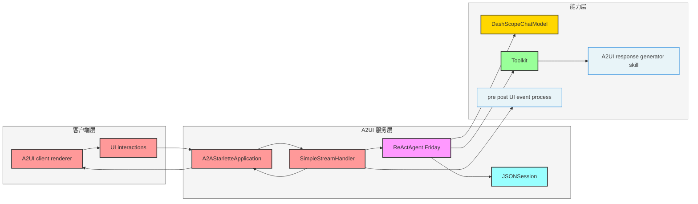

### 12.3 流程图

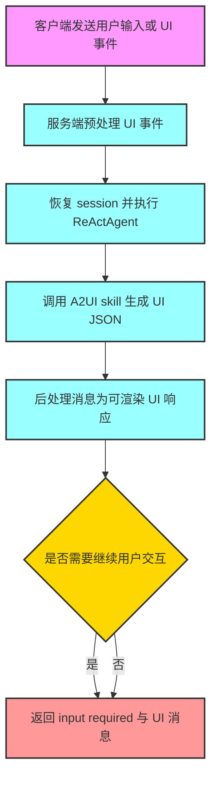

---

## 13. 选型建议（工程实践）

- `react_agent`：通用问答 + 轻工具任务，最小起步
- `meta_planner_agent`：复杂任务拆解与多 worker 协作
- `deep_research_agent`：研究型任务、报告型产出
- `browser_agent`：网页操作、数据提取、表单自动化
- `voice_agent`：低复杂度语音交互
- `realtime_voice_agent`：低延迟双向语音会话
- `a2a_agent`：跨系统 agent 互联
- `a2ui_agent`：需要“Agent 直接驱动 UI”的交互场景

---

## 14. Mermaid 绘图约束（按当前仓库风格）

- 使用稳定属性：`fill`、`stroke`、`stroke-width`
- 避免在节点内放复杂 JSON、未转义括号与过长文本
- 优先 `flowchart LR` 或 `flowchart TD`
- 边标签保持短语化，详细语义放正文
- 若渲染失败，先缩减到骨架再逐步恢复样式

