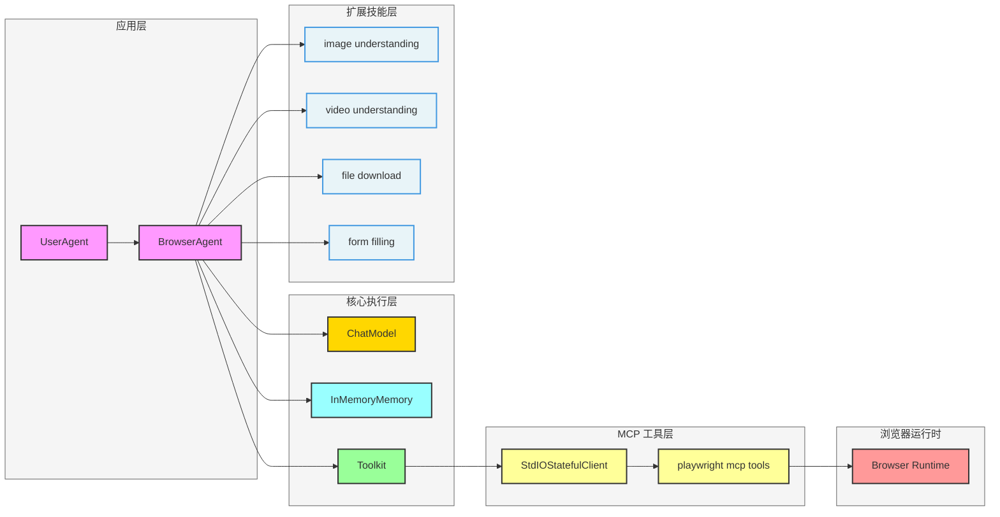
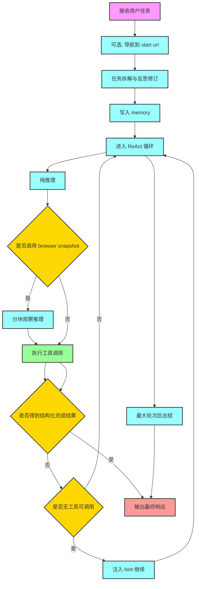
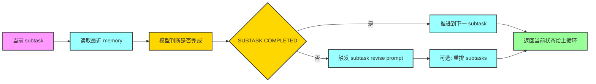

# Browser Agent 复杂任务构建与拆解指南

## 1. 文档目标与适用读者

本文围绕 `examples/agent/browser_agent` 的 `BrowserAgent` 实现展开，目标是帮助读者回答三个核心问题：

- 复杂 Browser Agent 是如何从“能调用工具”升级为“可完成复杂任务”的
- 一个复杂任务应该如何拆解成可执行、可验证、可收敛的子任务
- 面试中如何系统解释 Agent 架构、流程、鲁棒性与工程化设计

适合人群：

- 希望理解 AgentScope 中 Browser Agent 设计思想的开发者
- 需要实现网页自动化智能体的工程师
- 准备大模型 Agent 方向面试的同学

---

## 2. Browser Agent 是什么

`BrowserAgent` 继承自 `ReActAgent`，本质是一个“带浏览器工具生态和任务管理能力的 ReAct 执行器”。

它并不只是“调用 Playwright 工具”，而是在 ReAct 基础上增加了以下关键能力：

- **任务分解**：先把原始任务拆成子任务序列，再进入执行
- **观察增强**：当触发页面快照时，支持按 chunk 分段观察推理，缓解超长上下文
- **子任务推进**：通过 `browser_subtask_manager` 判断当前子任务是否完成，并推进或重排计划
- **完成判定**：通过 `browser_generate_final_response` 与 `_validate_finish_status` 双重收敛
- **上下文控制**：内存超长时自动摘要，避免上下文爆炸
- **技能扩展**：在基础浏览器工具外，支持图片理解、视频理解、文件下载、表单填写等能力

---

## 3. 总体架构（含 Mermaid）

### 架构解读

- `main.py` 中由 `StdIOStatefulClient` 拉起 `@playwright/mcp`，注册到 `Toolkit`
- `BrowserAgent` 负责推理、记忆、工具调用编排，而不是直接操作浏览器协议
- `Toolkit` 是工具注册与执行中枢，既可挂 MCP 工具，也可挂 Python 技能函数
- 浏览器是外部可观测环境，Agent 通过 snapshot 与 screenshot 形成闭环

---

## 4. 关键概念与职责边界

### 4.1 ReAct 主循环

每轮循环都遵循：

- Reasoning：模型决定下一步
- Acting：执行一个或多个工具调用
- Observation：读取工具返回，写入记忆并影响下一轮

### 4.2 任务拆解与重排

- 首次收到用户任务时，先调用拆解 prompt 输出子任务列表
- 再调用反思 prompt 对拆解结果做二次修正
- 若后续执行受阻，可触发子任务修订，将计划重排

### 4.3 观察分块

当页面快照内容过大时：

- 先切分为多个 chunk
- 逐 chunk 观察与提炼信息
- 通过 `STATUS` 控制是否继续处理下一块

### 4.4 结构化结束

当传入 `structured_model` 时：

- Agent 被要求必须通过 finish 工具产出结构化结果
- 若未满足结构化输出，会注入系统 hint 继续执行
- 保证“可解析、可消费、可集成”的最终响应

---

## 5. 端到端执行流程（含 Mermaid）

---

## 6. 复杂任务拆解方法论

结合 `browser_agent_task_decomposition_prompt.md`，该 Agent 采用的是“结果导向的原子子任务拆解”。

### 6.1 拆解原则

- **原子化**：每个子任务不可再拆
- **结果导向**：描述要拿到什么结果，不写具体操作手法
- **单结果**：一个子任务只产出一个核心结果
- **无验证语句**：避免“先做再验证”导致路径膨胀
- **全覆盖**：所有子任务组合后必须完整覆盖原任务目标

### 6.2 实战拆解模板

复杂任务可按以下骨架拆：

1. 明确目标信息与输出格式
2. 获取关键页面入口与上下文
3. 提取第一组关键字段
4. 提取第二组关键字段
5. 聚合字段并形成最终答案

### 6.3 子任务推进与纠偏流程（含 Mermaid）

---

## 7. 核心设计亮点与工程价值

- **计划与执行分离**：先拆解再执行，降低复杂任务的搜索空间
- **观察与动作分离**：snapshot 时专门走观察推理通道，避免“盲点动作”
- **可恢复性**：记忆摘要机制减少上下文过载导致的崩溃
- **可扩展性**：技能函数以工具形式挂载，便于按业务增删
- **可收敛性**：子任务管理 + 结束判定，减少无限循环风险
- **可集成性**：结构化输出让结果可直接接入下游系统

---

## 8. 常见坑位与规避策略

### 8.1 无限循环或低效循环

- 现象：反复调用相似工具，结果无前进
- 规避：设置合理 `max_iters`，并利用子任务管理器强制推进

### 8.2 上下文过长导致退化

- 现象：模型开始遗忘任务目标或输出漂移
- 规避：启用 memory summarize，保留首问和阶段性摘要

### 8.3 页面信息过长无法观察

- 现象：一次 snapshot 太大，推理噪声高
- 规避：chunk 化观察，累计 chunk 信息再决策

### 8.4 最终答案不可消费

- 现象：结果是长文本，难被程序稳定解析
- 规避：始终启用 structured output 的 finish 工具链路

---

## 9. Mermaid 绘图注意事项

你提到“关键字符会导致 Mermaid 无法显示”，以下是实战建议：

- 节点文本尽量避免 `{ }`、未经转义的引号、复杂 JSON 片段
- 边标签避免过长，先短语化，再在正文解释
- `classDef` 建议仅使用 `fill`、`stroke`、`stroke-width` 这类稳定属性
- 优先使用 `flowchart LR` 或 `flowchart TD`，复杂交互再用 `sequenceDiagram`
- 如果图渲染失败，先最小化到 3 个节点逐步恢复

---

## 10. 经典与高频面试 FAQ

### Q1：Browser Agent 和“普通工具调用 Agent”最大区别是什么

**答：** Browser Agent 不是只会调用浏览器工具，而是有完整任务生命周期管理：任务拆解、分步执行、子任务推进、完成判定、结构化收敛。核心差异在“复杂任务可控收敛能力”。

### Q2：为什么要做任务拆解，不直接端到端一步到位

**答：** 复杂网页任务通常涉及多页面、多条件、长链路依赖。一步到位容易搜索空间爆炸、遗漏约束。拆解后可将问题转化为多个原子目标，显著提高稳定性与可解释性。

### Q3：如何避免 Agent 在网页上反复试错

**答：** 三层控制：

- 子任务完成判定，避免无目标动作
- memory 摘要，维持全局目标一致性
- 最大迭代阈值与 finish 校验，防止无限循环

### Q4：snapshot 分块观察的价值是什么

**答：** 页面语义内容可能非常长，直接给模型会导致噪声高、成本高、遗漏关键点。分块后可按 chunk 累积局部结论，再决定是否继续观察，提升准确率与 token 利用率。

### Q5：什么时候应该引入多模态能力

**答：** 当任务需要识别视觉元素、图表、按钮位置、验证码上下文或视频信息时，多模态能力可以显著提升定位和理解精度。纯文本 DOM 快照不一定足够。

### Q6：如何做 Browser Agent 的可观测性设计

**答：** 至少记录：

- 每轮子任务、工具调用、工具返回
- memory 摘要前后差异
- finish 判定理由
- 失败重试链路与异常类型

### Q7：线上化时最关键的工程点是什么

**答：** 工具超时控制、页面状态一致性、幂等执行、结构化结果校验、失败回滚与重试策略。没有这些，Demo 能跑但生产不可用。

### Q8：如何评价一个复杂 Agent 设计是否成熟

**答：** 看四个维度：

- 能否拆解复杂任务并持续推进
- 能否在长上下文下保持目标一致
- 能否稳定结束并输出可消费结果
- 能否扩展新技能且不破坏主流程

---

## 11. 最小实践建议

如果你要基于该实现继续演进，推荐优先做三件事：

- 给 `browser_subtask_manager` 增加失败原因分类标签，便于自动重规划
- 给 finish 判定增加“证据片段引用”，提升可审计性
- 为常见网页任务沉淀可复用子任务模板库

这三项能快速把“可用示例”升级到“可持续迭代的复杂 Agent 工程底座”。

