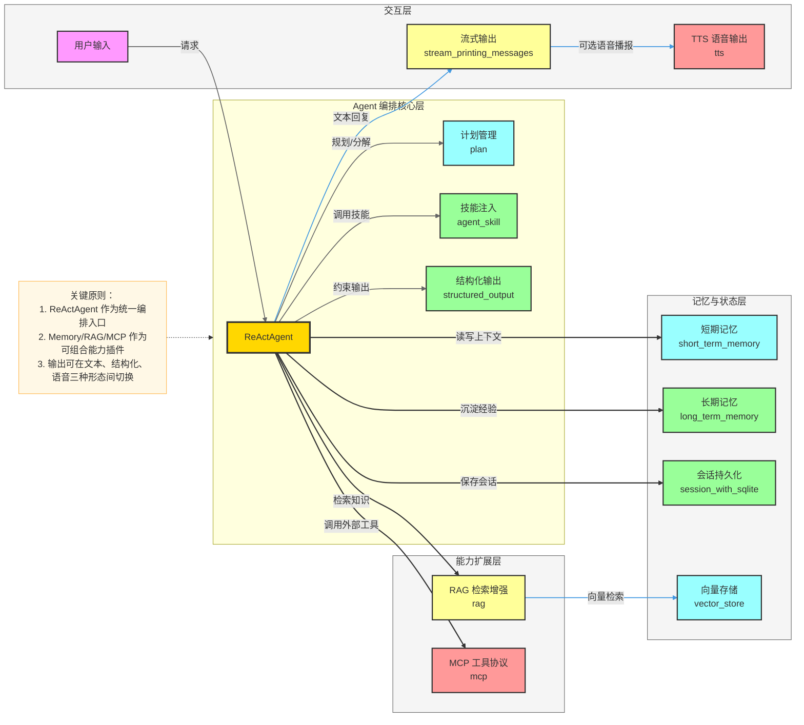
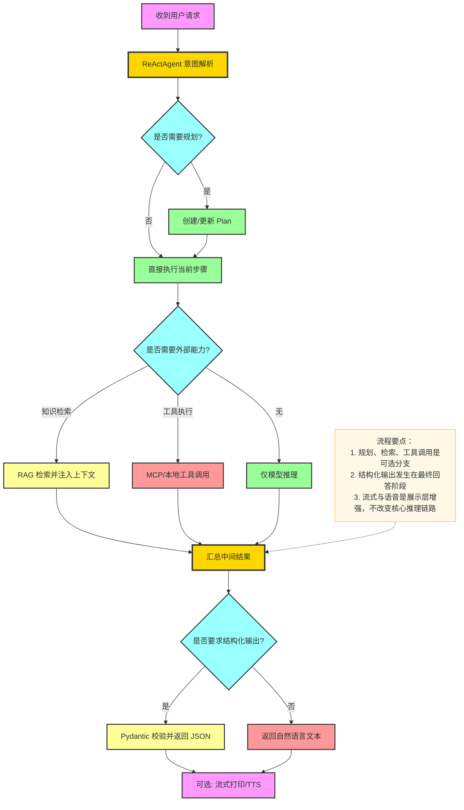
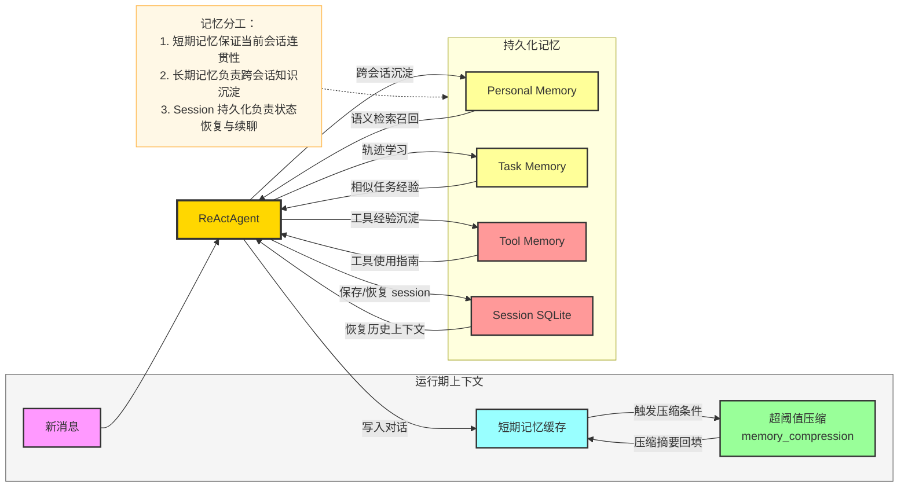

# `examples/functionality` 模块关键流程与架构说明

本文档用于快速理解 `examples/functionality` 中各能力模块的定位、核心概念、关键流程与整体架构关系，并提供 Mermaid 图辅助说明。

---

## 1. 模块总览

`examples/functionality` 主要覆盖以下能力域：

- **代理编排能力**：`plan`、`agent_skill`、`stream_printing_messages`
- **知识增强能力**：`rag`、`vector_store`
- **工具与协议能力**：`mcp`
- **记忆与状态能力**：`short_term_memory`、`long_term_memory`、`session_with_sqlite`
- **输出形态能力**：`structured_output`、`tts`

典型入口文件示例：

- `examples/functionality/rag/basic_usage.py`
- `examples/functionality/mcp/main.py`
- `examples/functionality/plan/main_agent_managed_plan.py`
- `examples/functionality/short_term_memory/memory_compression/main.py`
- `examples/functionality/long_term_memory/reme/tool_memory_example.py`
- `examples/functionality/structured_output/main.py`
- `examples/functionality/tts/main.py`

---

## 2. 核心概念

- **ReActAgent**：大多数示例的执行中枢，负责“推理 + 工具调用 + 回答生成”。
- **Toolkit/Tools**：将本地或远端能力注册为可调用工具（如 `mcp`、`agent_skill`、memory tools）。
- **Memory 分层**：
  - 短期记忆：会话上下文维持与压缩（如 `MemoryWithCompress`、ReMe 短期记忆）。
  - 长期记忆：跨会话持久化经验与用户偏好（Personal/Task/Tool Memory）。
  - 会话持久化：通过 SQLite 等后端保存/恢复 session。
- **RAG 增强**：通过检索结果扩充提示词上下文，提升知识问答准确性。
- **Structured Output**：通过 Pydantic Schema 约束输出结构，保证可解析和类型安全。
- **Streaming/TTS**：支持增量消息输出与语音播报，优化交互体验。

---

## 3. 整体架构图（功能分层）

---

## 4. 关键流程一：统一请求处理主流程

---

## 5. 关键流程二：记忆系统协同流程

---

## 6. 各子模块与关键流程映射

| 子模块 | 关键概念 | 核心流程关键词 | 典型入口 |
|---|---|---|---|
| `rag` | 检索增强生成 | 查询 -> 检索 -> 上下文拼接 -> 生成 | `basic_usage.py` / `react_agent_integration.py` |
| `mcp` | 统一工具协议 | 启动 MCP Server -> 注册工具 -> Agent 调用 | `main.py` |
| `plan` | 显式任务规划 | 生成计划 -> 分步执行 -> 进度更新 | `main_manual_plan.py` / `main_agent_managed_plan.py` |
| `structured_output` | Schema 约束输出 | 传入 `structured_model` -> 校验 -> JSON 输出 | `main.py` |
| `short_term_memory` | 上下文压缩 | token 统计 -> 触发压缩 -> 摘要回填 | `memory_compression/main.py` |
| `long_term_memory` | 跨会话记忆 | 记录经验 -> 向量检索 -> 注入推理 | `reme/*.py` / `mem0/memory_example.py` |
| `session_with_sqlite` | 会话持久化 | 保存 session -> 载入 session -> 续聊 | `main.py` |
| `stream_printing_messages` | 流式可观测性 | chunk 输出 -> 按消息 ID 聚合展示 | `single_agent.py` / `multi_agent.py` |
| `tts` | 语音反馈 | 文本回复 -> TTS 合成 -> 实时播报 | `main.py` |
| `agent_skill` | 领域技能增强 | 注册 Skill -> 按需调用 -> 回传结果 | `main.py` |
| `vector_store` | 检索基础设施 | 向量化 -> 索引存储 -> 相似度召回 | `*/main.py` |

---

## 7. 推荐阅读顺序

为快速上手，建议按以下路径阅读与运行：

1. `structured_output`（最容易验证输出质量）
2. `plan` + `mcp`（理解编排与工具调用）
3. `rag` + `vector_store`（理解知识增强链路）
4. `short_term_memory` + `long_term_memory` + `session_with_sqlite`（理解状态与记忆体系）
5. `stream_printing_messages` + `tts`（补齐交互体验层）

