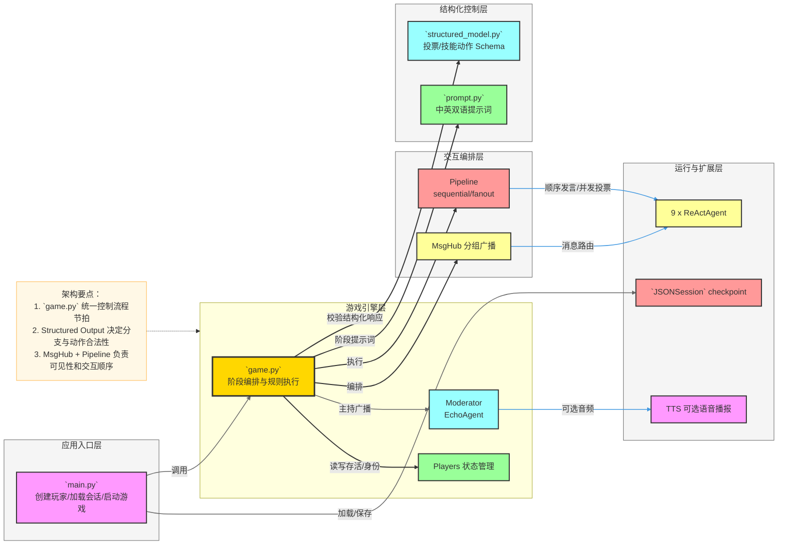
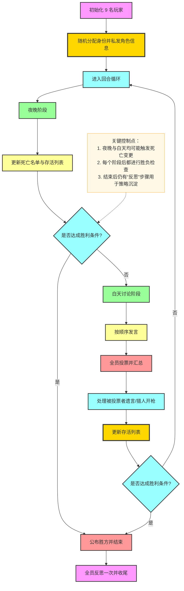

# `examples/game` 模块关键流程与架构说明

本文档面向 `examples/game/werewolves`，用于说明该游戏示例的核心概念、关键流程与系统架构，并提供 Mermaid 图辅助理解。

---

## 1. 快速阅读（合并自 README 精简版）

`examples/game/werewolves` 是一个基于 AgentScope 的九人狼人杀多智能体示例，展示了角色博弈、结构化输出驱动流程与回合制编排能力。

### 核心能力

- 多智能体对抗：9 名 `ReActAgent` 分别扮演不同角色
- 结构化决策：用 Pydantic 模型约束投票/技能动作输出
- 流程可控：`MsgHub` + `Pipeline` 管理广播范围与发言顺序
- 连续对局：`JSONSession` 支持 checkpoint 加载与保存
- 可扩展体验：支持中英提示词切换与可选 TTS 语音播报

### 阅读导航

- 先看 `3. 系统架构总览`，理解组件分层与调用关系
- 再看 `4. 单局游戏主流程（回合制）`，理解整局执行节奏
- 最后看 `5. 夜晚阶段关键分支流程`，掌握角色技能分支细节

---

## 2. 模块定位与能力边界

`examples/game/werewolves` 是一个基于 AgentScope 的多智能体博弈示例，核心目标是演示：

- 多代理协作与对抗（9 名玩家 + 主持人）
- 角色驱动的差异化决策（狼人、村民、预言家、女巫、猎人）
- 结构化输出驱动流程控制（投票、技能决策、是否达成共识）
- 复杂回合编排（夜晚分支行动 + 白天讨论/投票 + 胜负判定）
- 会话状态持久化与连续对局（`JSONSession` checkpoint）

---

## 3. 核心概念

- **ReActAgent 玩家代理**：每位玩家由 `ReActAgent` 扮演，带有统一游戏规则与角色策略提示词。
- **Moderator（EchoAgent）**：作为主持人发出流程指令、广播阶段消息，可选接入 TTS。
- **Players 状态容器**：维护 `name -> role`、阵营列表、当前存活列表与胜负判断逻辑。
- **MsgHub**：用于分组广播与可见性隔离（如“仅狼人可见”）。
- **Pipeline**：
  - `sequential_pipeline`：白天按顺序发言；
  - `fanout_pipeline`：并发收集投票/反思等结果。
- **Structured Output（Pydantic）**：用 `DiscussionModel`、`VoteModel`、`SeerModel`、`Witch/Hunter` 模型约束输出字段，保证流程可自动解析。
- **Session 持久化**：通过 `JSONSession` 在局前加载和局后保存玩家状态，支持连续游戏。

---

## 4. 系统架构总览

---

## 5. 单局游戏主流程（回合制）

---

## 6. 夜晚阶段关键分支流程

```mermaid
flowchart LR
    classDef producerStyle fill:#f9f,stroke:#333,stroke-width:2px
    classDef topicStyle fill:#ffd700,stroke:#333,stroke-width:3px
    classDef partitionStyle1 fill:#9ff,stroke:#333,stroke-width:2px
    classDef partitionStyle2 fill:#9f9,stroke:#333,stroke-width:2px
    classDef consumerGroup1Style fill:#ff9,stroke:#333,stroke-width:2px
    classDef consumerGroup2Style fill:#f99,stroke:#333,stroke-width:2px
    classDef subgraphStyle fill:#f5f5f5,stroke:#666,stroke-width:1px,rounded:10px
    classDef ruleNoteStyle fill:#fff8e6,stroke:#ffb74d,stroke-width:1px,rounded:8px

    subgraph wolfStage["狼人阶段"]
        W1[狼人讨论<br/>DiscussionModel]:::consumerGroup1Style
        W2[狼人投票<br/>VoteModel]:::consumerGroup2Style
        W3[得到夜杀目标]:::partitionStyle1
        W1 --> W2 --> W3
    end
    class wolfStage subgraphStyle

    subgraph witchStage["女巫阶段"]
        WT1[是否使用解药<br/>WitchResurrectModel]:::consumerGroup1Style
        WT2[是否使用毒药+目标<br/>PoisonModel]:::consumerGroup2Style
        WT3[修正死亡名单]:::partitionStyle2
        WT1 --> WT2 --> WT3
    end
    class witchStage subgraphStyle

    subgraph seerStage["预言家阶段"]
        S1[选择查验对象<br/>SeerModel]:::consumerGroup1Style
        S2[私发查验结果]:::partitionStyle1
        S1 --> S2
    end
    class seerStage subgraphStyle

    subgraph hunterStage["猎人触发阶段"]
        H1{猎人本夜是否死亡?}:::partitionStyle1
        H2[是否开枪+目标<br/>HunterModel]:::consumerGroup2Style
        H3[追加带走目标]:::partitionStyle2
        H1 --> H2 --> H3
    end
    class hunterStage subgraphStyle

    START[夜晚开始广播]:::producerStyle --> W1
    W3 --> WT1
    WT3 --> S1
    S2 --> H1
    H3 --> END[统一结算并更新存活]:::topicStyle

    Note[规则要点：<br/>1. 女巫解药和毒药均为一次性资源<br/>2. 预言家查验结果仅自己可见<br/>3. 猎人开枪是条件触发分支]:::ruleNoteStyle
    Note -.-> witchStage
```

---

## 7. 关键文件职责映射

| 文件 | 职责 | 关键点 |
|---|---|---|
| `examples/game/werewolves/main.py` | 启动与会话生命周期管理 | 创建 9 个玩家、加载/保存 checkpoint、调用 `werewolves_game` |
| `examples/game/werewolves/game.py` | 核心流程编排 | 夜晚/白天循环、投票结算、技能触发、胜负判断 |
| `examples/game/werewolves/utils.py` | 状态与工具函数 | `Players` 维护全局状态、`majority_vote`、`EchoAgent` |
| `examples/game/werewolves/structured_model.py` | 结构化输出协议 | Pydantic 模型约束每种动作返回格式 |
| `examples/game/werewolves/prompt.py` | 游戏提示词模板 | 英文与中文两套流程提示词，支持多语言玩法 |
| `examples/game/werewolves/README.md` | 使用与扩展说明 | 快速启动、语言切换、模型替换、TTS 开关 |

---

## 8. 扩展建议

- **对战可观测性**：记录每轮关键决策（投票理由、技能使用理由）形成可分析日志。
- **策略评估**：基于结束后的反思内容，构建角色维度的策略评分指标。
- **人机混合玩法**：替换单个玩家为 `UserAgent`，用于评估 AI 协作/博弈体验。
- **多模型对战实验**：不同玩家使用不同模型，观察阵营胜率与行为风格差异。

