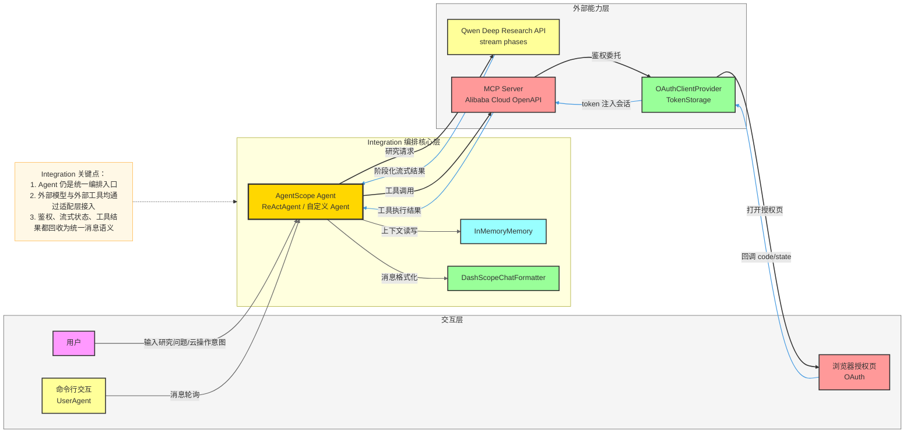
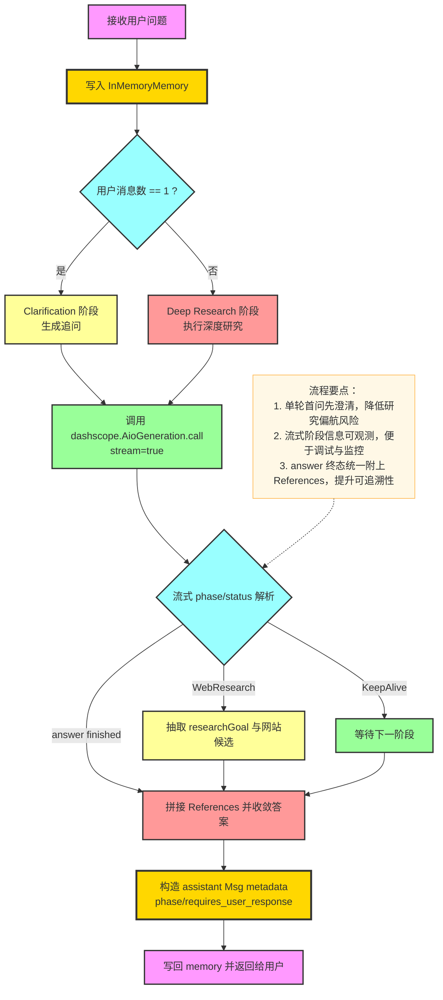
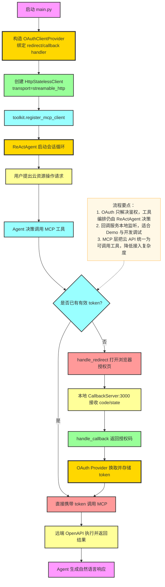

# `examples/integration` 模块关键流程与架构说明

本文档用于快速理解 `examples/integration` 的能力定位、核心概念、关键流程与整体架构关系，并提供 Mermaid 图辅助说明。

---

## 1. 模块总览

`examples/integration` 主要展示如何将 AgentScope 与外部生态能力做端到端集成，当前包含两个方向：

- **深度研究模型集成**：`qwen_deep_research_model`
  - 展示基于 `qwen-deep-research` 的两阶段研究流程（澄清 -> 深度研究）。
- **云 API MCP 集成**：`alibabacloud_api_mcp`
  - 展示通过 OAuth 登录，将阿里云 OpenAPI 以 MCP 工具方式接入智能体。

典型入口文件：

- `examples/integration/qwen_deep_research_model/main.py`
- `examples/integration/qwen_deep_research_model/qwen_deep_research_agent.py`
- `examples/integration/alibabacloud_api_mcp/main.py`
- `examples/integration/alibabacloud_api_mcp/oauth_handler.py`

---

## 2. 核心概念

- **Integration（集成层）**：将“外部模型能力”与“外部工具能力”接入 AgentScope 的适配层，不改变 Agent 的主编排思想。
- **两阶段研究交互**（Qwen Deep Research）：
  - 第一阶段：模型根据初始问题产出澄清问题（Clarification）。
  - 第二阶段：用户补充后，模型执行检索、分析与答案汇总（Deep Research）。
- **流式阶段信号**：通过 `phase/status/extra` 识别模型所处阶段（如 `WebResearch`、`answer`、`KeepAlive`），并在终态汇总参考链接。
- **MCP（Model Context Protocol）工具接入**：通过 `HttpStatelessClient` 将远端 MCP Server 暴露的能力注册为工具给 `ReActAgent` 调用。
- **OAuth 授权闭环**：本地启动回调服务，浏览器授权后拿到 `code`，由 MCP OAuth Provider 完成 token 流转。

---

## 3. 整体架构图（Integration 分层）

---

## 4. 关键流程一：Qwen Deep Research 双阶段流程

该流程由 `QwenDeepResearchAgent.reply()` 驱动，基于“用户消息数量”在澄清和深度研究之间切换。

---

## 5. 关键流程二：OAuth + MCP 工具调用流程

该流程由 `alibabacloud_api_mcp/main.py` 与 `oauth_handler.py` 协同完成。

---

## 6. 子模块与关键流程映射

| 子模块 | 关键概念 | 核心流程关键词 | 典型入口 |
|---|---|---|---|
| `qwen_deep_research_model` | 双阶段研究代理 | 首问澄清 -> 用户补充 -> 深度研究 -> 参考文献汇总 | `main.py` / `qwen_deep_research_agent.py` |
| `alibabacloud_api_mcp` | OAuth + MCP 工具链 | 浏览器授权 -> 回调收码 -> token 注入 -> 工具调用 | `main.py` / `oauth_handler.py` |

---

## 7. 推荐阅读与实践顺序

1. 先读 `qwen_deep_research_model/main.py`，理解两阶段交互入口。
2. 再读 `qwen_deep_research_agent.py`，重点关注 `reply()` 与 `_process_responses()`。
3. 然后读 `alibabacloud_api_mcp/main.py`，理解 OAuth Provider 与 MCP Client 装配关系。
4. 最后读 `oauth_handler.py`，理解本地回调服务与授权码回收逻辑。

如果要快速验证：

- 研究链路：设置 `DASHSCOPE_API_KEY` 后运行 `qwen_deep_research_model/main.py`。
- MCP 链路：将 `server_url` 替换为你自己的 MCP 地址后运行 `alibabacloud_api_mcp/main.py`。
