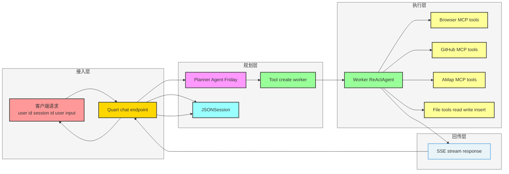
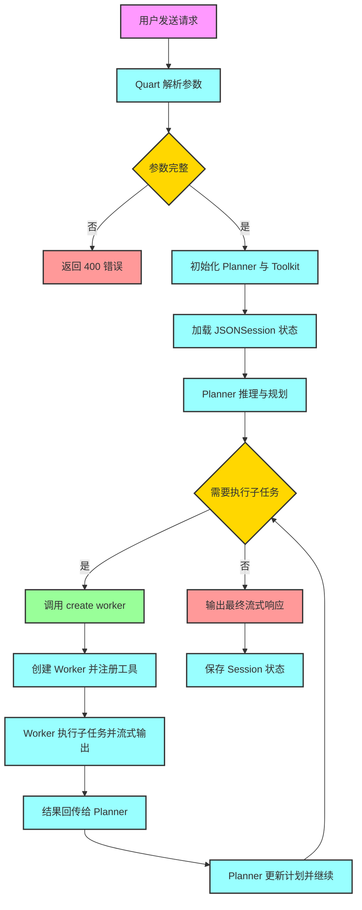
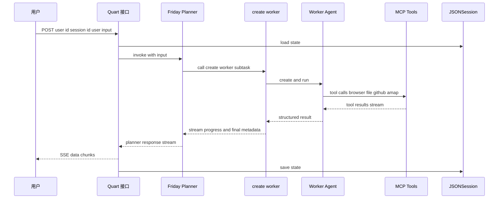

# Planning Agent 复杂任务规划与执行指南

## 1. 文档目标

本文基于 `examples/deployment/planning_agent` 的实现，系统讲解一个可部署的 Planning Agent 是如何构建的，重点回答：

- 复杂任务如何被 Planner 拆解并调度执行
- Planner 与 Worker 如何协作并避免职责混乱
- 架构层如何支持流式交互、会话持久化与工具扩展

---

## 2. Planning Agent 是什么

这里的 `planning_agent` 是一个“主规划器 + 动态工人”的多智能体模式：

- **主 Agent（Friday）**：负责理解用户目标、制定计划、决定何时调用 `create_worker`
- **工具 `create_worker`**：每次被调用，动态创建一个 Worker 子 Agent，专门执行某个子任务
- **Worker Agent**：使用浏览器、文件、可选地图和 GitHub 工具，完成子任务后返回结构化结果

核心思想是：**规划与执行分离**。主 Agent 只管“怎么拆”和“何时派”，不直接做重工具执行。

---

## 3. 总体架构（Mermaid）

---

## 4. 关键概念与职责边界

### 4.1 Planner Agent（Friday）

主 Agent 在 `main.py` 中以 `ReActAgent` 创建，系统提示词明确约束：

- 不直接做子任务
- 必须按计划顺序推进
- 所有子任务完成前不能提前结束

这保证了 Planner 的角色稳定为“调度中心”。

### 4.2 create worker 工具

`create_worker(task_description)` 是 Planner 唯一关键工具：

- 接收完整子任务描述
- 动态创建 Worker 与其工具集
- 流式回传 Worker 执行过程
- 最后返回结构化结果元数据

### 4.3 Worker Agent

Worker 是独立 `ReActAgent`，目标是“完成一个具体子任务”，并被要求最终调用 finish 工具生成结构化输出。

Worker 默认工具：

- 文件工具：`write_text_file`、`insert_text_file`、`view_text_file`
- 浏览器工具：Playwright MCP（始终启用）
- 可选工具：GitHub MCP、AMap MCP（依赖环境变量）

### 4.4 Session 持久化

主 Agent 使用 `JSONSession` 按 `user_id-session_id` 维度保存与恢复状态，实现多轮上下文连续。

---

## 5. 端到端关键流程（Mermaid）

---

## 6. 任务拆解与执行机制

Planning Agent 的任务拆解不是在单独模块中硬编码，而是通过主 Agent 的系统约束与 `create_worker` 工具调用行为实现。

可抽象为三段：

1. **计划生成**：Friday 将复杂需求拆为可委派子任务
2. **计划执行**：每个子任务都通过 `create_worker` 触发 Worker 独立处理
3. **计划收敛**：Friday 汇总 Worker 回传结果，决定继续派发还是结束

### 推荐的子任务描述规范

为了让 Worker 更稳定，建议 Planner 生成子任务描述时满足：

- 包含目标、输入、输出格式
- 包含边界条件和约束
- 包含执行优先级或顺序要求
- 不包含歧义词，例如“尽量”或“差不多”

---

## 7. Planner 与 Worker 的协作时序（Mermaid）

---

## 8. 工程价值与扩展点

### 8.1 工程价值

- **解耦**：规划逻辑与执行逻辑分离，便于演进
- **弹性**：Worker 可按任务动态挂载工具，不影响主流程
- **可观测**：子任务执行过程通过流式文本可追踪
- **可恢复**：Session 让中断后续聊保持上下文

### 8.2 典型扩展点

- 增加 `create_worker` 入参，例如 `priority`、`deadline`、`output_schema`
- 引入多 Worker 并发调度器，支持 DAG 型任务计划
- 为 Worker 增加失败重试和超时策略
- 将结构化结果写入数据库而不仅是回传给 Planner

---

## 9. Mermaid 绘图注意事项

结合你的风格参考，建议保持以下规则，降低渲染失败概率：

- 节点文本避免复杂符号组合，尤其是大段 JSON、花括号、嵌套引号
- 边标签尽量短，详细语义放正文解释
- `classDef` 使用稳定属性，例如 `fill`、`stroke`、`stroke-width`
- 先完成主骨架再加样式，若失败可快速定位问题行

---

## 10. 一句话总结

`planning_agent` 的核心不是“一个更强的 Agent”，而是“一个可持续扩展的多智能体编排模式”：主 Agent 负责规划与调度，Worker 负责执行与产出，Session 负责状态连续，SSE 负责过程可见。

