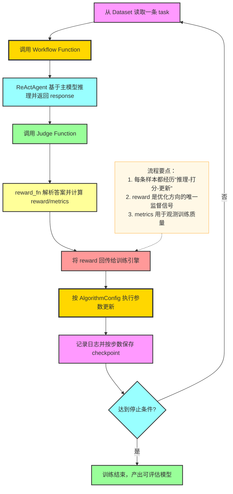
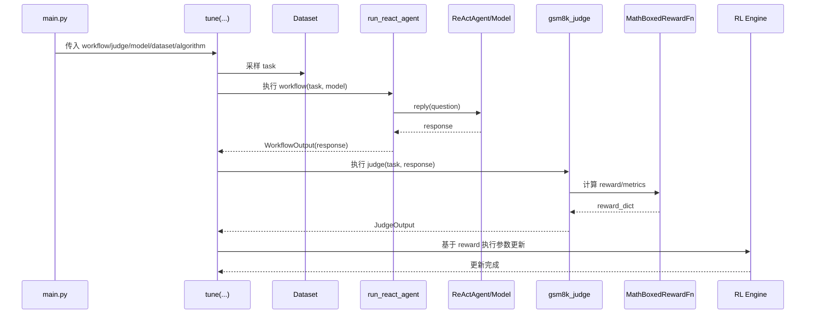

# `examples/tuner` 模块关键流程与架构说明

本文档面向 `examples/tuner/react_agent`，用于讲解 AgentScope `tuner` 子模块在强化学习训练中的核心概念、关键流程与系统架构，并提供 Mermaid 图辅助理解。

---

## 1. 模块定位与目标

`tuner` 的核心目标是：将“可运行的智能体工作流”转成“可训练的强化学习任务”，通过奖励信号持续优化主模型策略。

在 `examples/tuner/react_agent` 中，业务场景是数学题求解，训练对象是一个可调用工具的 `ReActAgent`，使用数据集样本驱动训练，并通过 `judge` 对响应打分。

---

## 2. 核心概念

- **Workflow Function**：对单条任务样本执行一次完整智能体流程，输出 `WorkflowOutput`（通常包含 `response`）。
- **Judge Function**：基于 `task + response` 计算 `JudgeOutput`，至少返回 `reward`。
- **Task Dataset**：训练样本来源（如 `openai/gsm8k`），每条样本至少包含可求解问题与参考答案。
- **TunerModelConfig**：可训练主模型配置（模型路径、上下文长度、推理并发等）。
- **AlgorithmConfig**：强化学习算法配置（示例里为 `multi_step_grpo`，含 `group_size`、`batch_size`、`learning_rate`）。
- **tune(...)**：训练入口，组装 workflow/judge/模型/数据/算法并转入底层训练引擎执行。
- **辅助模型（Auxiliary Models）**：可选，不直接训练，常用于 LLM-as-a-Judge；当前示例未启用。

---

## 3. 系统架构总览

```mermaid
flowchart LR
    %% 样式定义（对齐参考风格）
    classDef producerStyle fill:#f9f,stroke:#333,stroke-width:2px
    classDef topicStyle fill:#ffd700,stroke:#333,stroke-width:3px
    classDef partitionStyle1 fill:#9ff,stroke:#333,stroke-width:2px
    classDef partitionStyle2 fill:#9f9,stroke:#333,stroke-width:2px
    classDef consumerGroup1Style fill:#ff9,stroke:#333,stroke-width:2px
    classDef consumerGroup2Style fill:#f99,stroke:#333,stroke-width:2px
    classDef subgraphStyle fill:#f5f5f5,stroke:#666,stroke-width:1px,rounded:10px
    classDef kafkaClusterStyle fill:#e8f4f8,stroke:#4299e1,stroke-width:1.5px,rounded:10px
    classDef ruleNoteStyle fill:#fff8e6,stroke:#ffb74d,stroke-width:1px,rounded:8px

    subgraph entryLayer["训练入口层"]
        MAIN[`main.py`<br/>组装配置并调用 `tune(...)`]:::producerStyle
    end
    class entryLayer subgraphStyle

    subgraph coreLayer["Tuner 核心逻辑层"]
        TUNE[`tune(...)` 协调器]:::topicStyle
        WF[Workflow Function<br/>`run_react_agent`]:::partitionStyle1
        JUDGE[Judge Function<br/>`gsm8k_judge`]:::partitionStyle2
    end
    class coreLayer kafkaClusterStyle

    subgraph runtimeLayer["运行时执行层"]
        AGENT[ReActAgent + 主模型]:::consumerGroup1Style
        REWARD[MathBoxedRewardFn<br/>奖励计算]:::consumerGroup2Style
    end
    class runtimeLayer subgraphStyle

    subgraph configLayer["配置与数据层"]
        DATA[`DatasetConfig`<br/>GSM8K 样本]:::partitionStyle1
        MODEL[`TunerModelConfig`<br/>可训练模型参数]:::partitionStyle2
        ALGO[`AlgorithmConfig`<br/>GRPO 超参数]:::consumerGroup1Style
        AUX[Auxiliary Models<br/>可选 Judge 模型]:::consumerGroup2Style
    end
    class configLayer subgraphStyle

    subgraph outputLayer["产物层"]
        CKPT[`checkpoints/AgentScope/...`]:::topicStyle
        TB[`monitor/tensorboard`]:::producerStyle
    end
    class outputLayer subgraphStyle

    MAIN -->|传入 workflow/judge/config| TUNE
    DATA -->|提供 task| TUNE
    MODEL -->|初始化训练模型| TUNE
    ALGO -->|提供更新策略| TUNE
    AUX -->|可选辅助判分| TUNE
    TUNE -->|逐样本调用| WF
    WF -->|生成 response| AGENT
    AGENT -->|返回消息| WF
    WF -->|输出 response| JUDGE
    JUDGE -->|调用奖励函数| REWARD
    REWARD -->|返回 reward/metrics| JUDGE
    JUDGE -->|回传奖励| TUNE
    TUNE -->|周期保存| CKPT
    TUNE -->|记录训练指标| TB

    linkStyle 0,1,2,3,4 stroke:#666,stroke-width:1.5px,arrowheadStyle:filled
    linkStyle 5,6,7,8,9,10 stroke:#333,stroke-width:2px,arrowheadStyle:filled
    linkStyle 11,12 stroke:#4299e1,stroke-width:1.5px,arrowheadStyle:filled

    Note[架构要点：<br/>1. Workflow 负责“做题”<br/>2. Judge 负责“打分”<br/>3. tune 负责“训练循环与参数更新”]:::ruleNoteStyle
    Note -.-> coreLayer
```

---

## 4. 关键流程（单步训练视角）

下图展示一次训练样本在系统中的闭环。



---

## 5. 示例实现映射（`react_agent/main.py`）

### 5.1 Workflow：`run_react_agent`

- 输入 `task`，读取其中 `question` 字段。
- 使用传入的 `model` 初始化 `ReActAgent`，确保模型调用可被训练框架接管。
- 执行 `agent.reply(...)` 获取响应，放入 `WorkflowOutput(response=...)` 返回。
- 当前示例不使用 `auxiliary_models`，并通过断言确保为空。

### 5.2 Judge：`gsm8k_judge`

- 从 `task["answer"]` 中提取标准答案（GSM8K 常见 `####` 分隔格式会被清洗）。
- 读取 `response.get_text_content()` 作为模型答案文本。
- 调用 `MathBoxedRewardFn` 计算奖励字典，最终将其累加为标量 `reward`。
- 返回 `JudgeOutput(reward=..., metrics=...)`，供训练循环记录与更新。

### 5.3 启动训练：`tune(...)`

- `DatasetConfig`：指定数据源（示例为 `openai/gsm8k`）。
- `TunerModelConfig`：指定主模型与推理执行参数。
- `AlgorithmConfig`：指定 RL 算法与关键超参数。
- `tune(...)` 将上述组件编排为训练任务，并自动输出 checkpoint 与 TensorBoard 日志。

---

## 6. 时序图（从脚本启动到一次更新）



---

## 7. 关键设计原则与实践建议

- **接口稳定优先**：优先保证 workflow/judge 签名稳定，便于替换业务逻辑与模型实现。
- **奖励函数先可用再复杂**：先做可解释、可观测的基础 reward，再逐步增加鲁棒性与复合指标。
- **可观测性必须内建**：将中间指标放入 `metrics`，便于从 TensorBoard 快速定位训练退化点。
- **配置文件化**：复杂实验建议转为 YAML 配置，减少脚本硬编码并提升复现实验能力。
- **训练与评测分离**：训练阶段关注 reward 收敛，评测阶段再看最终任务成功率与泛化能力。

---

## 8. 关键文件职责映射

| 文件 | 职责 | 关键点 |
|---|---|---|
| `examples/tuner/react_agent/main.py` | 完整示例入口 | 定义 workflow/judge，组装配置并调用 `tune(...)` |
| `examples/tuner/react_agent/README.md` | 快速上手说明 | 解释三元组（workflow/judge/dataset）与运行步骤 |
| `examples/tuner/react_agent/config.yaml` | 进阶配置（可选） | 适合进行更细粒度训练控制 |

