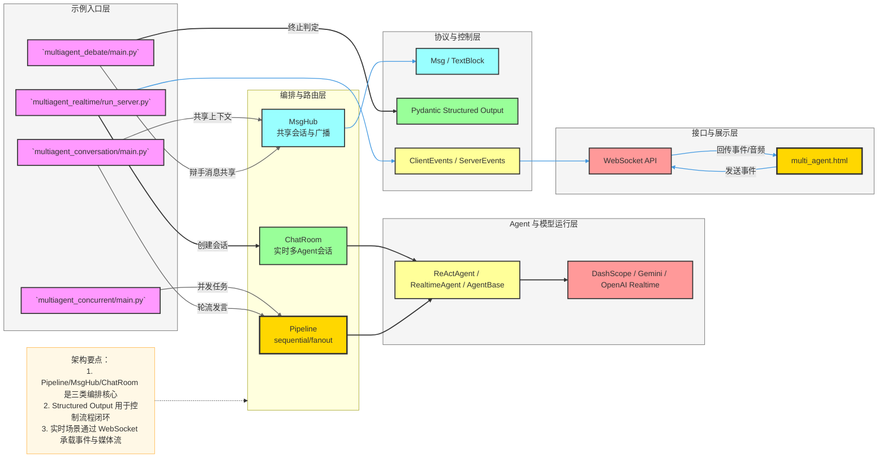
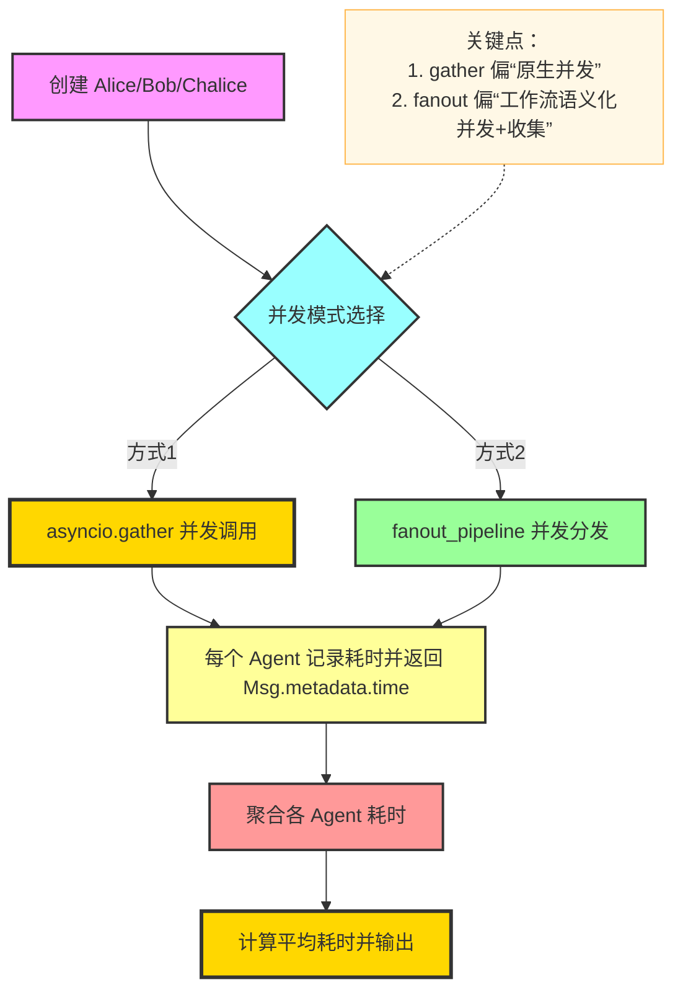
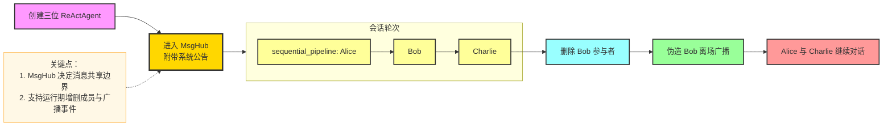
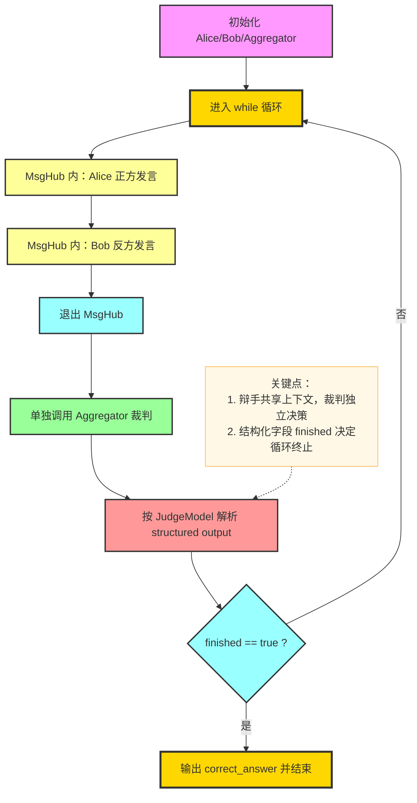
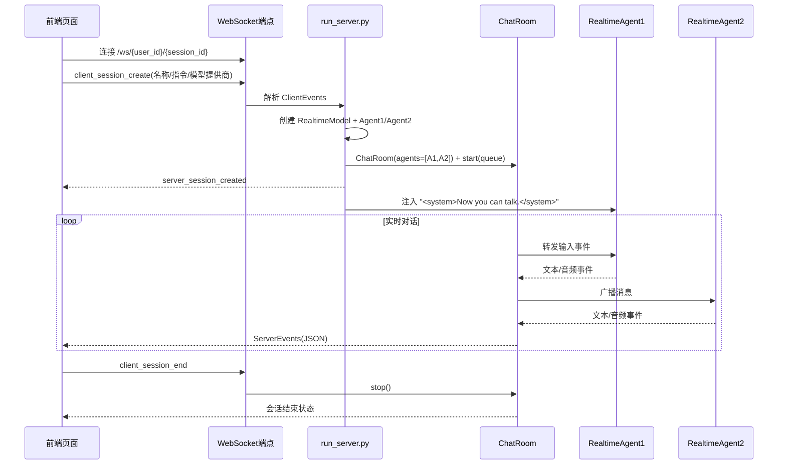

# `examples/workflows` 模块关键流程与架构说明

本文档面向 `examples/workflows`，用于说明该模块的核心概念、关键流程与系统架构，并提供 Mermaid 图辅助理解。

---

## 1. 快速阅读（合并自 README 精简版）

`examples/workflows` 通过四类示例展示 AgentScope 的工作流编排能力：

- `multiagent_concurrent`：并发执行与聚合结果（`asyncio.gather` / `fanout_pipeline`）
- `multiagent_conversation`：多角色共享会话空间（`MsgHub` + 顺序发言）
- `multiagent_debate`：带裁判的多轮辩论闭环（结构化判断是否结束）
- `multiagent_realtime`：实时语音多智能体会话（`ChatRoom` + WebSocket）

这些示例覆盖了从“离线任务并发”到“在线实时交互”的典型多智能体工作流形态。

---

## 2. 模块定位与能力边界

`examples/workflows` 的核心目标是演示“工作流编排”而非具体业务领域逻辑，重点能力包括：

- **执行编排**：顺序、并发、广播、循环终止条件
- **上下文共享**：在受控范围内共享对话消息与状态
- **角色协作**：多 Agent 分工（参与者、辩手、裁判、实时语音角色）
- **结构化控制**：通过结构化输出驱动流程分支与停止条件
- **实时连接**：WebSocket 驱动前后端实时事件流与音频流

---

## 3. 核心概念

- **Agent（`ReActAgent` / `RealtimeAgent` / `AgentBase`）**：执行单元，负责生成响应、消费上下文、输出结果。
- **Msg / MsgHub**：消息载体与共享会话空间；`MsgHub` 决定谁能看到哪些消息，并支持广播。
- **Pipeline**：
  - `sequential_pipeline`：按顺序执行，适合轮流发言；
  - `fanout_pipeline`：并发分发并收集结果，适合投票、并行求解。
- **Structured Output（Pydantic）**：将 LLM 输出约束为结构化字段，用于自动判定流程状态（如 `finished`）。
- **ChatRoom（Realtime）**：管理多个实时 Agent 的生命周期与消息转发。
- **ClientEvents / ServerEvents**：前后端在 WebSocket 上交换的协议事件。

---

## 4. 系统架构总览

---

## 5. 关键流程 A：并发执行与结果聚合（`multiagent_concurrent`）

该示例演示两种并发模式：

- `asyncio.gather`：直接并发执行多个 Agent 调用。
- `fanout_pipeline(enable_gather=True)`：统一分发输入并收集输出，便于后续统计。

---

## 6. 关键流程 B：共享会话与广播（`multiagent_conversation`）

该示例展示如何在一个共享会话空间中组织多参与者对话，并支持成员动态变更。

---

## 7. 关键流程 C：多轮辩论与裁判闭环（`multiagent_debate`）

该示例体现“讨论-裁判-继续/结束”的循环式工作流。

---

## 8. 关键流程 D：实时语音会话（`multiagent_realtime`）

该示例提供前后端协同的实时工作流：前端发事件、后端建会话、ChatRoom 驱动双 Agent 自主对话并回传事件。

---

## 9. 关键文件职责映射

| 文件 | 职责 | 关键点 |
|---|---|---|
| `examples/workflows/multiagent_concurrent/main.py` | 并发执行示例 | 对比 `asyncio.gather` 与 `fanout_pipeline`，并统计耗时 |
| `examples/workflows/multiagent_conversation/main.py` | 多人共享会话示例 | `MsgHub` 广播、`sequential_pipeline` 轮流发言、动态删成员 |
| `examples/workflows/multiagent_debate/main.py` | 辩论闭环示例 | 两辩手 + 裁判，`JudgeModel` 结构化判定循环结束 |
| `examples/workflows/multiagent_realtime/run_server.py` | 实时语音服务端 | FastAPI + WebSocket，创建 `ChatRoom` 与实时 Agent |
| `examples/workflows/multiagent_realtime/multi_agent.html` | 实时前端界面 | 发起会话、接收事件、播放音频、展示 transcript |
| `examples/workflows/*/README.md` | 示例使用说明 | 启动方式、模型配置与扩展建议 |

---

## 10. 实践建议（从示例走向生产）

- **统一工作流抽象**：将“并发-广播-裁判-终止”提炼为可复用流程模板。
- **增强可观测性**：记录每轮输入、输出、耗时、结构化判定结果，支持回放与排障。
- **失败与重试策略**：为模型调用、WebSocket 中断、事件解析异常添加降级与恢复机制。
- **状态外置化**：将会话状态与关键决策持久化，支撑长对话与多实例部署。
- **安全与配额治理**：对 API Key、并发连接数、模型调用频次进行统一治理。

