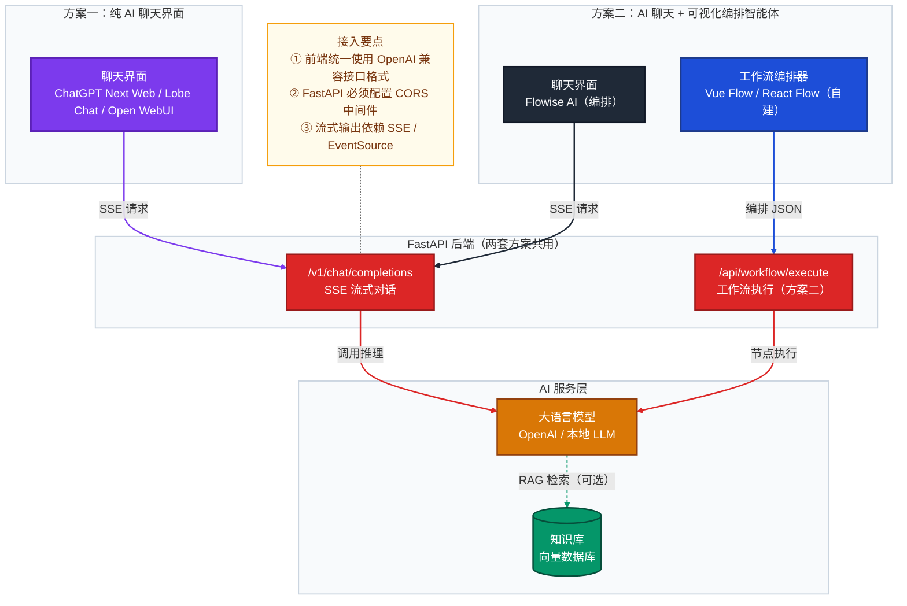

# 前端技术选型 · FastAPI 集成指南

> **适用后端**：FastAPI（固定）  
> **更新日期**：2026-03  
> **核心目标**：为两套需求场景选型开源前端方案，聚焦接入方式

---

## 一、方案全景

两套方案共享同一个 FastAPI 后端，差异仅在前端能力边界。



| 维度 | 方案一（纯聊天） | 方案二（聊天 + 编排） |
|------|----------------|----------------------|
| 适用场景 | 仅需 AI 聊天对话界面 | 需要可视化拖拽工作流 + 对话 |
| 前端复杂度 | 低（纯对话 UI） | 中高（含流程图引擎） |
| 接入周期 | 半天～1 天 | 1～3 天 |

---

## 二、方案一开源项目推荐（纯 AI 聊天界面）

> 四个项目均定位纯对话界面，支持 OpenAI 兼容接口，可直接对接 FastAPI 后端。`ChatGPT Next Web` 最轻量；`Lobe Chat` 功能最完整；`Open WebUI` 与 FastAPI 同栈且内置 RAG；`chatgpt-web` 适合 Vue3 团队二次开发。

| 对比维度 | ChatGPT Next Web | Lobe Chat | Open WebUI | chatgpt-web |
|----------|-----------------|-----------|-----------|-------------|
| **GitHub Stars（2026-03）** | ~78k | ~55k | ~65k | ~31k |
| **GitHub 地址** | [ChatGPTNextWeb/ChatGPT-Next-Web](https://github.com/ChatGPTNextWeb/ChatGPT-Next-Web) | [lobehub/lobe-chat](https://github.com/lobehub/lobe-chat) | [open-webui/open-webui](https://github.com/open-webui/open-webui) | [Chanzhaoyu/chatgpt-web](https://github.com/Chanzhaoyu/chatgpt-web) |
| **前端技术栈** | Next.js + React | Next.js + React + Ant Design X | **Svelte + SvelteKit** | Vue 3 + TypeScript + Vite |
| **后端技术栈** | Next.js API Routes（Edge Runtime） | Next.js API Routes | **Python + FastAPI** | Node.js + Express |
| **许可证** | MIT | Apache 2.0 | MIT | MIT |
| **UI 风格** | 极简黑白，高度还原 ChatGPT | 现代多栏侧边，类 Notion/Slack | 功能全面 Dashboard，类 Slack | 简洁中文风，轻量对话页 |
| **接入 FastAPI 方式** | 环境变量 `BASE_URL=http://fastapi-host:8000/v1` + `OPENAI_API_KEY=dummy` | UI 设置页或 `OPENAI_PROXY_URL=http://fastapi-host:8000/v1` | 环境变量 `OPENAI_API_BASE_URL=http://fastapi-host:8000`（**不带 /v1**，内部自动拼接） | 环境变量 `OPENAI_API_BASE_URL=http://fastapi-host:8000/v1` |
| **流式 SSE** | ✅ | ✅ | ✅ | ✅ |
| **多模型 / 多 Provider 切换** | ✅ 支持多 Provider | ✅ 支持 20+ Provider | ✅ Ollama + OpenAI 兼容双轨 | ⚠️ 仅 OpenAI 兼容单路 |
| **内置 RAG / 知识库** | ❌ | ✅ 文档上传（较新版） | ✅ 内置文件 RAG，功能最完整 | ❌ |
| **插件 / Function Calling** | ⚠️ 有限 | ✅ 插件市场 + MCP 支持 | ✅ 内置 Tool Calling | ❌ |
| **图片 / 多模态输入** | ✅ | ✅ | ✅ | ❌ |
| **Ollama 本地模型** | ⚠️ 需手动配置 | ✅ | ✅ 原生深度支持 | ❌ |
| **私有化部署** | ✅ Vercel / Docker | ✅ Docker / Vercel | ✅ Docker（官方推荐） | ✅ Docker |
| **Docker 一键启动** | ✅ | ✅ | ✅ | ✅ |
| **中文 i18n** | ✅ 完整 | ✅ 完整 | ⚠️ 英文为主，有社区中文翻译 | ✅ 中文优先 |
| **中文社区活跃度** | ⭐⭐⭐⭐⭐ | ⭐⭐⭐⭐ | ⭐⭐⭐ | ⭐⭐⭐⭐ |
| **优势** | 部署极简；星数最高；Edge Runtime 低延迟；零配置 Vercel 上线 | 功能最完整；插件/多模型/知识库一体；UI 最精致；持续迭代快 | 后端即 FastAPI 同栈零摩擦；原生 Ollama；RAG 内置最完整 | Vue3 技术栈；代码量小；适合国内团队快速二次开发 |
| **劣势 / 局限** | 无知识库、无插件；功能相对单一；不适合做完整产品 | 资源消耗较重；配置项复杂；上手成本略高 | Svelte 栈，前端改造成本较高；定制 UI 需学习 Svelte | 近期维护频率有所下降；功能扩展性受限 |
| **最适合场景** | 快速验证 Demo、内部轻量工具、PoC 展示 | 需插件 + 多模型 + 知识库的产品级聊天应用 | 需本地 Ollama + RAG + FastAPI 全 Python 栈统一部署 | Vue3 团队、偏好中文社区、轻量对话场景二次开发 |
| **综合推荐星级** | ⭐⭐⭐⭐⭐ 快速上线首选 | ⭐⭐⭐⭐⭐ 功能完整首选 | ⭐⭐⭐⭐ FastAPI 全栈首选 | ⭐⭐⭐ Vue 团队备选 |

### 方案一接入 FastAPI 配置速查

```bash
# FastAPI 最低接口要求
POST /v1/chat/completions   # 支持 stream=true，返回 text/event-stream
GET  /v1/models             # 返回模型列表（Open WebUI 启动时必须调用）

# ChatGPT Next Web（NextChat）
BASE_URL=http://fastapi-host:8000/v1
OPENAI_API_KEY=<随意填写，FastAPI 自行鉴权>

# Lobe Chat
OPENAI_PROXY_URL=http://fastapi-host:8000/v1
OPENAI_API_KEY=<同上>

# Open WebUI（注意：不带 /v1）
OPENAI_API_BASE_URL=http://fastapi-host:8000
OPENAI_API_KEY=<同上>

# chatgpt-web
OPENAI_API_BASE_URL=http://fastapi-host:8000/v1
OPENAI_API_KEY=<同上>

# 所有方案共用 —— FastAPI 必须配置 CORS
from fastapi.middleware.cors import CORSMiddleware
app.add_middleware(CORSMiddleware, allow_origins=["*"],
                   allow_methods=["*"], allow_headers=["*"])
```

---

## 三、方案二开源项目推荐（AI 聊天 + 可视化编排）

> 三个项目均具备可视化工作流编排能力，可与 FastAPI 后端 OpenAI 兼容接口对接。`Langflow` 后端本身即 FastAPI，天然同栈；`Dify` 功能最全；`Flowise AI` 生产级多智能体能力最成熟。

| 对比维度 | Flowise AI | Langflow | Dify |
|----------|-----------|---------|------|
| **GitHub Stars（2026-03）** | ~51k | ~50k | ~119k |
| **GitHub 地址** | [FlowiseAI/Flowise](https://github.com/FlowiseAI/Flowise) | [langflow-ai/langflow](https://github.com/langflow-ai/langflow) | [langgenius/dify](https://github.com/langgenius/dify) |
| **前端技术栈** | React + TypeScript | React + TypeScript | Next.js + React |
| **后端技术栈** | Node.js + TypeScript（monorepo） | **Python + FastAPI** | Python + Flask + Celery |
| **许可证** | Apache 2.0 | MIT | Apache 2.0（SaaS 版有附加限制） |
| **工作流引擎** | 可视化 LangChain 节点拖拽，支持多智能体 / Human-in-the-loop | 可视化 LangChain / LlamaIndex 节点拖拽，含预制模板 | 可视化 DAG 节点编排，内置条件分支 / 循环 / 并行 |
| **接入 FastAPI 方式** | 在「模型配置」中设置 Base URL → `http://fastapi-host/v1`，OpenAI 兼容即可 | 后端本身即 FastAPI，可直接扩展路由；也可通过节点配置 OpenAI Base URL | 「设置 → 模型供应商 → 添加自定义」，填入 Base URL `http://fastapi-host/v1`，Key 随意填 |
| **流式 SSE 支持** | ✅ | ✅ | ✅ |
| **内置 RAG / 知识库** | ✅ 向量数据库集成 | ✅ 文档加载器节点 | ✅ 最完整，含 OCR / 文档解析 |
| **内置 LLM 管理** | ✅ 100+ 集成 | ✅ LangChain 全生态 | ✅ 20+ 供应商，含本地模型 |
| **API 对外暴露** | ✅ 流程可发布为 REST API | ✅ 流程自动暴露为 REST API | ✅ 应用可发布为独立 API |
| **内置 Tracing / 可观测** | ✅ 原生支持 | ⚠️ 需集成第三方 | ✅ 内置 LLMOps 监控 |
| **私有化部署** | ✅ Docker Compose | ✅ Docker / pip 安装 | ✅ Docker Compose |
| **中文社区活跃度** | ⭐⭐⭐ | ⭐⭐⭐ | ⭐⭐⭐⭐⭐ |
| **优势** | 生产级多智能体；内置 Tracing 与 Human-in-the-loop；节点丰富 | 与 FastAPI **同一技术栈**，后端无缝融合；原型验证最快；MIT 最自由 | 功能最全；LLMOps 全套；星数最高；迭代最快；文档完备 |
| **劣势 / 局限** | 后端为 Node.js，与 FastAPI 异构，需跨服务通信；部署资源较重 | 功能相对轻量，大规模场景不及 Dify；社区生态较小 | 部署资源消耗最重（依赖 Redis + PostgreSQL + Celery）；SaaS 版有商业限制 |
| **最适合场景** | 已有 Node 生态、需成熟多智能体编排、上生产环境 | FastAPI Python 团队快速原型、希望统一技术栈、需要二次开发 | 需要企业级 LLMOps 全功能、团队熟悉 Python、对资源消耗不敏感 |
| **综合推荐星级** | ⭐⭐⭐⭐ | ⭐⭐⭐⭐⭐ FastAPI 最佳搭档 | ⭐⭐⭐⭐ 功能最强首选 |

### 方案二接入 FastAPI 配置速查

```bash
# FastAPI 需暴露的最低接口
POST /v1/chat/completions   # 返回 OpenAI 格式 SSE 流
GET  /v1/models             # 返回可用模型列表（Flowise/Langflow 自动探测）

# Flowise：启动时注入环境变量
OPENAI_API_BASE=http://fastapi-host:8000/v1
OPENAI_API_KEY=dummy                         # FastAPI 自行鉴权，Key 内容随意

# Langflow：节点内配置 OpenAI Base URL（无需重启）
OpenAI Base URL = http://fastapi-host:8000/v1

# Dify：Web UI 操作路径
设置 → 模型供应商 → 添加自定义提供商 → Base URL: http://fastapi-host:8000/v1
```

---

## 四、选型决策速查

| 你的情况 | 推荐组合 |
|---------|---------|
| 仅需聊天，最快上线 Demo / PoC | **ChatGPT Next Web + FastAPI**（半天内完成） |
| 需要聊天 + 插件 + 知识库，打造完整产品 | **Lobe Chat + FastAPI**（功能最全，持续迭代） |
| 需要本地 Ollama 接入 + RAG + 全 Python 栈统一 | **Open WebUI + FastAPI**（同栈零摩擦） |
| 团队熟悉 Vue3，偏好中文社区，轻量二次开发 | **chatgpt-web + FastAPI**（代码简洁，改动成本低） |
| 需要可视化拖拽工作流，团队用 Python / FastAPI | **Langflow + FastAPI**（同栈无缝集成，改造成本最低） |
| 需要可视化工作流，追求功能完整，可接受重量级部署 | **Dify + FastAPI**（LLMOps 全套） |
| 需要可视化工作流，上生产环境，注重多智能体编排 | **Flowise AI + FastAPI**（Node 生态，成熟度高） |

---

## 五、额外选型参考

> 以下项目不直接归属方案一或方案二，但在特定场景下值得参考。

### FastGPT（知识库 Q&A 优先场景）

> **[labring/FastGPT](https://github.com/labring/FastGPT)** · ~27.5k Stars · Apache 2.0

FastGPT 是以**知识库 + RAG** 为核心的一体化平台，自带可视化工作流编排（Flow 编辑器），但工作流专为知识库问答路径设计，而非通用 AI 节点编排。

| 维度 | 说明 |
|------|------|
| **GitHub 地址** | [labring/FastGPT](https://github.com/labring/FastGPT) |
| **前端技术栈** | Next.js + React + TypeScript + Chakra UI |
| **后端技术栈** | Node.js（Next.js API Routes）+ MongoDB + PostgreSQL/PgVector |
| **许可证** | Apache 2.0 |
| **核心能力** | 知识库管理、多格式文档解析（OCR）、精细分块策略、RAG 检索、可视化 Q&A 流编排 |
| **与 FastAPI 的关系** | FastGPT **自带完整后端**，与 FastAPI 并列部署；可通过 OpenAI 兼容接口将 FastAPI 配置为其上游模型来源 |
| **接入方式** | 设置 → 模型配置 → 自定义 Base URL → `http://fastapi-host:8000/v1` |
| **私有化部署** | ✅ Docker Compose（需 MongoDB + PgVector + Redis） |
| **中文社区** | ✅ 中文优先，文档完备，国内团队维护 |
| **优势** | RAG 能力最专精；知识库管理 UI 完善；中文社区最友好；内置分享链接与嵌入能力 |
| **劣势 / 局限** | 非纯前端，不能仅作 Chat UI 接入 FastAPI；通用工作流编排弱于 Dify/Flowise；部署依赖重 |
| **适合场景** | 企业内部知识库问答系统、文档智能检索、需要精细 RAG 调优、团队偏好中文社区 |

> ⚠️ **使用注意**：FastGPT 是独立平台，引入后 FastAPI 仅作为其**上游模型提供方**（配置为 OpenAI 兼容接口），两者并列部署，FastAPI 不再是唯一后端入口。

---
