# AgentBasePlatform 后端架构设计文档 v1.0

> **文档版本**：v1.0  
> **基于初稿**：智能体平台项目架构设计文档 v0.1  
> **定位**：后端架构详细设计，覆盖架构决策、模块拆分、数据模型、安全、可观测性等全方位设计

---

## 一、整体架构设计

### 1.1 架构风格选型

| 维度 | 分析 | 结论 |
|------|------|------|
| **用户规模** | 1,000～5,000 人，峰值 100 QPS | 单体架构即可承载 |
| **团队规模** | 中小团队，技术栈以 Python 为主 | 微服务运维成本过高 |
| **业务复杂度** | 多模块（智能体、工作流、RAG、权限等）业务边界清晰 | 需要模块化隔离 |
| **演进需求** | MVP 快速验证 → 逐步增强 → 生产就绪 | 需要支持渐进式拆分 |

**架构决策：模块化单体（Modular Monolith）**

- 单一部署单元，降低运维复杂度，适配中小团队
- 模块间通过显式接口交互，严禁跨模块直接访问数据库表
- 模块边界对齐业务域，未来可按模块拆分为独立服务
- 通过 RabbitMQ 实现模块间异步解耦，为后续服务化预留通道

### 1.2 系统整体架构图

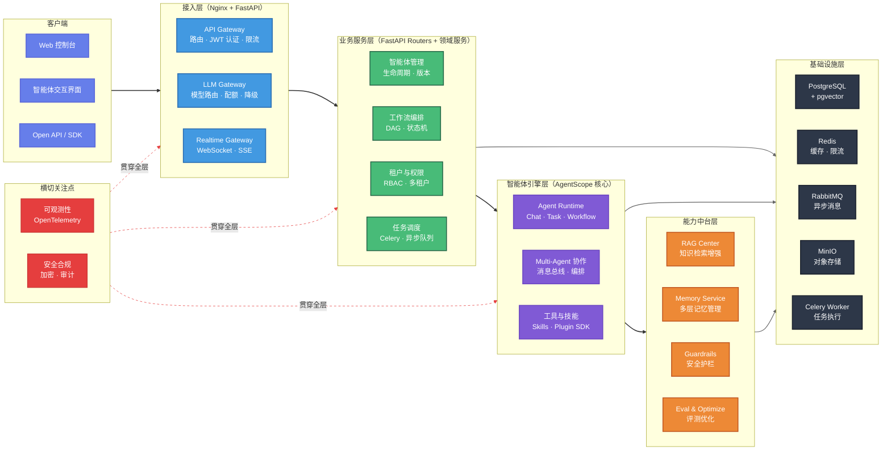

### 1.3 各层职责划分

| 层级 | 职责 | 技术实现 | 关键约束 |
|------|------|----------|----------|
| **接入层** | 统一流量入口，认证鉴权、限流熔断、协议转换 | Nginx 反向代理 + FastAPI 中间件 | 无业务逻辑，仅做流量治理 |
| **业务服务层** | 业务领域逻辑编排，数据持久化，事务管理 | FastAPI Router + 领域服务 + SQLAlchemy | 各模块通过接口交互，禁止跨模块直访 DB |
| **智能体引擎层** | 智能体运行时、多 Agent 协作、工具调用 | AgentScope 框架 + Skills + Bricks | 纯技术引擎，不含业务语义 |
| **能力中台层** | RAG、记忆、评测、安全护栏等通用 AI 能力 | 独立服务模块，通过内部 API 调用 | 中台能力下沉，上层按需调用 |
| **基础设施层** | 数据存储、缓存、消息通信、对象存储 | PostgreSQL / Redis / RabbitMQ / MinIO | Docker Compose 统一编排 |

### 1.4 核心请求流转（以智能体对话为例）

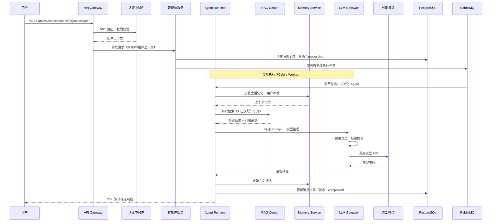

---

## 二、分模块架构设计

### 2.1 模块全景与依赖关系

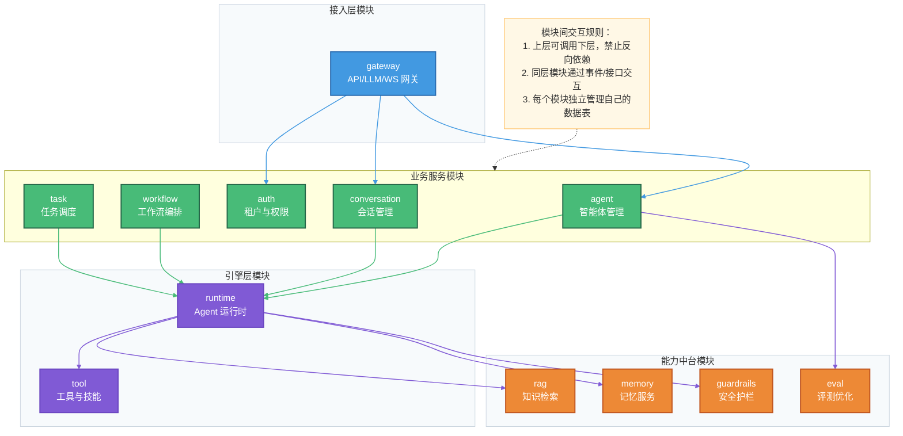

### 2.2 gateway — 网关模块

> **架构说明**：API Gateway / LLM Gateway / Realtime Gateway 不是三个独立服务，而是同一 `gateway` 模块内按**协议与关注点分离**的三个逻辑组件，共享同一个 FastAPI 进程、同一套中间件链（CORS → JWT → 限流 → 审计），统一通过 Nginx 反向代理接入。分区的目的是隔离三类流量各自的处理逻辑（REST 路由 / 模型选型与降级 / 长连接管理），避免代码耦合。未来若单一组件成为瓶颈，可按路径前缀拆出独立部署。

| 项目 | 说明 |
|------|------|
| **职责** | 统一流量入口，认证鉴权（JWT 校验）、请求限流（Redis 令牌桶）、路由分发、LLM 模型路由与降级、WebSocket/SSE 实时通道管理 |
| **AgentScope 集成** | 无直接集成，纯基础设施层 |

**核心接口：**

| 接口 | 方法 | 说明 |
|------|------|------|
| `/api/v1/*` | ALL | API Gateway 统一入口，路由至各业务模块 |
| `/api/v1/llm/completions` | POST | LLM Gateway 模型推理统一入口 |
| `/ws/conversations/{id}` | WS | 实时对话 WebSocket 通道 |
| `/api/v1/sse/conversations/{id}` | GET | SSE 流式输出通道 |

**模块架构图：**

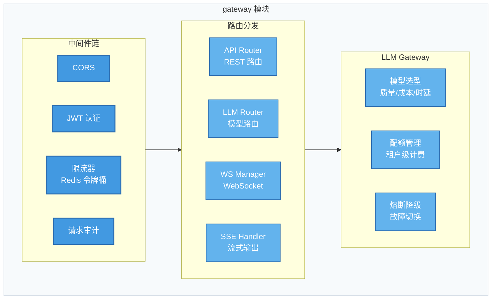

### 2.3 agent — 智能体管理模块

| 项目 | 说明 |
|------|------|
| **职责** | 智能体全生命周期管理：创建、配置、发布、版本化、下线；智能体模板管理；关联知识库与工具集 |
| **AgentScope 集成** | 通过 `agentscope` 核心框架加载 Agent 配置，通过 `agentscope-skills` 关联预制技能 |

**核心接口：**

| 接口 | 方法 | 输入 | 输出 |
|------|------|------|------|
| `/api/v1/agents` | POST | `AgentCreateRequest`（名称、描述、类型、模型配置、提示词、工具集） | `AgentResponse`（agent_id, 版本号） |
| `/api/v1/agents` | GET | 分页参数、筛选条件 | `PagedResponse[AgentSummary]` |
| `/api/v1/agents/{id}` | GET | — | `AgentDetailResponse` |
| `/api/v1/agents/{id}` | PUT | `AgentUpdateRequest` | `AgentResponse` |
| `/api/v1/agents/{id}/publish` | POST | `PublishRequest`（版本说明） | `AgentVersionResponse` |
| `/api/v1/agents/{id}/versions` | GET | — | `List[AgentVersionSummary]` |
| `/api/v1/agents/{id}/versions/{ver}` | GET | — | `AgentVersionDetail` |

**模块间依赖：**

| 依赖模块 | 交互方式 | 说明 |
|----------|----------|------|
| `auth` | 同步调用 | 校验操作权限 |
| `runtime` | 同步调用 | 发布时验证 Agent 配置合法性 |
| `rag` | 同步调用 | 绑定/解绑知识库 |
| `eval` | 异步事件 | 发布后触发基准评测 |

### 2.4 conversation — 会话管理模块

| 项目 | 说明 |
|------|------|
| **职责** | 管理用户与智能体的对话会话：会话创建/恢复/归档、消息收发与持久化、流式响应推送、对话历史查询 |
| **AgentScope 集成** | 通过 Agent Runtime 执行对话，使用 `agentscope` 的消息协议（`Msg`） |

**核心接口：**

| 接口 | 方法 | 说明 |
|------|------|------|
| `/api/v1/conversations` | POST | 创建会话（指定 agent_id） |
| `/api/v1/conversations/{id}/messages` | POST | 发送消息（触发智能体执行） |
| `/api/v1/conversations/{id}/messages` | GET | 查询历史消息（分页） |
| `/api/v1/conversations/{id}` | DELETE | 归档/删除会话 |

### 2.5 workflow — 工作流编排模块

| 项目 | 说明 |
|------|------|
| **职责** | 多智能体协作流程编排：DAG 定义与校验、流程执行调度、节点状态机管理、人工介入（HITL）节点、补偿事务处理 |
| **AgentScope 集成** | 基于 `agentscope` 的 Multi-Agent 消息总线编排多 Agent 协作 |

**核心接口：**

| 接口 | 方法 | 说明 |
|------|------|------|
| `/api/v1/workflows` | POST | 创建工作流（DAG 定义） |
| `/api/v1/workflows/{id}` | PUT | 更新工作流 |
| `/api/v1/workflows/{id}/execute` | POST | 触发执行 |
| `/api/v1/workflows/{id}/executions` | GET | 查询执行历史 |
| `/api/v1/workflows/{id}/executions/{eid}` | GET | 查询执行详情（含各节点状态） |

**工作流执行状态机：**

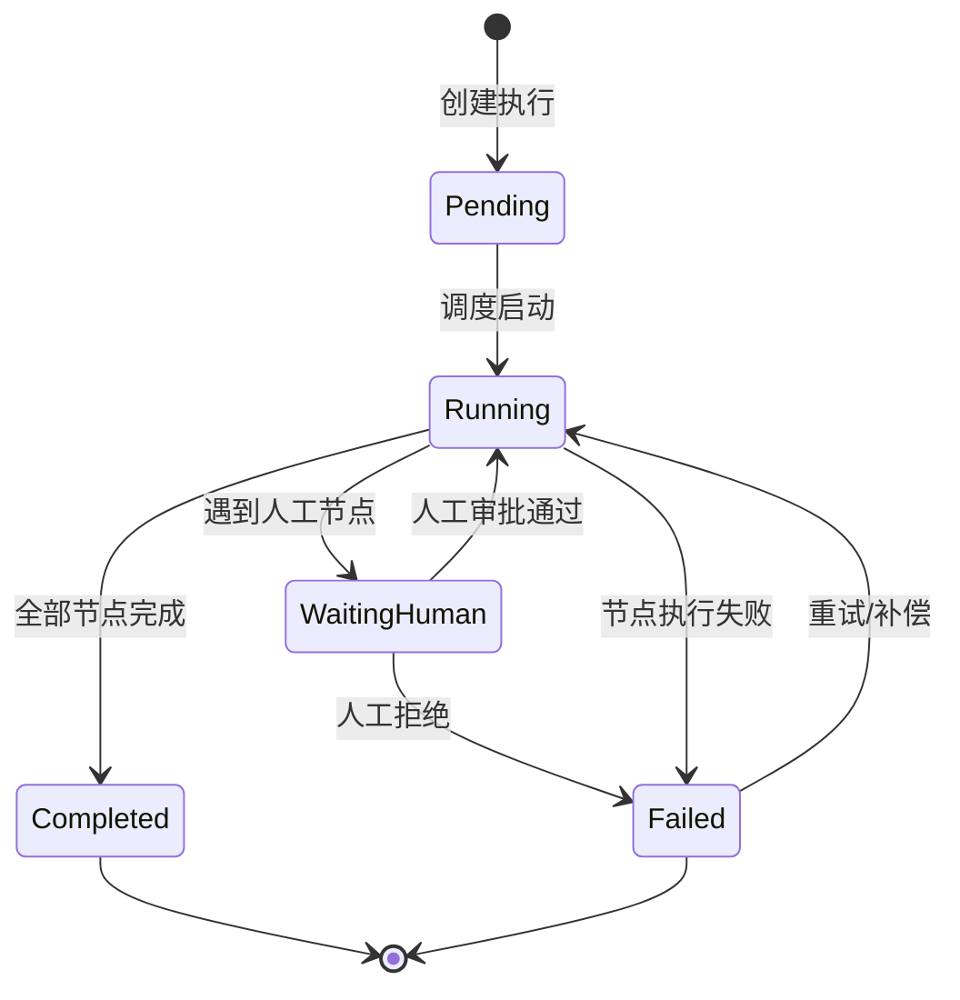

### 2.6 auth — 租户与权限模块

| 项目 | 说明 |
|------|------|
| **职责** | 用户认证（注册/登录/Token 管理）、多租户隔离、组织与项目管理、RBAC 权限模型（Casbin）、API Key 管理、配额管控 |

**核心接口：**

| 接口 | 方法 | 说明 |
|------|------|------|
| `/api/v1/auth/register` | POST | 用户注册 |
| `/api/v1/auth/login` | POST | 登录获取 JWT |
| `/api/v1/auth/refresh` | POST | 刷新 Token |
| `/api/v1/tenants` | CRUD | 租户管理 |
| `/api/v1/tenants/{id}/members` | CRUD | 租户成员管理 |
| `/api/v1/roles` | CRUD | 角色管理 |
| `/api/v1/api-keys` | CRUD | API Key 管理 |

**RBAC 权限模型：**

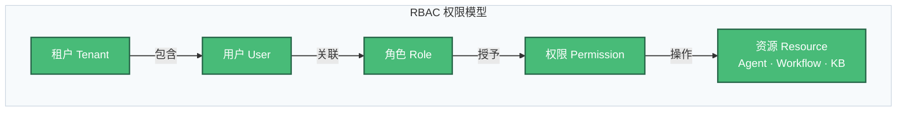

**预定义角色：**

| 角色 | 权限范围 |
|------|----------|
| `tenant_admin` | 租户全部资源的完整操作权限 |
| `developer` | 智能体、工作流、知识库的创建/编辑/调试权限 |
| `operator` | 智能体发布/下线、监控查看权限 |
| `viewer` | 只读查看权限 |

### 2.7 task — 任务调度模块

| 项目 | 说明 |
|------|------|
| **职责** | 异步任务调度与执行：Celery Worker 管理、任务优先级队列、重试策略、死信处理、定时任务（Celery Beat）、任务状态追踪 |

**核心接口：**

| 接口 | 方法 | 说明 |
|------|------|------|
| `/api/v1/tasks` | GET | 查询任务列表 |
| `/api/v1/tasks/{id}` | GET | 查询任务状态与结果 |
| `/api/v1/tasks/{id}/cancel` | POST | 取消任务 |
| `/api/v1/tasks/{id}/retry` | POST | 重试失败任务 |

**任务类型与优先级：**

| 任务类型 | 队列 | 优先级 | 超时 | 重试 |
|----------|------|--------|------|------|
| 智能体对话执行 | `agent_execution` | HIGH | 120s | 1 次 |
| 工作流节点执行 | `workflow_execution` | HIGH | 300s | 2 次 |
| 知识库文档索引 | `document_indexing` | MEDIUM | 600s | 3 次 |
| 评测任务 | `evaluation` | LOW | 1800s | 1 次 |
| 定期清理/归档 | `maintenance` | LOW | 3600s | 0 次 |

### 2.8 runtime — Agent 运行时模块

| 项目 | 说明 |
|------|------|
| **职责** | AgentScope 核心集成层：Agent 实例化与执行、Multi-Agent 消息路由与协作、工具调用沙箱、Prompt 模板管理 |
| **AgentScope 集成** | 直接依赖 `agentscope` 核心框架、`agentscope-bricks` 基础组件、`agentscope-skills` 技能库 |

**模块架构图：**

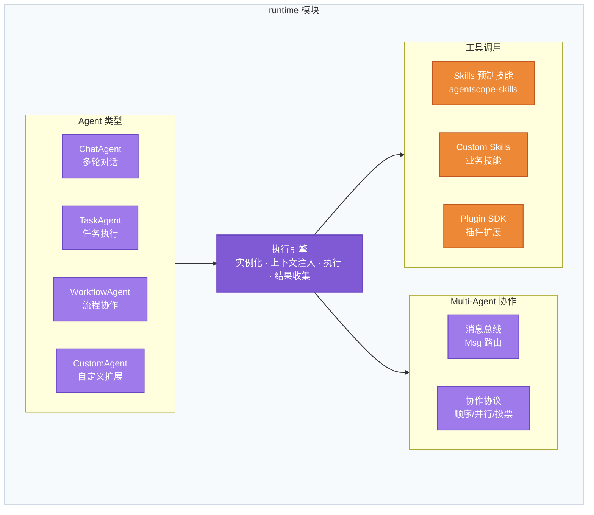

### 2.9 rag — 知识检索增强模块

| 项目 | 说明 |
|------|------|
| **职责** | 知识库管理：文档上传解析 → 分块 → 向量化 → 索引存储；检索服务：多路召回 → 重排序 → 引用溯源；支持多租户知识库隔离 |
| **AgentScope 集成** | 基于 `agentscope-bricks` 的文档解析工具 |

**核心接口：**

| 接口 | 方法 | 说明 |
|------|------|------|
| `/api/v1/knowledge-bases` | CRUD | 知识库管理 |
| `/api/v1/knowledge-bases/{id}/documents` | POST | 上传文档（支持 PDF/DOCX/MD/TXT） |
| `/api/v1/knowledge-bases/{id}/documents/{did}` | DELETE | 删除文档及其向量索引 |
| `/api/v1/knowledge-bases/{id}/search` | POST | 语义检索（内部调用） |

**RAG Pipeline 流程：**

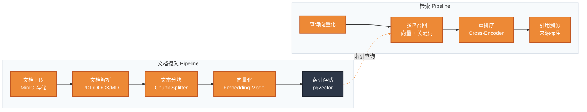

### 2.10 memory — 记忆服务模块

| 项目 | 说明 |
|------|------|
| **职责** | 多层记忆管理：短期记忆（会话上下文窗口）、长期记忆（用户偏好/画像）、情节记忆（任务执行轨迹）；记忆检索与遗忘策略；合规删除 |

**记忆层次设计：**

| 记忆类型 | 存储介质 | 生命周期 | 容量策略 |
|----------|----------|----------|----------|
| **短期记忆** | Redis | 会话级（会话结束后 TTL 过期） | 滑动窗口（最近 N 轮）+ Token 截断 |
| **长期记忆** | PostgreSQL + pgvector | 用户级（持久化） | 重要性评分 + 定期压缩摘要 |
| **情节记忆** | PostgreSQL | 任务级（持久化） | 自动归档 + 按时间衰减 |

### 2.11 guardrails — 安全护栏模块

| 项目 | 说明 |
|------|------|
| **职责** | 输入/输出内容审查（敏感词、有害内容检测）、PII 脱敏、工具调用白名单校验、安全审计日志 |

**安全检查流程：**

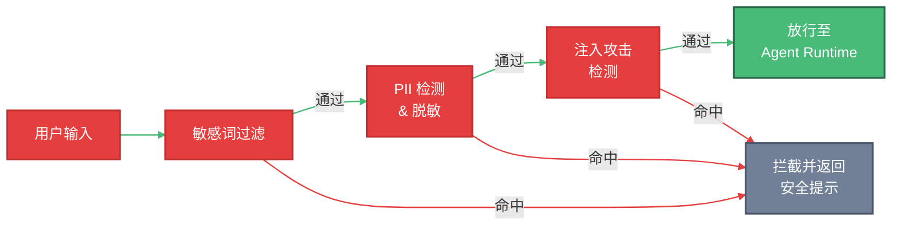

### 2.12 eval — 评测优化模块

| 项目 | 说明 |
|------|------|
| **职责** | 智能体质量评测：离线基准评测（准确率、相关性、安全性）、在线反馈采集（点赞/点踩/纠正）、评测报告生成；优化闭环：基于评测结果优化 Prompt / 模型 / 检索策略 |

**核心接口：**

| 接口 | 方法 | 说明 |
|------|------|------|
| `/api/v1/evaluations` | POST | 创建评测任务 |
| `/api/v1/evaluations/{id}` | GET | 查询评测结果 |
| `/api/v1/feedback` | POST | 提交用户反馈 |
| `/api/v1/agents/{id}/metrics` | GET | 查询智能体质量指标 |

---

## 三、API 设计规范

### 3.1 接口风格

采用 **RESTful** 风格，资源导向设计。

### 3.2 URL 命名规范

| 规则 | 示例 | 说明 |
|------|------|------|
| 统一前缀 | `/api/v1/` | 版本号嵌入 URL 路径 |
| 资源名用复数名词 | `/agents`、`/workflows` | 禁止使用动词（`/getAgent`） |
| 嵌套资源最多两层 | `/agents/{id}/versions` | 超过两层用查询参数替代 |
| 动作用子资源 | `/agents/{id}/publish` | 非 CRUD 操作用 POST + 动作子路径 |
| 小写 + 连字符 | `/knowledge-bases` | 禁止驼峰或下划线 |

### 3.3 请求/响应统一格式

**成功响应：**

```python
{
    "code": 0,
    "message": "success",
    "data": { ... },           # 业务数据
    "request_id": "req_xxx"    # 请求追踪 ID
}
```

**分页响应：**

```python
{
    "code": 0,
    "message": "success",
    "data": {
        "items": [ ... ],
        "total": 100,
        "page": 1,
        "page_size": 20
    },
    "request_id": "req_xxx"
}
```

**错误响应：**

```python
{
    "code": 40001,             # 业务错误码
    "message": "Agent not found",
    "details": { ... },        # 可选错误详情
    "request_id": "req_xxx"
}
```

**错误码规范：**

| 错误码范围 | 含义 |
|-----------|------|
| `0` | 成功 |
| `40000 ~ 40099` | 通用客户端错误（参数校验、格式错误） |
| `40100 ~ 40199` | 认证与授权错误 |
| `40400 ~ 40499` | 资源不存在 |
| `42900 ~ 42999` | 限流与配额错误 |
| `50000 ~ 50099` | 服务端内部错误 |
| `50200 ~ 50299` | 外部服务错误（模型调用失败等） |

### 3.4 版本管理策略

| 策略 | 说明 |
|------|------|
| **URL 路径版本** | `/api/v1/`，大版本号嵌入路径 |
| **兼容性保证** | 同一大版本内新增字段保持向后兼容，不删除已有字段 |
| **废弃流程** | 旧版本标记 `Deprecated` Header → 保留至少 3 个月 → 下线 |
| **版本共存** | 最多同时维护 2 个大版本（当前版本 + 上一版本） |

### 3.5 认证方式

| 场景 | 认证方式 | 说明 |
|------|----------|------|
| **Web 前端** | JWT（Access Token + Refresh Token） | Access Token 有效期 30 分钟，Refresh Token 有效期 7 天 |
| **Open API** | API Key（`X-API-Key` Header） | 每个 API Key 绑定租户和权限范围 |
| **内部服务** | 共享密钥签名 | HMAC-SHA256 签名校验（模块间调用） |

### 3.6 通用请求 Header

| Header | 说明 | 必选 |
|--------|------|------|
| `Authorization` | `Bearer {jwt_token}` | 是（Web） |
| `X-API-Key` | API Key | 是（Open API） |
| `X-Request-ID` | 请求追踪 ID（客户端生成或服务端自动分配） | 否 |
| `X-Tenant-ID` | 租户 ID（多租户场景） | 否（JWT 中携带） |

---

## 四、数据库设计

### 4.1 核心数据模型（ER 图）

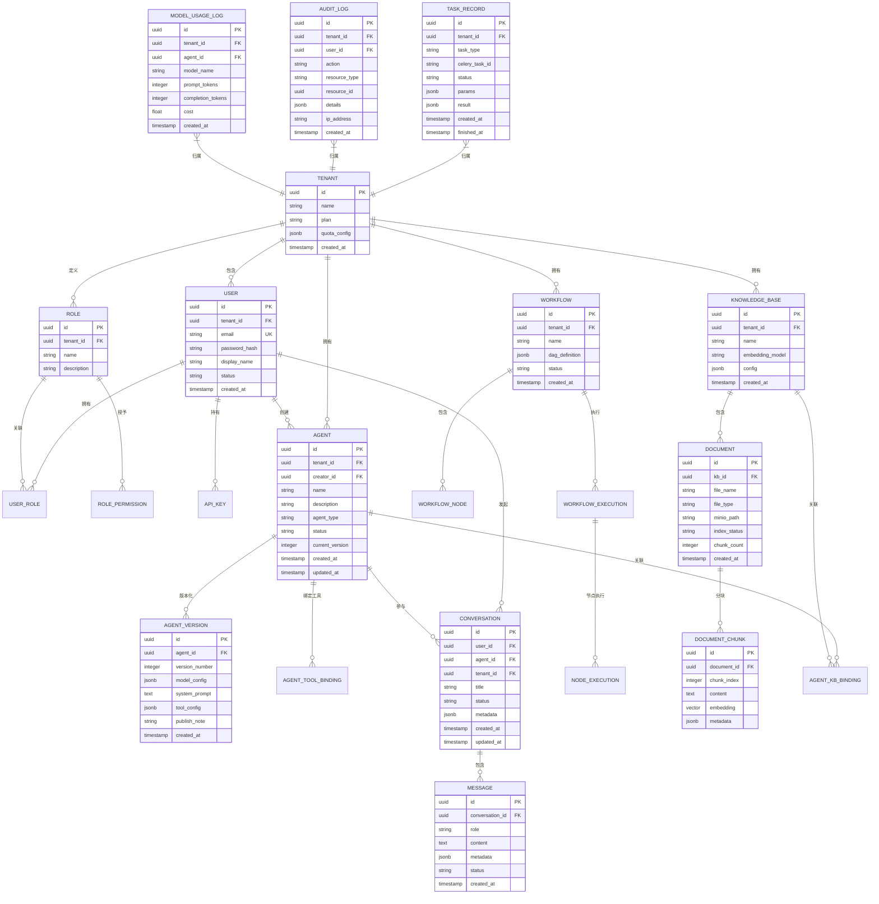

### 4.2 分库分表策略

当前规模（10 万级初期数据）**无需分库分表**，采用以下策略应对数据增长：

| 阶段 | 数据规模 | 策略 |
|------|----------|------|
| **MVP 期** | 10 万级 | 单库单表，关注索引优化 |
| **增长期** | 百万级 | 分区表（按 `tenant_id` 或时间分区），冷数据归档 |
| **规模化** | 千万级 | 评估读写分离（主从复制）；高频表水平分片 |

**冷数据归档规则：**

| 表 | 归档条件 | 归档方式 |
|----|----------|----------|
| `message` | 会话关闭超过 90 天 | 迁移至 `message_archive` 表 |
| `audit_log` | 创建超过 180 天 | 迁移至 MinIO 归档（Parquet 格式） |
| `model_usage_log` | 创建超过 90 天 | 聚合统计后归档 |
| `document_chunk` | 所属文档已删除 | 物理删除 |

### 4.3 索引设计原则

| 原则 | 说明 |
|------|------|
| **租户隔离索引** | 所有业务表必须包含 `(tenant_id, ...)` 复合索引，确保多租户查询性能 |
| **查询驱动** | 仅为高频查询路径创建索引，避免过度索引影响写入性能 |
| **覆盖索引** | 列表查询优先使用覆盖索引减少回表 |
| **向量索引** | `document_chunk.embedding` 使用 pgvector 的 `ivfflat` 索引（数据量大时切换 `hnsw`） |

**关键索引清单：**

| 表 | 索引 | 类型 |
|----|------|------|
| `user` | `(tenant_id, email)` | UNIQUE |
| `agent` | `(tenant_id, status, created_at DESC)` | B-Tree |
| `conversation` | `(user_id, status, updated_at DESC)` | B-Tree |
| `message` | `(conversation_id, created_at)` | B-Tree |
| `document_chunk` | `(document_id, chunk_index)` | B-Tree |
| `document_chunk` | `(embedding)` | IVFFlat / HNSW |
| `audit_log` | `(tenant_id, created_at DESC)` | B-Tree |
| `model_usage_log` | `(tenant_id, agent_id, created_at)` | B-Tree |
| `task_record` | `(status, created_at)` | B-Tree |

### 4.4 数据迁移方案

基于 **Alembic** 进行数据库版本管理：

| 规范 | 说明 |
|------|------|
| **迁移文件命名** | `{revision_id}_{description}.py`，description 使用英文蛇形命名 |
| **向前兼容** | 每次迁移必须包含 `upgrade()` 和 `downgrade()` |
| **在线迁移** | DDL 变更使用 `ADD COLUMN ... DEFAULT` 而非 `ALTER COLUMN`，避免锁表 |
| **数据迁移** | 大表数据迁移分批执行（每批 1000 行），避免长事务 |
| **CI 集成** | PR 合并前自动检测迁移冲突，部署流水线自动执行 `alembic upgrade head` |

---

## 五、安全设计

### 5.1 认证与授权方案

**认证流程：**

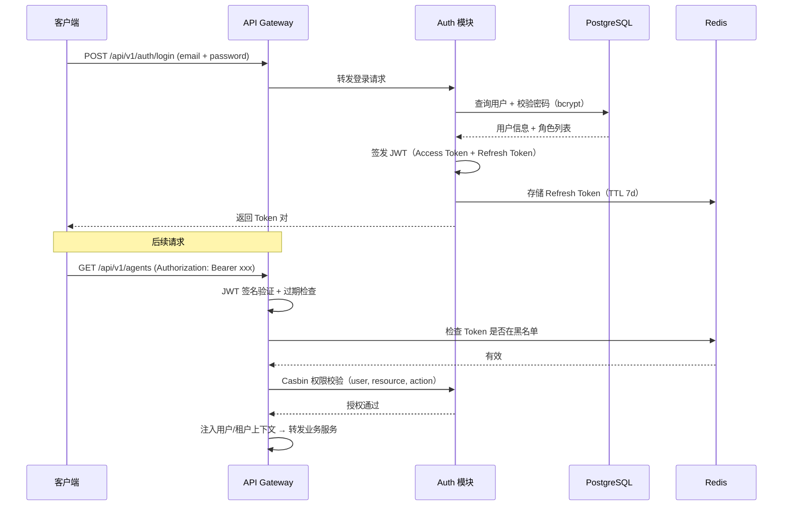

**RBAC 实现（Casbin）：**

| 要素 | 说明 |
|------|------|
| **模型定义** | RBAC with domains（`sub, dom, obj, act`），domain 对应租户 |
| **策略存储** | PostgreSQL Adapter，支持动态策略变更 |
| **缓存** | 策略加载后缓存至内存，变更时通过 Redis Pub/Sub 通知刷新 |
| **中间件** | FastAPI 依赖注入，请求级权限校验 |

### 5.2 数据加密策略

| 层级 | 方案 | 说明 |
|------|------|------|
| **传输层** | TLS 1.3 | Nginx 统一终止 TLS，内部通信可选 mTLS |
| **存储层 — 密码** | bcrypt（cost factor 12） | 不可逆散列 |
| **存储层 — 敏感配置** | AES-256-GCM 字段级加密 | API Key、模型密钥等字段加密存储 |
| **存储层 — 数据库** | PostgreSQL TDE（可选） | 生产环境启用透明数据加密 |
| **密钥管理** | 环境变量 → 后期迁移 Vault/KMS | MVP 阶段使用 `.env` + Docker Secret |

### 5.3 接口安全

| 安全措施 | 实现方案 |
|----------|----------|
| **限流** | Redis 令牌桶算法，分三级：全局限流（1000 req/s）→ 租户级（100 req/min）→ 用户级（30 req/min） |
| **防重放** | 请求携带 `X-Request-ID` + `X-Timestamp`，服务端校验时间窗口（±5 分钟）+ Redis 去重 |
| **参数校验** | Pydantic v2 模型校验，所有输入字段强类型 + 约束（长度、范围、正则） |
| **SQL 注入** | SQLAlchemy ORM 参数化查询，禁止原生 SQL 拼接 |
| **XSS** | 输出编码 + CSP Header |
| **CORS** | 白名单域名配置，禁止通配符 `*` |

### 5.4 敏感数据处理规范

| 数据类型 | 处理方式 |
|----------|----------|
| **用户密码** | bcrypt 散列存储，禁止明文日志 |
| **API Key / Token** | AES-256-GCM 加密存储，API 返回时仅展示前 8 位 + 掩码 |
| **模型 API Key** | 加密存储，运行时解密使用，禁止日志输出 |
| **用户对话内容** | 存储加密（可选），审计日志脱敏 |
| **PII 信息** | Guardrails 模块自动检测并脱敏（姓名、手机号、身份证号等） |
| **数据删除** | 支持用户数据导出（GDPR-like）和彻底删除请求 |

---

## 六、非功能性需求

### 6.1 高可用设计

| 组件 | 高可用方案 | 健康检查 |
|------|-----------|----------|
| **FastAPI 应用** | 多实例部署（Docker Compose `replicas: 2+`），Nginx 负载均衡 | `/health`（存活检查）、`/ready`（就绪检查，含 DB/Redis 连通性） |
| **PostgreSQL** | 主从流复制，自动故障转移（Patroni 或云托管 RDS） | 连接池心跳检测 |
| **Redis** | Redis Sentinel 或主从复制 | 定期 PING |
| **RabbitMQ** | 镜像队列（Mirrored Queue），节点故障自动切换 | Management API 健康检查 |
| **Celery Worker** | 多 Worker 实例 + 自动重启策略 | Celery Inspect 心跳 |
| **MinIO** | 纠删码模式（4 节点起），单点故障不丢数据 | MinIO Health Check API |

**故障转移策略：**

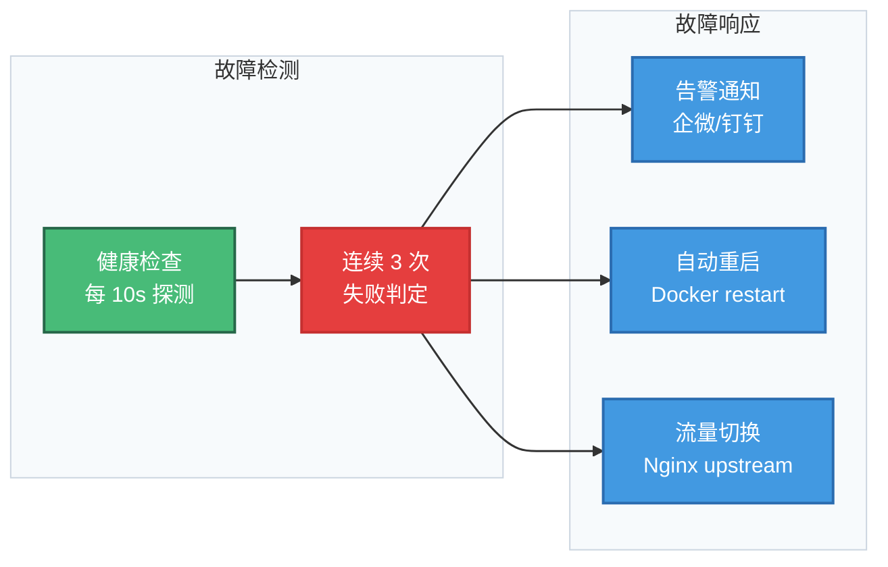

### 6.2 可扩展性设计

| 维度 | 方案 |
|------|------|
| **应用层水平扩展** | FastAPI 无状态设计（会话状态存 Redis），直接增加实例数 |
| **Worker 水平扩展** | Celery Worker 按队列独立扩缩，CPU 密集型任务（文档索引）独立 Worker 池 |
| **数据库垂直扩展** | 当前阶段优先升级硬件规格；读写分离预留主从架构 |
| **缓存层扩展** | Redis Cluster 分片（当前阶段 Sentinel 模式即可） |
| **模块级扩展** | 模块化单体设计，单个高负载模块可独立拆出部署为微服务 |

### 6.3 性能优化策略

| 策略 | 实现方案 |
|------|----------|
| **多级缓存** | L1：进程内 LRU Cache（Agent 配置、权限策略）<br/>L2：Redis 缓存（会话上下文、热点数据，TTL 5~30min） |
| **异步处理** | 智能体执行、文档索引、评测等耗时操作通过 Celery 异步化 |
| **连接池** | SQLAlchemy 连接池（pool_size=20, max_overflow=10）<br/>Redis 连接池（max_connections=50）<br/>RabbitMQ 通道池 |
| **流式响应** | LLM 推理采用 SSE 流式输出，减少用户等待体感 |
| **批量操作** | 文档分块批量写入（batch_size=100）<br/>审计日志批量插入 |
| **查询优化** | 列表查询使用 keyset 分页（替代 OFFSET）<br/>大表查询强制走索引 |

### 6.4 容灾与备份策略

| 项目 | 方案 |
|------|------|
| **数据库备份** | 每日全量备份（pg_dump）+ WAL 持续归档，保留 30 天 |
| **Redis 备份** | RDB 快照（每 6 小时）+ AOF 持久化 |
| **对象存储备份** | MinIO 版本控制 + 跨桶复制 |
| **备份存储** | 备份文件上传至独立存储（另一 MinIO 实例或云 OSS） |
| **恢复演练** | 每季度执行一次灾难恢复演练，验证备份可恢复 |
| **RPO / RTO** | RPO ≤ 1 小时（WAL 归档间隔），RTO ≤ 30 分钟（容器化快速重建） |

---

## 七、通信与集成

### 7.1 服务间通信方式

| 通信类型 | 适用场景 | 技术方案 |
|----------|----------|----------|
| **同步调用** | 实时查询、权限校验等低延迟场景 | 模块内 Python 函数调用（模块化单体内部） |
| **异步消息** | 耗时任务、事件通知、模块解耦 | RabbitMQ（Celery 作为消费者框架） |
| **流式推送** | LLM 响应、实时进度 | WebSocket / SSE |

### 7.2 消息队列设计

**Exchange 与 Queue 规划：**

| Exchange | 类型 | 绑定队列 | 用途 |
|----------|------|----------|------|
| `agent.execution` | Direct | `queue.agent.chat`<br/>`queue.agent.task` | 智能体执行任务分发 |
| `workflow.execution` | Direct | `queue.workflow.node` | 工作流节点执行 |
| `document.indexing` | Direct | `queue.document.index` | 文档索引任务 |
| `platform.events` | Topic | `queue.audit.*`<br/>`queue.notify.*` | 平台事件（审计、通知） |

**消息可靠性保障：**

| 措施 | 说明 |
|------|------|
| **Publisher Confirm** | 生产者确认，消息持久化后返回 ACK |
| **消息持久化** | 队列和消息均标记 `durable=True` |
| **手动 ACK** | 消费者处理完成后手动确认，失败则 requeue |
| **死信队列** | 超过重试次数的消息路由至 DLX，人工排查 |
| **幂等消费** | 消费者基于 `message_id` 去重，确保幂等 |

### 7.3 第三方服务集成方案

| 集成对象 | 集成方式 | 隔离策略 |
|----------|----------|----------|
| **LLM 模型服务**（OpenAI / DeepSeek / 本地部署等） | LLM Gateway 统一适配层，基于 `agentscope` 的模型适配器 | 适配器模式，新增模型只需实现标准接口 |
| **外部工具 API** | Plugin SDK 标准化封装，沙箱执行 | 工具调用白名单 + 超时熔断 |
| **通知服务**（企微/钉钉/邮件） | 事件驱动，异步投递 | 通知适配器，按需扩展渠道 |
| **SSO / LDAP** | Auth 模块扩展，支持 OAuth2/OIDC 外部认证源 | 认证提供者接口，可插拔 |

### 7.4 事件驱动设计

平台定义以下领域事件，通过 RabbitMQ Topic Exchange 广播：

| 事件 | 发布者 | 消费者 | 用途 |
|------|--------|--------|------|
| `agent.published` | agent 模块 | eval 模块 | 发布后自动触发基准评测 |
| `agent.published` | agent 模块 | audit 模块 | 记录操作审计日志 |
| `conversation.completed` | runtime 模块 | memory 模块 | 会话结束后持久化长期记忆 |
| `document.uploaded` | rag 模块 | task 模块 | 触发文档索引异步任务 |
| `task.failed` | task 模块 | notify 模块 | 任务失败告警通知 |
| `quota.exceeded` | gateway 模块 | notify 模块 | 配额超限通知管理员 |

---

## 八、可观测性设计

### 8.1 日志规范

**日志级别使用规范：**

| 级别 | 场景 |
|------|------|
| `ERROR` | 影响业务的异常（DB 连接失败、模型调用异常等） |
| `WARNING` | 潜在问题（接近限流阈值、重试触发等） |
| `INFO` | 关键业务节点（请求开始/结束、任务状态变更等） |
| `DEBUG` | 详细调试信息（仅开发/测试环境启用） |

**结构化日志格式（JSON）：**

```python
{
    "timestamp": "2026-03-17T10:30:00.123Z",
    "level": "INFO",
    "logger": "agent.service",
    "message": "Agent execution completed",
    "request_id": "req_abc123",
    "trace_id": "trace_xyz",
    "tenant_id": "tenant_001",
    "user_id": "user_042",
    "agent_id": "agent_007",
    "duration_ms": 2340,
    "model": "deepseek-chat",
    "tokens": {"prompt": 1500, "completion": 320}
}
```

**日志安全规范：**
- 禁止记录密码、Token、API Key 明文
- 用户输入/输出内容日志中截断至 500 字符
- PII 字段自动脱敏（手机号、邮箱等）

### 8.2 监控指标

**系统指标（Prometheus）：**

| 指标名 | 类型 | 说明 |
|--------|------|------|
| `http_requests_total` | Counter | HTTP 请求总数（按 method, path, status 分组） |
| `http_request_duration_seconds` | Histogram | 请求耗时分布 |
| `db_pool_active_connections` | Gauge | 数据库活跃连接数 |
| `redis_pool_active_connections` | Gauge | Redis 活跃连接数 |
| `celery_tasks_active` | Gauge | 当前执行中的 Celery 任务数 |
| `celery_tasks_total` | Counter | 任务总数（按 task_name, status 分组） |

**业务指标（Prometheus + 自定义）：**

| 指标名 | 类型 | 说明 |
|--------|------|------|
| `agent_execution_duration_seconds` | Histogram | 智能体执行耗时 |
| `agent_execution_total` | Counter | 智能体执行次数（按 agent_type, status 分组） |
| `llm_request_duration_seconds` | Histogram | LLM 调用耗时 |
| `llm_tokens_total` | Counter | Token 消耗量（按 model, type[prompt/completion] 分组） |
| `rag_retrieval_duration_seconds` | Histogram | RAG 检索耗时 |
| `rag_retrieval_relevance_score` | Histogram | 检索结果相关性评分 |
| `active_conversations` | Gauge | 当前活跃会话数 |
| `document_index_duration_seconds` | Histogram | 文档索引耗时 |

### 8.3 链路追踪方案

| 组件 | 方案 |
|------|------|
| **SDK** | OpenTelemetry Python SDK |
| **传播协议** | W3C TraceContext（`traceparent` Header） |
| **自动埋点** | FastAPI、SQLAlchemy、Redis、RabbitMQ 自动 Instrumentation |
| **手动埋点** | 智能体执行链路（Agent 调用 → 记忆加载 → RAG 检索 → LLM 推理 → 工具调用） |
| **后端** | Tempo（轻量）或 Jaeger（MVP 阶段） |
| **可视化** | Grafana Tempo Data Source，支持 Trace → Logs 关联 |

**关键追踪链路：**

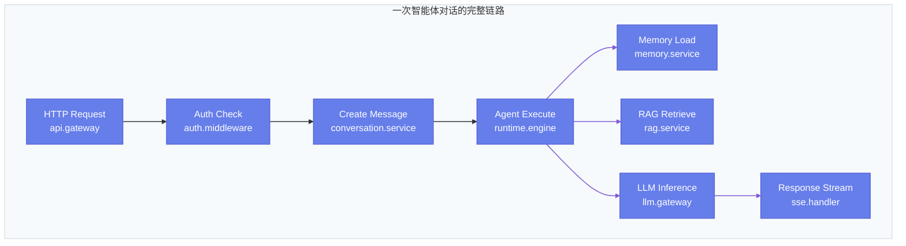

### 8.4 告警策略

| 告警级别 | 触发条件 | 通知方式 | 响应要求 |
|----------|----------|----------|----------|
| **P0 — 致命** | 服务不可用（健康检查连续失败 > 3 次）<br/>数据库主库不可达 | 电话 + 企微/钉钉 | 15 分钟内响应 |
| **P1 — 严重** | 错误率 > 5%（5 分钟窗口）<br/>LLM 调用失败率 > 10%<br/>任务队列积压 > 1000 | 企微/钉钉 + 邮件 | 30 分钟内响应 |
| **P2 — 警告** | P99 延迟 > 10s<br/>Redis 内存使用 > 80%<br/>磁盘使用 > 85% | 企微/钉钉 | 4 小时内处理 |
| **P3 — 通知** | 租户配额使用 > 80%<br/>证书即将过期（< 30 天） | 邮件 | 工作日内处理 |

---

## 九、项目目录结构

```
AgentBasePlatform/
├── docker-compose.yml              # 容器编排定义（所有服务 + 中间件）
├── docker-compose.dev.yml          # 开发环境 override
├── Dockerfile                      # 应用镜像构建
├── pyproject.toml                  # 项目依赖与构建配置
├── alembic.ini                     # Alembic 迁移配置
├── .env.example                    # 环境变量模板
├── Makefile                        # 常用命令快捷入口
│
├── docs/                           # 项目文档
│   ├── 智能体平台项目架构设计文档_v0.1.md
│   ├── 智能体平台后端架构设计文档_v1.0.md
│   ├── agentscope生态圈.md
│   └── api/                        # API 文档（自动生成）
│
├── migrations/                     # Alembic 数据库迁移
│   ├── env.py
│   ├── script.py.mako
│   └── versions/                   # 迁移版本文件
│
├── src/                            # 源码根目录
│   ├── main.py                     # FastAPI 应用入口，注册路由/中间件
│   ├── config.py                   # 全局配置（pydantic-settings）
│   ├── dependencies.py             # FastAPI 全局依赖注入
│   │
│   ├── common/                     # 公共模块（跨模块复用）
│   │   ├── schemas.py              # 统一响应模型（BaseResponse, PagedResponse）
│   │   ├── exceptions.py           # 自定义异常 + 全局异常处理器
│   │   ├── middleware/             # 中间件
│   │   │   ├── auth.py             # JWT 认证中间件
│   │   │   ├── rate_limit.py       # 限流中间件
│   │   │   ├── request_context.py  # 请求上下文（request_id, tenant_id）
│   │   │   └── audit.py           # 请求审计中间件
│   │   ├── database.py             # SQLAlchemy 引擎/Session 工厂
│   │   ├── redis.py                # Redis 连接池
│   │   ├── mq.py                   # RabbitMQ 连接与 Exchange 定义
│   │   ├── minio_client.py         # MinIO 客户端
│   │   ├── security.py             # 加密/解密工具、JWT 工具
│   │   ├── pagination.py           # 分页工具
│   │   └── logging.py              # 结构化日志配置
│   │
│   ├── gateway/                    # 网关模块
│   │   ├── router.py               # 网关路由（LLM Gateway、SSE）
│   │   ├── llm_gateway.py          # LLM 路由/配额/降级逻辑
│   │   ├── ws_manager.py           # WebSocket 连接管理
│   │   └── sse_handler.py          # SSE 流式推送
│   │
│   ├── auth/                       # 租户与权限模块
│   │   ├── router.py               # Auth API 路由
│   │   ├── service.py              # 认证/授权业务逻辑
│   │   ├── models.py               # ORM 模型（User, Tenant, Role...）
│   │   ├── schemas.py              # Pydantic 请求/响应模型
│   │   ├── casbin_adapter.py       # Casbin 策略适配器
│   │   └── dependencies.py         # 模块级依赖（get_current_user 等）
│   │
│   ├── agent/                      # 智能体管理模块
│   │   ├── router.py
│   │   ├── service.py
│   │   ├── models.py               # ORM（Agent, AgentVersion...）
│   │   └── schemas.py
│   │
│   ├── conversation/               # 会话管理模块
│   │   ├── router.py
│   │   ├── service.py
│   │   ├── models.py               # ORM（Conversation, Message）
│   │   └── schemas.py
│   │
│   ├── workflow/                   # 工作流编排模块
│   │   ├── router.py
│   │   ├── service.py
│   │   ├── models.py               # ORM（Workflow, WorkflowNode...）
│   │   ├── schemas.py
│   │   ├── dag_validator.py        # DAG 合法性校验
│   │   └── state_machine.py        # 执行状态机
│   │
│   ├── task/                       # 任务调度模块
│   │   ├── router.py
│   │   ├── service.py
│   │   ├── models.py               # ORM（TaskRecord）
│   │   ├── schemas.py
│   │   ├── celery_app.py           # Celery 应用配置
│   │   └── tasks/                  # Celery 任务定义
│   │       ├── agent_tasks.py      # 智能体执行任务
│   │       ├── workflow_tasks.py   # 工作流执行任务
│   │       ├── indexing_tasks.py   # 文档索引任务
│   │       └── maintenance_tasks.py # 清理/归档任务
│   │
│   ├── runtime/                    # Agent 运行时模块
│   │   ├── engine.py               # 执行引擎（加载配置 → 实例化 Agent → 执行）
│   │   ├── agent_factory.py        # Agent 工厂（按类型创建 AgentScope Agent）
│   │   ├── multi_agent.py          # Multi-Agent 协作编排
│   │   ├── prompt_manager.py       # Prompt 模板管理
│   │   └── tool_executor.py        # 工具调用执行器（沙箱）
│   │
│   ├── rag/                        # 知识检索增强模块
│   │   ├── router.py
│   │   ├── service.py
│   │   ├── models.py               # ORM（KnowledgeBase, Document, Chunk）
│   │   ├── schemas.py
│   │   ├── parser.py               # 文档解析（PDF/DOCX/MD）
│   │   ├── chunker.py              # 文本分块策略
│   │   ├── embedder.py             # 向量化服务
│   │   └── retriever.py            # 检索 + 重排序
│   │
│   ├── memory/                     # 记忆服务模块
│   │   ├── service.py
│   │   ├── models.py               # ORM（LongTermMemory, EpisodicMemory）
│   │   ├── short_term.py           # 短期记忆（Redis）
│   │   ├── long_term.py            # 长期记忆（PostgreSQL + pgvector）
│   │   └── episodic.py             # 情节记忆
│   │
│   ├── guardrails/                 # 安全护栏模块
│   │   ├── service.py
│   │   ├── content_filter.py       # 内容审查（敏感词/有害内容）
│   │   ├── pii_detector.py         # PII 检测与脱敏
│   │   └── tool_whitelist.py       # 工具调用白名单
│   │
│   └── eval/                       # 评测优化模块
│       ├── router.py
│       ├── service.py
│       ├── models.py               # ORM（Evaluation, Feedback）
│       ├── schemas.py
│       └── metrics.py              # 评测指标计算
│
├── tests/                          # 测试目录
│   ├── conftest.py                 # 测试 fixtures（测试 DB、测试客户端）
│   ├── unit/                       # 单元测试（按模块组织）
│   │   ├── test_agent_service.py
│   │   ├── test_auth_service.py
│   │   └── ...
│   ├── integration/                # 集成测试
│   │   ├── test_agent_api.py
│   │   ├── test_conversation_flow.py
│   │   └── ...
│   └── fixtures/                   # 测试数据
│
└── scripts/                        # 运维脚本
    ├── init_db.py                  # 数据库初始化（建表 + 种子数据）
    ├── seed_data.py                # 测试/演示数据填充
    └── backup.sh                   # 数据库备份脚本
```

**目录结构设计原则：**

| 原则 | 说明 |
|------|------|
| **按业务域组织** | 每个模块独立目录，包含 `router.py`（API）、`service.py`（业务逻辑）、`models.py`（ORM）、`schemas.py`（DTO） |
| **分层一致** | Router → Service → Model 三层结构，Router 仅做参数校验与响应封装，Service 承载业务逻辑 |
| **公共抽取** | 跨模块复用的中间件、工具、基础模型统一放入 `common/` |
| **测试对称** | 测试目录结构与源码对称，单元测试与集成测试分离 |

---

## 十、实施路线图

### 10.1 阶段划分

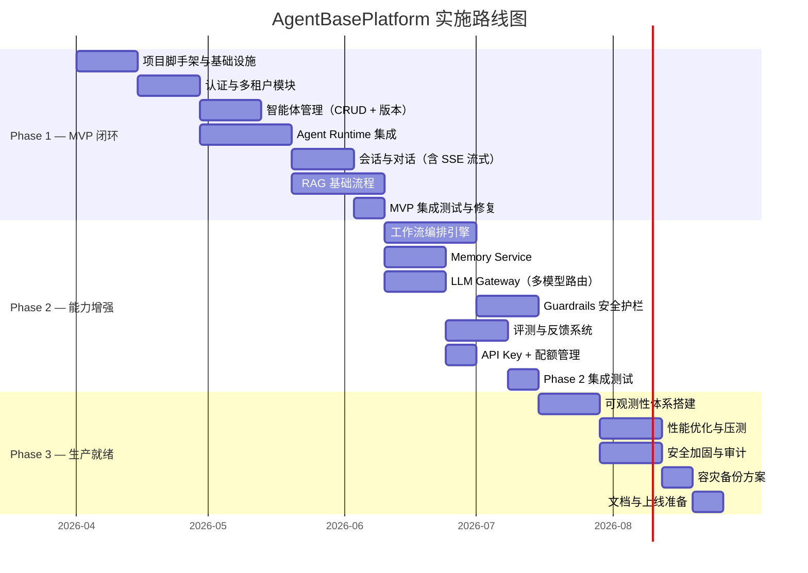

### 10.2 各阶段详细说明

#### Phase 1 — MVP 闭环（约 12 周）

> **目标**：跑通「用户登录 → 创建智能体 → 对话交互 → 知识库增强」核心链路

| 交付物 | 说明 | 完成状态 |
|--------|------|----------|
| **项目脚手架** | FastAPI 项目结构、Docker Compose 环境（PostgreSQL + Redis + RabbitMQ + MinIO）、Alembic 迁移、CI/CD 基础流水线 | - [x] FastAPI 项目结构<br>- [x] PostgreSQL + Redis<br>- [ ] RabbitMQ<br>- [ ] MinIO<br>- [ ] Dockerfile<br>- [x] Alembic 配置（⚠️ 无 revision 文件）<br>- [ ] CI/CD 流水线 |
| **认证与多租户** | 注册/登录/JWT/Refresh Token、Casbin RBAC、多租户数据隔离 | - [x] 注册/登录<br>- [x] JWT Access Token<br>- [x] Refresh Token<br>- [ ] Casbin RBAC（仅 role 字段）<br>- [x] 多租户数据隔离 |
| **智能体管理** | Agent CRUD + 版本化发布 + 配置管理 | - [x] Agent CRUD<br>- [x] 版本化发布<br>- [x] 配置管理 |
| **Agent Runtime** | 集成 AgentScope 核心框架，支持 ChatAgent / ReActAgent 对话执行 | - [x] 运行时接口封装<br>- [x] 同步/流式执行接口<br>- [x] AgentScope 真实集成（PlatformAgent 基类 + 工厂模式）<br>- [x] ChatAgent 实际调用（DashScope API）<br>- [x] ReActAgent 工具调用（builtin: execute_python_code / view_text_file）<br>- [x] ReActAgent MCP 工具调用（stdio / http 客户端接入）<br>- [x] Agent Skills 注册与调用（SKILL.md）<br>- [x] MCP 异常场景优雅降级（server 不可用不崩溃）<br>- [x] 真实 LLM 对接（Qwen via DashScope）<br>- [x] 模型配置自动填充 + 规范化<br>- [x] Agent 直接调用接口（/chat + /chat/stream）<br>- [x] 工具调用记录返回（tool_calls） |
| **会话管理** | 会话创建/消息收发/历史查询、SSE 流式输出 | - [x] 会话创建<br>- [x] 消息收发<br>- [x] 历史查询（分页）<br>- [x] SSE 流式输出 |
| **RAG 基础** | 知识库 CRUD、文档上传解析、向量化索引、基础语义检索 | - [ ] 知识库 CRUD<br>- [ ] 文档上传解析<br>- [ ] 向量化索引<br>- [ ] 语义检索 |
| **里程碑** | 内部 Demo 演示，核心链路可用 | ✅ 核心链路完整打通（注册→登录→创建智能体→真实 LLM 对话→工具调用），RAG 未实现 |

#### Phase 2 — 能力增强（约 11 周）

> **目标**：补全工作流编排、记忆管理、安全护栏等能力，支撑更复杂的业务场景

| 交付物 | 说明 |
|--------|------|
| **工作流编排** | DAG 定义/校验/执行、状态机管理、HITL 人工节点 |
| **Memory Service** | 短期记忆（Redis 滑动窗口）、长期记忆（向量存储）、情节记忆 |
| **LLM Gateway** | 多模型路由（成本/质量/延迟策略选择）、熔断降级、用量统计 |
| **Guardrails** | 输入/输出审查、PII 脱敏、工具白名单 |
| **评测系统** | 离线评测任务、用户反馈采集、智能体质量仪表盘 |
| **API Key & 配额** | API Key 管理、租户级配额管控 |
| **里程碑** | 内部灰度使用，收集反馈 |

#### Phase 3 — 生产就绪（约 8 周）

> **目标**：完成可观测性、安全加固、性能优化，达到生产环境上线标准

| 交付物 | 说明 |
|--------|------|
| **可观测性** | Prometheus + Grafana 监控面板、结构化日志 + Loki、OpenTelemetry 链路追踪 |
| **性能优化** | 压测报告（100 QPS 达标验证）、缓存优化、查询优化、连接池调优 |
| **安全加固** | TLS 配置、字段加密、安全扫描、渗透测试 |
| **容灾备份** | 自动备份脚本、恢复演练、RPO/RTO 验证 |
| **文档完善** | API 文档（OpenAPI 自动生成）、运维手册、部署文档 |
| **里程碑** | 生产环境上线，SLO 告警就位 |

### 10.3 技术风险与缓解

| 风险 | 影响 | 缓解措施 |
|------|------|----------|
| AgentScope 框架 API 变更 | 引擎层适配工作量 | 封装适配层（Anti-Corruption Layer），隔离框架变更影响 |
| LLM 模型调用延迟不稳定 | 用户体验下降 | SSE 流式输出 + 超时熔断 + 降级策略 |
| 向量检索性能瓶颈（pgvector） | RAG 响应慢 | 预留迁移至 Milvus 的架构接口；MVP 阶段数据量可控 |
| 文档解析质量参差不齐 | 知识库效果差 | 多格式解析器 + 分块策略调优 + 质量评估反馈 |
| 多租户数据隔离泄露 | 安全事故 | 全局查询拦截器强制注入 `tenant_id` 条件 |

---

## 附录 A：AgentScope 生态集成参考

平台各模块与 AgentScope 生态组件的完整集成映射：

| AgentScope 组件 | 平台集成模块 | 集成方式 | 优先级 |
|-----------------|-------------|----------|--------|
| `agentscope`（核心框架） | `runtime` | Agent 实例化、消息协议、Multi-Agent 协作基座 | P0 — MVP |
| `agentscope-studio` | `gateway`（前端交互） | 扩展为智能体交互界面，调试工具 | P1 — Phase 2 |
| `agentscope-skills` | `runtime.tool_executor` | 预制技能注册与调用 | P1 — Phase 2 |
| `agentscope-bricks` | `common` + `rag.parser` | 消息解析、模型适配器、配置管理 | P0 — MVP |
| `agentscope-runtime` | 部署脚本 | 容器调度与资源管理 | P2 — Phase 3 |
| `agentscope-spark-design` | 前端项目 | UI 组件库（前端架构范畴） | P1 — Phase 2 |
| `agentscope-samples` | 开发参考 | 示例代码与最佳实践参考 | 持续参考 |

---

## 附录 B：技术选型决策记录

| 决策项 | 选型 | 备选方案 | 决策理由 |
|--------|------|----------|----------|
| 架构风格 | 模块化单体 | 微服务 | 团队规模小、用户量可控，微服务运维成本过高 |
| 向量数据库 | pgvector（MVP）→ Milvus（规模化） | Weaviate / Qdrant | 减少组件，PostgreSQL 原生扩展，降低运维复杂度 |
| 消息队列 | RabbitMQ | Kafka | 当前吞吐量需求低，RabbitMQ 更轻量且支持延迟队列 |
| 任务调度 | Celery + RabbitMQ | Arq / Dramatiq | 生态成熟，社区资源丰富，与 RabbitMQ 天然集成 |
| 权限框架 | Casbin | 自研 / Django Guardian | 支持 RBAC + ABAC 双模型，多语言兼容，策略动态加载 |
| 对象存储 | MinIO | 本地文件系统 / 云 OSS | S3 兼容协议，本地部署，后期可平滑迁移至云 OSS |
| 密码散列 | bcrypt | Argon2 | 广泛使用，Python 生态支持好 |
| 数据库迁移 | Alembic | Django Migrations / Flyway | SQLAlchemy 原生配套，自动生成迁移脚本 |
