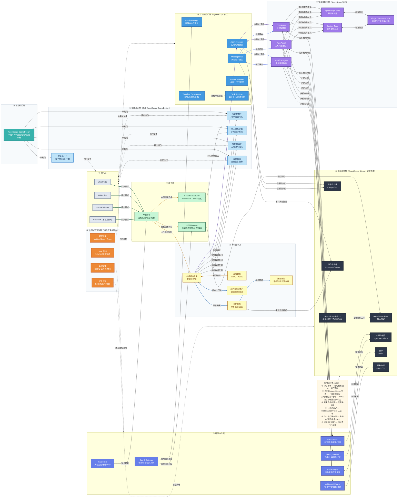
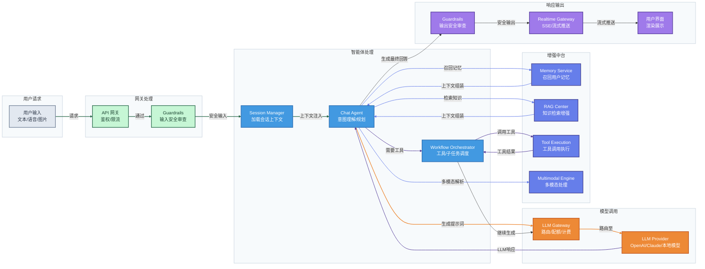
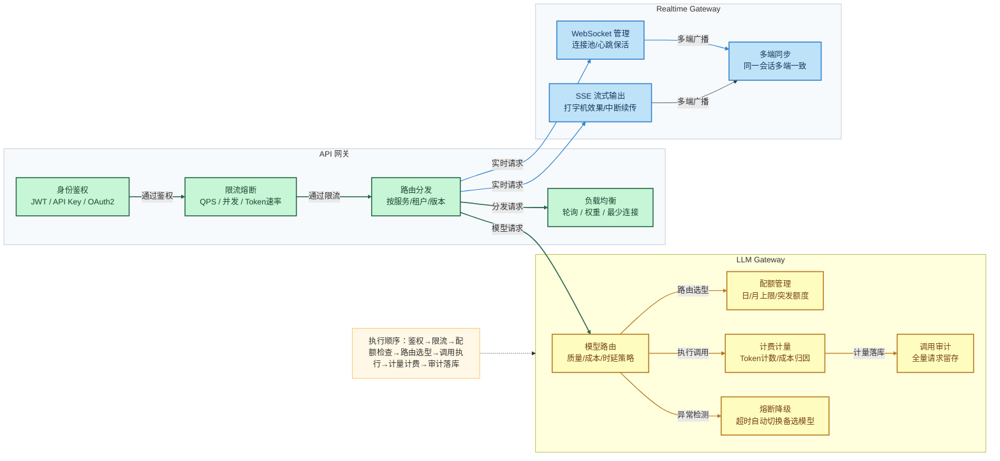
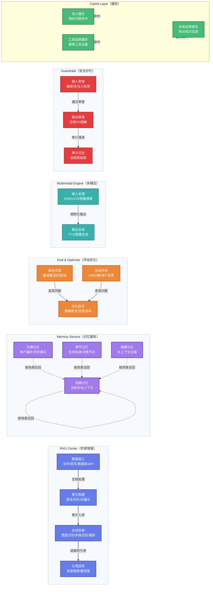
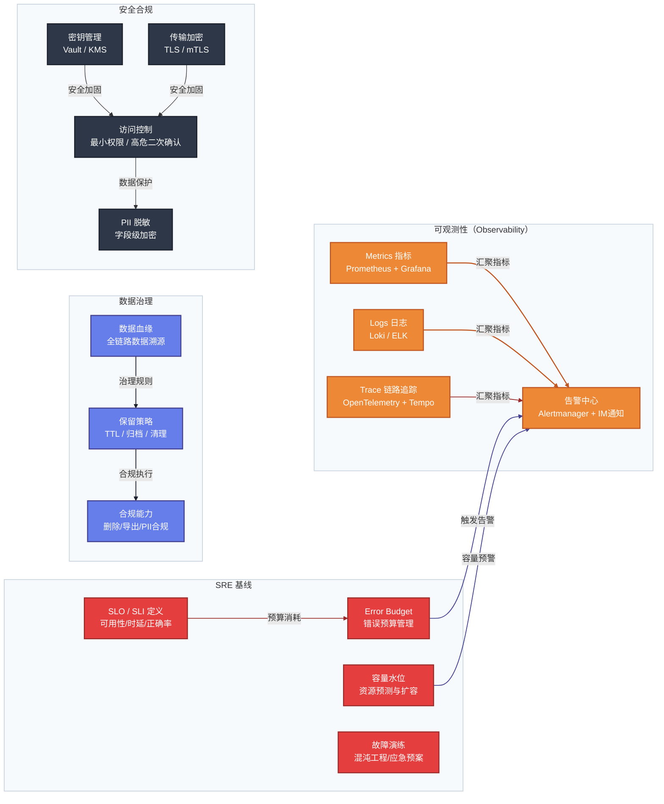
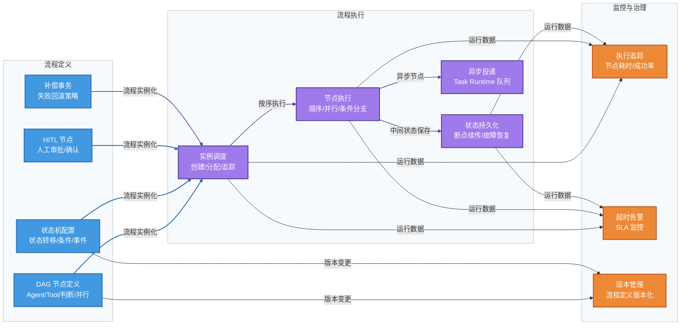
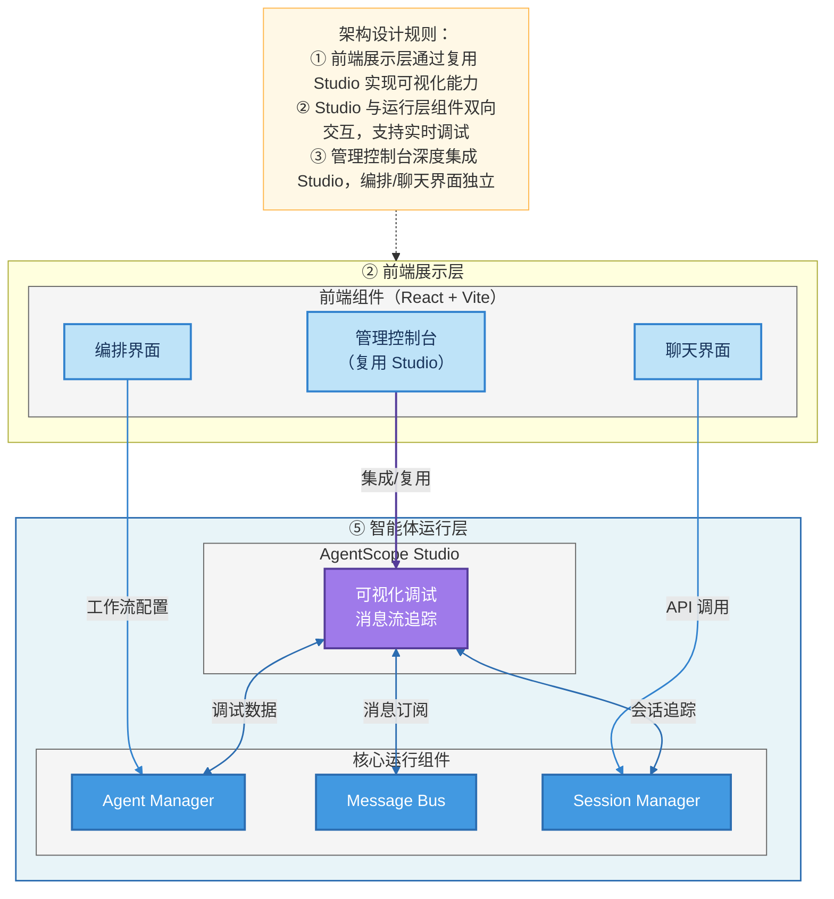
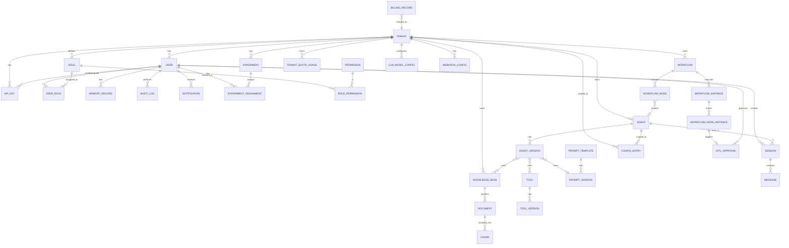

# 基于 AgentScope 生态的智能体平台架构设计文档（完善版）

> **版本**：v1.3 | **日期**：2026-03-13 | **定位**：项目整体架构规划基准文档

---

## 一、文档说明与设计目标

本文档以 **AgentScope 开源生态**为技术基石，设计一套覆盖「开发 → 部署 → 运营 → 治理」全生命周期的智能体平台架构。文档作为项目整体规划的顶层设计，后续所有模块开发均以此为依据。

### 核心目标

| 目标维度 | 描述 |
|----------|------|
| **可用性** | 具备完整的多智能体编排、工具调用、RAG 增强、记忆、实时交互、多模态主链路 |
| **可运营** | 具备 LLM 网关治理、评估优化闭环、监控告警、灰度发布机制 |
| **可治理** | 具备权限管控、安全审计、数据合规、多租户隔离完整体系 |
| **可扩展** | 分层解耦，各层独立扩容，模型/工具/协议均可替换，避免厂商锁定 |

---

## 二、架构设计原则

1. **分层解耦** — 各层职责独立、边界清晰，可单独演进
2. **全复用 AgentScope 生态** — 优先使用 agentscope / bricks / skills / studio / runtime / spark-design，不重复造轮子
3. **增强能力中台化** — RAG、记忆、多模态、评估统一作为中台服务，供所有智能体复用
4. **安全合规前置** — 安全策略、审计日志贯穿全链路，而非事后补充
5. **可观测驱动迭代** — Metrics + Logs + Trace 三位一体，评估闭环驱动持续优化
6. **企业级治理内建** — 多租户、工作流、任务调度、数据治理、SRE 基线作为一等公民设计

---

## 三、整体架构全景图

### 3.1 架构分层总览



---

### 3.2 核心请求链路图（典型对话场景）



---

## 四、各层详细设计

### 4.1 接入层

负责统一承接所有外部请求入口，屏蔽协议差异。

| 组件 | 描述 |
|------|------|
| **Web Portal** | 基于浏览器的 Web 应用入口 |
| **Mobile App** | iOS / Android 客户端 |
| **OpenAPI / SDK** | 标准化 REST API 及多语言 SDK，供第三方开发者调用 |
| **Webhook / 第三方集成** | 接收外部系统事件，如企业IM机器人、钉钉/飞书集成 |

---

### 4.2 前端展示层

基于 **AgentScope Spark Design** 设计规范构建，保障视觉和交互一致性。

| 组件 | 描述 |
|------|------|
| **管理控制台** | Agent 配置、版本管理、可视化调试（复用 AgentScope Studio） |
| **聊天交互界面** | 多角色对话、文件上传、引用溯源、流式打字机效果 |
| **智能体编排** | 工作流 DAG 可视化配置、节点连线、参数设置 |
| **监控面板** | 实时运行状态、性能指标、告警看板 |
| **开发者门户** | API 文档、SDK 下载、Playground 在线调试、Agent 市场 |

---

### 4.3 网关层

网关层是整个平台的统一流量入口，承担鉴权、路由、治理三大职责。



**LLM Gateway 关键指标**：网关可用性、P95/P99 延迟、429 比例、熔断触发率、降级成功率、计费准确率

---

### 4.4 应用服务层

承载平台业务逻辑，协调各核心服务。

| 组件 | 描述 |
|------|------|
| **业务编排服务** | 场景化逻辑编排，对接 Agent 运行层与前端 |
| **权限服务** | 基于 RBAC/ABAC 的用户/角色/资源权限管控，集成 Casbin |
| **租户与组织中心** | 多租户注册、组织架构、配额管理、账单归因、环境隔离 |
| **事件服务** | 事件驱动/回调，CloudEvents 规范，支持事件重放 |
| **通知服务** | 系统消息、任务完成告警、用户通知推送（IM/邮件/WebPush） |

---

### 4.5 智能体运行层（AgentScope 核心）

以 **AgentScope 核心框架**为基石，构建平台级智能体运行能力。

```mermaid
flowchart TD
    classDef coreStyle    fill:#4299e1,stroke:#2b6cb0,stroke-width:2px,color:#fff
    classDef agentStyle   fill:#9f7aea,stroke:#553c9a,stroke-width:2px,color:#fff
    classDef subgraphStyle fill:#f7fafc,stroke:#cbd5e0,stroke-width:1.5px

    subgraph runtime["智能体运行层（AgentScope Core）"]
        AR1[Agent Manager<br/>创建/启停/扩缩容]:::coreStyle
        AR2[Message Bus<br/>消息路由/协作/广播]:::coreStyle
        AR3[Session Manager<br/>会话上下文/多轮追踪]:::coreStyle
        AR4[Config Manager<br/>配置下发/热更新]:::coreStyle
        AR5[Workflow Orchestrator<br/>DAG/状态机/补偿/HITL]:::coreStyle
        AR6[Task Runtime<br/>异步队列/重试/死信/优先级]:::coreStyle
        AR7[AgentScope Studio<br/>可视化调试/消息流追踪]:::coreStyle
    end
    class runtime subgraphStyle

    subgraph agents["智能体实例"]
        A1[Chat Agent]:::agentStyle
        A2[Task Agent]:::agentStyle
        A3[Workflow Agent]:::agentStyle
        A4[Custom Agent]:::agentStyle
    end
    class agents subgraphStyle

    AR1 -->|生命周期管理| A1 & A2 & A3 & A4
    AR2 -->|消息路由| A1 & A2 & A3 & A4
    AR3 -->|注入会话上下文| A1 & A2 & A3 & A4
    AR4 -->|配置热注入| A1 & A2 & A3 & A4
    AR5 -->|流程节点调度| AR6
    AR7 -.->|调试观测| A1 & A2 & A3 & A4

    linkStyle 0,1,2,3 stroke:#2b6cb0,stroke-width:2px
    linkStyle 4 stroke:#553c9a,stroke-width:1.5px
```



| 组件 | 描述 |
|------|------|
| **Agent Manager** | 智能体生命周期管理：创建、启停、版本管理、扩缩容 |
| **Message Bus** | 多智能体消息路由、广播、同步/异步通信 |
| **Session Manager** | 会话上下文管理、多轮对话追踪、跨请求状态保持 |
| **Config Manager** | 中心化配置下发、环境变量管理、热更新支持 |
| **Workflow Orchestrator** | DAG/状态机编排，支持补偿事务和人工审批节点（HITL） |
| **Task Runtime** | 长任务异步队列、优先级调度、失败重试、死信队列 |
| **AgentScope Studio** | 可视化调试平台：图形化配置、消息流实时追踪 |

---

### 4.6 智能体能力层（AgentScope 生态）

以 AgentScope 标准协议构建可复用、可扩展的能力体系。

| 组件 | 描述 |
|------|------|
| **Chat Agent** | 对话类智能体，处理多轮自然语言对话 |
| **Task Agent** | 任务执行类智能体，支持任务分解与子任务汇总 |
| **Workflow Agent** | 多智能体协作，协调复杂多步骤任务 |
| **AgentScope Skills** | 预制通用技能库：文本摘要、代码生成、数据分析等 |
| **Custom Tools** | 业务定制工具：企业系统 API、数据查询、文件处理 |
| **Plugin / Extension SDK** | 标准化工具协议、版本兼容管理、沙箱安全执行 |

**Prompt 管理**（独立子模块）：
- 版本化 Prompt 模板存储与发布
- 按租户/场景/模型维度管理
- 支持 A/B 测试灰度验证

---

### 4.7 增强中台层



| 组件 | 核心能力 |
|------|----------|
| **RAG Center** | 离线索引构建 + 在线检索重排，支持多知识库、多租户隔离、引用溯源 |
| **Memory Service** | 短期/长期/情节/摘要四层记忆，含遗忘策略（TTL/权重衰减）、PII 脱敏 |
| **Eval & Optimize** | 离线基准评测 + 在线 A/B 双回路，评估质量/体验/成本/安全四维度 |
| **Multimodal Engine** | 统一接入 ASR/TTS/OCR/VLM，对上提供标准 `MultimodalMessage` 接口 |
| **Guardrails** | 输入/输出三段式防护（前置/调用中/后置），审计日志可追溯 |
| **Cache Layer** | 语义缓存 + 工具结果缓存 + 检索结果缓存，降低时延与成本 |

---

### 4.8 基础设施层

以 **AgentScope Bricks** 为基础组件层，底层资源按职责分离。

| 组件 | 选型建议 | 说明 |
|------|----------|------|
| **AgentScope Core** | agentscope | 核心框架，多智能体基石 |
| **AgentScope Bricks** | agentscope-bricks | 消息解析、模型适配器、日志工具 |
| **关系型存储** | PostgreSQL | 租户/用户/配置/审计/计费数据 |
| **向量数据库** | pgvector（MVP）→ Milvus | RAG 向量索引存储与检索 |
| **消息中间件** | RabbitMQ（MVP）→ Kafka | 事件总线、异步任务投递 |
| **缓存** | Redis | 限流计数、会话缓存、语义缓存 |
| **对象存储** | MinIO（私有化）/ S3 | 文件、多模态资源、模型文件 |

---

### 4.9 治理与可观测层（横向贯穿）

治理层横向贯穿所有层级，不属于某一业务层，而是全平台基础能力。



---

### 4.10 设计规范层

**AgentScope Spark Design** 作为平台统一设计体系，为所有前端界面提供：

- **UI 组件库**：与 AgentScope 生态保持视觉一致的标准组件
- **交互规范**：消息流展示、工具调用状态、加载/错误状态标准交互
- **视觉风格**：配色、字体、间距、图标的完整设计 Token
- **多端适配**：Web / Mobile / 嵌入式场景的响应式适配规范

---

## 五、关键子系统深度设计

### 5.1 LLM Gateway 设计

#### 架构定位
LLM Gateway 位于 API 网关与模型调用之间，作为统一模型调用入口，对上提供一致模型接口，对下屏蔽多模型厂商差异。

#### 执行顺序
```
鉴权认证 → 配额检查 → 限流判定 → 路由选型 → 调用执行 → 计量计费 → 审计落库
```

#### 核心能力

| 能力 | 描述 |
|------|------|
| **鉴权认证** | 支持 API Key、JWT、租户签名校验 |
| **流量治理** | 按租户/应用/用户维度限流（QPS、并发、Token 速率） |
| **配额管理** | 日/月调用上限、模型级配额、突发额度策略 |
| **计费计量** | 按请求/Token/模型单价聚合账单，支持成本归因 |
| **路由策略** | 质量优先 / 成本优先 / 时延优先三种策略动态切换 |
| **熔断降级** | 模型超时/异常时自动切换备选模型，支持兜底响应 |

#### 审计数据字段
每次模型调用记录：`tenant_id`、`app_id`、`request_id`、`model`、`token_in/out`、`cost`、`latency`、`fallback`、`timestamp`

---

### 5.2 RAG Center 设计

#### 离线构建链路

```
数据接入（文件/网页/数据库/API）
  → 数据治理（清洗/去重/权限标签/元数据补全）
  → 索引构建（语义切片+窗口重叠 / 嵌入模型 / 向量+关键词双索引）
  → 多租户隔离索引入库
```

#### 在线检索链路

```
Query 接收
  → Query 重写与意图识别（是否检索/范围/深度）
  → 多路召回（语义检索 + 关键词检索 + 规则召回）
  → 重排与过滤（相关性/时效性/权限/可信度）
  → 上下文组装（附引用来源/置信度/片段边界）
  → 降级策略（检索失败 → 直接回答/澄清提问/转人工）
```

#### 关键设计约束
- 支持引用可追溯与证据链展示
- 支持多租户隔离与租户级索引配额
- 检索失败有明确降级路径

---

### 5.3 Memory Service 设计

#### 记忆分层

| 类型 | 存储位置 | 生命周期 | 用途 |
|------|----------|----------|------|
| **短期记忆** | Redis | 会话级 | 当前会话上下文，低延迟读写 |
| **长期记忆** | PostgreSQL + 向量库 | 用户级持久化 | 用户偏好、历史事实，跨会话复用 |
| **情节记忆** | PostgreSQL | 任务级 | 任务执行过程、关键决策节点，便于复盘 |
| **摘要记忆** | PostgreSQL | 会话级 | 长上下文压缩，控制 Token 成本 |

#### 读写策略
- **写入触发**：会话结束、任务完成、显式确认、关键事件命中
- **检索策略**：按用户 + 场景 + 时间窗召回，结合相关性阈值
- **遗忘策略**：TTL、权重衰减、用户主动删除（满足合规要求）

#### 治理要求
- PII 脱敏与敏感字段分级加密
- 用户可见可控（查看 / 纠正 / 删除个人记忆）

---

### 5.4 工作流编排引擎设计



---

### 5.5 安全合规体系

#### 三段式防护模型

```
请求进入
  ├─ [前置审查] 输入内容安全（注入检测/敏感词/恶意意图）
  ├─ [调用中审查] 工具调用白名单、越权访问检查
  └─ [后置审查] 输出内容安全（合规检测/PII 脱敏/敏感数据过滤）
```

#### 安全能力矩阵

| 维度 | 能力 |
|------|------|
| **身份安全** | JWT/OAuth2 鉴权、MFA、API Key 轮换 |
| **访问控制** | RBAC/ABAC、最小权限原则、高危操作二次确认 |
| **数据安全** | 传输加密（TLS/mTLS）、字段级加密、密钥托管（Vault/KMS） |
| **内容安全** | 规则 + 模型双检审核，输入/输出全覆盖 |
| **合规能力** | PII 脱敏、数据生命周期管理、用户数据可删除/可导出 |
| **审计能力** | 全链路审计日志、会话级追踪 ID、风险事件告警与工单联动 |

---

### 5.6 AgentScope Studio 架构定位

#### 定位说明

AgentScope Studio 在平台中扮演**跨层桥梁**角色：它既是**前端展示层**的可视化能力来源（管理控制台深度复用 Studio），又是**智能体运行层**的实时调试观测工具，与运行层核心组件保持双向交互。



#### 关键交互说明

| 交互方向 | 说明 |
|--------|------|
| **管理控制台 → Studio** | 管理控制台复用 Studio 的图形化配置界面和消息流可视化组件，避免重复开发 |
| **Studio ↔ Agent Manager** | Studio 可触发 Agent 的启停、热重载，并实时接收 Agent 状态变更推送 |
| **Studio ↔ Message Bus** | Studio 订阅消息总线，以可视化方式追踪多智能体间的消息路由与广播过程 |
| **Studio ↔ Session Manager** | Studio 拉取当前会话的完整上下文，支持分步单步调试和上下文注入测试 |
| **聊天/编排界面** | 聊天界面直接调用 Session Manager API；编排界面通过 Agent Manager 提交工作流配置，二者不依赖 Studio |

---

### 5.7 权限服务（RBAC/ABAC）详细设计

#### 权限模型设计

平台采用 **RBAC（基于角色的访问控制）** 作为主模型，**ABAC（基于属性的访问控制）** 作为扩展，通过 **Casbin** 实现策略执行。

**角色层次：**

| 角色层级 | 角色标识符 | 说明 |
|---------|-----------|------|
| **平台级** | `super_admin` | 平台超级管理员，可管理所有租户和平台资源 |
| **平台级** | `platform_admin` | 平台运营管理员，只读查看跨租户统计数据 |
| **租户级** | `tenant_admin` | 租户管理员，管理租户内全部资源与成员 |
| **租户级** | `developer` | 开发者，可创建/管理 Agent、工具、知识库、工作流 |
| **租户级** | `viewer` | 只读访问者，可查看和使用已发布 Agent |
| **租户级** | `custom` | 自定义角色，由租户管理员按需配置权限集合 |

**权限标识规范：** `{resource_type}:{action}`

| 资源类型 | 支持的 Action |
|---------|--------------|
| `agent` | `create`, `read`, `update`, `delete`, `publish`, `debug` |
| `knowledge_base` | `create`, `read`, `update`, `delete`, `upload_doc` |
| `workflow` | `create`, `read`, `update`, `delete`, `execute` |
| `tool` | `create`, `read`, `update`, `delete`, `execute` |
| `session` | `create`, `read`, `delete` |
| `prompt` | `create`, `read`, `update`, `publish` |
| `billing` | `read`, `export` |
| `tenant` | `update`, `manage_users`, `manage_quota` |
| `user` | `create`, `read`, `update`, `delete`, `manage_roles` |
| `audit_log` | `read`, `export` |

**ABAC 扩展属性规则：**
- `tenant_id`：强制属性，任何操作都必须满足租户归属匹配，防止跨租户越权
- `resource_owner`：资源创建者对自身资源额外拥有 `update` / `delete` 权限（即使 RBAC 层没有）
- `subscription_plan`：订阅计划限制部分高级功能（如多模态引擎、高级工作流节点）的访问

#### 权限检查流程

```
请求到达 API 接口
  ① Token 解析：从 JWT/ApiKey 提取 user_id、tenant_id、roles
  ② 租户上下文注入：验证 tenant_id 合法性（防伪造）
  ③ RBAC 检查：验证用户角色集合是否包含 {resource_type}:{action} 权限
  ④ ABAC 检查（可选）：验证 tenant_id 归属匹配、计划特性限制
  ⑤ 资源级检查（可选）：验证目标资源的 tenant_id 与请求上下文一致
  ⑥ 通过 → 执行业务逻辑；拒绝 → 返回 20002 权限不足错误
```

#### 默认角色权限矩阵

| 权限 | super_admin | tenant_admin | developer | viewer |
|------|:-----------:|:------------:|:---------:|:------:|
| `agent:create` | ✅ | ✅ | ✅ | ❌ |
| `agent:publish` | ✅ | ✅ | ✅ | ❌ |
| `agent:debug` | ✅ | ✅ | ✅ | ❌ |
| `knowledge_base:create` | ✅ | ✅ | ✅ | ❌ |
| `workflow:execute` | ✅ | ✅ | ✅ | ✅ |
| `session:create` | ✅ | ✅ | ✅ | ✅ |
| `billing:read` | ✅ | ✅ | ❌ | ❌ |
| `tenant:manage_users` | ✅ | ✅ | ❌ | ❌ |
| `audit_log:read` | ✅ | ✅ | ❌ | ❌ |

---

### 5.8 事件与通知服务详细设计

#### 事件服务（Event Service）

**事件类型分类：**

| 事件域 | 事件类型 | 触发时机 |
|--------|---------|---------|
| `agent.*` | `agent.created` / `agent.published` / `agent.archived` | Agent 生命周期变更 |
| `session.*` | `session.started` / `session.ended` / `session.error` | 会话状态变更 |
| `workflow.*` | `workflow.started` / `workflow.completed` / `workflow.failed` / `workflow.node.completed` | 工作流执行变更 |
| `llm.*` | `llm.call.success` / `llm.call.failed` / `llm.fallback.triggered` | LLM 调用事件 |
| `quota.*` | `quota.warning` / `quota.exceeded` | 配额预警/超限（80% 时 warning，100% 时 exceeded） |
| `security.*` | `security.injection.detected` / `security.content.blocked` / `security.key.rotated` | 安全事件 |
| `billing.*` | `billing.threshold.reached` / `billing.invoice.generated` | 计费事件 |
| `system.*` | `system.maintenance.scheduled` / `system.degraded` | 平台运维事件 |

**CloudEvents 标准字段（每条事件必须携带）：**

```json
{
  "specversion": "1.0",
  "id": "550e8400-e29b-41d4-a716-446655440000",
  "type": "com.agentplatform.agent.published",
  "source": "/platform/agent-service",
  "subject": "agent/agent-id-xxx",
  "time": "2026-03-13T10:00:00Z",
  "datacontenttype": "application/json",
  "data": {
    "tenant_id": "tenant-xxx",
    "agent_id": "agent-xxx",
    "version": "1.2.0"
  }
}
```

**事件路由规则：**

| 事件类型 | 路由目标 | 优先级 |
|---------|---------|--------|
| `security.*` | 告警中心 + 审计日志 + 通知服务（即时推送） | 高 |
| `quota.exceeded` | 通知服务（邮件/IM） + LLM Gateway（触发限流） | 高 |
| `workflow.*` | 工作流引擎状态机更新 | 中 |
| `llm.fallback.triggered` | 可观测性指标 + 告警中心 | 中 |
| `billing.*` | 账单服务 + 通知服务 | 中 |
| `agent.*` | 审计日志 + 通知服务（按订阅） | 低 |

**事件持久化与重放：**
- 所有事件持久化至消息中间件（RabbitMQ/Kafka），保留 7 天
- 消费失败的事件进入死信队列，最多重试 3 次（指数退避：1s / 5s / 30s）
- 支持按时间范围重放历史事件（用于数据修复和审计）

#### 通知服务（Notification Service）

**通知渠道矩阵：**

| 渠道 | 适用场景 | 延迟要求 | 实现方案 |
|------|---------|---------|---------|
| **站内通知** | 任务完成、系统公告、HITL 审批请求 | 秒级 | WebSocket 实时推送 + 数据库持久化 |
| **邮件** | 账单通知、安全告警、账号变更 | 分钟级 | SMTP / SendGrid |
| **Webhook** | 第三方系统集成、任务结果回调 | 秒级 | HTTP POST + 签名验证 + 重试 |
| **企业 IM** | 实时告警、审批通知 | 秒级 | 飞书/钉钉/Slack Bot API |
| **WebPush** | 浏览器端实时提醒 | 秒级 | Web Push API + Service Worker |

**通知模板规范：** 使用 `{{variable}}` 双花括号占位符，与 Prompt 工程规范保持一致。

**Webhook 安全规范：**
- 请求头携带 `X-Webhook-Signature: hmac-sha256={sign}`，签名密钥由用户在控制台设置
- 接收方需验证签名，防止伪造请求
- 支持配置 IP 白名单限制回调来源

---

### 5.9 配置中心详细设计

#### 配置层次结构

配置按优先级由高到低分为**三层**，**高层配置覆盖低层配置**：

```
① Agent 级配置（最高优先级）：单个 Agent 的个性化参数
     ↓ 覆盖
② 租户级配置：租户范围内的默认参数与特性开关
     ↓ 覆盖
③ 平台默认配置（最低优先级）：系统内置默认值
```

> 对应 `config_entries.scope = ENUM(platform / tenant / agent)`，读取时按 `agent → tenant → platform` 逐层回退，高层命中即返回。

#### 配置分类与热更新策略

| 配置类型 | 示例 | 热更新 | 生效范围 |
|---------|------|--------|---------|
| **模型配置** | 默认模型 / temperature / max_tokens / top_p | ✅ 支持 | Agent 级 / 租户级 |
| **功能开关** | 是否启用 RAG / 记忆 / 多模态 / 流式输出 | ✅ 支持 | 平台级 / 租户级 |
| **限流配额** | QPS / 并发会话数 / 每日 Token 上限 | ✅ 支持 | 租户级 |
| **路由策略** | LLM Gateway 路由偏好（质量/成本/时延） | ✅ 支持 | 租户级 / App 级 |
| **系统参数** | 超时时间 / 重试次数 / 连接池大小 | ⚠️ 部分热更新 | 平台级（需服务重载） |
| **安全策略** | Guardrails 规则集 / 敏感词库版本 | ✅ 支持 | 平台级 / 租户级 |
| **密钥配置** | 数据库密码 / 第三方 API Key | ❌ 不热更新 | 通过 Vault 管理，服务重启加载 |

#### 配置热更新机制

```
管理员操作（控制台或 API）触发配置变更
  → Config Manager 校验变更合法性（类型校验 / 值范围校验）
  → 将变更写入 PostgreSQL（持久化，记录变更历史）
  → 发布 config.changed 事件至 Redis Pub/Sub
  → 各服务的配置监听器接收事件
  → 服务内存中目标配置局部热替换（无需重启）
  → 变更结果异步回写确认状态（success / partial_fail / fail）
  → 失败时自动回滚并告警
```

**回滚能力：** 所有配置变更完整记录历史版本，支持秒级回滚至任意历史版本，操作计入审计日志。

#### 配置变更安全管控

| 变更级别 | 示例 | 审批要求 |
|---------|------|---------|
| **低风险** | 调整模型 temperature | 无需审批，立即生效 |
| **中风险** | 修改 QPS 限流阈值、切换路由策略 | 租户管理员确认 |
| **高风险** | 修改安全审查规则、关闭 Guardrails | 平台管理员二次确认 + 审计日志 |
| **极高风险** | 修改平台级默认配置 | Tech Lead 审批 + 变更工单 |

---

## 六、技术栈选型

### 6.1 后端服务

| 模块 | 技术选型 | 说明 |
|------|----------|------|
| Web 框架 | **FastAPI** | REST + WebSocket + SSE，异步性能优秀 |
| 数据校验 | **Pydantic v2** + pydantic-settings | 强类型校验与配置管理 |
| ORM & 迁移 | **SQLAlchemy 2.0** + Alembic | 类型安全 ORM，数据库迁移 |
| 鉴权权限 | **JWT/OAuth2** + Casbin | RBAC/ABAC 权限模型 |
| 任务调度 | **Celery** + Redis/RabbitMQ | 异步长任务、定时任务 |
| 网关治理 | FastAPI 中间件（MVP）→ Kong/Envoy | 规模化后引入专用网关 |

### 6.2 数据与存储

| 类型 | 选型 | 说明 |
|------|------|------|
| 事务数据库 | **PostgreSQL** | 租户/用户/配置/审计/计费 |
| 向量检索 | **pgvector**（MVP）→ Milvus/Weaviate | RAG 索引，MVP 优先 pgvector 减少运维成本 |
| 全文检索 | **Elasticsearch / OpenSearch** | 关键词检索与日志检索 |
| 缓存 | **Redis** | 限流计数、会话、语义缓存 |
| 对象存储 | **MinIO**（私有化）/ S3 兼容 | 文件/多模态资源 |

### 6.3 消息与实时通信

| 类型 | 选型 | 说明 |
|------|------|------|
| 事件总线 | **RabbitMQ**（MVP）→ Kafka | 高吞吐阶段迁移至 Kafka |
| 实时通道 | FastAPI WebSocket/SSE + Redis Pub/Sub | 多实例广播 |
| 事件规范 | **CloudEvents** | id/type/source/time 标准字段 |

### 6.4 智能体与 LLM

| 类型 | 选型 | 说明 |
|------|------|------|
| Agent 框架 | **AgentScope** + AgentScope-Bricks | 主框架 + 基础组件 |
| 模型接入 | **OpenAI 兼容协议** | 便于厂商替换和多模型调度 |
| Prompt 管理 | 版本化存储（PostgreSQL）+ 灰度分桶 | 版本化 + A/B 测试 |

### 6.5 前端

| 类型 | 选型 | 说明 |
|------|------|------|
| 框架 | **React + TypeScript + Vite** | 现代前端标准栈 |
| 状态管理 | **Zustand** / Redux Toolkit | 轻量优先，复杂场景升级 |
| UI 体系 | **AgentScope Spark Design** | 复用生态 UI 组件库 |
| 错误监控 | **Sentry** + Web Vitals | 前端质量保障 |

### 6.6 可观测性与运维

| 类型 | 选型 |
|------|------|
| 指标 | Prometheus + Grafana |
| 日志 | Loki / ELK |
| 链路追踪 | OpenTelemetry + Tempo / Jaeger |
| 告警 | Alertmanager + 企业 IM（飞书/钉钉/Slack） |
| 发布 | 蓝绿/金丝雀发布 + 自动回滚 |

---

## 七、分阶段交付路线

```mermaid
flowchart LR
    classDef p1Style fill:#48bb78,stroke:#276749,stroke-width:2px,color:#fff
    classDef p2Style fill:#4299e1,stroke:#2b6cb0,stroke-width:2px,color:#fff
    classDef p3Style fill:#9f7aea,stroke:#553c9a,stroke-width:2px,color:#fff
    classDef subgraphStyle fill:#f7fafc,stroke:#cbd5e0,stroke-width:1.5px

    subgraph p1["阶段一（第 1-2 周）：打通最小闭环"]
        P1A[FastAPI 统一 API<br/>会话管理/基础鉴权]:::p1Style
        P1B[AgentScope 接入<br/>Chat Agent + 核心工具]:::p1Style
        P1C[LLM Gateway MVP<br/>鉴权/限流/路由/审计]:::p1Style
        P1D[最小可观测<br/>请求日志/指标/Trace ID]:::p1Style
    end
    class p1 subgraphStyle

    subgraph p2["阶段二（第 3-4 周）：增强可用与可控"]
        P2A[RAG Center<br/>离线构建/在线检索/引用]:::p2Style
        P2B[Memory Service<br/>短期+长期+遗忘策略]:::p2Style
        P2C[实时通道<br/>WebSocket/SSE/中断重试]:::p2Style
        P2D[基础安全策略<br/>输入输出审查/工具白名单]:::p2Style
    end
    class p2 subgraphStyle

    subgraph p3["阶段三（第 5-6 周）：提升可运营与可扩展"]
        P3A[评测优化闭环<br/>离线评测/在线反馈]:::p3Style
        P3B[异步任务中心<br/>队列/死信/失败补偿]:::p3Style
        P3C[多租户与配额<br/>账单归因/成本看板]:::p3Style
        P3D[灰度发布<br/>SLO告警闭环]:::p3Style
    end
    class p3 subgraphStyle

    p1 -->|MVP 上线| p2 -->|能力增强| p3

    linkStyle 0 stroke:#276749,stroke-width:3px
    linkStyle 1 stroke:#2b6cb0,stroke-width:3px
```



### 各阶段目标

| 阶段 | 时间 | 核心交付 | 验收标准 |
|------|------|----------|----------|
| **阶段一** | 第 1-2 周 | 最小可用闭环 | Chat Agent 可正常对话，LLM Gateway 可审计调用 |
| **阶段二** | 第 3-4 周 | 增强可用性 | RAG 知识问答可用，实时流式输出正常，安全审查生效 |
| **阶段三** | 第 5-6 周 | 生产可运营 | 多租户隔离，评测基准建立，SLO 告警生效 |

---

## 八、可扩展性分析与风险点

### 8.1 可扩展性评估

| 维度 | 设计方式 | 结论 |
|------|----------|------|
| **横向扩展** | 网关/检索/记忆/实时通道独立部署扩容 | ✅ 适合高并发场景 |
| **纵向扩展** | 增强能力通过"中台服务 + 策略配置"演进 | ✅ 减少业务改代码频率 |
| **模型扩展** | OpenAI 兼容协议，LLM Gateway 统一路由 | ✅ 易替换厂商/版本 |
| **工具扩展** | Plugin/Extension SDK 标准协议沙箱 | ✅ 第三方工具低成本接入 |
| **前端扩展** | Spark Design 设计体系 + 组件复用 | ✅ 多端、主题定制、国际化 |

### 8.2 已识别风险与应对

| 风险 | 应对策略 |
|------|----------|
| **跨模块配置漂移** | 统一配置中心 + 配置变更审计 + 版本号追踪 |
| **异步链路观测断点** | 全链路 Trace ID + 跨服务 Context 传播 |
| **策略冲突（安全/路由/成本）** | 策略优先级注册 + 冲突检测告警 |
| **向量库迁移成本** | pgvector 兼容 SQL，迁移 Milvus 时可通过适配层屏蔽 |
| **模型厂商锁定** | OpenAI 兼容协议统一接入，LLM Gateway 负责厂商差异屏蔽 |
| **多租户数据隔离** | 数据库 Row-Level Security + 租户 ID 强制注入所有查询 |

### 8.3 持续演进三条主线

> **先闭环 → 再指标 → 后优化**
>
> 先保证端到端链路稳定上线，再用评测与观测驱动质量、时延、成本和安全的持续改进。

---

## 九、模块关系速查表

| 模块 | 依赖 | 被依赖 |
|------|------|--------|
| AgentScope Core | AgentScope Bricks | Agent Manager、LLM Gateway |
| LLM Gateway | AgentScope Core、Redis | API 网关、业务编排服务 |
| RAG Center | PostgreSQL、pgvector/Milvus | Chat/Task/Workflow Agent |
| Memory Service | PostgreSQL、Redis | Chat/Task/Workflow Agent |
| Guardrails | Guardrails 策略库 | API 网关（前置）、业务服务（后置） |
| Workflow Orchestrator | Task Runtime、Message Bus | 业务编排服务、Workflow Agent |
| Tenant/Org Center | PostgreSQL | API 网关（租户上下文）、权限服务、LLM Gateway |
| Eval & Optimize | 离线评测数据集、在线反馈 | LLM Gateway（策略优化）、Config Manager |
| Config Manager | PostgreSQL（`config_entries`）、Redis Pub/Sub | 所有需要热更新配置的服务 |

---

---

## 十、核心数据模型设计

### 10.1 核心实体关系图



### 10.2 核心表结构

#### 租户表 `tenants`

| 字段名 | 类型 | 说明 |
|--------|------|------|
| `id` | UUID PK | 租户唯一标识 |
| `name` | VARCHAR(128) | 租户名称 |
| `slug` | VARCHAR(64) UNIQUE | 租户标识符（URL 友好） |
| `plan` | ENUM | 计划级别（`free` / `pro` / `enterprise`） |
| `quota_config` | JSONB | 配额配置（token / call / storage） |
| `status` | ENUM | 状态（`active` / `suspended` / `deleted`） |
| `created_at` | TIMESTAMPTZ | 创建时间 |
| `updated_at` | TIMESTAMPTZ | 更新时间 |

#### 用户表 `users`

| 字段名 | 类型 | 说明 |
|--------|------|------|
| `id` | UUID PK | 用户唯一标识 |
| `tenant_id` | UUID FK | 所属租户 |
| `email` | VARCHAR(256) UNIQUE | 邮箱（全局唯一） |
| `username` | VARCHAR(128) | 用户名 |
| `password_hash` | VARCHAR(256) | 密码哈希（bcrypt） |
| `status` | ENUM | 状态（`active` / `inactive` / `banned`） |
| `mfa_enabled` | BOOLEAN | 是否启用 MFA |
| `mfa_secret` | VARCHAR(64) | MFA 密钥（TOTP，加密存储） |
| `last_login_at` | TIMESTAMPTZ | 最后登录时间 |
| `last_login_ip` | INET | 最后登录 IP |
| `created_at` | TIMESTAMPTZ | 创建时间 |
| `updated_at` | TIMESTAMPTZ | 更新时间 |

> 注：角色信息改为通过 `user_roles` 关联表管理，支持多角色分配，不再在 `users` 表内维护单一 `role` 字段。

#### 智能体表 `agents`

| 字段名 | 类型 | 说明 |
|--------|------|------|
| `id` | UUID PK | 智能体唯一标识 |
| `tenant_id` | UUID FK | 所属租户 |
| `name` | VARCHAR(128) | 智能体名称 |
| `description` | TEXT | 智能体描述（供用户理解用途） |
| `type` | ENUM | 类型（`chat` / `task` / `workflow`） |
| `current_version_id` | UUID FK | 当前生效版本 |
| `status` | ENUM | 状态（`draft` / `active` / `archived`） |
| `avatar_url` | VARCHAR(512) | 头像 URL（可选） |
| `tags` | TEXT[] | 标签（便于分类检索） |
| `config` | JSONB | 基础配置（超时/重试/特性开关） |
| `created_by` | UUID FK | 创建人 |
| `created_at` | TIMESTAMPTZ | 创建时间 |
| `updated_at` | TIMESTAMPTZ | 更新时间 |

#### 智能体版本表 `agent_versions`

| 字段名 | 类型 | 说明 |
|--------|------|------|
| `id` | UUID PK | 版本唯一标识 |
| `agent_id` | UUID FK | 所属智能体 |
| `version` | VARCHAR(32) | 版本号（语义化，如 `1.2.0`） |
| `prompt_version_id` | UUID FK | 关联 Prompt 版本 |
| `tool_ids` | UUID[] | 绑定工具列表 |
| `knowledge_base_ids` | UUID[] | 绑定知识库列表（RAG 数据源，Agent 调用时按此列表检索） |
| `model_config` | JSONB | 模型配置（model / temperature / max_tokens / top_p 等） |
| `is_published` | BOOLEAN | 是否已发布 |
| `published_at` | TIMESTAMPTZ | 发布时间 |
| `created_by` | UUID FK | 创建人 |

#### 会话表 `sessions`

| 字段名 | 类型 | 说明 |
|--------|------|------|
| `id` | UUID PK | 会话唯一标识 |
| `tenant_id` | UUID FK | 所属租户（强制隔离） |
| `user_id` | UUID FK | 会话用户 |
| `agent_id` | UUID FK | 关联智能体 |
| `agent_version_id` | UUID FK | 运行时版本快照（记录执行时的具体版本） |
| `title` | VARCHAR(256) | 会话标题（可由 LLM 自动生成首条消息摘要） |
| `status` | ENUM | 状态（`active` / `archived` / `expired`） |
| `context` | JSONB | 会话上下文元数据（渠道来源/语言/自定义变量） |
| `message_count` | INT | 消息数量（冗余计数，加速展示） |
| `total_tokens` | BIGINT | 累计 Token 消耗 |
| `last_active_at` | TIMESTAMPTZ | 最后活跃时间 |
| `created_at` | TIMESTAMPTZ | 创建时间 |
| `expires_at` | TIMESTAMPTZ | 过期时间（TTL，到期后状态变为 `expired`） |

#### 消息表 `messages`

| 字段名 | 类型 | 说明 |
|--------|------|------|
| `id` | UUID PK | 消息唯一标识 |
| `session_id` | UUID FK | 所属会话 |
| `tenant_id` | UUID FK | 所属租户（冗余，便于 RLS） |
| `role` | ENUM | 角色（`user` / `assistant` / `system` / `tool`） |
| `content` | TEXT | 消息正文 |
| `content_type` | ENUM | 内容类型（`text` / `image` / `audio` / `file`） |
| `attachments` | JSONB | 附件信息（文件名/URL/类型） |
| `tool_calls` | JSONB | 工具调用信息（tool_name / args / result） |
| `references` | JSONB | RAG 引用来源（来源名/chunk_id/置信度） |
| `token_count` | INT | 本条消息 Token 数 |
| `created_at` | TIMESTAMPTZ | 创建时间 |

#### Prompt 版本表 `prompt_versions`

| 字段名 | 类型 | 说明 |
|--------|------|------|
| `id` | UUID PK | 版本唯一标识 |
| `template_id` | UUID FK | 所属 Prompt 模板 |
| `tenant_id` | UUID FK | 所属租户 |
| `version` | VARCHAR(32) | 版本号 |
| `system_prompt` | TEXT | System Prompt 内容 |
| `user_prompt_template` | TEXT | User Prompt 模板（含变量占位符） |
| `variables` | JSONB | 变量定义（名称/类型/描述/必填） |
| `target_model` | VARCHAR(64) | 优化目标模型（可选） |
| `is_published` | BOOLEAN | 是否发布 |
| `created_at` | TIMESTAMPTZ | 创建时间 |

#### 工具表 `tools`

| 字段名 | 类型 | 说明 |
|--------|------|------|
| `id` | UUID PK | 工具唯一标识 |
| `tenant_id` | UUID FK | 所属租户（`NULL` 表示平台公共工具） |
| `name` | VARCHAR(128) UNIQUE | 工具唯一名称（蛇形命名，如 `web_search`） |
| `display_name` | VARCHAR(256) | 展示名称 |
| `description` | TEXT | 工具描述（供 LLM Function Calling 理解用途） |
| `current_version` | VARCHAR(32) | 当前生效版本号 |
| `category` | ENUM | 分类（`query` / `compute` / `integration` / `file` / `code` / `system`） |
| `sandbox_level` | ENUM | 沙箱级别（`soft` / `network_restricted` / `strong_isolated`） |
| `is_public` | BOOLEAN | 是否公开（平台公共工具对所有租户可用） |
| `requires_approval` | BOOLEAN | 是否需要管理员审核后才可使用（高危工具） |
| `status` | ENUM | 状态（`active` / `deprecated` / `pending_review`） |
| `created_by` | UUID FK | 创建人 |
| `created_at` | TIMESTAMPTZ | 创建时间 |
| `updated_at` | TIMESTAMPTZ | 更新时间 |

#### 计费记录表 `billing_records`

| 字段名 | 类型 | 说明 |
|--------|------|------|
| `id` | UUID PK | 记录唯一标识 |
| `tenant_id` | UUID FK | 所属租户 |
| `app_id` | VARCHAR(64) | 应用标识 |
| `user_id` | UUID FK | 用户标识（可匿名化） |
| `request_id` | UUID | 请求唯一 ID（全链路追踪） |
| `model` | VARCHAR(128) | 模型标识 |
| `prompt_tokens` | INT | 输入 Token 数 |
| `completion_tokens` | INT | 输出 Token 数 |
| `cost_usd` | NUMERIC(10,6) | 本次调用成本（美元） |
| `latency_ms` | INT | 端到端延迟（毫秒） |
| `is_fallback` | BOOLEAN | 是否触发降级 |
| `status` | ENUM | 调用状态（`success` / `error` / `timeout` / `fallback`） |
| `timestamp` | TIMESTAMPTZ | 调用时间戳（UTC） |

---

### 10.3 Prompt 管理表

#### Prompt 模板表 `prompt_templates`

| 字段名 | 类型 | 说明 |
|--------|------|------|
| `id` | UUID PK | 模板唯一标识 |
| `tenant_id` | UUID FK | 所属租户（`NULL` 表示平台内置模板） |
| `name` | VARCHAR(128) | 模板名称（租户内唯一） |
| `description` | TEXT | 模板描述（用途与适用场景说明） |
| `category` | ENUM | 分类（`chat` / `task` / `rag` / `system` / `tool_call`） |
| `current_version_id` | UUID FK | 当前生效版本 |
| `is_system` | BOOLEAN | 是否平台内置（内置模板不可删除，只可创建新版本） |
| `created_by` | UUID FK | 创建人 |
| `created_at` | TIMESTAMPTZ | 创建时间 |
| `updated_at` | TIMESTAMPTZ | 更新时间 |

---

### 10.4 知识库与 RAG 相关表

#### 知识库表 `knowledge_bases`

| 字段名 | 类型 | 说明 |
|--------|------|------|
| `id` | UUID PK | 知识库唯一标识 |
| `tenant_id` | UUID FK | 所属租户 |
| `name` | VARCHAR(128) | 知识库名称 |
| `description` | TEXT | 知识库描述 |
| `embed_model` | VARCHAR(128) | 向量化模型标识（如 `text-embedding-3-small`） |
| `chunk_strategy` | JSONB | 切片策略（`chunk_size` / `overlap` / `method`） |
| `retrieval_config` | JSONB | 检索配置（`top_k` / `score_threshold` / `rerank_enabled`） |
| `doc_count` | INT | 文档数量（冗余计数，加速展示） |
| `chunk_count` | INT | 分片总数 |
| `status` | ENUM | 状态（`active` / `building` / `error` / `archived`） |
| `created_by` | UUID FK | 创建人 |
| `created_at` | TIMESTAMPTZ | 创建时间 |
| `updated_at` | TIMESTAMPTZ | 更新时间 |

#### 文档表 `documents`

| 字段名 | 类型 | 说明 |
|--------|------|------|
| `id` | UUID PK | 文档唯一标识 |
| `knowledge_base_id` | UUID FK | 所属知识库 |
| `tenant_id` | UUID FK | 所属租户（冗余，便于 RLS） |
| `name` | VARCHAR(256) | 文档名称 |
| `source_type` | ENUM | 来源类型（`file` / `url` / `database` / `api`） |
| `source_url` | TEXT | 来源 URL 或对象存储路径 |
| `file_type` | VARCHAR(32) | 文件类型（`pdf` / `docx` / `md` / `txt` / `html` 等） |
| `file_size` | BIGINT | 文件大小（字节） |
| `chunk_count` | INT | 切片数量 |
| `status` | ENUM | 处理状态（`pending` / `processing` / `indexed` / `failed`） |
| `error_message` | TEXT | 处理失败原因 |
| `metadata` | JSONB | 附加元数据（标签/作者/来源系统/自定义字段） |
| `created_by` | UUID FK | 上传人 |
| `created_at` | TIMESTAMPTZ | 创建时间 |

#### 知识库分片表 `chunks`

| 字段名 | 类型 | 说明 |
|--------|------|------|
| `id` | UUID PK | 分片唯一标识 |
| `document_id` | UUID FK | 所属文档 |
| `knowledge_base_id` | UUID FK | 所属知识库（冗余，加速检索过滤） |
| `tenant_id` | UUID FK | 所属租户（RLS 强制字段） |
| `content` | TEXT | 分片文本内容（已清洗） |
| `chunk_index` | INT | 在文档内的顺序索引（0-based） |
| `token_count` | INT | 内容 Token 数 |
| `embedding` | vector(1536) | 向量嵌入（维度按嵌入模型配置） |
| `metadata` | JSONB | 附加元数据（页码/章节标题/来源位置） |
| `created_at` | TIMESTAMPTZ | 创建时间 |

> **索引建议：** `embedding` 字段使用 pgvector 扩展，建立 `IVFFlat` 或 `HNSW` 索引；同时为 `(knowledge_base_id, tenant_id)` 建立复合索引加速检索过滤。

---

### 10.5 工作流相关表

#### 工作流定义表 `workflows`

| 字段名 | 类型 | 说明 |
|--------|------|------|
| `id` | UUID PK | 工作流唯一标识 |
| `tenant_id` | UUID FK | 所属租户 |
| `name` | VARCHAR(128) | 工作流名称 |
| `description` | TEXT | 描述 |
| `definition` | JSONB | DAG 定义（节点列表、边关系、条件表达式、输入变量声明） |
| `version` | VARCHAR(32) | 当前版本号（语义化） |
| `status` | ENUM | 状态（`draft` / `active` / `archived`） |
| `trigger_type` | ENUM | 触发方式（`manual` / `event` / `scheduled` / `api`） |
| `trigger_config` | JSONB | 触发配置（事件类型/Cron 表达式/API 触发条件） |
| `timeout_seconds` | INT | 全局超时（秒），超时后自动标记失败 |
| `created_by` | UUID FK | 创建人 |
| `created_at` | TIMESTAMPTZ | 创建时间 |
| `updated_at` | TIMESTAMPTZ | 更新时间 |

#### 工作流节点表 `workflow_nodes`

| 字段名 | 类型 | 说明 |
|--------|------|------|
| `id` | UUID PK | 节点唯一标识 |
| `workflow_id` | UUID FK | 所属工作流 |
| `tenant_id` | UUID FK | 所属租户 |
| `node_key` | VARCHAR(64) | 节点在流程内的唯一 Key（DAG 边引用此值） |
| `node_type` | ENUM | 节点类型（`agent` / `tool` / `condition` / `parallel` / `hitl` / `start` / `end`） |
| `agent_id` | UUID FK | 关联 Agent（`node_type=agent` 时必填） |
| `tool_id` | UUID FK | 关联工具（`node_type=tool` 时必填） |
| `config` | JSONB | 节点配置（输入映射/输出映射/超时/重试策略） |
| `position` | JSONB | 可视化坐标 `{x, y}`（前端 DAG 渲染用） |

#### 工作流执行实例表 `workflow_instances`

| 字段名 | 类型 | 说明 |
|--------|------|------|
| `id` | UUID PK | 执行实例唯一标识 |
| `workflow_id` | UUID FK | 关联工作流定义 |
| `tenant_id` | UUID FK | 所属租户 |
| `trigger_type` | ENUM | 触发方式 |
| `trigger_source` | VARCHAR(256) | 触发来源标识（用户 ID / 事件 ID / Cron 任务名） |
| `input` | JSONB | 输入参数 |
| `output` | JSONB | 最终输出结果 |
| `status` | ENUM | 执行状态（`pending` / `running` / `paused` / `completed` / `failed` / `cancelled`） |
| `error_message` | TEXT | 失败原因（失败时必填） |
| `context` | JSONB | 执行上下文（跨节点变量传递存储） |
| `started_at` | TIMESTAMPTZ | 开始时间 |
| `completed_at` | TIMESTAMPTZ | 完成时间 |
| `created_by` | UUID FK | 触发用户（手动触发时填充） |
| `created_at` | TIMESTAMPTZ | 创建时间 |

#### 工作流节点执行记录表 `workflow_node_instances`

| 字段名 | 类型 | 说明 |
|--------|------|------|
| `id` | UUID PK | 节点执行记录唯一标识 |
| `workflow_instance_id` | UUID FK | 所属工作流执行实例 |
| `node_key` | VARCHAR(64) | 节点 Key |
| `node_type` | ENUM | 节点类型 |
| `status` | ENUM | 执行状态（`pending` / `running` / `completed` / `failed` / `skipped`） |
| `input` | JSONB | 节点输入参数 |
| `output` | JSONB | 节点输出结果 |
| `error_message` | TEXT | 失败原因 |
| `retry_count` | INT | 已重试次数 |
| `started_at` | TIMESTAMPTZ | 开始时间 |
| `completed_at` | TIMESTAMPTZ | 完成时间 |

---

### 10.6 权限相关表

#### 角色表 `roles`

| 字段名 | 类型 | 说明 |
|--------|------|------|
| `id` | UUID PK | 角色唯一标识 |
| `tenant_id` | UUID FK | 所属租户（`NULL` 表示平台内置角色） |
| `name` | VARCHAR(64) | 角色标识符（英文小写，如 `developer`） |
| `display_name` | VARCHAR(128) | 展示名称（如"开发者"） |
| `description` | TEXT | 角色描述 |
| `is_system` | BOOLEAN | 是否系统内置（内置角色不可删除） |
| `created_at` | TIMESTAMPTZ | 创建时间 |

**唯一约束：** `UNIQUE(tenant_id, name)`

#### 权限表 `permissions`

| 字段名 | 类型 | 说明 |
|--------|------|------|
| `id` | UUID PK | 权限唯一标识 |
| `resource_type` | VARCHAR(64) | 资源类型（`agent` / `knowledge_base` / `workflow` 等） |
| `action` | VARCHAR(64) | 操作（`create` / `read` / `update` / `delete` / `publish` 等） |
| `description` | TEXT | 权限描述 |

**唯一约束：** `UNIQUE(resource_type, action)`

#### 角色权限关联表 `role_permissions`

| 字段名 | 类型 | 说明 |
|--------|------|------|
| `role_id` | UUID FK | 角色 ID |
| `permission_id` | UUID FK | 权限 ID |
| **PK** | | `(role_id, permission_id)` 联合主键 |

#### 用户角色关联表 `user_roles`

| 字段名 | 类型 | 说明 |
|--------|------|------|
| `user_id` | UUID FK | 用户 ID |
| `role_id` | UUID FK | 角色 ID |
| `tenant_id` | UUID FK | 租户 ID（RLS 强制字段） |
| `granted_by` | UUID FK | 授权人 |
| `granted_at` | TIMESTAMPTZ | 授权时间 |
| **PK** | | `(user_id, role_id, tenant_id)` 联合主键 |

#### API Key 表 `api_keys`

| 字段名 | 类型 | 说明 |
|--------|------|------|
| `id` | UUID PK | 唯一标识 |
| `tenant_id` | UUID FK | 所属租户 |
| `user_id` | UUID FK | 创建人 |
| `name` | VARCHAR(128) | Key 名称（便于识别管理，如"生产环境集成"） |
| `key_hash` | VARCHAR(256) | API Key 哈希值（SHA-256，原始值仅创建时展示一次） |
| `key_prefix` | VARCHAR(16) | Key 前缀（明文展示，便于识别，如 `sk-prod-****`） |
| `permissions` | TEXT[] | 授权权限范围（如 `["agent:read", "session:create"]`） |
| `allowed_ips` | INET[] | IP 白名单（空数组表示不限制） |
| `is_active` | BOOLEAN | 是否启用 |
| `last_used_at` | TIMESTAMPTZ | 最后使用时间 |
| `expires_at` | TIMESTAMPTZ | 过期时间（`NULL` 表示永久有效） |
| `created_at` | TIMESTAMPTZ | 创建时间 |

---

### 10.7 记忆服务相关表

#### 记忆记录表 `memory_records`

| 字段名 | 类型 | 说明 |
|--------|------|------|
| `id` | UUID PK | 记忆唯一标识 |
| `tenant_id` | UUID FK | 所属租户 |
| `user_id` | UUID FK | 关联用户 |
| `agent_id` | UUID FK | 关联 Agent |
| `session_id` | UUID FK | 来源会话（情节记忆必填，长期记忆可空） |
| `memory_type` | ENUM | 记忆类型（`long_term` / `episodic` / `summary`） |
| `content` | TEXT | 记忆内容（已完成 PII 脱敏处理） |
| `summary` | TEXT | 摘要（长记忆的压缩版本，用于快速检索） |
| `embedding` | vector(1536) | 向量嵌入（用于语义相似度检索召回） |
| `importance_score` | FLOAT | 重要性评分（0-1，影响召回优先级与遗忘决策） |
| `access_count` | INT | 被召回次数（越高越不容易被遗忘） |
| `last_accessed_at` | TIMESTAMPTZ | 最后被召回时间 |
| `is_pii_masked` | BOOLEAN | 是否已完成 PII 脱敏 |
| `expires_at` | TIMESTAMPTZ | 过期时间（基于 TTL 遗忘策略；`NULL` 表示永久保留） |
| `created_at` | TIMESTAMPTZ | 创建时间 |

> **短期记忆**（当前会话上下文）存储于 Redis，不落 PostgreSQL，以 `session:{id}:context` 键存储，TTL 随会话过期自动清理。

---

### 10.8 审计日志表

#### 审计日志表 `audit_logs`

| 字段名 | 类型 | 说明 |
|--------|------|------|
| `id` | UUID PK | 日志唯一标识 |
| `tenant_id` | UUID FK | 所属租户 |
| `user_id` | UUID FK | 操作用户（系统触发时为 `NULL`） |
| `action` | VARCHAR(128) | 操作类型（如 `agent.create` / `user.delete` / `key.rotate`） |
| `resource_type` | VARCHAR(64) | 被操作资源类型 |
| `resource_id` | UUID | 被操作资源 ID |
| `ip_address` | INET | 请求 IP |
| `user_agent` | TEXT | User-Agent（截断至 512 字节） |
| `request_id` | UUID | 请求追踪 ID（与 OpenTelemetry Trace 关联） |
| `payload` | JSONB | 操作详情（变更前后对比，敏感字段已脱敏） |
| `result` | ENUM | 结果（`success` / `failure` / `partial`） |
| `risk_level` | ENUM | 风险等级（`low` / `medium` / `high` / `critical`） |
| `created_at` | TIMESTAMPTZ | 操作时间戳（UTC，不可更新） |

> **分区策略：** 按 `created_at` 月度分区（`PARTITION BY RANGE`），超过保留期（默认 1 年）的分区自动归档至冷存储（对象存储）。`high` / `critical` 级别日志保留 3 年。

---

### 10.9 通知相关表

#### 通知记录表 `notifications`

| 字段名 | 类型 | 说明 |
|--------|------|------|
| `id` | UUID PK | 通知唯一标识 |
| `tenant_id` | UUID FK | 所属租户 |
| `user_id` | UUID FK | 目标用户 |
| `type` | ENUM | 通知类型（`system` / `alert` / `billing` / `task_complete` / `security` / `hitl_approval`） |
| `title` | VARCHAR(256) | 通知标题 |
| `content` | TEXT | 通知正文（模板变量渲染后存储） |
| `channel` | ENUM | 发送渠道（`in_app` / `email` / `webhook` / `im` / `web_push`） |
| `status` | ENUM | 发送状态（`pending` / `sent` / `failed` / `read`） |
| `metadata` | JSONB | 附加元数据（关联资源 ID / 跳转链接 / 操作按钮配置） |
| `read_at` | TIMESTAMPTZ | 用户已读时间 |
| `sent_at` | TIMESTAMPTZ | 实际发送时间 |
| `created_at` | TIMESTAMPTZ | 创建时间 |

---

### 10.10 配额用量快照表

#### 租户配额用量表 `tenant_quota_usage`

| 字段名 | 类型 | 说明 |
|--------|------|------|
| `id` | UUID PK | 唯一标识 |
| `tenant_id` | UUID FK | 所属租户 |
| `metric_type` | ENUM | 指标类型（`token` / `api_call` / `storage_bytes` / `session_count` / `agent_count` / `workflow_run`） |
| `period_type` | ENUM | 统计周期（`daily` / `monthly`） |
| `period_start` | DATE | 统计周期开始日期 |
| `used_amount` | BIGINT | 已用量 |
| `limit_amount` | BIGINT | 配额上限（从 `tenants.quota_config` 冗余，提升检查性能） |
| `updated_at` | TIMESTAMPTZ | 最后更新时间 |

**唯一约束：** `UNIQUE(tenant_id, metric_type, period_type, period_start)`

> **实时配额检查方案：** LLM Gateway 调用前先读 Redis 计数器（`quota:{tenant_id}:{metric_type}:{period}`），命中则增量；每分钟异步将 Redis 计数同步至此表，双写保障准确性。

---

### 10.11 A/B 实验相关表

#### 实验表 `experiments`

| 字段名 | 类型 | 说明 |
|--------|------|------|
| `id` | UUID PK | 实验唯一标识 |
| `tenant_id` | UUID FK | 所属租户 |
| `agent_id` | UUID FK | 关联 Agent |
| `name` | VARCHAR(128) | 实验名称 |
| `status` | ENUM | 状态（`draft` / `running` / `paused` / `completed` / `stopped`） |
| `variants` | JSONB | 实验分组配置（`[{id, prompt_version_id, traffic_ratio, description}]`） |
| `metrics_config` | JSONB | 评估指标配置（主指标/辅助指标/指标类型） |
| `stopping_criteria` | JSONB | 停止条件（最小样本量/显著性/最长周期/护栏指标阈值） |
| `started_at` | TIMESTAMPTZ | 实验开始时间 |
| `ended_at` | TIMESTAMPTZ | 实验结束时间 |
| `created_by` | UUID FK | 创建人 |
| `created_at` | TIMESTAMPTZ | 创建时间 |

#### 实验分配记录表 `experiment_assignments`

| 字段名 | 类型 | 说明 |
|--------|------|------|
| `id` | UUID PK | 唯一标识 |
| `experiment_id` | UUID FK | 所属实验 |
| `user_id` | UUID FK | 分配用户 |
| `tenant_id` | UUID FK | 所属租户 |
| `variant_id` | VARCHAR(64) | 分配到的实验分组 ID |
| `assigned_at` | TIMESTAMPTZ | 分配时间 |

**唯一约束：** `UNIQUE(experiment_id, user_id)`，确保同一用户在同一实验中只分配一次（粘性分流）。

---

### 10.12 工具版本表

#### 工具版本表 `tool_versions`

| 字段名 | 类型 | 说明 |
|--------|------|------|
| `id` | UUID PK | 版本唯一标识 |
| `tool_id` | UUID FK | 所属工具 |
| `version` | VARCHAR(32) | 版本号（语义化 `MAJOR.MINOR.PATCH`） |
| `definition` | JSONB | 工具接口定义（参数 Schema / 返回类型 / 权限要求 / 示例） |
| `implementation_config` | JSONB | 执行配置（超时/重试策略/沙箱级别/实现类/执行 URL） |
| `changelog` | TEXT | 变更说明 |
| `is_active` | BOOLEAN | 是否为当前生效版本 |
| `security_scan_result` | ENUM | 安全扫描结果（`pass` / `fail` / `pending`） |
| `security_scan_detail` | JSONB | 安全扫描详情（漏洞列表/风险说明） |
| `published_at` | TIMESTAMPTZ | 发布时间 |
| `created_by` | UUID FK | 创建人 |
| `created_at` | TIMESTAMPTZ | 创建时间 |

**唯一约束：** `UNIQUE(tool_id, version)`

---

### 10.13 LLM 模型配置表

LLM Gateway 的路由、降级、计费均依赖此表，每个租户可配置专属模型，平台同时维护所有租户可见的内置模型。

#### 模型配置表 `llm_model_configs`

| 字段名 | 类型 | 说明 |
|--------|------|------|
| `id` | UUID PK | 配置唯一标识 |
| `tenant_id` | UUID FK | 所属租户（`NULL` 表示平台内置模型，对所有租户可见） |
| `provider` | VARCHAR(64) | 提供商标识（`openai` / `anthropic` / `azure_openai` / `local` 等） |
| `model_id` | VARCHAR(128) | 模型标识符（如 `gpt-4o` / `claude-3-5-sonnet-20241022`） |
| `display_name` | VARCHAR(256) | 展示名称 |
| `api_base_url` | VARCHAR(512) | API 基础地址（`NULL` 表示使用提供商默认地址） |
| `api_key_vault_path` | VARCHAR(256) | Vault 中 API Key 的路径（不存明文，运行时动态获取） |
| `max_context_tokens` | INT | 最大上下文窗口（Token 数） |
| `features` | TEXT[] | 支持特性（`vision` / `function_calling` / `streaming` / `json_mode`） |
| `price_input_per_1k` | NUMERIC(10,6) | 输入 Token 单价（美元/千 Token，用于计费归因） |
| `price_output_per_1k` | NUMERIC(10,6) | 输出 Token 单价（美元/千 Token） |
| `priority` | INT | 路由优先级（数值越小优先级越高；降级时按此顺序尝试备选） |
| `routing_weight` | INT | 同优先级下的随机路由权重 |
| `is_fallback` | BOOLEAN | 是否为降级备选模型 |
| `timeout_ms` | INT | 单次调用超时（毫秒） |
| `status` | ENUM | 状态（`active` / `disabled` / `deprecated`） |
| `created_by` | UUID FK | 配置人 |
| `created_at` | TIMESTAMPTZ | 创建时间 |
| `updated_at` | TIMESTAMPTZ | 更新时间 |

**唯一约束：** `UNIQUE(tenant_id, provider, model_id)`

> **运行时路由逻辑**：LLM Gateway 收到调用请求后，从此表加载当前租户可用模型列表（自身租户配置 + 平台内置），按请求的路由策略（质量/成本/时延）结合 `priority` / `routing_weight` 选型；主模型异常时按 `is_fallback=true` 的记录依次降级重试。API Key 通过 `api_key_vault_path` 从 Vault 动态获取，不落库。

---

### 10.14 Webhook 配置表

通知服务 Webhook 渠道的目标端点由此表管理，每个租户可注册多个 Webhook 并按事件类型订阅。

#### Webhook 配置表 `webhook_configs`

| 字段名 | 类型 | 说明 |
|--------|------|------|
| `id` | UUID PK | 配置唯一标识 |
| `tenant_id` | UUID FK | 所属租户 |
| `name` | VARCHAR(128) | 配置名称（如"生产环境工作流回调"） |
| `url` | VARCHAR(512) | 目标回调地址（HTTPS） |
| `secret_hash` | VARCHAR(256) | 签名密钥哈希（SHA-256，原始密钥仅创建时返回一次，用于 HMAC 验签） |
| `events` | TEXT[] | 订阅事件类型（如 `["workflow.completed", "quota.exceeded"]`；空数组表示订阅全部） |
| `is_active` | BOOLEAN | 是否启用 |
| `allowed_ips` | INET[] | 回调来源 IP 白名单（空数组表示不限制） |
| `retry_policy` | JSONB | 重试策略（`max_retries` / `backoff_seconds` / `timeout_ms`） |
| `last_triggered_at` | TIMESTAMPTZ | 最后触发时间 |
| `success_count` | INT | 历史成功投递次数 |
| `failure_count` | INT | 历史失败投递次数 |
| `created_by` | UUID FK | 创建人 |
| `created_at` | TIMESTAMPTZ | 创建时间 |
| `updated_at` | TIMESTAMPTZ | 更新时间 |

> **投递机制**：通知服务按 `tenant_id` + 事件类型过滤匹配的 Webhook 配置，发起 HTTP POST 请求，请求头携带 `X-Webhook-Signature: hmac-sha256={sign}` 供接收方验签；按 `retry_policy` 指数退避重试，最终失败的投递记录进入死信队列并告警。

---

### 10.15 表与模块关系速查

| 表名 | 所属模块 | 关键索引建议 |
|------|---------|-------------|
| `tenants` | 租户与组织中心 | PK，`slug` |
| `users` | 权限服务 | PK，`(tenant_id, email)` |
| `user_roles` | 权限服务 | `(user_id, tenant_id)` |
| `roles` / `permissions` / `role_permissions` | 权限服务 | PK，`(tenant_id, name)` |
| `api_keys` | 权限服务 | `key_hash`（查找验证） |
| `agents` | Agent Manager | `(tenant_id, status)` |
| `agent_versions` | Agent Manager | `(agent_id, version)` |
| `sessions` | Session Manager | `(tenant_id, user_id, status)` |
| `messages` | Session Manager | `(session_id, created_at)` |
| `prompt_templates` / `prompt_versions` | Config Manager | `(tenant_id, name)` |
| `knowledge_bases` | RAG Center | `(tenant_id, status)` |
| `documents` | RAG Center | `(knowledge_base_id, status)` |
| `chunks` | RAG Center | `(knowledge_base_id, tenant_id)` + HNSW 向量索引 |
| `workflows` / `workflow_nodes` | Workflow Orchestrator | `(tenant_id, status)` |
| `workflow_instances` | Workflow Orchestrator | `(workflow_id, status, created_at)` |
| `workflow_node_instances` | Workflow Orchestrator | `(workflow_instance_id)` |
| `tools` / `tool_versions` | Plugin/Extension SDK | `(tenant_id, status)` |
| `memory_records` | Memory Service | `(user_id, agent_id, memory_type)` + HNSW 向量索引 |
| `billing_records` | LLM Gateway | `(tenant_id, timestamp)` 分区 |
| `audit_logs` | 安全合规层 | `(tenant_id, created_at)` 月度分区 |
| `notifications` | 通知服务 | `(user_id, status, created_at)` |
| `tenant_quota_usage` | 租户与组织中心 | `(tenant_id, metric_type, period_start)` |
| `experiments` / `experiment_assignments` | Eval & Optimize | `(tenant_id, agent_id)` |
| `llm_model_configs` | LLM Gateway | `(tenant_id, provider, model_id)` |
| `webhook_configs` | 通知服务 | `(tenant_id, is_active)` |
| `config_entries` | Config Manager | `(scope, scope_id, key)` |
| `config_change_logs` | Config Manager | `(config_entry_id, created_at)` |
| `hitl_approvals` | Workflow Orchestrator | `(workflow_instance_id, status)` |
| `background_jobs` | Task Runtime / Celery | `(tenant_id, status, created_at)` |

---

### 10.16 配置中心表

Config Manager（第 5.9 节）描述了 4 层优先级配置体系及热更新机制，所有配置变更需持久化至 PostgreSQL 并支持历史回滚，本表为其核心存储。

#### 配置项表 `config_entries`

| 字段名 | 类型 | 说明 |
|--------|------|------|
| `id` | UUID PK | 配置项唯一标识 |
| `tenant_id` | UUID FK | 所属租户（`NULL` 表示平台级默认配置） |
| `scope` | ENUM | 配置作用域（`platform` / `tenant` / `agent`） |
| `scope_id` | UUID | 作用域实体 ID（`scope=tenant` 时为 `tenant_id`，`scope=agent` 时为 `agent_id`，`scope=platform` 时为 `NULL`） |
| `key` | VARCHAR(256) | 配置键（如 `llm.default_model` / `feature.rag_enabled` / `quota.daily_token_limit`） |
| `value` | JSONB | 配置值（支持字符串/数字/布尔/JSON 任意类型） |
| `value_type` | ENUM | 值类型提示（`string` / `number` / `boolean` / `json`），用于前端渲染与校验 |
| `description` | TEXT | 配置说明（用途与取值范围） |
| `is_secret` | BOOLEAN | 是否敏感配置（`true` 时读取走 Vault，此处仅存路径引用） |
| `version` | INT | 版本号（每次修改自增，用于乐观锁与回滚） |
| `changed_by` | UUID FK | 最后修改人 |
| `created_at` | TIMESTAMPTZ | 创建时间 |
| `updated_at` | TIMESTAMPTZ | 更新时间 |

**唯一约束：** `UNIQUE(scope, scope_id, key)`

**配置优先级覆盖规则：** 读取时按 `agent → tenant → platform` 逐层回退，高层命中即返回，无需读取低层。

#### 配置变更历史表 `config_change_logs`

| 字段名 | 类型 | 说明 |
|--------|------|------|
| `id` | UUID PK | 日志唯一标识 |
| `config_entry_id` | UUID FK | 关联配置项 |
| `old_value` | JSONB | 变更前的值 |
| `new_value` | JSONB | 变更后的值 |
| `version` | INT | 变更后的版本号 |
| `changed_by` | UUID FK | 操作人 |
| `change_reason` | TEXT | 变更原因（可选，高风险操作必填） |
| `created_at` | TIMESTAMPTZ | 变更时间（UTC，不可更新） |

> **回滚能力：** 通过 `config_change_logs` 查询任意历史版本的值，写回 `config_entries` 即完成回滚，操作计入审计日志。

---

### 10.17 HITL 审批表

工作流编排引擎中 `node_type=hitl` 的节点执行时，流程暂停等待人工决策。本表记录每个 HITL 节点产生的审批任务，支持审批人列表、状态追踪、超时自动处理与结果审计。

#### 人工审批任务表 `hitl_approvals`

| 字段名 | 类型 | 说明 |
|--------|------|------|
| `id` | UUID PK | 审批任务唯一标识 |
| `workflow_instance_id` | UUID FK | 所属工作流执行实例 |
| `workflow_node_instance_id` | UUID FK | 关联节点执行记录 |
| `node_key` | VARCHAR(64) | HITL 节点 Key |
| `tenant_id` | UUID FK | 所属租户 |
| `title` | VARCHAR(256) | 审批标题（由节点配置或上下文自动生成） |
| `description` | TEXT | 审批说明（提供给审批人的业务上下文） |
| `input_data` | JSONB | 送审数据（当前节点的输入参数与上游执行结果） |
| `assignee_ids` | UUID[] | 指定审批人 ID 列表（空数组表示任意有 `workflow:execute` 权限的用户均可审批） |
| `status` | ENUM | 审批状态（`pending` / `approved` / `rejected` / `expired`） |
| `decision` | TEXT | 审批意见或拒绝原因 |
| `approved_by` | UUID FK | 实际审批人（`NULL` 表示尚未处理） |
| `approved_at` | TIMESTAMPTZ | 审批时间 |
| `expires_at` | TIMESTAMPTZ | 超时时间（超时后按节点配置策略处理：自动拒绝或自动通过） |
| `created_at` | TIMESTAMPTZ | 创建时间 |

> **生命周期：** 工作流到达 HITL 节点 → 创建 `hitl_approvals` 记录（`status=pending`）并推送站内通知 → 审批人操作通过/拒绝 → 状态更新 → 触发工作流实例继续执行或终止。审批结果同步写入 `workflow_node_instances.output`，全程计入审计日志。

---

### 10.18 异步任务表

平台多处操作为耗时异步任务（知识库索引构建、文档批量处理、数据导出等），统一由 Celery Worker 执行并通过此表向 API 层暴露进度与结果。

#### 后台任务表 `background_jobs`

| 字段名 | 类型 | 说明 |
|--------|------|------|
| `id` | UUID PK | 任务唯一标识 |
| `tenant_id` | UUID FK | 所属租户 |
| `job_type` | ENUM | 任务类型（`doc_process` / `kb_rebuild` / `data_export` / `vector_migrate`） |
| `resource_type` | VARCHAR(64) | 关联资源类型（`knowledge_base` / `document` / `audit_log` 等） |
| `resource_id` | UUID | 关联资源 ID |
| `status` | ENUM | 任务状态（`pending` / `running` / `completed` / `failed` / `cancelled`） |
| `progress` | INT | 进度百分比（0-100，`-1` 表示不可预估） |
| `result` | JSONB | 任务结果（完成时填充，如导出文件路径） |
| `error_message` | TEXT | 失败原因 |
| `celery_task_id` | VARCHAR(128) | Celery 任务 ID（用于状态查询与取消） |
| `created_by` | UUID FK | 触发人（`NULL` 表示系统自动触发） |
| `created_at` | TIMESTAMPTZ | 创建时间 |
| `started_at` | TIMESTAMPTZ | 开始执行时间 |
| `completed_at` | TIMESTAMPTZ | 完成时间 |

> **使用场景：** `POST /knowledge-bases/{id}/rebuild`、`POST /knowledge-bases/{id}/documents`（批量上传）、`GET /billing/export` 等异步接口均创建一条 `background_jobs` 记录并在响应中返回 `job_id`，客户端通过 `GET /api/v1/jobs/{id}` 轮询进度，无需长连接等待。

---

## 十一、API 规范与接口契约

### 11.1 URL 设计规范

| 规则 | 示例 | 说明 |
|------|------|------|
| **基础路径** | `/api/v1/` | 所有接口统一前缀 |
| **资源名称** | `/api/v1/agents` | 复数名词，小写连字符 |
| **嵌套层级** | `/api/v1/agents/{id}/versions` | 最多 2 层嵌套 |
| **操作动词** | `POST /api/v1/agents/{id}/publish` | 非 CRUD 操作用动词后缀 |
| **批量操作** | `POST /api/v1/agents/batch-delete` | 批量操作用 `batch-` 前缀 |
| **过滤/搜索** | `GET /api/v1/agents?status=active&page=1` | 过滤参数作为 Query String |

### 11.2 统一响应格式

**成功响应：**
```json
{
  "code": 0,
  "message": "success",
  "data": { },
  "request_id": "550e8400-e29b-41d4-a716-446655440000",
  "timestamp": "2026-03-13T10:00:00Z"
}
```

**错误响应：**
```json
{
  "code": 40001,
  "message": "Invalid agent configuration",
  "details": [
    {"field": "model_config.temperature", "error": "must be between 0 and 2"}
  ],
  "request_id": "550e8400-e29b-41d4-a716-446655440000",
  "timestamp": "2026-03-13T10:00:00Z"
}
```

**分页列表响应：**
```json
{
  "code": 0,
  "data": {
    "items": [],
    "total": 100,
    "page": 1,
    "page_size": 20,
    "has_more": true
  }
}
```

**流式响应（SSE 格式）：**
```
data: {"type": "chunk", "content": "你好", "session_id": "xxx"}

data: {"type": "tool_call", "tool": "search", "args": {...}}

data: {"type": "tool_result", "tool": "search", "result": {...}}

data: {"type": "done", "usage": {"prompt_tokens": 100, "completion_tokens": 50}}
```

### 11.3 错误码体系

| 错误域 | 错误码范围 | 典型错误码 |
|--------|-----------|-----------|
| **通用错误** | `10000–10999` | 10001: 参数校验失败，10002: 资源不存在，10003: 请求幂等冲突 |
| **认证授权** | `20000–20999` | 20001: Token 无效，20002: 权限不足，20003: Token 过期，20004: MFA 未通过 |
| **租户配额** | `30000–30999` | 30001: 配额超限，30002: 功能未授权，30003: 存储空间不足 |
| **智能体** | `40000–40999` | 40001: 配置非法，40002: 版本不存在，40003: Agent 未发布 |
| **LLM 调用** | `50000–50999` | 50001: 模型超时，50002: 模型降级，50003: Token 超限，50004: 模型不可用 |
| **RAG** | `60000–60999` | 60001: 知识库不存在，60002: 文档解析失败，60003: 索引构建中 |
| **工具调用** | `70000–70999` | 70001: 工具不存在，70002: 工具执行超时，70003: 工具权限不足 |
| **安全审查** | `80000–80999` | 80001: 输入内容违规，80002: 输出内容违规，80003: 注入攻击检测 |

### 11.4 API 版本策略

- **版本标识**：URL 路径 `/api/v{N}/`，当前为 `v1`
- **兼容性保证**：同一大版本内只做向后兼容变更（新增字段不删除、不重命名）
- **废弃通知**：弃用字段通过 `X-Deprecated-Fields: field1,field2` 响应头通知
- **迁移期**：旧版本 API 下线前至少提前 3 个月通知，双版本并行运行不少于 3 个月

### 11.5 标准请求头规范

| 请求头 | 必填 | 说明 |
|--------|------|------|
| `Authorization` | 是 | `Bearer {jwt_token}` 或 `ApiKey {key}` |
| `X-Tenant-ID` | 条件 | 多租户场景下，SA 级 Token 调用时显式指定租户 |
| `X-Request-ID` | 推荐 | 调用方自定义请求 ID，用于幂等与端到端追踪 |
| `X-Idempotency-Key` | 条件 | 写操作幂等 Key（创建/更新接口必须支持） |
| `Content-Type` | 是 | `application/json`（文件上传用 `multipart/form-data`） |
| `Accept-Language` | 否 | 语言偏好，影响错误消息语言 |

### 11.6 核心资源 API 端点速查

以下列出各主要资源的标准 RESTful 端点，所有端点均以 `/api/v1/` 为基础路径，需携带 `Authorization` 请求头。

#### 认证与 API Key 管理

| 方法 | 路径 | 权限要求 | 说明 |
|------|------|---------|------|
| `POST` | `/api/v1/auth/login` | 无 | 用户名密码登录，返回 JWT Token |
| `POST` | `/api/v1/auth/refresh` | 有效 RefreshToken | 刷新 AccessToken |
| `POST` | `/api/v1/auth/logout` | 登录态 | 登出（Token 加入黑名单） |
| `POST` | `/api/v1/auth/mfa/verify` | 登录态 | MFA 二次验证 |
| `GET` | `/api/v1/auth/api-keys` | 登录态 | 列出当前用户的 API Keys（前缀脱敏） |
| `POST` | `/api/v1/auth/api-keys` | 登录态 | 创建 API Key（原始值仅此次返回） |
| `DELETE` | `/api/v1/auth/api-keys/{id}` | 登录态 | 吊销 API Key（立即失效） |

> **Token 存储方案：** AccessToken 有效期 15 分钟，RefreshToken 有效期 7 天。RefreshToken 以 `auth:refresh:{user_id}:{token_hash}` 键存储于 Redis（TTL 7 天）；登出时将对应 AccessToken 写入 Redis 黑名单（`auth:blacklist:{jti}`，TTL 至原过期时间），RefreshToken 立即删除。Token 解析后 JTI 未在黑名单中方可通过验证。

#### 用户管理

| 方法 | 路径 | 权限要求 | 说明 |
|------|------|---------|------|
| `GET` | `/api/v1/users/me` | 登录态 | 获取当前用户信息 |
| `PUT` | `/api/v1/users/me` | 登录态 | 更新当前用户基本信息 |
| `GET` | `/api/v1/users` | `user:read` | 列出租户内用户（分页） |
| `POST` | `/api/v1/users` | `user:create` | 创建用户（邀请注册） |
| `GET` | `/api/v1/users/{id}` | `user:read` | 获取指定用户信息 |
| `PUT` | `/api/v1/users/{id}/roles` | `user:manage_roles` | 分配/移除角色 |
| `PUT` | `/api/v1/users/{id}/status` | `user:update` | 启用/禁用/封禁用户 |

#### 智能体管理

| 方法 | 路径 | 权限要求 | 说明 |
|------|------|---------|------|
| `GET` | `/api/v1/agents` | `agent:read` | 列出 Agent（支持 `type` / `status` / `page` 过滤） |
| `POST` | `/api/v1/agents` | `agent:create` | 创建 Agent |
| `GET` | `/api/v1/agents/{id}` | `agent:read` | 获取 Agent 详情 |
| `PUT` | `/api/v1/agents/{id}` | `agent:update` | 更新 Agent 基础信息 |
| `DELETE` | `/api/v1/agents/{id}` | `agent:delete` | 归档删除 Agent |
| `GET` | `/api/v1/agents/{id}/versions` | `agent:read` | 列出 Agent 历史版本 |
| `POST` | `/api/v1/agents/{id}/versions` | `agent:update` | 创建新版本 |
| `POST` | `/api/v1/agents/{id}/publish` | `agent:publish` | 发布指定版本为生效版本 |
| `POST` | `/api/v1/agents/{id}/rollback` | `agent:publish` | 回滚至指定历史版本 |
| `GET` | `/api/v1/agents/{id}/debug` | `agent:debug` | 获取调试会话（Studio） |

#### 会话与对话

| 方法 | 路径 | 权限要求 | 说明 |
|------|------|---------|------|
| `POST` | `/api/v1/sessions` | `session:create` | 创建会话 |
| `GET` | `/api/v1/sessions` | `session:read` | 列出会话（支持 `agent_id` / `status` 过滤） |
| `GET` | `/api/v1/sessions/{id}` | `session:read` | 获取会话详情 |
| `DELETE` | `/api/v1/sessions/{id}` | `session:delete` | 删除会话（软删除） |
| `GET` | `/api/v1/sessions/{id}/messages` | `session:read` | 获取会话消息列表（分页，支持 cursor） |
| `POST` | `/api/v1/sessions/{id}/messages` | `session:create` | 发送消息（同步响应） |
| `POST` | `/api/v1/sessions/{id}/messages/stream` | `session:create` | 发送消息（SSE 流式响应） |

#### 知识库管理

| 方法 | 路径 | 权限要求 | 说明 |
|------|------|---------|------|
| `GET` | `/api/v1/knowledge-bases` | `knowledge_base:read` | 列出知识库 |
| `POST` | `/api/v1/knowledge-bases` | `knowledge_base:create` | 创建知识库 |
| `GET` | `/api/v1/knowledge-bases/{id}` | `knowledge_base:read` | 获取知识库详情 |
| `PUT` | `/api/v1/knowledge-bases/{id}` | `knowledge_base:update` | 更新知识库配置（切片策略/检索配置） |
| `DELETE` | `/api/v1/knowledge-bases/{id}` | `knowledge_base:delete` | 删除知识库（级联删除文档与向量索引） |
| `POST` | `/api/v1/knowledge-bases/{id}/documents` | `knowledge_base:upload_doc` | 上传文档（`multipart/form-data`） |
| `GET` | `/api/v1/knowledge-bases/{id}/documents` | `knowledge_base:read` | 列出文档（支持 `status` 过滤） |
| `DELETE` | `/api/v1/knowledge-bases/{id}/documents/{doc_id}` | `knowledge_base:delete` | 删除文档（同步删除向量索引） |
| `POST` | `/api/v1/knowledge-bases/{id}/search` | `knowledge_base:read` | 检索测试（调试用，直接返回 Top-K 结果） |
| `POST` | `/api/v1/knowledge-bases/{id}/rebuild` | `knowledge_base:update` | 重建全量索引（触发离线构建任务） |

#### 工作流管理

| 方法 | 路径 | 权限要求 | 说明 |
|------|------|---------|------|
| `GET` | `/api/v1/workflows` | `workflow:read` | 列出工作流 |
| `POST` | `/api/v1/workflows` | `workflow:create` | 创建工作流 |
| `GET` | `/api/v1/workflows/{id}` | `workflow:read` | 获取工作流定义（含节点图） |
| `PUT` | `/api/v1/workflows/{id}` | `workflow:update` | 更新工作流定义（自动创建新版本） |
| `DELETE` | `/api/v1/workflows/{id}` | `workflow:delete` | 删除工作流（归档） |
| `POST` | `/api/v1/workflows/{id}/execute` | `workflow:execute` | 手动触发工作流执行 |
| `GET` | `/api/v1/workflows/{id}/instances` | `workflow:read` | 列出执行实例（支持 `status` / 时间范围过滤） |
| `GET` | `/api/v1/workflow-instances/{id}` | `workflow:read` | 获取执行实例详情（含节点执行状态） |
| `POST` | `/api/v1/workflow-instances/{id}/cancel` | `workflow:execute` | 取消执行中的实例 |
| `POST` | `/api/v1/workflow-instances/{id}/resume` | `workflow:execute` | 恢复 HITL 暂停的实例（审批通过后） |

#### 工具管理

| 方法 | 路径 | 权限要求 | 说明 |
|------|------|---------|------|
| `GET` | `/api/v1/tools` | `tool:read` | 列出工具（含平台公共工具，支持 `category` 过滤） |
| `POST` | `/api/v1/tools` | `tool:create` | 注册自定义工具 |
| `GET` | `/api/v1/tools/{id}` | `tool:read` | 获取工具详情（含版本历史） |
| `POST` | `/api/v1/tools/{id}/versions` | `tool:update` | 发布新版本（触发安全扫描） |
| `POST` | `/api/v1/tools/{id}/test` | `tool:execute` | 沙箱测试执行（传入参数，返回执行结果） |
| `PUT` | `/api/v1/tools/{id}/status` | `tool:update` | 启用/停用工具 |

#### LLM 调用与计费

| 方法 | 路径 | 权限要求 | 说明 |
|------|------|---------|------|
| `GET` | `/api/v1/llm/models` | 登录态 | 列出可用模型（含当前租户可用模型） |
| `POST` | `/api/v1/llm/chat` | 登录态 | 直接调用模型（调试用，走 LLM Gateway 完整链路） |
| `GET` | `/api/v1/billing/records` | `billing:read` | 查询计费记录（分页，支持时间范围/模型/Agent 过滤） |
| `GET` | `/api/v1/billing/summary` | `billing:read` | 计费汇总（按模型/Agent/时间段聚合） |
| `GET` | `/api/v1/billing/export` | `billing:export` | 导出账单 CSV/JSON |

#### 租户与配额管理

| 方法 | 路径 | 权限要求 | 说明 |
|------|------|---------|------|
| `GET` | `/api/v1/tenant` | 登录态 | 获取当前租户信息 |
| `PUT` | `/api/v1/tenant` | `tenant:update` | 更新租户基础配置 |
| `GET` | `/api/v1/tenant/quota` | `billing:read` | 查询当前配额用量与剩余 |
| `PUT` | `/api/v1/tenant/quota` | 平台管理员 | 修改租户配额（平台侧管理接口） |

#### 可观测性与审计

| 方法 | 路径 | 权限要求 | 说明 |
|------|------|---------|------|
| `GET` | `/api/v1/audit-logs` | `audit_log:read` | 查询审计日志（支持 `action` / `user_id` / `risk_level` 过滤） |
| `GET` | `/api/v1/audit-logs/export` | `audit_log:export` | 导出审计日志 |
| `GET` | `/api/v1/metrics/overview` | 租户管理员 | 平台概览指标（Agent 数/会话数/Token 消耗趋势） |
| `GET` | `/api/v1/metrics/agents/{id}` | `agent:read` | 单个 Agent 的详细运行指标 |

#### Webhook 管理

| 方法 | 路径 | 权限要求 | 说明 |
|------|------|---------|------|
| `GET` | `/api/v1/webhooks` | `tenant:update` | 列出当前租户的 Webhook 配置 |
| `POST` | `/api/v1/webhooks` | `tenant:update` | 创建 Webhook（返回明文 secret，仅此次展示） |
| `GET` | `/api/v1/webhooks/{id}` | `tenant:update` | 获取 Webhook 配置详情（secret 脱敏） |
| `PUT` | `/api/v1/webhooks/{id}` | `tenant:update` | 更新 Webhook 配置（订阅事件/IP 白名单/重试策略） |
| `DELETE` | `/api/v1/webhooks/{id}` | `tenant:update` | 删除 Webhook 配置 |
| `POST` | `/api/v1/webhooks/{id}/test` | `tenant:update` | 发送测试事件，验证目标端点可达性 |

#### LLM 模型配置管理（平台管理员）

| 方法 | 路径 | 权限要求 | 说明 |
|------|------|---------|------|
| `GET` | `/api/v1/llm/model-configs` | 登录态 | 列出当前租户可用模型（含平台内置 + 租户自定义） |
| `POST` | `/api/v1/llm/model-configs` | `tenant:update` | 为当前租户添加自定义模型配置（私有部署或专属 API Key） |
| `PUT` | `/api/v1/llm/model-configs/{id}` | `tenant:update` | 更新模型配置（路由权重/超时/状态） |
| `DELETE` | `/api/v1/llm/model-configs/{id}` | `tenant:update` | 删除租户自定义模型配置 |

#### HITL 审批管理

| 方法 | 路径 | 权限要求 | 说明 |
|------|------|---------|------|
| `GET` | `/api/v1/hitl-approvals` | 登录态 | 列出审批任务（支持 `status=pending` 过滤，仅返回当前用户有权审批的任务） |
| `GET` | `/api/v1/hitl-approvals/{id}` | 登录态 | 获取审批任务详情（含送审数据与上下文） |
| `POST` | `/api/v1/hitl-approvals/{id}/approve` | 登录态 | 审批通过（`decision` 字段填写意见），触发工作流继续执行 |
| `POST` | `/api/v1/hitl-approvals/{id}/reject` | 登录态 | 审批拒绝（`decision` 字段填写拒绝原因），触发工作流终止或补偿 |

#### 配置中心管理

| 方法 | 路径 | 权限要求 | 说明 |
|------|------|---------|------|
| `GET` | `/api/v1/configs` | 租户管理员 | 列出当前租户的配置项（支持 `scope` / `key` 过滤） |
| `PUT` | `/api/v1/configs/{scope}/{key}` | 租户管理员 | 创建或更新配置项（支持 `scope=tenant` / `scope=agent`） |
| `DELETE` | `/api/v1/configs/{scope}/{key}` | 租户管理员 | 删除配置项（恢复为低层默认值） |
| `GET` | `/api/v1/configs/{scope}/{key}/history` | 租户管理员 | 查看配置变更历史 |
| `POST` | `/api/v1/configs/{scope}/{key}/rollback` | 租户管理员 | 回滚至指定历史版本（`version` 字段指定目标版本号） |

#### 异步任务状态查询

| 方法 | 路径 | 权限要求 | 说明 |
|------|------|---------|------|
| `GET` | `/api/v1/jobs/{id}` | 登录态 | 查询后台任务状态（进度/结果/错误信息） |
| `POST` | `/api/v1/jobs/{id}/cancel` | 登录态 | 取消待执行的任务（仅 `pending` 状态可取消） |

> 所有触发异步操作的接口（如文档上传、知识库重建、数据导出）均在响应体的 `data.job_id` 字段返回任务 ID，客户端通过此接口轮询获取最新状态，无需长连接等待。

---

## 十二、工具与插件开发规范

### 12.1 Tool 接口契约

每个工具必须按以下结构声明定义：

```python
@tool_definition(
    name="web_search",                   # 工具唯一名称（蛇形命名）
    display_name="网页搜索",
    description="搜索互联网获取实时信息，适用于需要最新数据的查询",
    version="1.2.0",
    category="integration",
    is_idempotent=True,                   # 查询类工具标记幂等，支持结果缓存
    timeout_ms=10000,
    requires_permission=["internet_access"],
)
class WebSearchTool(BaseTool):
    class Parameters(BaseModel):
        query: str = Field(..., description="搜索关键词")
        max_results: int = Field(5, ge=1, le=20, description="最大返回条数")

    async def execute(self, params: Parameters) -> ToolResult:
        try:
            results = await self._search(params.query, params.max_results)
            return ToolResult(success=True, data=results)
        except TimeoutError:
            return ToolResult(success=False, error="搜索超时，请稍后重试")
        except Exception as e:
            self.logger.error("web_search_failed", error=str(e))
            return ToolResult(success=False, error=str(e))
```

**`ToolResult` 标准结构：**

```python
@dataclass
class ToolResult:
    success: bool
    data: Any = None           # 工具执行结果（成功时）
    error: str | None = None   # 错误信息（失败时）
    metadata: dict = field(default_factory=dict)  # 附加元数据（耗时/来源等）
```

### 12.2 工具分类与执行约束

| 分类 | 示例 | 沙箱级别 | 最大超时 | 结果缓存 |
|------|------|----------|----------|----------|
| **数据查询** | DB 查询、API 读取 | 软隔离 | 10s | 支持（幂等标记） |
| **计算处理** | 数学计算、数据分析 | 代码沙箱 | 30s | 支持 |
| **外部集成** | 发邮件、调用第三方 API | 网络受控 | 30s | 不缓存 |
| **文件操作** | 读写文件、格式转换 | 路径受限 | 60s | 支持 |
| **代码执行** | 运行 Python/JS | 强隔离容器 | 60s | 不缓存 |
| **高危操作** | 数据写入、系统命令 | 强隔离 + 二次确认 | 60s | 不缓存 |

### 12.3 工具注册与版本管理

```
工具发布流程：
  开发者提交工具包（含定义 + 测试 + 文档）
    → 自动化安全扫描（依赖漏洞 / 危险 API 调用检测）
    → 沙箱冒烟测试（正常路径 + 异常路径）
    → 管理员审核（高危类工具需人工审核）
    → 发布至工具注册表

版本管理规则：
  - 语义化版本（MAJOR.MINOR.PATCH）
  - MAJOR 变更：不兼容的接口变更，Agent 需显式升级绑定
  - MINOR 变更：向后兼容的新增参数，自动继承
  - PATCH 变更：Bug 修复，自动热更新
  - 废弃版本：保留 90 天，期间发出迁移告警
```

### 12.4 工具沙箱约束

代码执行类工具强制在隔离容器中运行，约束如下：

| 约束维度 | 规则 |
|--------|------|
| **网络访问** | 默认禁止外网访问，需在工具定义中声明 `requires_permission=["internet_access"]` |
| **文件系统** | 只允许访问 `/tmp/tool_workspace/` 目录，禁止访问宿主机路径 |
| **进程创建** | 禁止 `fork` / `exec` 系统调用（除预批准的解释器） |
| **资源限制** | CPU: 1 核，内存: 512MB，磁盘: 100MB，执行时间: 按工具类型上限 |
| **敏感 API** | 禁止调用 `os.system` / `subprocess.Popen`（代码执行类除外） |

---

## 十三、Prompt 工程规范

### 13.1 Prompt 模板结构标准

所有 Prompt 模板遵循统一结构，以保障可维护性和可测试性：

```
---metadata---
name: customer_service_v1
version: 1.3.0
target_models: [gpt-4o, claude-3-5-sonnet]
language: zh-CN
author: team_platform
---system---
你是一名专业的客户服务助手，隶属于 {{company_name}}。

【能力边界】
- 你可以回答产品相关问题、处理售后请求、查询订单状态
- 你不可以：承诺超出授权范围的赔偿、透露内部价格策略、讨论竞争对手

【行为准则】
- 始终保持专业友善的语气
- 回复长度控制在 200 字以内，除非用户明确要求详细说明
- 如无法解决问题，引导用户转接人工客服

【输出格式】
- 纯文本回复，不使用 Markdown（除非用户在 Web 端）
- 如需列举，使用数字序号
---user---
【用户背景】
用户名：{{user_name}}
会员等级：{{user_level}}
历史记忆：{{memory_context}}

【知识库检索结果】
{{rag_context}}

【用户问题】
{{user_input}}
```

### 13.2 变量命名约定

| 变量类型 | 命名前缀 | 示例 |
|--------|---------|------|
| 用户输入 | `user_*` | `{{user_input}}`, `{{user_name}}` |
| 检索结果 | `rag_*` | `{{rag_context}}`, `{{rag_sources}}` |
| 记忆内容 | `memory_*` | `{{memory_context}}`, `{{memory_facts}}` |
| 工具结果 | `tool_*` | `{{tool_result}}`, `{{tool_name}}` |
| 系统上下文 | `sys_*` | `{{sys_datetime}}`, `{{sys_locale}}` |
| 业务变量 | 驼峰命名 | `{{companyName}}`, `{{productList}}` |

### 13.3 Prompt 版本管理规则

- **不可变原则**：已发布的 Prompt 版本不得修改内容，变更必须创建新版本
- **绑定关系**：Agent 版本绑定特定 Prompt 版本，升级 Prompt 须同步发布新 Agent 版本
- **多维管理**：支持按「租户 / Agent / 目标模型 / 语言」维度独立管理 Prompt
- **回滚能力**：任意版本可秒级回滚，无需重新部署

### 13.4 A/B 测试实验规范

```yaml
experiment_id: exp_20260313_cs_prompt
name: 客服 Prompt 简洁化测试
agent_id: agent_customer_service

variants:
  - id: control
    prompt_version: v1.2.0
    traffic_ratio: 0.5          # 50% 流量
  - id: treatment
    prompt_version: v1.3.0
    traffic_ratio: 0.5

evaluation_metrics:
  primary: user_satisfaction_score      # 主指标（CSAT）
  secondary:
    - task_completion_rate
    - avg_token_cost
    - avg_session_turns

traffic_split:
  method: user_id_hash                  # 基于用户 ID 哈希稳定分流
  sticky: true                          # 同一用户始终落入同一分组

stopping_criteria:
  min_sample_size: 500                  # 每组最小样本量
  significance_level: 0.95             # 显著性水平
  max_duration_days: 14                # 最长实验周期

guardrails:
  - metric: error_rate
    threshold: 0.05
    action: auto_stop                   # 超阈值自动停止实验
```

**分流规则**：基于 `user_id` 哈希稳定分流，同一用户在同一实验周期内始终落入同一分组，保障体验一致性。

---

## 十四、部署架构与工程实践

### 14.1 部署拓扑

**MVP 阶段（单集群 Docker Compose）：**

```
[外网入口]
  Nginx (SSL 终止)
       │
[应用层]
  API Server × 2  │  Celery Worker × 2
       │                   │
[中间件层]
  PostgreSQL (主从)  │  Redis  │  RabbitMQ
       │
[存储层]
  MinIO / S3  │  pgvector (内嵌 PostgreSQL)
```

**生产阶段（Kubernetes 多副本）：**

```
[流量调度]
  DNS + Cloud LB
       │
[网关层] (Kong / Envoy)
  API GW × 3 (HPA)
       │
[服务层] (Kubernetes Deployments)
  api-server      (HPA: 2–20 replicas)
  llm-gateway     (HPA: 2–10 replicas)
  agent-runtime   (HPA: 2–20 replicas)
  rag-service     (HPA: 2–10 replicas)
  memory-service  (HPA: 2–8 replicas)
  realtime-gw     (HPA: 2–10 replicas)
  celery-worker   (HPA: 2–30 replicas)
       │
[数据层]
  PostgreSQL (RDS 主从多可用区)
  Redis Cluster
  Kafka (生产阶段替换 RabbitMQ)
  Milvus (向量库独立集群)
       │
[对象存储]
  MinIO / S3 (跨区域复制)
```

### 14.2 推荐项目目录结构

```
AgentBasePlatform/
├── backend/                         # 后端服务（Python + FastAPI）
│   ├── app/
│   │   ├── api/v1/                  # API 路由（按资源分文件）
│   │   │   ├── agents.py
│   │   │   ├── sessions.py
│   │   │   ├── knowledge.py
│   │   │   ├── workflows.py
│   │   │   └── ...
│   │   ├── core/                    # 核心配置与全局依赖
│   │   │   ├── config.py            # pydantic-settings 配置
│   │   │   ├── security.py          # JWT / 权限工具
│   │   │   └── deps.py              # FastAPI 依赖注入
│   │   ├── models/                  # SQLAlchemy ORM 模型
│   │   ├── schemas/                 # Pydantic 请求/响应 Schema
│   │   ├── services/                # 业务逻辑层
│   │   │   ├── agent_service.py
│   │   │   ├── rag_service.py
│   │   │   ├── memory_service.py
│   │   │   └── ...
│   │   ├── gateway/                 # LLM Gateway 模块
│   │   ├── workers/                 # Celery 异步任务
│   │   └── utils/                   # 公共工具函数
│   ├── migrations/                  # Alembic 数据库迁移文件
│   ├── tests/
│   │   ├── unit/                    # 单元测试
│   │   ├── integration/             # 集成测试（testcontainers）
│   │   └── e2e/                     # E2E 测试
│   └── pyproject.toml
│
├── frontend/                        # 前端应用（React + TypeScript）
│   ├── src/
│   │   ├── pages/                   # 页面组件
│   │   ├── components/              # 通用业务组件
│   │   ├── stores/                  # Zustand 状态管理
│   │   ├── services/                # API 调用封装层
│   │   ├── hooks/                   # 自定义 React Hooks
│   │   └── types/                   # TypeScript 类型定义
│   └── package.json
│
├── infra/                           # 基础设施即代码
│   ├── docker/                      # Dockerfile 集合
│   ├── docker-compose.yml           # 本地开发环境
│   ├── k8s/                         # Kubernetes Manifests
│   ├── helm/                        # Helm Charts
│   └── terraform/                   # 云资源定义（可选）
│
├── docs/                            # 项目文档
└── scripts/                         # 运维 / 初始化脚本
```

### 14.3 测试策略

| 测试类型 | 工具 | 覆盖目标 | 运行时机 |
|--------|------|--------|--------|
| **单元测试** | pytest + pytest-asyncio | 核心业务逻辑覆盖率 ≥ 80% | PR 合并前（必须通过） |
| **集成测试** | pytest + testcontainers | 服务间接口契约验证 | PR 合并前（必须通过） |
| **E2E 测试** | Playwright | 对话/RAG/工具调用完整链路 | 每日构建 |
| **性能测试** | k6 / Locust | P95 延迟目标达标 | 版本发布前 |
| **安全测试** | OWASP ZAP + Bandit | API 安全扫描 + 代码安全扫描 | 版本发布前 |
| **合规测试** | 自定义 | PII 合规、租户数据隔离验证 | 版本发布前 |

**测试数据管理原则：**
- 单元测试使用 Mock，不依赖真实外部服务
- 集成测试使用 testcontainers 启动真实中间件（PostgreSQL / Redis）
- E2E 测试使用独立测试租户，测试前后自动清理数据
- 禁止在测试代码中硬编码真实密钥或生产数据

### 14.4 CI/CD 流水线

```
── PR 提交阶段 ──────────────────────────────────────────────
  代码提交（Pull Request）
    → Lint & 类型检查（Ruff / Mypy / ESLint / TypeScript）
    → 单元测试（覆盖率必须 ≥ 80%）
    → 集成测试（Docker Compose 环境）
    → Docker 镜像构建 + 安全漏洞扫描
    → 代码审查（必须 2 人 Approve）

── 合并至 main 阶段 ─────────────────────────────────────────
  → 自动部署至 Staging 环境
  → E2E 测试自动化验证（全链路）
  → 性能冒烟测试（关键接口 P95 验证）

── 版本发布阶段（打 Tag）────────────────────────────────────
  → 金丝雀发布：1% → 5% → 20% → 50% → 100%
  → 每阶段等待 SLO 稳定（15–30 分钟无 Critical 告警）
  → 任意阶段异常：自动回滚至上一稳定版本
```

### 14.5 环境管理规范

| 环境 | 用途 | 数据策略 | 密钥管理 |
|------|------|--------|--------|
| **local** | 本地开发调试 | Docker Compose + Mock 数据 | `.env.local`（不提交） |
| **dev** | 集成联调 | 自动生成测试数据，定期清空 | Vault dev 命名空间 |
| **staging** | 预发布验证 | 生产脱敏数据快照（每周刷新） | Vault staging 命名空间 |
| **prod** | 正式生产 | 真实数据 | Vault prod 命名空间（严格审批） |

**环境隔离核心原则：**
- 所有配置通过环境变量注入，严禁硬编码
- 数据库 / Redis / MQ 各环境独立实例，不共享
- 密钥通过 Vault 按环境命名空间隔离，跨环境访问需审批
- 生产环境变更需变更工单 + 二次审批

### 14.6 备份与容灾策略

#### 各数据源备份策略

| 数据源 | 备份方式 | 备份频率 | 保留周期 | 存储位置 |
|--------|---------|---------|---------|---------|
| **PostgreSQL** | WAL 持续归档（pgBackRest）+ 每日全量 | 持续 + 每日 02:00 | WAL：7 天；全量：30 天 | 对象存储（异地） |
| **Redis** | RDB 快照 + AOF | 每 15 分钟 + everysec | 24 小时 | 本地 + 复制节点 |
| **向量库（Milvus）** | 增量备份（`milvus backup`）| 每日 | 14 天 | 对象存储 |
| **对象存储（MinIO/S3）** | 跨区域同步复制 | 实时 | 永久（按 TTL 策略） | 跨区域 Bucket |

#### RTO / RPO 目标

| 故障级别 | 场景 | RTO 目标 | RPO 目标 | 恢复方案 |
|---------|------|---------|---------|---------|
| **L1（单实例故障）** | 单个服务 Pod 崩溃 | < 30s | 0 | Kubernetes 自动重调度 |
| **L2（主库故障）** | PostgreSQL 主节点宕机 | < 2min | < 1min | 自动 Failover 至热备从库 |
| **L3（单可用区故障）** | 整个 AZ 不可用 | < 10min | < 5min | 多 AZ 部署，流量自动切换 |
| **L4（数据误删）** | 误删数据库表/数据 | < 30min | ≤ 备份频率 | PITR 时间点恢复 |
| **L5（区域级故障）** | 整个云区域不可用 | < 2h | < 1h | 跨区域容灾（手动切换 DNS + 只读副本晋升） |

**PITR 验证要求：** 每月执行一次时间点恢复演练，验证可恢复至指定时间点；每季度执行全量恢复演练，记录实际 RTO 与 RPO。

#### 应急响应流程

```
故障发现（告警自动触发 / 人工发现）
  ① 告警推送：Alertmanager → 飞书/钉钉 On-Call 群（5 分钟内）
  ② 初步判断：On-Call 工程师确认故障范围与影响面（5 分钟内）
  ③ 故障分级：
      - P0（全平台不可用）：立即拉起应急群，Tech Lead + 基础设施 + 业务负责人全部到场
      - P1（核心功能降级）：On-Call 主导，30 分钟内无法恢复则升级为 P0
      - P2（非核心功能异常）：On-Call 处理，在 SLO Error Budget 范围内
  ④ 故障处理：按对应服务的 Runbook 执行恢复操作
  ⑤ 状态页更新：P0/P1 故障期间每 15 分钟更新外部状态页
  ⑥ 故障复盘：故障解决后 48 小时内完成 RCA（根因分析）文档，识别改进措施
```

#### 数据删除合规要求

根据 GDPR 等数据合规要求，支持**用户数据的可删除与可导出**：

| 操作类型 | 执行范围 | 时效要求 |
|---------|---------|---------|
| **用户数据导出** | `sessions` / `messages` / `memory_records` / `audit_logs` | 用户提交申请后 72 小时内 |
| **用户数据删除** | 同上，向量库中的对应向量一并删除 | 用户提交申请后 30 天内（考虑备份过期） |
| **租户数据清理** | 租户注销后，所有关联数据（含对象存储）在 90 天内清理完成 | 90 天 |

---

## 十五、性能基线与容量规划

### 15.1 各服务 SLO 目标

| 服务 | P50 延迟 | P95 延迟 | P99 延迟 | 可用性 | 错误率上限 |
|------|--------|--------|--------|--------|--------|
| API 网关（鉴权路由） | < 20ms | < 50ms | < 100ms | 99.95% | < 0.1% |
| LLM Gateway（纯网关开销） | < 15ms | < 40ms | < 80ms | 99.99% | < 0.01% |
| LLM Gateway（含模型调用） | < 1s | < 4s | < 10s | 99.9% | < 1% |
| 流式首字延迟（TTFT） | < 300ms | < 800ms | < 2s | 99.9% | < 0.5% |
| RAG 检索 | < 200ms | < 600ms | < 1.5s | 99.9% | < 0.5% |
| 记忆读取（短期/Redis） | < 20ms | < 80ms | < 200ms | 99.99% | < 0.1% |
| 记忆读取（长期/向量库） | < 100ms | < 300ms | < 800ms | 99.9% | < 0.5% |
| 工具调用（框架开销） | < 30ms | < 100ms | < 300ms | 99.9% | < 1% |
| 会话创建 | < 50ms | < 150ms | < 400ms | 99.95% | < 0.1% |

### 15.2 容量基准估算

> 基准场景：平台 DAU 5000，平均每用户 5 次对话/天，每次对话 4 轮

| 服务实例 | MVP 配置 | 万级 DAU 配置 |
|--------|---------|------------|
| API Server | 2C4G × 2 | 4C8G × 6+ (HPA) |
| LLM Gateway | 2C4G × 2 | 4C8G × 4+ (HPA) |
| Agent Runtime | 4C8G × 2 | 8C16G × 6+ (HPA) |
| RAG Service | 4C8G × 1 | 8C16G × 4+ (HPA) |
| Memory Service | 2C4G × 1 | 4C8G × 4+ (HPA) |
| Celery Worker | 4C8G × 2 | 8C16G × 10+ (HPA) |
| PostgreSQL | 4C16G（单实例）| 8C32G（主从 + 只读副本） |
| Redis | 2C4G | 4C8G（Cluster 3 主 3 从） |
| pgvector / Milvus | 4C16G | 独立 Milvus 集群（4C32G × 3） |

### 15.3 HPA 扩容触发阈值

| 指标 | 扩容触发 | 缩容触发 |
|------|--------|--------|
| CPU 使用率 | > 70% 持续 2 分钟 | < 30% 持续 10 分钟 |
| 内存使用率 | > 80% | < 40% 持续 10 分钟 |
| 请求队列积压 | > 100 pending | < 10 pending |
| P95 延迟 | > SLO × 1.5 | — |
| 并发连接数 | > 实例上限 × 80% | < 实例上限 × 20% |

---

## 十六、多租户隔离实现细节

### 16.1 数据库隔离策略

平台采用**共享数据库 + 共享 Schema + Row Level Security（RLS）**模式，在降低运维成本的同时保障数据隔离：

```sql
-- 1. 所有业务表强制包含 tenant_id 字段
ALTER TABLE agents ADD COLUMN tenant_id UUID NOT NULL;
ALTER TABLE sessions ADD COLUMN tenant_id UUID NOT NULL;
ALTER TABLE messages ADD COLUMN tenant_id UUID NOT NULL;

-- 2. 启用 RLS
ALTER TABLE agents ENABLE ROW LEVEL SECURITY;
CREATE POLICY tenant_isolation ON agents
    USING (tenant_id = current_setting('app.current_tenant_id')::uuid);

-- 3. 应用层在每次数据库会话开始时注入租户上下文
-- SET LOCAL app.current_tenant_id = '{tenant_id}';
```

### 16.2 各维度隔离机制

| 维度 | 隔离机制 |
|------|--------|
| **关系型数据** | PostgreSQL RLS，所有查询自动过滤 `tenant_id` |
| **向量索引** | pgvector: 同表按 `tenant_id` 过滤；Milvus: 按 Collection 或 Partition 隔离 |
| **缓存** | Redis Key 强制命名规范：`tenant:{id}:*`（中间件层自动加前缀） |
| **消息队列** | Queue 名称携带租户标识：`tenant.{id}.{queue_name}` |
| **对象存储** | 按租户分配独立路径前缀或独立 Bucket |
| **日志** | 结构化日志强制包含 `tenant_id` 字段，支持按租户独立检索 |
| **链路追踪** | Span 属性强制携带 `tenant.id`，支持按租户过滤 Trace |

### 16.3 租户上下文传播链路

```
请求入口（API 网关）
  → JWT/ApiKey 解析，提取 tenant_id、user_id、role
  → 注入请求上下文 RequestContext
  → 中间件自动传播到：
      ├─ 数据库连接：SET LOCAL app.current_tenant_id = '{id}'
      ├─ Redis 操作：Key 自动加前缀 tenant:{id}:
      ├─ 消息队列：路由 Key 携带租户标识
      ├─ 结构化日志：自动注入 tenant_id 字段
      └─ Trace Span：自动设置 tenant.id 属性
  → 跨服务调用：通过 X-Tenant-ID 请求头传播
  → 下游服务接收 X-Tenant-ID，重新构建上下文
```

### 16.4 租户配额强制执行

| 配额维度 | 检查时机 | 超限处理 |
|--------|--------|--------|
| 日/月 Token 用量 | LLM Gateway 调用前（Redis 预检） | HTTP 429，`X-Quota-Reset` 响应头告知重置时间 |
| 并发会话数 | Session 创建时 | HTTP 429，提示升级计划 |
| 知识库存储大小 | 文档上传时 | HTTP 413，提示存储配额 |
| API 调用频率（QPS） | API 网关入口（令牌桶） | HTTP 429，`Retry-After` 响应头 |
| 工作流数量上限 | 工作流创建时 | HTTP 403，提示升级 |
| Agent 数量上限 | Agent 创建时 | HTTP 403，提示升级 |

---

## 十七、灰度发布与变更管理

### 17.1 服务发布金丝雀策略

```
准备阶段：
  ① 新版本镜像构建通过 + 安全漏洞扫描清零
  ② Staging 环境 E2E 测试全部通过
  ③ 数据库迁移向后兼容性评估（必要时先行执行迁移）
  ④ 发布审批（影响范围大的变更需 Tech Lead 审批）

发布阶段（每阶段必须等待稳定后再推进）：
  1%  流量 → 新版本（等待 15 分钟，验证无 Critical 告警）
  5%  流量 → 新版本（等待 15 分钟）
  20% 流量 → 新版本（等待 30 分钟）
  50% 流量 → 新版本（等待 30 分钟）
  100% 流量 → 新版本

每阶段自动验证项：
  ✅ 错误率 ≤ 发布前基准 × 1.2
  ✅ P95 延迟 < SLO 目标
  ✅ 核心业务成功率 > 99%
  ✅ 无新增 Critical / P0 告警

自动回滚触发条件（任一满足即回滚）：
  ❌ 错误率 > 1%（持续 3 分钟）
  ❌ P95 延迟 > SLO × 2（持续 3 分钟）
  ❌ 核心业务成功率 < 98%
  ❌ 新增 P0 告警未在 5 分钟内解除
```

### 17.2 Agent / Prompt 版本灰度

区别于服务发布，Agent 和 Prompt 版本灰度无需重新部署，通过配置热更新即时生效：

| 灰度维度 | 配置方式 | 回滚时效 |
|--------|--------|--------|
| 按用户百分比 | 配置实验流量比例（哈希分流） | 秒级（配置立即生效） |
| 按租户白名单 | 指定租户 ID 列表先行体验 | 秒级 |
| 按用户标签 | VIP / Beta 用户优先 | 秒级 |
| 按地区/语言 | 特定地区先行（国际化场景） | 秒级 |

### 17.3 数据库变更规范

数据库变更是生产事故的高风险来源，执行以下强制规范：

| 变更类型 | 是否允许直接执行 | 标准操作 |
|--------|------------|--------|
| 新增表 / 新增有默认值的列 | ✅ 允许 | 直接执行迁移 |
| 新增索引 | ✅ 允许（大表用 `CREATE INDEX CONCURRENTLY`） | 并发创建，不锁表 |
| 修改列类型（兼容转换） | ⚠️ 谨慎 | 充分测试后，低峰期执行 |
| 删除 / 重命名列 | ❌ 禁止直接执行 | **三步走**：① 新增目标列 → ② 双写过渡 → ③ 迁移完成后删旧列 |
| 大表数据迁移 | ❌ 禁止全量锁定 | 分批次迁移（每批 1000 行），使用 `pg_repack` 或在线工具 |

**迁移脚本规范：**
- 每个 Alembic 迁移文件必须提供 `upgrade()` 和 `downgrade()` 双向函数
- 迁移文件提交前必须在 Staging 环境验证通过
- 生产执行前备份相关表（或确认 RDS 自动备份可用）

---

## 十八、开发规范与工程约定

### 18.1 后端编码规范

| 规范项 | 要求 |
|--------|------|
| **代码风格** | Ruff 格式化 + Mypy 类型检查，CI 强制通过 |
| **依赖注入** | 使用 FastAPI `Depends()` 机制，禁止在业务代码中直接实例化外部依赖 |
| **异常处理** | 统一异常处理中间件，业务异常继承 `AppException(code, message)` |
| **日志规范** | 结构化 JSON 日志，必须包含 `request_id`, `tenant_id`, `user_id`, `level`, `message` |
| **配置管理** | 所有配置通过 `pydantic-settings` 从环境变量读取，不硬编码 |
| **数据库操作** | 使用 SQLAlchemy 2.0 异步 Session，禁止裸 SQL（审计/统计类除外） |
| **API 命名** | 路由函数命名：`{verb}_{resource}`，如 `create_agent`, `list_sessions` |
| **测试覆盖** | 每个 Service 方法必须有对应单元测试，核心路径集成测试覆盖 |

### 18.2 前端编码规范

| 规范项 | 要求 |
|--------|------|
| **组件设计** | 遵循 AgentScope Spark Design 设计规范，优先使用生态组件库 |
| **状态管理** | 全局状态使用 Zustand，组件内状态用 `useState`/`useReducer` |
| **API 调用** | 统一封装为 `services/` 层，使用 React Query 管理缓存与 loading 状态 |
| **类型安全** | 所有接口入参/出参定义 TypeScript 类型，禁止使用 `any` |
| **错误处理** | 统一 ErrorBoundary，API 错误通过全局 Toast 通知，关键错误上报 Sentry |
| **国际化** | 所有 UI 文本使用 `i18next`，禁止硬编码中文字符串 |
| **性能** | 列表页必须分页/虚拟滚动，大文件使用懒加载，图片使用 CDN + WebP |

### 18.3 模块开发检查清单

开发新模块或功能时，必须逐项确认：

```
[ ] API 接口定义（路由、请求/响应 Schema、错误码）
[ ] 数据模型（ORM Model + 数据库迁移脚本）
[ ] 业务逻辑（Service 层，含异常处理）
[ ] 单元测试（覆盖率 ≥ 80%，含正常/异常/边界场景）
[ ] 集成测试（与依赖服务的交互验证）
[ ] 结构化日志（关键操作均有日志，含 request_id/tenant_id）
[ ] 可观测性（关键指标 Prometheus 埋点，关键操作 Trace 埋点）
[ ] 权限检查（接口是否正确鉴权，资源是否正确隔离）
[ ] 多租户隔离（数据操作是否携带 tenant_id 上下文）
[ ] 文档更新（API 文档、架构文档相关章节同步更新）
```

---

---

## 十九、架构决策记录（ADR）

记录关键架构决策及其取舍背景，防止历史决策信息丢失。

| ADR 编号 | 决策主题 | 决策结论 | 核心理由 |
|---------|---------|---------|---------|
| ADR-001 | 数据库多租户方案 | 共享库+共享 Schema+RLS | 运维成本最低，RLS 保障隔离；数据量级达亿级后可评估 Schema-per-Tenant |
| ADR-002 | 向量库选型 | MVP 用 pgvector，生产迁移 Milvus | pgvector 与 PostgreSQL 共用运维体系，MVP 阶段避免额外中间件；规模化后 Milvus 性能和扩展性更优 |
| ADR-003 | 消息中间件选型 | MVP 用 RabbitMQ，生产迁移 Kafka | RabbitMQ 部署简单，满足 MVP；高吞吐/多消费者/事件溯源场景需 Kafka |
| ADR-004 | 权限模型 | RBAC + ABAC 混合，Casbin 实现 | 纯 RBAC 不足以满足多租户资源隔离；纯 ABAC 实现复杂。混合模型平衡灵活性与可维护性 |
| ADR-005 | LLM 接入协议 | OpenAI 兼容协议统一接入 | 厂商协议趋同，OpenAI 协议事实标准；LLM Gateway 负责厂商差异屏蔽，避免锁定 |
| ADR-006 | 前端框架 | React + TypeScript + Vite | 与 AgentScope Spark Design 生态对齐；Vite 构建速度快；TypeScript 类型安全 |
| ADR-007 | 异步任务框架 | Celery + Redis/RabbitMQ | Python 生态成熟方案，与 FastAPI 配合良好；任务可见性、重试、死信均有成熟支持 |
| ADR-008 | 服务间通信 | HTTP REST（同步）+ 消息队列（异步） | 避免引入 gRPC 增加学习成本；异步解耦通过 CloudEvents 标准化；规模化后可引入 gRPC 提升性能 |

---

## 二十、开发启动 Checklist

新开发者加入或新模块启动前，必须完成以下确认：

### 环境初始化

```
[ ] 克隆仓库，按 README 完成本地环境搭建（Docker Compose）
[ ] 确认 .env.local 已从 .env.example 拷贝并填写本地配置
[ ] 执行 alembic upgrade head 完成数据库初始化
[ ] 执行初始化脚本：创建平台默认角色与权限、平台内置 Prompt 模板
[ ] 运行 pytest 确认全部现有测试通过
[ ] 确认 pre-commit hooks 已安装（Ruff / Mypy / ESLint）
```

### 新功能开发流程

```
[ ] 确认功能需求对应到本文档的哪个层/模块
[ ] 确认涉及的数据表设计（参考第十章），如需新表则编写 Alembic 迁移脚本
[ ] 确认 API 端点设计（参考第十一章），遵守 URL 规范与响应格式
[ ] 权限检查：确认接口是否正确鉴权、资源是否正确隔离（参考 5.7）
[ ] 多租户上下文：所有数据操作必须携带 tenant_id，确认 RLS 策略覆盖
[ ] 日志与追踪：关键操作添加结构化日志（含 request_id / tenant_id）
[ ] 告警埋点：关键指标 Prometheus Counter/Histogram 埋点，关键链路 Trace Span
[ ] 单元测试：覆盖率 ≥ 80%，含正常/异常/边界场景
[ ] 对照 18.3 模块开发检查清单逐项确认
```

### 发布前确认

```
[ ] Staging 环境 E2E 测试全部通过
[ ] 数据库迁移已在 Staging 验证（可 downgrade 回滚）
[ ] 安全扫描：Bandit 代码扫描无高危告警，OWASP ZAP 接口扫描通过
[ ] 性能测试：核心接口 P95 延迟达标（参考第十五章 SLO 目标）
[ ] 文档同步：API 文档、本架构文档相关章节已更新
[ ] 发布审批：影响核心链路的变更需 Tech Lead 审批
```

---

*本文档为项目整体架构基准设计（v1.3），涵盖「开发 → 部署 → 运营 → 治理」全生命周期指导。所有模块的详细技术设计文档（接口定义、数据模型、部署方案、Runbook）应以本文档为依据独立展开。文档随项目演进持续更新，变更须记录至第十九章 ADR。*
