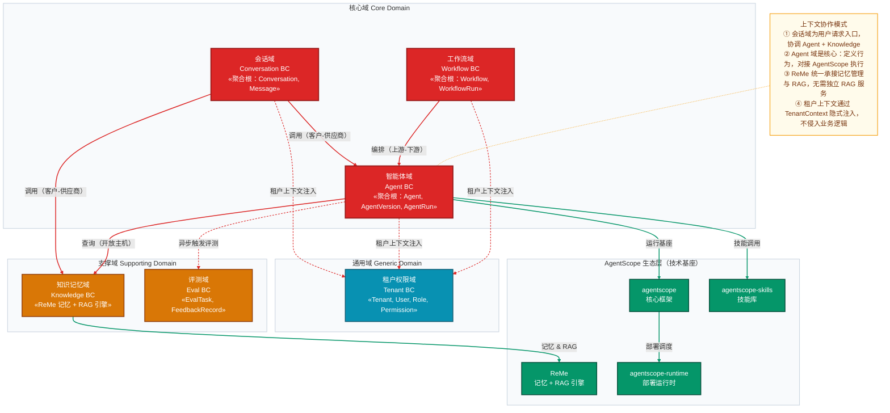
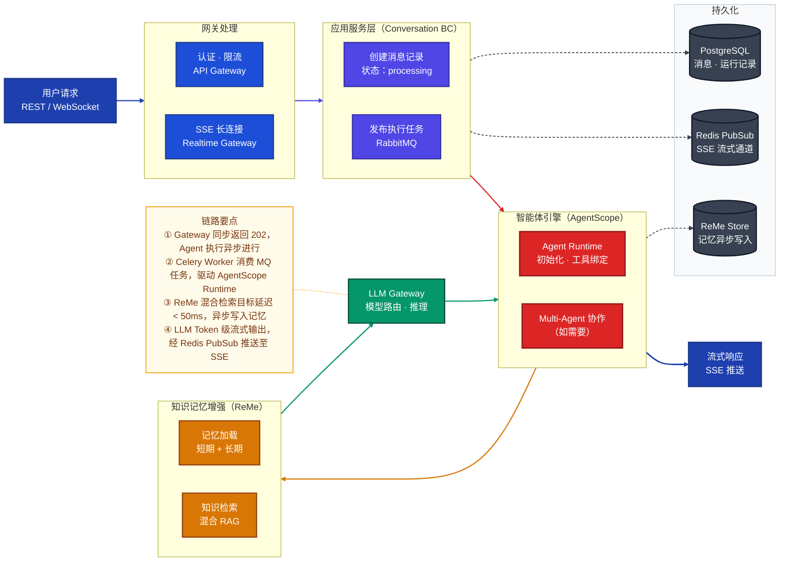
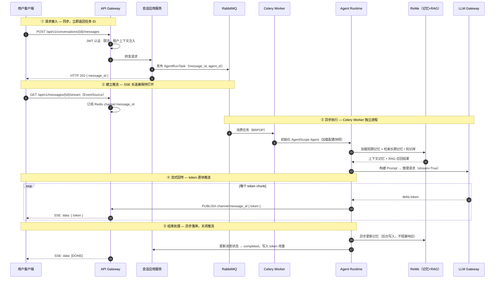
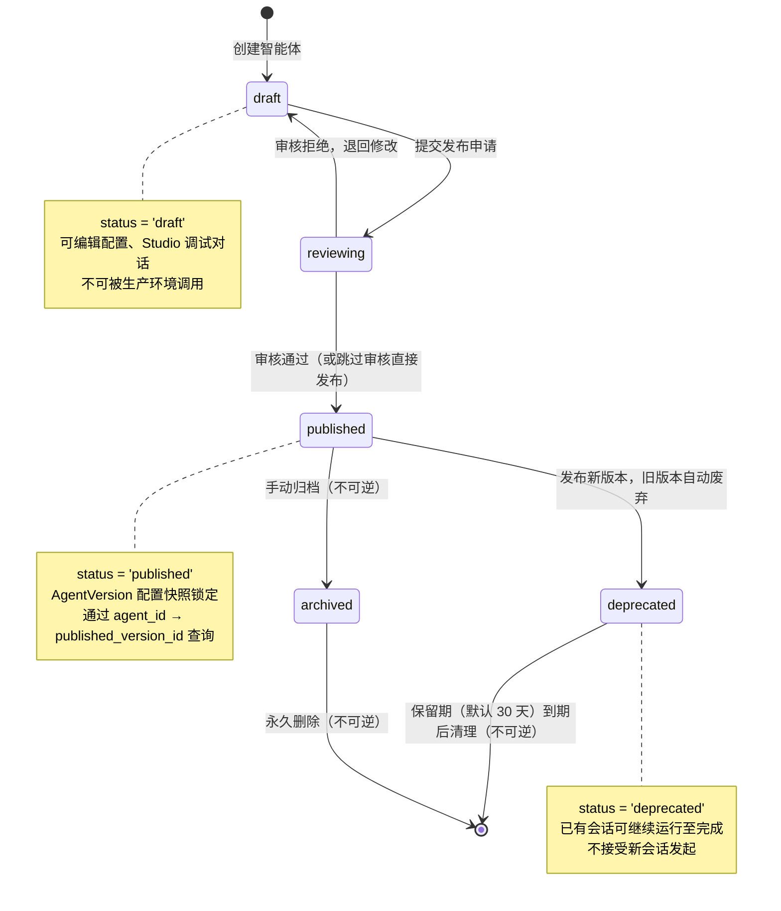

# 智能体平台架构设计方案（DDD）v1.0

> **文档版本**：v1.0  
> **参考基础**：智能体平台项目架构设计文档 v0.1、后端架构设计文档 v1.0、AgentScope 生态圈全解析  
> **定位**：以 DDD 为架构方法论的平台级设计方案，覆盖领域划分、系统架构、核心流程与分阶段实现计划

---
    
## 一、设计目标与原则

### 1.1 定位与目标

以 **AgentScope 生态**（核心框架 / ReMe / Skills / Runtime）为技术底座，以 **DDD（领域驱动设计）** 为架构方法论，构建企业级智能体平台，提供智能体全生命周期管理能力，覆盖开发 → 调试 → 发布 → 运营全流程，支撑多租户、多业务场景下的智能体应用快速落地。

### 1.2 核心原则

| 原则 | 说明 |
|------|------|
| **领域优先** | 以业务语言划定限界上下文，代码结构跟随领域边界，而非按技术层切分 |
| **生态复用** | AgentScope 生态组件优先复用；ReMe 统一承接记忆管理与 RAG 检索，无需引入独立 RAG 服务 |
| **模块化单体** | MVP 以模块化单体部署，模块边界对齐限界上下文，保留按域拆分为独立服务的通道 |
| **渐进演进** | 先闭环核心对话链路（Phase 1），再扩展工作流与多租户（Phase 2），最后完善评测与安全合规（Phase 3） |
| **可观测可治理** | 全链路追踪 / 指标 / 日志贯穿全层，多租户隔离与安全审计以横切关注点方式注入 |

---

## 二、领域划分（DDD）

### 2.1 核心域 / 支撑域 / 通用域

| 类型 | 限界上下文 | 核心职责 | 战略地位 |
|------|-----------|---------|---------|
| **核心域** | 智能体域（Agent BC） | 智能体定义、版本管理、运行调度 | 平台核心竞争力，优先投入 |
| **核心域** | 工作流域（Workflow BC） | DAG 工作流编排、节点调度、状态管理 | 支撑复杂多步骤业务场景 |
| **核心域** | 会话域（Conversation BC） | 多轮对话生命周期、消息流管理 | 用户直接感知的体验入口 |
| **支撑域** | 知识记忆域（Knowledge BC） | RAG 检索增强（ReMe）、多层记忆管理 | 增强智能体能力，复用 ReMe 生态 |
| **支撑域** | 评测域（Eval BC） | 智能体质量评测、反馈闭环优化 | 能力持续提升，Phase 2 引入 |
| **通用域** | 租户权限域（Tenant BC） | 多租户隔离、RBAC、配额管理 | 标准化通用能力，可复用成熟方案 |

### 2.2 限界上下文地图

### 2.3 核心聚合根与不变量

| 限界上下文 | 聚合根 | 核心实体 / 值对象 | 关键不变量 |
|-----------|--------|-----------------|----------|
| 智能体域 | `Agent` | `AgentVersion`, `AgentConfig`, `ToolBinding` | 同一时刻只有一个「已发布版本」可接受新会话 |
| 智能体域 | `AgentRun` | `RunStep`, `ToolCall`, `TokenUsage` | 运行记录只追加，不可修改历史 |
| 工作流域 | `Workflow` | `WorkflowNode`, `WorkflowEdge` | DAG 节点图不允许有环 |
| 工作流域 | `WorkflowRun` | `NodeExecution` | 运行快照与触发时的工作流版本绑定，版本更新不影响历史执行 |
| 会话域 | `Conversation` | `Message`, `ConversationConfig` | 消息严格有序，不允许乱序写入 |
| 知识记忆域 | `KnowledgeBase` | `Document`, `MemoryEntry` | 向量索引与文档状态同步，删除文档必须同步清理向量 |
| 租户权限域 | `Tenant` | `User`, `Role`, `Permission` | 所有业务资源操作必须归属于某租户，不允许跨租户访问 |

---

## 三、总体架构

### 3.1 系统架构图

```mermaid
flowchart TB
    %% ── 配色定义 ────────────────────────────────────────────────────
    classDef clientStyle  fill:#1f2937,stroke:#111827,stroke-width:2px,color:#f9fafb
    classDef gatewayStyle fill:#1d4ed8,stroke:#1e3a8a,stroke-width:2.5px,color:#fff
    classDef appStyle     fill:#0891b2,stroke:#155e75,stroke-width:2px,color:#fff
    classDef domainStyle  fill:#dc2626,stroke:#991b1b,stroke-width:2.5px,color:#fff
    classDef ecoStyle     fill:#059669,stroke:#064e3b,stroke-width:2px,color:#fff
    classDef infraStyle   fill:#374151,stroke:#111827,stroke-width:2px,color:#fff
    classDef crossStyle   fill:#7c3aed,stroke:#5b21b6,stroke-width:1.5px,color:#fff
    classDef noteStyle    fill:#fffbeb,stroke:#f59e0b,stroke-width:1.5px,color:#78350f
    classDef layerStyle   fill:#f8fafc,stroke:#cbd5e0,stroke-width:1.5px

    %% ── 用户接入层 ───────────────────────────────────────────────────
    subgraph CLIENT["用户接入层"]
        direction LR
        C1["Web 控制台<br>Spark-Design"]:::clientStyle
        C2["Studio 交互界面<br>agentscope-studio"]:::clientStyle
        C3["Open API / SDK"]:::clientStyle
    end
    class CLIENT layerStyle

    %% ── 网关层 ──────────────────────────────────────────────────────
    subgraph GATEWAY["网关层"]
        direction LR
        G1["API Gateway<br>路由 · 认证 · 限流"]:::gatewayStyle
        G2["LLM Gateway<br>模型路由 · 配额 · 降级"]:::gatewayStyle
        G3["Realtime Gateway<br>WebSocket · SSE"]:::gatewayStyle
    end
    class GATEWAY layerStyle

    %% ── 应用服务层（按限界上下文组织） ───────────────────────────────
    subgraph APP["应用服务层（限界上下文）"]
        direction LR
        A1["智能体应用服务<br>Agent BC"]:::appStyle
        A2["工作流应用服务<br>Workflow BC"]:::appStyle
        A3["会话应用服务<br>Conversation BC"]:::appStyle
        A4["租户权限服务<br>Tenant BC"]:::appStyle
    end
    class APP layerStyle

    %% ── 领域层（AgentScope 核心）────────────────────────────────────
    subgraph DOMAIN["领域层（AgentScope 核心）"]
        direction LR
        D1["Agent Runtime<br>Chat · Task · Workflow"]:::domainStyle
        D2["Multi-Agent 协作<br>消息总线 · 编排协议"]:::domainStyle
        D3["知识记忆域<br>ReMe · 混合 RAG · Memory"]:::domainStyle
    end
    class DOMAIN layerStyle

    %% ── 能力生态层 ───────────────────────────────────────────────────
    subgraph ECO["AgentScope 能力生态层"]
        direction LR
        E1["agentscope-skills<br>预制技能库"]:::ecoStyle
        E2["agentscope-bricks<br>基础组件"]:::ecoStyle
        E3["Eval & Optimize<br>评测优化（Eval BC）"]:::ecoStyle
        E4["Guardrails<br>安全护栏"]:::ecoStyle
    end
    class ECO layerStyle

    %% ── 基础设施层 ───────────────────────────────────────────────────
    subgraph INFRA["基础设施层"]
        direction LR
        I1[("PostgreSQL<br>+ pgvector")]:::infraStyle
        I2[("Redis<br>缓存 · 限流 · PubSub")]:::infraStyle
        I3[("RabbitMQ<br>异步消息")]:::infraStyle
        I4[("MinIO<br>文件存储")]:::infraStyle
    end
    class INFRA layerStyle

    %% ── 横切关注点 ───────────────────────────────────────────────────
    subgraph CROSS["横切关注点（贯穿全层）"]
        direction LR
        X1["可观测性<br>OTel · Prometheus · Loki"]:::crossStyle
        X2["安全合规<br>TLS · 审计 · 脱敏"]:::crossStyle
        X3["agentscope-runtime<br>部署 · 调度 · 弹性"]:::crossStyle
    end
    class CROSS layerStyle

    %% ── 层间调用关系 ─────────────────────────────────────────────────
    CLIENT --> GATEWAY
    GATEWAY --> APP
    APP --> DOMAIN
    DOMAIN --> ECO
    APP --> INFRA
    DOMAIN --> INFRA
    ECO --> INFRA
    CROSS -.->|"贯穿全层"| GATEWAY
    CROSS -.->|"贯穿全层"| APP
    CROSS -.->|"贯穿全层"| DOMAIN

    %% ── 注记 ─────────────────────────────────────────────────────────
    NOTE["架构要点<br>① 网关层统一处理认证/限流/路由，应用层不含流量治理逻辑<br>② 应用层按限界上下文划分，模块间通过领域事件/应用接口交互，严禁跨模块直访 DB<br>③ AgentScope 核心框架 + ReMe 构成领域层主体，不含业务语义<br>④ Eval / Guardrails 在能力生态层，由应用层按需接入<br>⑤ 横切关注点以 Middleware / Decorator 方式嵌入，不侵入领域层"]:::noteStyle
    NOTE -.- APP

    %% 边索引：0-10，共 11 条
    linkStyle 0,1,2,3 stroke:#1d4ed8,stroke-width:2px
    linkStyle 4,5,6   stroke:#374151,stroke-width:1.5px
    linkStyle 7,8,9   stroke:#7c3aed,stroke-width:1px,stroke-dasharray:4 3
    linkStyle 10      stroke:#f59e0b,stroke-width:1px,stroke-dasharray:2 2
```

### 3.2 DDD 四层架构说明

各限界上下文内部按 DDD 四层组织代码，以**智能体域（Agent BC）**为例：

| DDD 层次 | 对应代码组件 | 核心职责 | 关键约束 |
|---------|------------|---------|---------|
| **接口层** | FastAPI Router、Pydantic Schema | HTTP 接口定义、请求/响应映射、参数校验 | 不含业务逻辑，仅做协议转换 |
| **应用层** | Application Service、Command/Query Handler | 用例编排、事务边界、领域事件发布 | 依赖领域层接口，不直接访问基础设施 |
| **领域层** | Aggregate Root、Domain Service、领域事件 | 业务规则与不变量、核心计算逻辑 | 不依赖任何外部框架，纯粹业务代码 |
| **基础设施层** | Repository 实现、外部适配器 | 持久化实现、AgentScope / ReMe / MQ 集成 | 实现领域层定义的接口，隔离技术细节 |

> **目录结构约定**：`src/{bounded_context}/{interface,application,domain,infrastructure}/`，每个限界上下文独立分包，严禁跨包直接调用内部实现。

---

## 四、AgentScope 生态集成方案

### 4.1 生态组件与平台层次映射

| AgentScope 组件 | 平台层次 | 集成方式 |
|----------------|---------|---------|
| **agentscope**（核心框架） | 领域层 | Agent Runtime 执行基座；通过 `AgentRepository` 适配器封装，隔离框架版本升级影响 |
| **ReMe**（记忆 + RAG） | 领域层 / 基础设施层 | 知识记忆域的唯一技术底座；替代独立 RAG 框架 |
| **agentscope-skills**（技能库） | 能力生态层 | 基础设施层 `ToolRegistry` 统一注册，智能体配置时绑定 |
| **agentscope-bricks**（基础组件） | 基础设施层 | 提供消息解析、模型适配器、配置管理等底层模块 |
| **agentscope-runtime**（运行时） | 横切 / 运维 | 智能体应用部署调度、弹性伸缩、故障恢复 |
| **agentscope-studio**（可视化） | 用户接入层 | 扩展为智能体交互界面和多 Agent 可视化调试工具 |
| **agentscope-spark-design**（设计体系） | 用户接入层 | Web 控制台统一 UI 组件库 |
| **agentscope-samples**（示例库） | 开发参考 | 业务智能体开发的典型场景参考，加速功能落地 |

### 4.2 ReMe 集成重点

ReMe 同时承担**记忆管理**与**知识库 RAG** 两项职责，是知识记忆域的核心引擎：

| 能力 | 技术方案 | 说明 |
|------|---------|------|
| **短期记忆** | `ReMeLight` 文件型轻量记忆 | 会话上下文窗口管理，低延迟 |
| **长期记忆** | 向量型记忆（Chroma / Qdrant / ES 可选） | 用户画像、跨会话知识积累 |
| **RAG 检索** | `memory_search` 混合检索 | 向量（权重 0.7）+ BM25（权重 0.3），目标延迟 < 50ms |
| **多租户隔离** | 知识库 namespace 隔离 | 每租户独立向量空间，防止知识泄漏 |
| **记忆治理** | 遗忘策略、合规删除 | 支持 GDPR 右被遗忘，容量配额管理 |

---

## 五、核心流程设计

### 5.1 智能体对话端到端链路

### 5.2 对话异步执行时序

### 5.3 智能体生命周期状态机

---

## 六、技术选型

| 领域 | 技术方案 | 选型理由 |
|------|---------|---------|
| **后端框架** | FastAPI + Python 3.11+ | 高性能异步，原生支持 SSE / WebSocket，与 AgentScope 生态同语言 |
| **数据校验** | Pydantic v2 + pydantic-settings | 强类型校验，Schema 与配置管理统一 |
| **ORM / 迁移** | SQLAlchemy 2.0 + Alembic | 异步 ORM 支持，版本化数据库迁移 |
| **任务队列** | Celery + RabbitMQ | 成熟稳定，支持优先级队列、重试、死信，与 Python 生态契合 |
| **缓存 / 限流** | Redis | 会话状态、SSE PubSub、限流计数 |
| **向量存储** | pgvector（MVP）→ Qdrant（扩展） | ReMe 支持多向量后端，pgvector 降低初期运维复杂度 |
| **对象存储** | MinIO | 知识库文件、多模态附件，S3 兼容接口 |
| **鉴权** | JWT + OAuth2 + Casbin（RBAC） | 无状态认证，Casbin 管理细粒度权限策略 |
| **可观测性** | OpenTelemetry + Prometheus + Loki | 三遥统一：链路追踪 / 指标 / 日志聚合 |
| **前端** | React + TypeScript + Vite | 基于 AgentScope Spark-Design 组件库，Studio 可视化集成 |
| **容器化** | Docker Compose（开发）→ Kubernetes（生产） | 开发低门槛，生产弹性伸缩，agentscope-runtime 负责调度 |
| **智能体引擎** | AgentScope + ReMe + Skills | 生态原生，「框架 + 记忆/RAG + 工具 + 部署」四位一体 |

---

## 七、分阶段实现计划

### Phase 1：MVP 核心链路（1～2 月）

**目标**：单租户下完整跑通「创建智能体 → 发起对话 → 流式响应」核心链路，形成可演示的 MVP。

| 模块 | 实现内容 |
|------|---------|
| **用户接入层** | Web 控制台基础页面（Spark-Design）、Open API / OpenAI 兼容接口 |
| **网关层** | API Gateway（JWT 认证、基础限流）、SSE 实时推流通道 |
| **会话域** | 多轮对话创建、消息管理、SSE 流式推送、会话历史查询 |
| **智能体域** | 智能体 CRUD、版本快照、Chat Agent 类型、状态流转（draft → published）|
| **领域层** | AgentScope Agent Runtime 集成、LLM Gateway（多模型路由、配额基础控制）|
| **知识记忆域** | ReMe 短期记忆（会话上下文窗口管理），基础长期记忆接入 |
| **基础设施** | PostgreSQL + pgvector + Redis + RabbitMQ + Docker Compose |

**交付标准**：能通过 API 创建 Agent、发起对话、收到流式响应；核心链路 P99 端到端延迟 < 5s（不含 LLM 首 Token 时间）。

---

### Phase 2：能力增强（3～4 月）

**目标**：多租户隔离、工作流编排、知识库 RAG、Studio 集成、评测闭环。

| 模块 | 实现内容 |
|------|---------|
| **租户权限域** | 多租户隔离（资源 namespace 隔离）、RBAC（Casbin）、配额管理与账单归属 |
| **工作流域** | DAG 工作流编排（节点定义、连线校验）、WorkflowRun 状态机、可视化配置 |
| **知识记忆域** | ReMe 知识库 RAG（FileStore 双引擎，混合检索）、多租户知识库隔离、知识库 CRUD |
| **评测域** | 基础评测任务（离线指标评估）、在线反馈采集（点赞 / 差评），简版评测报告 |
| **智能体域** | Task Agent、Workflow Agent 类型扩展；Multi-Agent 协作（消息总线）|
| **安全护栏** | 输入 / 输出内容过滤（Guardrails）、工具调用白名单 |
| **Studio 集成** | agentscope-studio 可视化调试集成，多 Agent 消息流可视化 |

**交付标准**：多租户隔离验证通过；工作流能跑通 5 节点以上 DAG；RAG 检索相关性 > 80%；Studio 可调试 Multi-Agent 场景。

---

### Phase 3：生产就绪（5～6 月）

**目标**：全链路可观测、安全合规、性能调优、弹性部署，达到生产级 SLO。

| 模块 | 实现内容 |
|------|---------|
| **可观测性** | OpenTelemetry 全链路追踪、Prometheus + Grafana 指标看板、Loki 日志聚合、SLO 告警 |
| **安全合规** | TLS 全链路加密、PII 脱敏、密钥管理（Vault / 云 KMS）、全链路审计日志、数据生命周期管理 |
| **多模态** | 多模态消息支持（ASR / OCR / 图像），统一 MultimodalMessage 接口 |
| **弹性部署** | Kubernetes + agentscope-runtime，弹性伸缩、蓝绿 / 金丝雀发布，Helm Chart 交付 |
| **评测优化** | 离线基准评测（LoCoMo 等基准）、Prompt / 模型策略自动调优，评测驱动迭代 |
| **性能** | 热点接口 Redis 缓存、向量索引优化、LLM 语义相似度响应缓存 |

**交付标准**：P99 对话延迟 < 3s（不含模型首 Token）；全链路可观测，告警响应 < 5min；通过安全审计；支持 100 QPS 峰值稳定运行。

---

## 八、架构决策记录（ADR）

| 编号 | 决策 | 选型 | 核心理由 |
|------|------|------|---------|
| ADR-001 | 部署架构 | 模块化单体（Modular Monolith） | 中小团队 / 用户规模（~5000）不需微服务；模块边界对齐限界上下文，保留服务化拆分通道 |
| ADR-002 | RAG 方案 | ReMe 替代独立 RAG 框架 | 生态原生，记忆与 RAG 合一；FileStore 双引擎混合检索，LoCoMo 综合得分 86.23 领先 |
| ADR-003 | 异步通信 | Celery + RabbitMQ | 成熟稳定，支持优先级队列和死信，Python 生态天然契合 |
| ADR-004 | 向量存储 | pgvector 起步 → Qdrant 扩展 | MVP 降低运维复杂度；ReMe 支持多向量后端，迁移无需改业务代码 |
| ADR-005 | 多租户 | 应用层逻辑隔离 + Schema 隔离 | 单部署单元下折中方案；资源 namespace 隔离防止跨租户数据泄漏 |
| ADR-006 | 状态机驱动 | Agent / WorkflowRun 显式状态机 | 异步链路中保证状态可查、可重入；支持断线重连后补发进度 |
