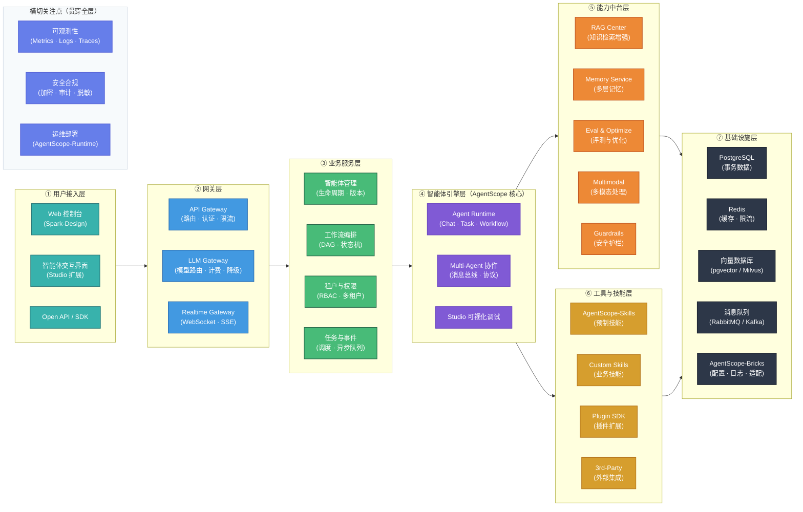
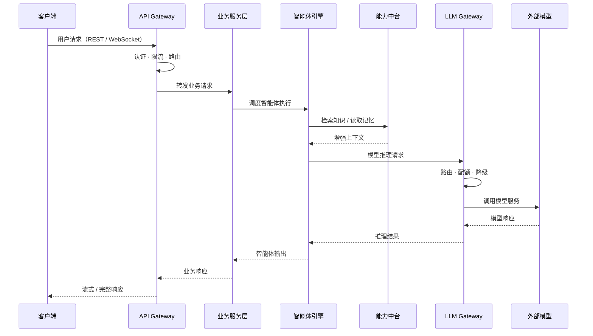

# 基于 AgentScope 生态的智能体平台架构设计

## 一、设计目标与原则

### 1.1 设计目标

构建以 AgentScope 为核心技术栈的企业级智能体平台，提供智能体全生命周期管理能力，覆盖开发、调试、部署、运营全流程，支撑多业务场景下的智能体应用快速落地。

### 1.2 核心设计原则

| 原则 | 说明 |
|------|------|
| **分层解耦** | 各层职责独立，层间通过标准接口交互，支持独立演进与替换 |
| **生态优先** | 优先复用 AgentScope 生态组件（Studio / Skills / Bricks / Runtime），避免重复建设 |
| **中台化能力** | RAG、记忆、评测、多模态、安全等通用能力中台化，供上层按需调用 |
| **可观测可治理** | 全链路可观测（Metrics / Logs / Traces），多租户隔离与安全审计贯穿全流程 |
| **渐进式演进** | 先闭环 MVP，再增强指标与治理能力，架构支持平滑扩展 |

---

## 二、总体架构

### 2.1 分层架构图

### 2.2 核心请求流转

---

## 三、分层架构说明

### 3.1 用户接入层

平台面向用户的统一入口，提供可视化管理与交互能力。

| 组件 | 职责 | 技术方案 |
|------|------|----------|
| **Web 控制台** | 智能体配置、管理、监控的后台管理界面 | 基于 AgentScope-Spark-Design 组件库构建 |
| **智能体交互界面** | 多轮对话、文件上传、流式输出等用户交互界面 | 基于 AgentScope-Studio 扩展，支持多模态输入输出 |
| **Open API / SDK** | 面向开发者的标准化 API 接口与多语言 SDK | RESTful API + WebSocket，配合自动生成的接口文档 |

### 3.2 网关层

统一流量入口，承担认证鉴权、流量治理、协议转换等职责。

| 组件 | 职责 |
|------|------|
| **API Gateway** | 统一请求入口，负责路由分发、身份认证、速率限流、请求审计 |
| **LLM Gateway** | 模型调用统一入口，负责模型路由选型（质量/成本/时延策略）、配额计费、熔断降级、调用审计 |
| **Realtime Gateway** | 实时通信通道，提供 WebSocket / SSE 连接管理、心跳保活、断线重连、消息重放 |

### 3.3 业务服务层

承载平台业务逻辑，协调各模块完成业务场景。

| 组件 | 职责 |
|------|------|
| **智能体管理** | 智能体全生命周期管理（创建、配置、发布、下线），支持版本化管控 |
| **工作流编排** | 基于 DAG / 状态机的流程编排引擎，支持人工节点（HITL）与补偿事务 |
| **租户与权限** | 多租户隔离、组织与项目管理、RBAC / ABAC 权限模型、配额管控与账单归属 |
| **任务与事件** | 异步任务调度（优先级队列 / 重试 / 死信）、事件驱动通知与回调 |

### 3.4 智能体引擎层（AgentScope 核心）

平台技术核心，基于 AgentScope 框架提供智能体运行与协作能力。

| 组件 | 职责 |
|------|------|
| **Agent Runtime** | 智能体运行时，内置 Chat Agent（对话）、Task Agent（任务执行）、Workflow Agent（流程协作）等基础类型，支持自定义扩展 |
| **Multi-Agent 协作引擎** | 多智能体消息通信与协作机制，支持同步 / 异步消息传递、协作协议编排 |
| **Studio 可视化调试** | 基于 AgentScope-Studio，提供智能体图形化配置、多智能体交互调试、消息流可视化 |

### 3.5 能力中台层

提供通用的 AI 增强能力，以中台服务形式供引擎层与业务层按需调用。

| 组件 | 职责 |
|------|------|
| **RAG Center** | 知识检索增强服务：文档解析 → 向量化索引 → 多路召回 → 重排引用，支持多租户知识库隔离与检索失败降级 |
| **Memory Service** | 多层记忆管理：短期记忆（会话上下文）、长期记忆（用户画像）、情节记忆（任务轨迹），支持遗忘策略与合规删除 |
| **Eval & Optimize** | 评测与优化闭环：离线基准评测 + 在线反馈采集，驱动 Prompt / 模型 / 工具策略持续优化 |
| **Multimodal Engine** | 多模态处理引擎：统一接入 ASR / TTS / OCR / VLM 能力，提供标准化 MultimodalMessage 消息结构 |
| **Guardrails** | 安全护栏服务：输入 / 输出内容审查、敏感数据脱敏、工具调用白名单、审计日志留痕 |

### 3.6 工具与技能层

为智能体提供可复用的外部能力与工具调用。

| 组件 | 职责 |
|------|------|
| **AgentScope-Skills** | 生态预制通用技能（文本总结、代码生成、工具调用等），开箱即用 |
| **Custom Skills** | 业务定制技能，基于平台标准接口开发特定领域能力 |
| **Plugin SDK** | 插件扩展框架，提供标准化工具协议、版本兼容机制、沙箱执行环境 |
| **3rd-Party Integration** | 第三方服务集成（外部 API、SaaS 服务、数据源等） |

### 3.7 基础设施层

提供数据存储、缓存、消息通信等底层基础能力。

| 组件 | 职责 |
|------|------|
| **PostgreSQL** | 核心事务数据存储（用户、租户、配置、审计、计费等） |
| **Redis** | 高性能缓存、限流计数、会话状态暂存 |
| **向量数据库** | 向量索引与语义检索（MVP 使用 pgvector，后期可迁移 Milvus / Weaviate） |
| **消息队列** | 异步消息与事件通信（MVP 使用 RabbitMQ，高吞吐可迁移 Kafka） |
| **AgentScope-Bricks** | 生态基础组件库，提供消息解析、模型适配、配置管理、日志工具等通用模块 |

### 3.8 横切关注点

以下能力贯穿所有架构层级，以标准化方式嵌入各层实现，而非独立分层。

| 关注点 | 覆盖内容 |
|--------|----------|
| **可观测性** | 指标采集（Prometheus + Grafana）、日志聚合（Loki / ELK）、链路追踪（OpenTelemetry），建立请求级与会话级诊断能力 |
| **安全合规** | 传输加密（TLS）、字段级加密、PII 脱敏、密钥托管（Vault / KMS）、全链路审计日志、数据生命周期管理（可删除 / 可导出） |
| **运维部署** | 基于 AgentScope-Runtime 实现部署调度与资源管理，支持容器化（Docker / K8s）、弹性伸缩、蓝绿 / 金丝雀发布、SLO 告警 |

---

## 四、AgentScope 生态组件集成

平台充分复用 AgentScope 生态体系的 7 个核心组件，以下为各组件在平台中的集成方式：

| AgentScope 生态组件 | 平台集成层 | 集成方式 |
|---------------------|-----------|----------|
| **agentscope**（核心框架） | ④ 智能体引擎层 | 作为 Agent Runtime 与 Multi-Agent 协作的核心运行基座 |
| **agentscope-studio**（可视化平台） | ① 接入层 + ④ 引擎层 | 扩展为智能体交互界面，同时提供可视化开发调试能力 |
| **agentscope-skills**（技能库） | ⑥ 工具与技能层 | 直接集成预制技能，作为通用技能能力底座 |
| **agentscope-bricks**（基础组件库） | ⑦ 基础设施层 | 提供消息解析、模型适配、配置管理等基础模块 |
| **agentscope-runtime**（运行时） | 横切 · 运维部署 | 负责智能体应用的部署、调度、资源管理与故障恢复 |
| **agentscope-spark-design**（设计体系） | ① 用户接入层 | 统一 UI 组件库与交互规范，保障前端体验一致性 |
| **agentscope-samples**（示例库） | 开发参考 | 提供典型场景示例与最佳实践，加速业务智能体开发 |

---

## 五、技术选型概览

| 领域 | 技术方案 |
|------|----------|
| **Web 框架** | FastAPI（REST + WebSocket + SSE） |
| **数据校验** | Pydantic v2 + pydantic-settings |
| **ORM 与迁移** | SQLAlchemy 2.0 + Alembic |
| **鉴权与权限** | JWT / OAuth2 + Casbin（RBAC / ABAC） |
| **任务调度** | Celery（Redis / RabbitMQ）或 Arq（轻量异步） |
| **前端框架** | React + TypeScript + Vite |
| **UI 组件** | AgentScope-Spark-Design + 业务组件 |
| **指标监控** | Prometheus + Grafana |
| **日志聚合** | Loki / ELK |
| **链路追踪** | OpenTelemetry + Tempo / Jaeger |
| **密钥管理** | Vault / 云 KMS |
| **容器化** | Docker + Kubernetes（Helm / Kustomize） |

---

## 六、总结

本架构以 **七层分层 + 横切关注点** 组织智能体平台全貌：

- **上三层**（接入 → 网关 → 业务服务）面向用户与业务，提供统一入口、流量治理与业务编排能力；
- **中间层**（智能体引擎）以 AgentScope 为核心基座，提供智能体运行与多 Agent 协作能力；
- **下三层**（能力中台 → 工具技能 → 基础设施）提供 AI 增强能力、可复用工具与底层资源支撑；
- **横切关注点**（可观测性、安全合规、运维部署）贯穿全层，确保平台可运营、可治理、可持续演进。

架构全面复用 AgentScope 生态的 7 个核心组件，在保持技术一致性的同时，通过分层解耦为后续业务扩展与技术迭代留出充分空间。建议后续落地坚持 **先闭环、再指标、后优化** 的演进主线。
