# 基于 AgentScope 生态的智能体平台项目设计

## 一、项目架构 Mermaid 图

```mermaid
flowchart LR
    %% 统一样式定义（适配生态+平台特性，易扩展）
    classDef infraStyle fill:#2d3748,stroke:#333,stroke-width:2px,color:#fff
    classDef coreStyle fill:#4299e1,stroke:#333,stroke-width:2px,color:#fff
    classDef agentStyle fill:#9f7aea,stroke:#333,stroke-width:2px,color:#fff
    classDef skillStyle fill:#ed8936,stroke:#333,stroke-width:2px,color:#fff
    classDef serviceStyle fill:#48bb78,stroke:#333,stroke-width:2px,color:#fff
    classDef frontendStyle fill:#f5fafe,stroke:#48bb78,stroke-width:2px,color:#333
    classDef deployStyle fill:#f6ad55,stroke:#333,stroke-width:2px,color:#fff
    classDef enhanceStyle fill:#667eea,stroke:#333,stroke-width:2px,color:#fff
    classDef governanceStyle fill:#805ad5,stroke:#333,stroke-width:2px,color:#fff
    classDef designStyle fill:#38b2ac,stroke:#333,stroke-width:2px,color:#fff
    classDef subgraphStyle fill:#f5f5f5,stroke:#666,stroke-width:1px,rounded:10px
    classDef noteStyle fill:#fff8e6,stroke:#ffb74d,stroke-width:1px,rounded:8px

    %% 1. 基础设施层（生态基石+底层资源）
    subgraph infraLayer["基础设施层"]
        A[AgentScope 核心框架<br/>（多智能体核心能力）]:::infraStyle
        B[AgentScope-Bricks<br/>（配置/日志/模型适配）]:::infraStyle
        C[存储层<br/>（数据库/对象存储）]:::infraStyle
        D[配置中心<br/>（基于Bricks扩展）]:::infraStyle
    end
    class infraLayer subgraphStyle

    %% 2. 平台核心层（平台管控能力）
    subgraph platformCoreLayer["平台核心层"]
        E[Agent Manager<br/>（智能体生命周期管理）]:::coreStyle
        F[Message Bus<br/>（多智能体通信/事件）]:::coreStyle
        G[Config Manager<br/>（中心化配置管理）]:::coreStyle
        H[Version/Permission<br/>（版本/权限管控）]:::coreStyle
    end
    class platformCoreLayer subgraphStyle

    %% 3. 智能体层（能力载体）
    subgraph agentLayer["智能体层"]
        I[Base Agent<br/>（基础智能体基类）]:::agentStyle
        J[Chat Agent<br/>（对话类智能体）]:::agentStyle
        K[Task Agent<br/>（任务执行类智能体）]:::agentStyle
        L[Workflow Agent<br/>（工作流协作智能体）]:::agentStyle
        M[AgentScope-Studio<br/>（可视化调试）]:::agentStyle
    end
    class agentLayer subgraphStyle

    %% 4. 技能工具层（可复用能力）
    subgraph skillToolLayer["技能工具层"]
        N[AgentScope-Skills<br/>（预制通用技能）]:::skillStyle
        O[Custom Skills<br/>（业务定制技能）]:::skillStyle
        P[General Tools<br/>（文件/数据/推理工具）]:::skillStyle
        Q[3rd-Party Integration<br/>（第三方能力集成）]:::skillStyle
        SS[OpenClaw<br/>（数据抓取/爬取工具）]:::skillStyle
    end
    class skillToolLayer subgraphStyle

    %% 5. 应用服务层（接口/业务逻辑）
    subgraph serviceLayer["应用服务层"]
        R[API网关<br/>（统一接口入口）]:::serviceStyle
        MM[LLMGateway<br/>（鉴权/限流/计费/降级）]:::serviceStyle
        S[业务逻辑<br/>（场景化编排）]:::serviceStyle
        T[权限控制<br/>（用户/角色管理）]:::serviceStyle
        U[Event Service<br/>（事件驱动/回调）]:::serviceStyle
    end
    class serviceLayer subgraphStyle

    %% 6. 前端交互层（可视化操作）
    subgraph frontendLayer["前端交互层（复用Studio）"]
        V[管理控制台<br/>（Agent配置/管理/调试）]:::frontendStyle
        W[聊天交互界面<br/>（多角色对话/文件上传）]:::frontendStyle
        X[监控面板<br/>（运行状态/性能指标）]:::frontendStyle
        Y[API文档与测试<br/>（接口调试/文档生成）]:::frontendStyle
        Z[智能体编排<br/>（工作流可视化配置）]:::frontendStyle
    end
    class frontendLayer subgraphStyle

    %% 7. 部署运维层（生产落地）
    subgraph deployLayer["部署运维层（复用Runtime）"]
        AA[AgentScope-Runtime<br/>（部署/调度/容灾）]:::deployStyle
        BB[监控告警<br/>（性能监控/异常告警）]:::deployStyle
        CC[弹性伸缩<br/>（自动扩缩容）]:::deployStyle
        DD[多环境管理<br/>（开发/测试/生产）]:::deployStyle
        EE[安全合规<br/>（数据加密/访问控制）]:::deployStyle
    end
    class deployLayer subgraphStyle

    %% 8. 增强能力层（查漏补缺后的关键中台）
    subgraph enhanceLayer["增强能力层（知识/记忆/评估/实时/多模态/安全）"]
        FF[RAG Center<br/>（索引/检索/重排/引用）]:::enhanceStyle
        GG[Memory Service<br/>（短期/长期/情节记忆）]:::enhanceStyle
        HH[Eval & Optimize<br/>（离线评测/在线反馈/优化）]:::enhanceStyle
        II[Realtime Gateway<br/>（WebSocket/SSE/流式）]:::enhanceStyle
        JJ[Multimodal Engine<br/>（ASR/TTS/OCR/VLM）]:::enhanceStyle
        KK[Guardrails<br/>（内容安全/策略/审计）]:::enhanceStyle
    end
    class enhanceLayer subgraphStyle

    %% 9. 治理与运行层（企业级管控与稳定性）
    subgraph governanceLayer["治理与运行层（多租户/流程/任务/扩展/数据/SRE）"]
        TOC[Tenant/Org Center<br/>（租户/组织/项目/环境/配额/账单）]:::governanceStyle
        WO[Workflow Orchestrator<br/>（DAG/状态机/补偿/HITL）]:::governanceStyle
        TR[Task Runtime<br/>（队列/重试/死信/优先级）]:::governanceStyle
        PX[Plugin/Extension SDK<br/>（协议标准化/兼容/沙箱）]:::governanceStyle
        DG[Data Governance<br/>（血缘/保留/删除导出/审计检索）]:::governanceStyle
        SR[SRE Baseline<br/>（SLO/SLI/Error Budget/演练）]:::governanceStyle
    end
    class governanceLayer subgraphStyle

    %% 10. 设计规范层（体验一致性）
    subgraph designLayer["设计规范层"]
        LL[AgentScope-Spark Design<br/>（UI组件库/交互规范）]:::designStyle
    end
    class designLayer subgraphStyle

    %% 核心交互逻辑（体现依赖+协作）
    %% 基础设施层支撑平台核心
    A -->|核心能力| E
    B -->|基础组件| A
    B -->|配置管理| D
    D -->|配置下发| G
    C -->|数据存储| E

    %% 平台核心层管控智能体
    E -->|生命周期管理| I
    I -->|实例化| J & K & L
    F -->|消息通信| J & K & L
    G -->|配置注入| J & K & L
    H -->|权限/版本控制| E

    %% 智能体复用技能工具
    J & K & L -->|调用| N & O & P & Q & SS
    M -->|调试| J & K & L

    %% 增强能力层为智能体与业务提供核心增益
    C -->|知识库/向量索引存储| FF
    C -->|记忆持久化| GG
    J & K & L -->|上下文检索| FF
    J & K & L -->|读写记忆| GG
    J & K & L -->|多模态处理| JJ
    FF -->|知识增强结果| S
    GG -->|用户画像/会话状态| S
    JJ -->|多模态结构化输出| S
    U -->|业务反馈事件| HH
    M -->|调试数据回流| HH
    HH -->|策略优化回写| G
    HH -->|提示词/技能优化建议| O
    R -->|流式连接升级| II
    II -->|实时消息推送| W
    EE -->|安全策略同步| KK
    R -->|模型请求转发| MM
    MM -->|模型路由与降级| S
    MM -->|流量治理策略| KK
    HH -->|网关策略优化建议| MM
    KK -->|请求/响应安全拦截| R
    KK -->|越权与审计校验| T

    %% 治理与运行层与核心链路协同
    R -->|租户上下文注入| TOC
    TOC -->|配额与账单归属| MM
    TOC -->|组织权限边界| T
    TOC -->|租户环境隔离| DD
    S -->|业务流程定义与编排| WO
    WO -->|异步节点投递| TR
    WO -->|流程状态与回调| U
    TR -->|任务事件回传| U
    TR -->|任务指标与告警| BB
    J & K & L -->|插件发现/调用| PX
    PX -->|统一工具协议| N & O & P & Q & SS
    C -->|元数据与审计数据| DG
    DG -->|知识治理规则| FF
    DG -->|记忆生命周期策略| GG
    KK -->|安全审计归档| DG
    BB -->|运行指标输入| SR
    SR -->|SLO告警与预算| BB
    SR -->|容量与演练基线| AA

    %% 智能体能力对接应用服务
    J & K & L -->|能力提供| S
    R -->|业务请求路由| S
    S -->|权限校验| T
    S -->|事件触发| U

    %% 应用服务对接前端
    R -->|API调用| V
    S -->|数据返回| W
    BB -->|监控数据| X
    R -->|接口文档| Y
    S -->|工作流配置| Z

    %% 部署运维支撑全平台
    E -->|部署调度| AA
    AA -->|监控| BB
    AA -->|资源调整| CC
    AA -->|环境管理| DD
    AA -->|安全策略| EE
    BB -->|日志/指标| A & E & R
    DD -->|环境配置| D
    EE -->|安全控制| T

    %% 设计规范层支撑前端
    LL -->|UI规范| V
    LL -->|UI规范| W
    LL -->|UI规范| X
    LL -->|UI规范| Y
    LL -->|UI规范| Z

    %% 核心设计原则
    Note[架构核心设计原则：<br/>1. 分层解耦，每层职责独立且可扩展<br/>2. 全复用AgentScope生态，避免重复造轮子<br/>3. RAG+记忆双增强，提升准确率与连续性<br/>4. 建立评估优化闭环，实现可度量迭代<br/>5. 实时交互与多模态并重，覆盖复杂场景<br/>6. 安全合规与审计前置，贯穿全链路<br/>7. 企业级治理内建（多租户/流程/任务/数据治理/SRE）<br/>8. 覆盖开发-部署-运维全流程并保持体验一致性]:::noteStyle
    Note -.-> infraLayer
```



## 二、项目架构详细说明

### 1. 基础设施层

- **AgentScope 核心框架**：生态基石，提供智能体定义与管理、多智能体消息通信/协作机制、大模型适配与调用、环境管理等核心能力。
- **AgentScope-Bricks**：提供基础组件，如消息解析、模型适配器、配置管理器、日志/监控工具等，为核心框架提供支持。
- **存储层**：负责数据持久化，包括对话数据、智能体数据等。
- **配置中心**：基于Bricks扩展，集中管理平台配置，包括模型配置、环境配置、密钥管理等。

### 2. 平台核心层

- **Agent Manager**：负责智能体的生命周期管理，包括创建、启动、停止、监控等。
- **Message Bus**：实现智能体之间的消息传递，支持同步和异步通信。
- **Config Manager**：中心化配置管理，负责配置的分发和管理。
- **Version/Permission**：版本控制和权限管理，确保平台的安全性和可追溯性。

### 3. 智能体层

- **Base Agent**：基础智能体基类，提供通用的智能体功能和接口。
- **Chat Agent**：对话类智能体，处理用户的自然语言输入并生成响应。
- **Task Agent**：任务执行类智能体，能够分解任务、执行子任务并汇总结果。
- **Workflow Agent**：工作流协作智能体，能够协调多个智能体完成复杂任务。
- **AgentScope-Studio**：可视化开发/调试平台，提供图形化配置智能体、定义协作逻辑、实时调试多智能体交互过程等功能。

### 4. 技能工具层

- **AgentScope-Skills**：预制通用技能，如文本总结、代码生成、工具调用等。
- **Custom Skills**：业务定制技能，根据特定业务需求开发的技能。
- **General Tools**：通用工具，如文件处理、数据获取、模型推理等。
- **3rd-Party Integration**：第三方能力集成，整合外部服务和API。
- **OpenClaw**：数据抓取/爬取工具，用于从网页、API等数据源获取数据。

### 5. 应用服务层

- **API网关**：统一接口入口，负责请求路由、负载均衡、认证等。
- **LLMGateway**：模型调用网关，负责模型鉴权、配额与限流、请求计费、模型路由、熔断降级和调用审计。
- **业务逻辑**：场景化编排，协调智能体能力实现业务场景。
- **权限控制**：用户/角色管理，确保平台的安全性。
- **Event Service**：事件驱动/回调，处理平台内的事件。

### 6. 前端交互层

- **管理控制台**：基于AgentScope-Studio扩展，提供智能体配置、管理和调试功能。
- **聊天交互界面**：提供多角色对话、文件上传等功能。
- **监控面板**：展示运行状态、性能指标等。
- **API文档与测试**：提供接口调试、文档生成等功能。
- **智能体编排**：提供工作流可视化配置功能。

### 7. 部署运维层

- **AgentScope-Runtime**：运行时环境，负责多智能体应用的部署、调度、资源管理。
- **监控告警**：性能监控、异常告警、日志管理等。
- **弹性伸缩**：根据负载自动调整资源，支持弹性伸缩。
- **多环境管理**：管理开发、测试、生产等不同环境。
- **安全合规**：数据加密、访问控制、安全审计等。

### 8. 增强能力层

- **RAG Center**：负责文档解析、切片、向量化、索引构建、检索重排与引用回传，支持多知识库、多租户和权限过滤。
- **Memory Service**：统一管理短期记忆（会话窗口）、长期记忆（用户画像/偏好）、情节记忆（任务轨迹）与摘要记忆（压缩上下文）。
- **Eval & Optimize**：建立离线评测（基准集）+在线评测（真实流量反馈）双回路，支持 Prompt 优化、工具路由优化、模型策略优化。
- **Realtime Gateway**：统一 WebSocket/SSE/流式输出通道，支持中断、续传、打字机效果、事件订阅与回放。
- **Multimodal Engine**：统一接入语音、图片、文档、视频等能力（ASR/TTS/OCR/VLM），对上提供结构化多模态接口。
- **Guardrails**：执行输入/输出安全策略、越权访问检查、敏感数据脱敏、审计日志留痕。

### 9. 治理与运行层

- **Tenant/Org Center**：统一管理租户、组织、项目、环境、配额与账单归属，为网关、权限与多环境提供统一租户上下文。
- **Workflow Orchestrator**：提供 DAG/状态机编排，支持补偿事务和人工节点（HITL），用于承载复杂业务流程与跨智能体协作。
- **Task Runtime**：统一长任务队列、重试、死信、任务追踪与优先级调度，支撑异步执行和高峰削峰。
- **Plugin/Extension SDK**：标准化工具协议，提供插件版本兼容、沙箱执行与扩展注册机制，降低工具接入成本。
- **Data Governance**：统一数据血缘、保留策略、删除/导出与审计检索，打通知识、记忆与安全审计的数据治理闭环。
- **SRE Baseline**：建立 SLO/SLI/Error Budget、容量水位、故障演练与应急预案，形成可运营的稳定性基线。

### 10. 设计规范层

- **AgentScope-Spark Design**：设计体系，提供统一的UI组件库、视觉风格，确保平台前端与AgentScope生态产品的一致性。

## 三、关键模块补全设计（查漏补缺）

### 1. RAG 增强设计

1. **离线构建链路**：
   - 数据接入：文件、网页、数据库、业务系统 API。
   - 数据治理：清洗、去重、权限标签、元数据补全。
   - 索引构建：切片策略（语义切片+窗口重叠）、嵌入模型、多索引（向量+关键词）。

2. **在线检索链路**：
   - Query 重写与意图识别（是否需要检索、检索范围、检索深度）。
   - 多路召回（语义检索 + 关键词检索 + 规则召回）。
   - 重排与过滤（相关性、时效性、权限、可信度）。
   - 上下文组装（附引用来源、置信度、片段边界）。

3. **关键能力约束**：
   - 支持检索失败降级（直接回答/澄清提问/转人工）。
   - 支持引用可追溯与证据链展示。
   - 支持多租户隔离与租户级索引配额。

### 2. 记忆系统设计

1. **记忆分层**：
   - 短期记忆：当前会话上下文，低延迟读写。
   - 长期记忆：用户偏好、历史事实，支持跨会话复用。
   - 情节记忆：任务执行过程、关键决策节点，便于复盘。
   - 摘要记忆：长上下文压缩，控制 Token 成本。

2. **读写策略**：
   - 写入触发：会话结束、任务完成、显式确认、关键事件命中。
   - 检索策略：按用户+场景+时间窗召回，结合相关性阈值。
   - 遗忘策略：TTL、权重衰减、用户删除（满足合规要求）。

3. **治理要求**：
   - PII 脱敏与敏感字段分级加密。
   - 用户可见可控（查看/纠正/删除个人记忆）。

### 3. 评估与优化体系

1. **评估维度**：
   - 质量指标：正确性、相关性、完整性、可解释性。
   - 体验指标：首 Token 延迟、总响应时延、交互流畅度。
   - 成本指标：单次请求成本、工具调用成本、缓存命中率。
   - 安全指标：越权率、敏感信息泄露率、违规输出率。

2. **评测机制**：
   - 离线基准评测：固定数据集回归评测，发布前准入。
   - 在线 A/B：按流量分桶验证新 Prompt/新模型/新工具策略。
   - 人工反馈闭环：用户评分、纠错、人工审核回流训练集。

3. **优化闭环**：
   - 发现问题 -> 定位根因（模型/提示词/工具/检索/记忆） -> 策略修复 -> 灰度验证 -> 全量发布。

### 4. 实时交互体系

1. **协议层**：
   - 请求入口：REST（控制面）+ WebSocket/SSE（数据面）。
   - 事件模型：`message.delta`、`tool.start`、`tool.end`、`agent.state`、`error`、`done`。

2. **会话控制**：
   - 支持中断/取消、重试、续传、幂等请求 ID。
   - 支持多端同步（同一会话在 Web/移动端一致）。

3. **工程保障**：
   - 心跳保活、断线重连、背压控制、消息重放。

### 5. 多模态能力设计

1. **输入能力**：文本、语音、图片、PDF/Office、视频片段。
2. **处理链路**：
   - 语音 -> ASR -> 文本理解。
   - 图像/文档 -> OCR/VLM -> 结构化信息抽取。
   - 输出 -> 文本生成 + TTS 合成（按场景启用）。
3. **统一抽象**：
   - 定义标准 `MultimodalMessage` 数据结构，统一传输与存储。
   - 提供模态路由策略（按任务类型选择最优模型组合）。

### 6. 安全与治理补全

1. **策略中心**：统一管理提示词安全策略、访问控制策略、工具调用白名单。
2. **执行节点**：输入前审查、工具调用前审查、输出后审查三段式防护。
3. **审计能力**：全链路审计日志、可追溯会话 ID、风险事件告警与工单联动。
4. **合规能力**：数据分级、密钥托管、跨境与存储合规策略。

### 7. 其他易遗漏关键模块（建议纳入）

1. **模型网关与路由**：按成本/时延/质量动态选择模型，支持降级与熔断。
2. **缓存层**：Prompt Cache、检索结果缓存、工具结果缓存，降低时延和成本。
3. **任务调度与队列**：长任务异步化、优先级队列、失败重试和死信队列。
4. **特征与数据集管理**：评测数据集、对话样本、标注版本统一管理。
5. **可观测性增强**：Trace（请求级）、Metrics（指标级）、Logs（事件级）三位一体。

### 8. LLMGateway 设计（鉴权/限流/计费/降级）

1. **架构定位**：
   - 位于 `API网关` 与 `业务逻辑/模型调用` 之间，作为统一模型调用入口。
   - 对上提供一致模型接口，对下屏蔽多模型厂商差异。

2. **核心能力**：
   - 鉴权认证：支持 API Key、JWT、租户签名校验。
   - 流量治理：按租户/应用/用户维度限流（QPS、并发、Token 速率）。
   - 配额管理：日/月调用上限、模型级配额、突发额度策略。
   - 计费计量：按请求、Token、模型单价聚合账单，支持成本归因。
   - 路由策略：按场景在质量优先、成本优先、时延优先策略间切换。
   - 熔断降级：模型超时/异常时自动切换备选模型，支持兜底响应。

3. **策略执行顺序（建议）**：
   - 鉴权 -> 配额检查 -> 限流判定 -> 路由选型 -> 调用执行 -> 计量计费 -> 审计落库。

4. **关键指标**：
   - 网关可用性、P95/P99 延迟、429 比例、熔断触发率、降级成功率、计费准确率。

5. **数据与审计要求**：
   - 每次模型调用记录 `tenant_id`、`app_id`、`request_id`、`model`、`token_in/out`、`cost`、`latency`、`fallback`。
   - 支持按租户/应用/模型维度出账与追溯。

## 四、开发和部署建议（增强版）

### 1. 环境搭建

1. **Python 环境**：使用 Python 3.10+，建议使用虚拟环境。
2. **依赖管理**：使用 `pyproject.toml` 或 `requirements.txt` 管理依赖。
3. **AgentScope 安装**：
   ```bash
   pip install agentscope[full]
   ```
4. **增强组件准备**：
   - 向量数据库（如 Milvus/pgvector/Weaviate）与对象存储。
   - 消息中间件（如 Kafka/RabbitMQ）与实时网关组件。
   - 网关依赖组件（如 Redis 用于限流计数，账单存储用于计费对账）。
   - 观测栈（Prometheus/Grafana + Trace 系统）。

### 2. 开发流程

1. **核心服务开发**：
   - 实现 `Agent Manager`、`Message Bus`、`Config Manager` 等核心服务。
   - 定义智能体基类和接口，预留 RAG/记忆/评测扩展点。

2. **增强中台开发**：
   - 实现 `RAG Center`：离线索引构建 + 在线检索服务。
   - 实现 `Memory Service`：多层记忆存储、检索、遗忘策略。
   - 实现 `Eval & Optimize`：离线评测任务、在线反馈接入。
   - 实现 `LLMGateway`：鉴权、限流、配额、计费、路由与降级。

3. **技能和工具开发**：
   - 开发可复用的技能和工具。
   - 注册技能和工具到智能体，并为工具增加权限策略与审计点。

4. **服务接口开发**：
   - 实现 API 接口、业务逻辑和权限控制。
   - 集成事件服务与实时通道（WebSocket/SSE）。

5. **前端开发**：
   - 基于 `agentscope-spark-design` 设计规范，开发管理控制台、用户交互界面和 API 文档界面。
   - 集成 `agentscope-studio` 进行可视化调试。
   - 支持流式消息、实时状态、引用溯源、多模态输入输出。

### 3. 测试策略

1. **单元测试**：覆盖 RAG 检索、记忆读写、多模态解析、安全策略执行。
2. **集成测试**：验证智能体-工具-检索-记忆-网关全链路协作。
3. **端到端测试**：覆盖真实业务场景与异常路径（超时、断连、降级）。
4. **回归评测**：每次发布前执行离线基准集评测，设定准入阈值。
5. **在线观测验证**：灰度发布期间跟踪延迟、成功率、用户满意度和成本。
6. **网关专项测试**：覆盖鉴权失败、限流触发、计费对账、熔断与降级切换。

### 4. 部署方案

1. **本地开发**：
   - 使用 `python -m my_agent_platform` 启动平台后端服务。
   - 使用 `agentscope-studio` 进行可视化调试。
   - 前端开发可使用本地开发服务器（如 Vite、Create React App 等）。

2. **容器化部署**：
   - 创建 Dockerfile，构建后端服务镜像。
   - 前端应用打包为静态资源，可使用 Nginx 或其他静态资源服务器。
   - 使用 Docker Compose 管理服务，包括后端服务、前端静态资源服务器、数据库、向量库、消息队列等。

3. **云服务部署**：
   - 部署到 Kubernetes 集群，使用 Helm 或 Kustomize 管理部署配置。
   - 前端静态资源可部署到 CDN，提高访问速度。
   - 关键组件（RAG/记忆/实时网关）独立扩缩容，防止相互抢占资源。

4. **监控和维护**：
   - 集成 Prometheus 和 Grafana 进行后端服务监控。
   - 增加链路追踪与会话级诊断能力，支持问题快速定位。
   - 设置日志收集和分析系统，包括后端服务日志和前端错误日志。
   - 建立 SLO（可用性、时延、正确率）与告警分级策略。

### 5. 扩展建议

1. **智能体扩展**：
   - 基于业务需求，开发特定领域的智能体。
   - 实现智能体之间的协作机制与共享记忆策略。

2. **技能和工具扩展**：
   - 根据业务需求，开发特定领域的技能和工具。
   - 集成第三方服务和 API，并接入统一权限网关。

3. **服务接口扩展**：
   - 开发更多的服务接口，如 gRPC、GraphQL 等。
   - 优化 WebSocket 服务，支持更多实时通信场景。

4. **前端扩展**：
   - 开发移动端应用，支持多端访问。
   - 实现主题切换和品牌定制功能。
   - 集成更多第三方前端工具，如低代码平台等。
   - 实现国际化支持，适应全球用户需求。

## 五、方案评审结论（符合性/遗漏/可扩展性）

### 1. 是否符合智能体平台核心要求（结论：整体符合）

按“可用性、可运营、可治理、可扩展”四类要求评估，当前方案已覆盖：

1. **可用性**：具备智能体编排、工具调用、RAG、记忆、实时交互、多模态等主链路能力。  
2. **可运营**：具备网关治理、评估优化闭环、监控告警、灰度与回归机制。  
3. **可治理**：具备权限、审计、安全策略、数据合规与租户隔离设计。  
4. **可扩展**：分层清晰，增强能力中台化，支持模型/工具/协议/端形态扩展。

### 2. 已纳入主架构的关键模块（MVP+1 优先落地）

以下能力已并入“治理与运行层”，并在 Mermaid 主图体现跨层路由关系：  

1. **租户与组织中心（Tenant/Org Center）**：统一管理租户、组织、项目、环境、配额与账单归属。  
2. **工作流编排引擎（Workflow Orchestrator）**：支持 DAG/状态机、补偿事务、人工节点（HITL）。  
3. **异步任务中心（Task Runtime）**：统一长任务队列、重试、死信、任务追踪与优先级调度。  
4. **插件与扩展机制（Plugin/Extension SDK）**：标准化工具协议、版本兼容、沙箱执行。  
5. **数据治理中心（Data Governance）**：数据血缘、数据保留策略、删除/导出、审计检索。  
6. **SRE 运行基线**：SLO/SLI/Error Budget、容量水位、故障演练与应急预案。

### 3. 可扩展性评估（结论：具备中长期演进能力）

1. **横向扩展**：网关、检索、记忆、实时通道可独立扩容，适合高并发。  
2. **纵向扩展**：能力通过“中台服务 + 策略配置”演进，减少业务改代码频率。  
3. **生态扩展**：模型厂商、向量库、消息中间件具备可替换空间，降低厂商锁定。  
4. **风险点**：跨模块配置漂移、异步链路观测断点、策略冲突（安全/路由/成本）。  
5. **改进建议**：采用统一配置发布流程、全链路 Trace ID、策略优先级和冲突检测。

## 六、模块技术栈建议（落地版，含 FastAPI）

> 目标：技术选型优先“成熟、可维护、可替换”，先保证 MVP 可交付，再增强。

### 1. 后端服务与控制面

1. **Web 框架**：`FastAPI`（REST + WebSocket + SSE），接口契约清晰、异步性能好。  
2. **数据校验/配置**：`Pydantic v2` + `pydantic-settings`。  
3. **ORM 与迁移**：`SQLAlchemy 2.0` + `Alembic`。  
4. **鉴权与权限**：`JWT/OAuth2` + `Casbin`（RBAC/ABAC）。  
5. **任务调度**：`Celery`（配 `Redis/RabbitMQ`）或 `Arq`（轻量异步任务）。  
6. **网关治理**：优先内嵌 `FastAPI` 中间件实现，规模化后可引入 `Kong/Envoy`。

### 2. 数据与存储层

1. **事务数据库**：`PostgreSQL`（租户、用户、配置、审计、计费）。  
2. **缓存与限流计数**：`Redis`。  
3. **对象存储**：`MinIO`（私有化）或云对象存储（S3 兼容）。  
4. **向量检索**：MVP 选 `pgvector`（部署简单）；中后期可迁移 `Milvus/Weaviate`。  
5. **检索增强**：`Elasticsearch/OpenSearch`（关键词检索与日志检索）。

### 3. 消息、实时与事件

1. **事件总线**：MVP 可用 `RabbitMQ`，高吞吐阶段建议 `Kafka`。  
2. **实时通道**：`FastAPI WebSocket/SSE` + `Redis Pub/Sub`（多实例广播）。  
3. **事件规范**：采用 CloudEvents 风格字段（`id/type/source/time`）提高互操作性。

### 4. LLM 与智能体运行时

1. **Agent 框架**：`AgentScope`（主框架）+ `AgentScope-Bricks`（基础能力）。  
2. **模型网关能力**：在 `LLMGateway` 中实现统一鉴权、路由、限流、计费、降级。  
3. **Prompt 与策略管理**：版本化存储（数据库）+ 灰度发布（按租户/流量分桶）。  
4. **模型接入建议**：优先 OpenAI 兼容协议，便于厂商替换和多模型调度。

### 5. 前端与可视化

1. **前端框架**：`React + TypeScript + Vite`。  
2. **状态管理**：`Zustand`（轻量）或 `Redux Toolkit`（复杂场景）。  
3. **UI 体系**：优先复用 `agentscope-spark-design`，补充业务组件。  
4. **数据通信**：`REST` + `WebSocket/SSE`，统一事件渲染协议。  
5. **可观测前端**：`Sentry`（错误追踪）+ Web Vitals（体验监控）。

### 6. 可观测性与运维

1. **指标**：`Prometheus + Grafana`。  
2. **日志**：`Loki/ELK`。  
3. **链路追踪**：`OpenTelemetry + Tempo/Jaeger`。  
4. **告警**：`Alertmanager` + 企业 IM（飞书/钉钉/Slack）。  
5. **发布策略**：蓝绿/金丝雀发布 + 自动回滚。

### 7. 安全与合规

1. **密钥管理**：`Vault` 或云 KMS。  
2. **内容安全**：输入/输出审核（规则 + 模型双检）。  
3. **数据保护**：字段级加密、传输加密（TLS）、审计日志防篡改。  
4. **访问控制**：最小权限原则、工具白名单、高危操作二次确认。  
5. **合规策略**：PII 脱敏、数据生命周期管理、用户数据可删除/可导出。

## 七、分阶段落地建议（4-6 周 MVP 对齐）

### 阶段 1（第 1-2 周）：打通最小闭环

1. 基于 `FastAPI` 完成统一 API、会话管理、基础鉴权。  
2. 接入 `AgentScope`，实现 Chat Agent + 1~2 个核心工具。  
3. 完成 `LLMGateway` MVP（鉴权、限流、路由、审计）。  
4. 建立最小可观测（请求日志 + 基础指标 + Trace ID）。

### 阶段 2（第 3-4 周）：增强可用与可控

1. 上线 `RAG Center`（离线构建 + 在线检索 + 引用回传）。  
2. 上线 `Memory Service`（短期 + 长期，含遗忘策略）。  
3. 上线实时通道（WebSocket/SSE）、中断与重试机制。  
4. 完成基础安全策略（输入/输出审查 + 工具白名单）。

### 阶段 3（第 5-6 周）：提升可运营与可扩展

1. 引入离线评测与在线反馈闭环，形成发布准入标准。  
2. 补齐异步任务中心、死信队列、失败补偿。  
3. 推进多租户与配额管理、账单归因与成本看板。  
4. 完成灰度发布和 SLO 告警闭环。

## 八、总结

当前设计文档已经从“功能分层说明”升级为“可评审、可落地、可演进”的工程方案：既覆盖智能体平台关键能力，也明确了查漏补缺项与技术栈落地路径（含 `FastAPI` 作为后端主框架）。

建议后续持续坚持三条主线：**先闭环、再指标、后优化**。先保证端到端链路稳定上线，再用评测与观测驱动质量、时延、成本和安全的持续改进。