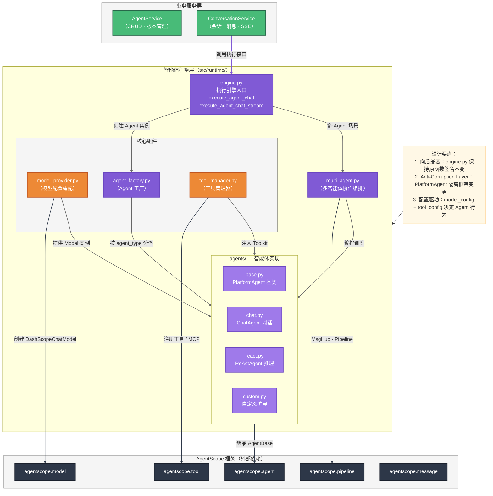
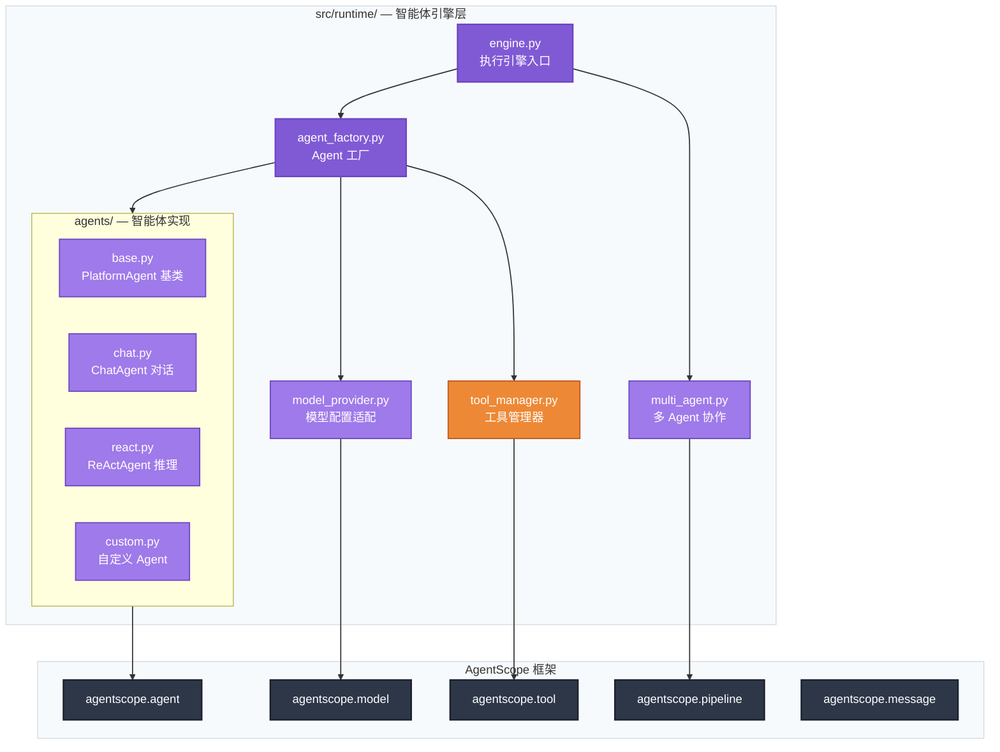
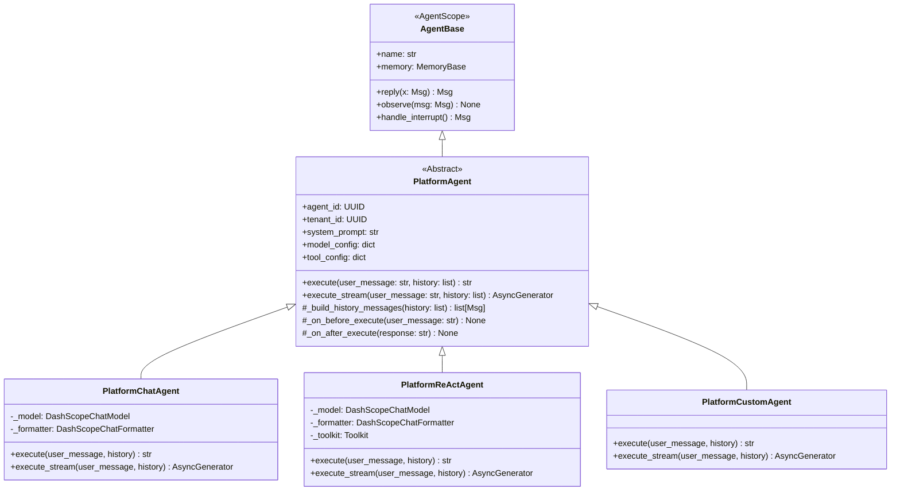
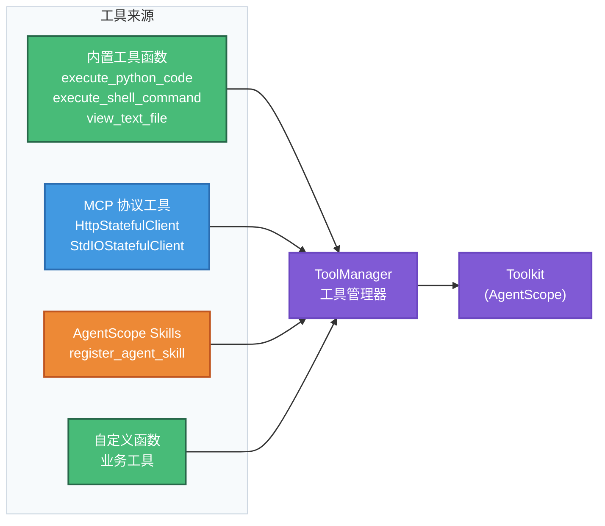
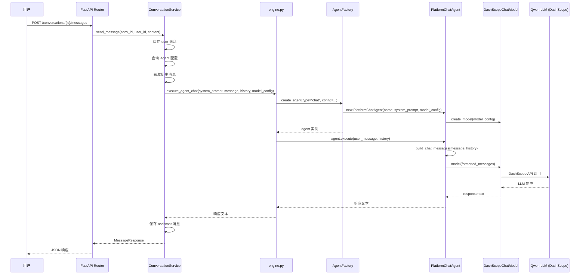
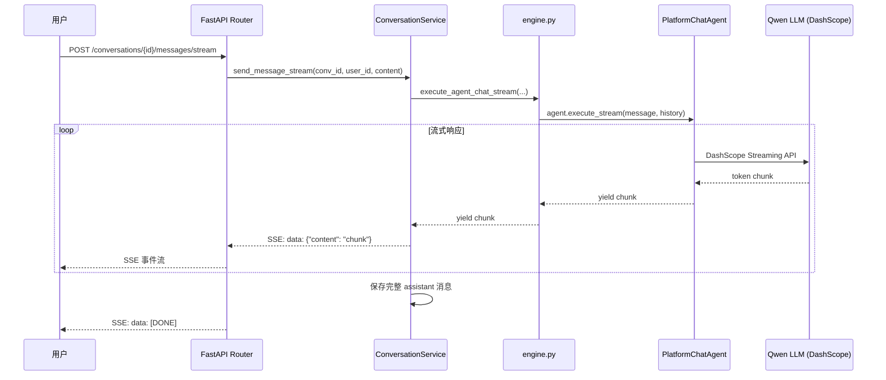

# 智能体引擎层（Agent Runtime Engine）详细设计文档

> **文档版本**：v1.0  
> **关联文档**：[智能体平台后端架构设计文档 v1.0](./智能体平台后端架构设计文档_v1.0.md)  
> **模块定位**：`src/runtime/` — 智能体引擎层，集成 AgentScope 框架，实现智能体实例化、执行、多 Agent 协作与工具调用

---

## 一、设计目标

### 1.1 核心目标

将当前 `src/runtime/engine.py` 的 **Mock 回显实现** 升级为基于 AgentScope 的 **真实智能体执行引擎**，实现：

1. **真实 LLM 对话**：集成 DashScope Qwen 系列模型，支持流式/非流式对话
2. **智能体基类抽象**：统一不同类型智能体的接口，支持灵活扩展
3. **多类型智能体**：支持 ChatAgent（对话）、ReActAgent（推理+工具）、自定义 Agent
4. **多智能体协作**：支持顺序执行、并行执行、消息广播等协作模式
5. **工具与技能**：支持内置工具函数、MCP 协议工具、AgentScope Skills
6. **环境变量配置**：Qwen 模型通过环境变量灵活配置，支持多模型切换

### 1.2 设计原则

| 原则 | 说明 |
|------|------|
| **Anti-Corruption Layer** | 封装适配层隔离 AgentScope 框架变更影响，上层业务不直接依赖 AgentScope API |
| **向后兼容** | 保持 `execute_agent_chat` / `execute_agent_chat_stream` 函数签名不变，ConversationService 无需修改 |
| **配置驱动** | Agent 行为由数据库中的 `agent_type`、`model_config`、`tool_config` 配置驱动 |
| **可插拔架构** | 模型、工具、记忆等组件均可通过配置替换 |
| **优雅降级** | AgentScope 不可用时回退到 Mock 模式，LLM 调用失败有重试和兜底策略 |

---

## 二、整体架构

### 2.1 引擎层在系统中的位置



### 2.2 模块架构图



---

## 三、模块文件结构

```
src/runtime/
├── __init__.py                 # 模块导出
├── engine.py                   # 执行引擎入口（改造现有文件）
├── agent_factory.py            # Agent 工厂：按 agent_type 创建 AgentScope Agent
├── model_provider.py           # 模型配置适配：环境变量 → DashScopeChatModel
├── tool_manager.py             # 工具管理器：注册内置工具、MCP 工具、Skills
├── multi_agent.py              # 多智能体协作编排
└── agents/                     # 平台智能体实现
    ├── __init__.py
    ├── base.py                 # PlatformAgent 基类
    ├── chat.py                 # ChatAgent —— 纯对话型
    ├── react.py                # ReActAgent —— 推理 + 工具调用
    └── custom.py               # CustomAgent —— 自定义扩展（预留）
```

### 与现有文件的关系

| 文件 | 操作 | 说明 |
|------|------|------|
| `src/runtime/engine.py` | **改造** | 保持原有函数签名，内部实现替换为真实 AgentScope 调用 |
| `src/conversation/service.py` | **无需修改** | 仍通过 `execute_agent_chat` / `execute_agent_chat_stream` 调用 |
| `src/config.py` | **扩展** | 新增 LLM 模型相关配置项 |
| `.env` | **扩展** | 新增 `DASHSCOPE_API_KEY`、模型名称等环境变量 |

---

## 四、环境变量与配置设计

### 4.1 新增环境变量（`.env`）

```bash
# ========== LLM Model (Qwen via DashScope) ==========
DASHSCOPE_API_KEY=sk-xxxxxxxxxxxxxxxxxxxxxxxx
DEFAULT_MODEL_NAME=qwen-max
DEFAULT_MODEL_STREAM=true
DEFAULT_MODEL_ENABLE_THINKING=false
DEFAULT_MODEL_MAX_TOKENS=4096
DEFAULT_MODEL_TEMPERATURE=0.7

# ========== Embedding Model ==========
EMBEDDING_MODEL_NAME=text-embedding-v4
EMBEDDING_DIMENSIONS=1024

# ========== Agent Runtime ==========
AGENT_MAX_REACT_ITERATIONS=10
AGENT_EXECUTION_TIMEOUT=120
AGENT_FALLBACK_TO_MOCK=false
```

### 4.2 Config 扩展（`src/config.py`）

```python
class Settings(BaseSettings):
    # ... 现有配置保持不变 ...

    # LLM Model Configuration (Qwen via DashScope)
    DASHSCOPE_API_KEY: str = ""
    DEFAULT_MODEL_NAME: str = "qwen-max"
    DEFAULT_MODEL_STREAM: bool = True
    DEFAULT_MODEL_ENABLE_THINKING: bool = False
    DEFAULT_MODEL_MAX_TOKENS: int = 4096
    DEFAULT_MODEL_TEMPERATURE: float = 0.7

    # Embedding Model
    EMBEDDING_MODEL_NAME: str = "text-embedding-v4"
    EMBEDDING_DIMENSIONS: int = 1024

    # Agent Runtime
    AGENT_MAX_REACT_ITERATIONS: int = 10
    AGENT_EXECUTION_TIMEOUT: int = 120       # 秒
    AGENT_FALLBACK_TO_MOCK: bool = False      # AgentScope 不可用时回退 Mock
```

### 4.3 配置优先级

Agent 执行时的模型配置按以下优先级合并：

```
Agent.model_config_json（数据库）  >  环境变量默认值（.env）
```

即：创建智能体时如果指定了 `llm_config`，则优先使用；未指定的字段从环境变量取默认值。

---

## 五、智能体基类抽象设计

### 5.1 类图



### 5.2 基类设计（`agents/base.py`）

```python
"""平台智能体基类 —— AgentScope 适配层"""

import uuid
import logging
from abc import abstractmethod
from typing import AsyncGenerator

from agentscope.agent import AgentBase
from agentscope.memory import InMemoryMemory
from agentscope.message import Msg

logger = logging.getLogger(__name__)


class PlatformAgent(AgentBase):
    """平台智能体基类。
    
    作为 AgentScope AgentBase 与平台业务之间的 Anti-Corruption Layer，
    封装平台特有的执行语义（同步/流式、历史注入、配置驱动等），
    同时保持与 AgentScope 生态的兼容。
    """

    def __init__(
        self,
        name: str,
        agent_id: uuid.UUID | None = None,
        tenant_id: uuid.UUID | None = None,
        system_prompt: str = "",
        model_config: dict | None = None,
        tool_config: dict | None = None,
    ):
        super().__init__()
        self.name = name
        self.agent_id = agent_id
        self.tenant_id = tenant_id
        self.system_prompt = system_prompt or "你是一个有帮助的AI助手。"
        self.model_config = model_config or {}
        self.tool_config = tool_config or {}
        self.memory = InMemoryMemory()

    @abstractmethod
    async def execute(
        self,
        user_message: str,
        history: list[dict] | None = None,
    ) -> str:
        """同步执行，返回完整响应文本。"""

    @abstractmethod
    async def execute_stream(
        self,
        user_message: str,
        history: list[dict] | None = None,
    ) -> AsyncGenerator[str, None]:
        """流式执行，逐块 yield 响应文本。"""

    def _build_history_messages(self, history: list[dict] | None) -> list[Msg]:
        """将平台历史消息格式转换为 AgentScope Msg 列表。"""
        if not history:
            return []
        return [
            Msg(name=h.get("role", "user"), content=h["content"], role=h["role"])
            for h in history
        ]

    async def reply(self, x=None):
        """实现 AgentScope AgentBase 接口，使 Agent 可参与 pipeline。"""
        if x is None:
            return Msg(name=self.name, content="", role="assistant")
        user_message = x.content if isinstance(x, Msg) else str(x)
        response = await self.execute(user_message)
        msg = Msg(name=self.name, content=response, role="assistant")
        await self.memory.add(msg)
        return msg

    async def observe(self, msg=None):
        if msg is not None:
            if isinstance(msg, Msg):
                await self.memory.add(msg)
            elif isinstance(msg, list):
                for m in msg:
                    await self.memory.add(m)

    async def handle_interrupt(self, *args, **kwargs):
        return Msg(
            name=self.name,
            content="操作已中断。",
            role="assistant",
        )
```

### 5.3 设计要点

| 要点 | 说明 |
|------|------|
| **双重接口** | 既实现 AgentScope 的 `reply()`（用于 pipeline/MsgHub），又提供平台专用的 `execute()` / `execute_stream()`（用于 ConversationService） |
| **历史转换** | `_build_history_messages()` 负责 `[{"role", "content"}]` → `[Msg]` 的格式桥接 |
| **钩子方法** | `_on_before_execute` / `_on_after_execute` 预留扩展点（日志、审计、指标采集） |
| **配置注入** | `model_config` / `tool_config` 在构造时注入，子类按需解析 |

---

## 六、智能体类型实现

### 6.1 ChatAgent — 纯对话型（`agents/chat.py`）

最简单的智能体类型，直接使用 DashScopeChatModel 进行多轮对话，不具备工具调用能力。

```python
"""ChatAgent —— 纯对话型智能体"""

import logging
from typing import AsyncGenerator

from agentscope.formatter import DashScopeChatFormatter
from agentscope.message import Msg

from src.runtime.agents.base import PlatformAgent
from src.runtime.model_provider import create_model

logger = logging.getLogger(__name__)


class PlatformChatAgent(PlatformAgent):
    """纯对话型智能体，基于 DashScopeChatModel 实现多轮对话。"""

    def __init__(self, **kwargs):
        super().__init__(**kwargs)
        self._model = create_model(self.model_config)
        self._formatter = DashScopeChatFormatter()

    async def execute(
        self,
        user_message: str,
        history: list[dict] | None = None,
    ) -> str:
        messages = self._build_chat_messages(user_message, history)
        formatted = self._formatter.format(messages)
        response = await self._model(formatted)
        return response.text

    async def execute_stream(
        self,
        user_message: str,
        history: list[dict] | None = None,
    ) -> AsyncGenerator[str, None]:
        messages = self._build_chat_messages(user_message, history)
        formatted = self._formatter.format(messages)
        async for chunk in self._model.stream(formatted):
            if chunk.text:
                yield chunk.text

    def _build_chat_messages(
        self, user_message: str, history: list[dict] | None
    ) -> list[Msg]:
        """构建包含 system_prompt + history + 当前消息的完整消息列表。"""
        messages = []
        if self.system_prompt:
            messages.append(Msg("system", self.system_prompt, "system"))
        messages.extend(self._build_history_messages(history))
        messages.append(Msg("user", user_message, "user"))
        return messages
```

**适用场景**：简单的客服对话、问答、内容生成等。

### 6.2 ReActAgent — 推理+工具型（`agents/react.py`）

支持 ReAct 推理循环 + 工具调用，适用于需要使用外部工具完成任务的场景。

```python
"""ReActAgent —— 推理 + 工具调用型智能体"""

import logging
from typing import AsyncGenerator

from agentscope.agent import ReActAgent
from agentscope.formatter import DashScopeChatFormatter
from agentscope.memory import InMemoryMemory
from agentscope.message import Msg

from src.runtime.agents.base import PlatformAgent
from src.runtime.model_provider import create_model
from src.runtime.tool_manager import ToolManager

logger = logging.getLogger(__name__)


class PlatformReActAgent(PlatformAgent):
    """推理+工具调用型智能体，基于 AgentScope ReActAgent 实现。"""

    def __init__(self, max_iterations: int = 10, **kwargs):
        super().__init__(**kwargs)
        self._model = create_model(self.model_config)
        self._formatter = DashScopeChatFormatter()
        self._max_iterations = max_iterations

        # 通过 ToolManager 根据 tool_config 构建 Toolkit
        self._tool_manager = ToolManager()
        self._toolkit = self._tool_manager.build_toolkit(self.tool_config)

        # 内部 AgentScope ReActAgent 实例
        self._react_agent = ReActAgent(
            name=self.name,
            sys_prompt=self.system_prompt,
            model=self._model,
            formatter=self._formatter,
            toolkit=self._toolkit,
            memory=InMemoryMemory(),
            max_iters=self._max_iterations,
        )

    async def execute(
        self,
        user_message: str,
        history: list[dict] | None = None,
    ) -> str:
        # 注入历史消息到 ReActAgent memory
        await self._inject_history(history)
        msg = Msg("user", user_message, "user")
        response = await self._react_agent(msg)
        return response.content

    async def execute_stream(
        self,
        user_message: str,
        history: list[dict] | None = None,
    ) -> AsyncGenerator[str, None]:
        await self._inject_history(history)
        msg = Msg("user", user_message, "user")

        # 利用 AgentScope stream_printing_messages 机制
        # 将 ReActAgent 的输出转为 AsyncGenerator
        from agentscope.tool import stream_printing_messages

        async with stream_printing_messages(self._react_agent) as stream:
            task = asyncio.create_task(self._react_agent(msg))
            async for chunk_msg in stream:
                if chunk_msg.content:
                    yield chunk_msg.content
            await task

    async def _inject_history(self, history: list[dict] | None):
        """清空并重新注入历史消息。"""
        await self._react_agent.memory.clear()
        if history:
            for msg in self._build_history_messages(history):
                await self._react_agent.memory.add(msg)
```

**适用场景**：需要搜索、计算、代码执行、API 调用等工具辅助的复杂任务。

### 6.3 CustomAgent — 自定义扩展（`agents/custom.py`）

预留扩展点，支持用户通过配置或代码注册自定义 Agent 类型。

```python
"""CustomAgent —— 自定义扩展型智能体（预留）"""

import logging
from typing import AsyncGenerator

from src.runtime.agents.base import PlatformAgent

logger = logging.getLogger(__name__)


class PlatformCustomAgent(PlatformAgent):
    """自定义智能体，通过 agent_config 中的自定义参数驱动行为。
    
    当前为预留实现，后续可支持：
    - 自定义 prompt 模板
    - 结构化输出 (structured_model)
    - 自定义 ReAct 循环逻辑
    - 特殊模型集成（如 qwen-deep-research）
    """

    async def execute(
        self,
        user_message: str,
        history: list[dict] | None = None,
    ) -> str:
        logger.warning(
            "CustomAgent [%s] 尚未实现自定义逻辑，回退到 ChatAgent 行为",
            self.name,
        )
        from src.runtime.agents.chat import PlatformChatAgent
        fallback = PlatformChatAgent(
            name=self.name,
            system_prompt=self.system_prompt,
            model_config=self.model_config,
        )
        return await fallback.execute(user_message, history)

    async def execute_stream(
        self,
        user_message: str,
        history: list[dict] | None = None,
    ) -> AsyncGenerator[str, None]:
        from src.runtime.agents.chat import PlatformChatAgent
        fallback = PlatformChatAgent(
            name=self.name,
            system_prompt=self.system_prompt,
            model_config=self.model_config,
        )
        async for chunk in fallback.execute_stream(user_message, history):
            yield chunk
```

### 6.4 agent_type 映射关系

| `agent_type`（数据库） | 平台 Agent 类 | AgentScope 底层 | 能力 |
|------------------------|---------------|-----------------|------|
| `chat` | `PlatformChatAgent` | `DashScopeChatModel` 直调 | 纯对话，无工具 |
| `react` | `PlatformReActAgent` | `ReActAgent` | 推理 + 工具调用 |
| `task` | `PlatformReActAgent` | `ReActAgent` (max_iters 更高) | 复杂任务执行 |
| `custom` | `PlatformCustomAgent` | 可配置 | 自定义扩展 |
| `workflow` | 预留 | Multi-Agent Pipeline | Phase 2 实现 |

---

## 七、Agent 工厂设计（`agent_factory.py`）

```python
"""Agent 工厂 —— 根据 agent_type 和配置创建对应的平台 Agent 实例。"""

import uuid
import logging

from src.config import get_settings
from src.runtime.agents.base import PlatformAgent
from src.runtime.agents.chat import PlatformChatAgent
from src.runtime.agents.react import PlatformReActAgent
from src.runtime.agents.custom import PlatformCustomAgent

logger = logging.getLogger(__name__)

# Agent 类型注册表
_AGENT_REGISTRY: dict[str, type[PlatformAgent]] = {
    "chat": PlatformChatAgent,
    "react": PlatformReActAgent,
    "task": PlatformReActAgent,
    "custom": PlatformCustomAgent,
}


def register_agent_type(agent_type: str, agent_class: type[PlatformAgent]):
    """注册自定义 Agent 类型（插件扩展点）。"""
    _AGENT_REGISTRY[agent_type] = agent_class
    logger.info("注册 Agent 类型: %s -> %s", agent_type, agent_class.__name__)


def create_agent(
    name: str,
    agent_type: str = "chat",
    agent_id: uuid.UUID | None = None,
    tenant_id: uuid.UUID | None = None,
    system_prompt: str = "",
    model_config: dict | None = None,
    tool_config: dict | None = None,
) -> PlatformAgent:
    """根据 agent_type 创建对应的智能体实例。"""
    settings = get_settings()

    agent_class = _AGENT_REGISTRY.get(agent_type)
    if agent_class is None:
        logger.warning(
            "未知 agent_type '%s'，回退到 chat 类型", agent_type
        )
        agent_class = PlatformChatAgent

    extra_kwargs = {}
    if agent_type == "task":
        extra_kwargs["max_iterations"] = settings.AGENT_MAX_REACT_ITERATIONS * 2

    agent = agent_class(
        name=name,
        agent_id=agent_id,
        tenant_id=tenant_id,
        system_prompt=system_prompt,
        model_config=model_config,
        tool_config=tool_config,
        **extra_kwargs,
    )

    logger.info(
        "创建 Agent: name=%s, type=%s, class=%s",
        name, agent_type, agent_class.__name__,
    )
    return agent
```

### 工厂模式要点

1. **注册表模式**：通过 `_AGENT_REGISTRY` 字典实现类型→类的映射，支持动态注册
2. **安全回退**：未知 `agent_type` 自动回退到 `PlatformChatAgent`
3. **配置透传**：`model_config` / `tool_config` 透传给 Agent 构造函数，由各子类自行解析
4. **可扩展**：第三方可通过 `register_agent_type()` 注册新类型

---

## 八、模型配置适配（`model_provider.py`）

### 8.1 设计目标

将平台的 `model_config`（来自数据库 JSONB）+ 环境变量默认值，转换为 AgentScope 的 `DashScopeChatModel` 实例。

### 8.2 实现设计

```python
"""模型配置适配器 —— 将平台配置转换为 AgentScope Model 实例。"""

import logging
from agentscope.model import DashScopeChatModel
from src.config import get_settings

logger = logging.getLogger(__name__)


def create_model(model_config: dict | None = None) -> DashScopeChatModel:
    """根据配置创建 DashScopeChatModel 实例。

    配置优先级：model_config（数据库）> 环境变量默认值
    """
    settings = get_settings()
    config = model_config or {}

    api_key = config.get("api_key") or settings.DASHSCOPE_API_KEY
    if not api_key:
        raise ValueError(
            "未配置 DASHSCOPE_API_KEY，请在 .env 文件或智能体模型配置中设置"
        )

    model_name = config.get("model_name", settings.DEFAULT_MODEL_NAME)
    stream = config.get("stream", settings.DEFAULT_MODEL_STREAM)
    enable_thinking = config.get(
        "enable_thinking", settings.DEFAULT_MODEL_ENABLE_THINKING
    )

    generate_kwargs = {}
    if "max_tokens" in config:
        generate_kwargs["max_tokens"] = config["max_tokens"]
    elif settings.DEFAULT_MODEL_MAX_TOKENS:
        generate_kwargs["max_tokens"] = settings.DEFAULT_MODEL_MAX_TOKENS
    if "temperature" in config:
        generate_kwargs["temperature"] = config["temperature"]
    elif settings.DEFAULT_MODEL_TEMPERATURE is not None:
        generate_kwargs["temperature"] = settings.DEFAULT_MODEL_TEMPERATURE

    model = DashScopeChatModel(
        api_key=api_key,
        model_name=model_name,
        stream=stream,
        enable_thinking=enable_thinking,
        generate_kwargs=generate_kwargs or None,
    )

    logger.info("创建模型: %s (stream=%s)", model_name, stream)
    return model
```

### 8.3 支持的 model_config 字段

| 字段 | 类型 | 默认值（环境变量） | 说明 |
|------|------|-------------------|------|
| `api_key` | `str` | `DASHSCOPE_API_KEY` | DashScope API Key |
| `model_name` | `str` | `DEFAULT_MODEL_NAME` (qwen-max) | 模型名称 |
| `stream` | `bool` | `DEFAULT_MODEL_STREAM` (true) | 是否流式 |
| `enable_thinking` | `bool` | `DEFAULT_MODEL_ENABLE_THINKING` (false) | 是否启用思维链 |
| `max_tokens` | `int` | `DEFAULT_MODEL_MAX_TOKENS` (4096) | 最大生成 token 数 |
| `temperature` | `float` | `DEFAULT_MODEL_TEMPERATURE` (0.7) | 采样温度 |

### 8.4 支持的 Qwen 模型列表

| 模型名 | 类型 | 推荐场景 |
|--------|------|----------|
| `qwen-max` | 通用对话 | 默认模型，综合能力最强 |
| `qwen3-max` | 通用对话 | 新一代通用模型 |
| `qwen-plus` | 通用对话 | 性价比更高 |
| `qwen-turbo` | 通用对话 | 速度最快，轻量任务 |
| `qwen-long` | 长文本 | 超长上下文任务 |
| `qwen3-max-preview` | 预览版 | 最新特性体验 |

---

## 九、工具与技能管理（`tool_manager.py`）

### 9.1 工具体系架构



### 9.2 tool_config 配置格式

智能体的 `tool_config`（JSONB）定义了该智能体可使用的工具集合：

```json
{
  "builtin_tools": [
    "execute_python_code",
    "execute_shell_command",
    "view_text_file"
  ],
  "mcp_clients": [
    {
      "name": "search_mcp",
      "transport": "sse",
      "url": "http://localhost:8001/sse"
    },
    {
      "name": "playwright_mcp",
      "transport": "stdio",
      "command": "npx",
      "args": ["@playwright/mcp@latest"]
    }
  ],
  "skills": [
    "/path/to/skills/A2UI_response_generator"
  ],
  "custom_functions": []
}
```

### 9.3 ToolManager 实现设计

```python
"""工具管理器 —— 根据 tool_config 构建 AgentScope Toolkit。"""

import logging
from agentscope.tool import (
    Toolkit,
    execute_python_code,
    execute_shell_command,
    view_text_file,
)

logger = logging.getLogger(__name__)

# 内置工具注册表
_BUILTIN_TOOLS = {
    "execute_python_code": execute_python_code,
    "execute_shell_command": execute_shell_command,
    "view_text_file": view_text_file,
}


class ToolManager:
    """工具管理器，根据 tool_config 构建 Toolkit。"""

    def build_toolkit(self, tool_config: dict | None = None) -> Toolkit:
        """根据配置构建 Toolkit 实例。"""
        toolkit = Toolkit()
        if not tool_config:
            return toolkit

        # 1. 注册内置工具
        for tool_name in tool_config.get("builtin_tools", []):
            if tool_name in _BUILTIN_TOOLS:
                toolkit.register_tool_function(_BUILTIN_TOOLS[tool_name])
                logger.info("注册内置工具: %s", tool_name)
            else:
                logger.warning("未知内置工具: %s", tool_name)

        # 2. 注册 AgentScope Skills
        for skill_path in tool_config.get("skills", []):
            try:
                toolkit.register_agent_skill(skill_path)
                logger.info("注册 Skill: %s", skill_path)
            except Exception as e:
                logger.error("注册 Skill 失败 [%s]: %s", skill_path, e)

        return toolkit

    async def build_toolkit_with_mcp(
        self, tool_config: dict | None = None
    ) -> Toolkit:
        """构建包含 MCP 工具的 Toolkit（需要异步连接）。"""
        toolkit = self.build_toolkit(tool_config)
        if not tool_config:
            return toolkit

        # 3. 注册 MCP 工具
        for mcp_conf in tool_config.get("mcp_clients", []):
            try:
                client = await self._create_mcp_client(mcp_conf)
                await toolkit.register_mcp_client(client)
                logger.info("注册 MCP 工具: %s", mcp_conf["name"])
            except Exception as e:
                logger.error(
                    "注册 MCP 工具失败 [%s]: %s", mcp_conf.get("name"), e
                )

        return toolkit

    async def _create_mcp_client(self, mcp_conf: dict):
        """根据配置创建 MCP Client 实例。"""
        transport = mcp_conf.get("transport", "sse")

        if transport == "stdio":
            from agentscope.mcp import StdIOStatefulClient
            client = StdIOStatefulClient(
                name=mcp_conf["name"],
                command=mcp_conf["command"],
                args=mcp_conf.get("args", []),
            )
        elif transport == "sse":
            from agentscope.mcp import HttpStatefulClient
            client = HttpStatefulClient(
                name=mcp_conf["name"],
                transport="sse",
                url=mcp_conf["url"],
            )
        elif transport == "streamable_http":
            from agentscope.mcp import HttpStatelessClient
            client = HttpStatelessClient(
                name=mcp_conf["name"],
                transport="streamable_http",
                url=mcp_conf["url"],
            )
        else:
            raise ValueError(f"不支持的 MCP transport: {transport}")

        if hasattr(client, 'connect'):
            await client.connect()
        return client
```

---

## 十、执行引擎改造（`engine.py`）

### 10.1 改造后的 engine.py

保持原有函数签名完全不变，内部替换为真实 AgentScope 调用：

```python
"""Agent Runtime Engine —— 智能体执行引擎。

提供 execute_agent_chat / execute_agent_chat_stream 两个入口函数，
由 ConversationService 调用。内部通过 AgentFactory 创建对应类型的
AgentScope Agent 实例，执行真实 LLM 对话。
"""

import asyncio
import logging
from typing import AsyncGenerator

from src.config import get_settings
from src.runtime.agent_factory import create_agent

logger = logging.getLogger(__name__)


async def execute_agent_chat(
    system_prompt: str,
    user_message: str,
    history: list[dict] | None = None,
    model_config: dict | None = None,
    # ---- 以下为新增可选参数（向后兼容） ----
    agent_type: str = "chat",
    agent_name: str = "Assistant",
    agent_id=None,
    tenant_id=None,
    tool_config: dict | None = None,
) -> str:
    """非流式智能体执行。

    保持与 MVP 版本相同的函数签名（前 4 个参数），新增参数均有默认值。
    """
    settings = get_settings()

    try:
        agent = create_agent(
            name=agent_name,
            agent_type=agent_type,
            agent_id=agent_id,
            tenant_id=tenant_id,
            system_prompt=system_prompt,
            model_config=model_config,
            tool_config=tool_config,
        )
        response = await asyncio.wait_for(
            agent.execute(user_message, history),
            timeout=settings.AGENT_EXECUTION_TIMEOUT,
        )
        return response

    except asyncio.TimeoutError:
        logger.error("Agent 执行超时 (timeout=%ss)", settings.AGENT_EXECUTION_TIMEOUT)
        return "抱歉，响应超时，请稍后重试。"

    except Exception as e:
        logger.error("Agent 执行异常: %s", e, exc_info=True)

        if settings.AGENT_FALLBACK_TO_MOCK:
            logger.warning("回退到 Mock 模式")
            return await _mock_execute(system_prompt, user_message, history)

        return f"抱歉，处理您的请求时出现问题：{type(e).__name__}"


async def execute_agent_chat_stream(
    system_prompt: str,
    user_message: str,
    history: list[dict] | None = None,
    model_config: dict | None = None,
    # ---- 新增可选参数 ----
    agent_type: str = "chat",
    agent_name: str = "Assistant",
    agent_id=None,
    tenant_id=None,
    tool_config: dict | None = None,
) -> AsyncGenerator[str, None]:
    """流式智能体执行。"""
    settings = get_settings()

    try:
        agent = create_agent(
            name=agent_name,
            agent_type=agent_type,
            agent_id=agent_id,
            tenant_id=tenant_id,
            system_prompt=system_prompt,
            model_config=model_config,
            tool_config=tool_config,
        )
        async for chunk in agent.execute_stream(user_message, history):
            yield chunk

    except Exception as e:
        logger.error("Agent 流式执行异常: %s", e, exc_info=True)

        if settings.AGENT_FALLBACK_TO_MOCK:
            async for chunk in _mock_execute_stream(
                system_prompt, user_message, history
            ):
                yield chunk
        else:
            yield f"抱歉，处理您的请求时出现问题：{type(e).__name__}"


# ---- Mock 回退实现（保留用于降级） ----

async def _mock_execute(
    system_prompt: str, user_message: str, history: list[dict] | None
) -> str:
    response = (
        f"[Mock 模式] 收到消息: \"{user_message}\"\n"
        f"系统提示词: \"{system_prompt[:100]}...\"\n"
        f"历史消息数: {len(history) if history else 0}\n"
        f"AgentScope 暂不可用，已回退到 Mock 模式。"
    )
    await asyncio.sleep(0.1)
    return response


async def _mock_execute_stream(
    system_prompt: str, user_message: str, history: list[dict] | None
) -> AsyncGenerator[str, None]:
    chunks = [
        "[Mock 模式] ",
        f"收到消息: \"{user_message}\"。",
        "\nAgentScope 暂不可用，已回退到 Mock 模式。",
    ]
    for chunk in chunks:
        yield chunk
        await asyncio.sleep(0.05)
```

### 10.2 ConversationService 调用增强（可选改造）

当前 `ConversationService.send_message()` 只传 `system_prompt`、`user_message`、`history`、`model_config` 四个参数。为了让引擎层知道 `agent_type` 和 `tool_config`，可在未来小幅改造调用处：

```python
# conversation/service.py 改造示例（向后兼容，不影响现有逻辑）
response_text = await execute_agent_chat(
    system_prompt=agent.system_prompt if agent else "",
    user_message=content,
    history=history,
    model_config=agent.model_config_json if agent else None,
    # 新增参数
    agent_type=agent.agent_type if agent else "chat",
    agent_name=agent.name if agent else "Assistant",
    agent_id=agent.id if agent else None,
    tenant_id=conv.tenant_id,
    tool_config=agent.tool_config if agent else None,
)
```

由于新增参数均有默认值，**不改造也不会报错**，只是所有 Agent 都会以 `chat` 类型运行。

---

## 十一、多智能体协作设计（`multi_agent.py`）

### 11.1 协作模式

基于 AgentScope 的 pipeline 模块，支持以下协作模式：

| 模式 | AgentScope API | 适用场景 |
|------|---------------|----------|
| **顺序执行** | `sequential_pipeline` | 多 Agent 依次处理，每个 Agent 看到前一个的输出 |
| **并行执行** | `fanout_pipeline` | 多 Agent 并行处理同一输入，收集所有结果 |
| **消息广播** | `MsgHub` | 多 Agent 在共享上下文中对话，类似群聊 |
| **主从协作** | 自定义 | 主 Agent 动态创建/调度子 Agent |

### 11.2 协作编排器设计

```python
"""多智能体协作编排器。"""

import logging
from typing import Optional

from agentscope.message import Msg
from agentscope.pipeline import MsgHub, sequential_pipeline, fanout_pipeline

from src.runtime.agents.base import PlatformAgent

logger = logging.getLogger(__name__)


class MultiAgentOrchestrator:
    """多智能体协作编排器。"""

    @staticmethod
    async def sequential(
        agents: list[PlatformAgent],
        initial_message: str,
        announcement: str | None = None,
    ) -> list[Msg]:
        """顺序执行多个 Agent。"""
        results = []
        async with MsgHub(
            participants=agents,
            announcement=Msg("system", announcement, "system") if announcement else None,
        ):
            msgs = await sequential_pipeline(agents)
            if isinstance(msgs, list):
                results = msgs
            else:
                results = [msgs]
        return results

    @staticmethod
    async def parallel(
        agents: list[PlatformAgent],
        initial_message: str,
    ) -> list[Msg]:
        """并行执行多个 Agent，收集结果。"""
        msg = Msg("user", initial_message, "user")
        for agent in agents:
            await agent.observe(msg)

        results = await fanout_pipeline(
            agents=agents,
            enable_gather=True,
        )
        return results

    @staticmethod
    async def discussion(
        agents: list[PlatformAgent],
        topic: str,
        rounds: int = 3,
    ) -> list[Msg]:
        """多 Agent 讨论模式，每轮每个 Agent 发言一次。"""
        all_messages = []
        async with MsgHub(
            participants=agents,
            announcement=Msg("system", f"讨论主题：{topic}", "system"),
        ):
            for _ in range(rounds):
                round_msgs = await sequential_pipeline(agents)
                if isinstance(round_msgs, list):
                    all_messages.extend(round_msgs)
                else:
                    all_messages.append(round_msgs)
        return all_messages
```

### 11.3 多智能体协作配置格式

后续可在 Agent 的 `tool_config` 或独立的 `workflow_config` 中配置：

```json
{
  "collaboration": {
    "mode": "sequential",
    "agents": [
      {"agent_id": "uuid-1", "role": "researcher"},
      {"agent_id": "uuid-2", "role": "writer"},
      {"agent_id": "uuid-3", "role": "reviewer"}
    ],
    "rounds": 1
  }
}
```

---

## 十二、核心执行时序

### 12.1 单 Agent 对话时序



### 12.2 流式对话时序



---

## 十三、错误处理与韧性设计

### 13.1 错误分层

| 层级 | 错误类型 | 处理策略 |
|------|---------|---------|
| **配置层** | API Key 缺失、模型名无效 | 启动/创建时 fast-fail，返回明确错误信息 |
| **网络层** | DashScope API 超时/不可达 | 重试 2 次（指数退避），超时后返回友好提示 |
| **模型层** | 限流 (429)、余额不足 | 限流时重试，余额不足返回明确提示 |
| **执行层** | Agent 死循环、工具调用失败 | max_iters 限制 + 全局超时 (AGENT_EXECUTION_TIMEOUT) |
| **系统层** | AgentScope 框架异常 | AGENT_FALLBACK_TO_MOCK=true 时回退 Mock |

### 13.2 超时控制

```python
# engine.py 中的超时控制
response = await asyncio.wait_for(
    agent.execute(user_message, history),
    timeout=settings.AGENT_EXECUTION_TIMEOUT,  # 默认 120 秒
)
```

### 13.3 降级策略

```
正常模式 → LLM 调用失败 → 重试 2 次 → 回退 Mock 模式（如启用）→ 返回错误提示
```

---

## 十四、与 agentscope_examples 的关系

### 14.1 参考映射

| agentscope_examples | 引擎层对应 | 集成方式 |
|---------------------|-----------|---------|
| `agent/react_agent/` | `agents/react.py` | 内部使用 `ReActAgent`，相同的 model + toolkit 配置模式 |
| `workflows/multiagent_conversation/` | `multi_agent.py` | 使用 `MsgHub` + `sequential_pipeline` |
| `workflows/multiagent_concurrent/` | `multi_agent.py` | 使用 `fanout_pipeline` |
| `functionality/mcp/` | `tool_manager.py` | MCP Client 注册方式完全复用 |
| `functionality/rag/` | 未来 RAG 模块 | `knowledge` 参数注入 ReActAgent |
| `integration/qwen_deep_research_model/` | `agents/custom.py` 扩展 | 可注册为自定义 Agent 类型 |
| `agent/browser_agent/` | 未来扩展 | 可注册为 `browser` 类型 Agent |

### 14.2 已验证的模式复用

引擎层的设计直接复用了 `agentscope_examples` 中已验证的模式：

- **模型创建**：`DashScopeChatModel(api_key=..., model_name="qwen-max", stream=True)` → `model_provider.py`
- **Formatter**：`DashScopeChatFormatter()` / `DashScopeMultiAgentFormatter()` → 各 Agent 子类
- **工具注册**：`toolkit.register_tool_function(...)` → `tool_manager.py`
- **MCP 集成**：`HttpStatefulClient` / `StdIOStatefulClient` → `tool_manager.py`
- **Memory**：`InMemoryMemory()` → `agents/base.py`
- **Pipeline**：`MsgHub` + `sequential_pipeline` / `fanout_pipeline` → `multi_agent.py`

---

## 十五、依赖管理

### 15.1 新增 Python 依赖

```
# requirements.txt 新增
agentscope                    # AgentScope 核心框架
dashscope                     # DashScope SDK（Qwen 模型调用）
```

### 15.2 可选依赖（按需引入）

```
# 工具相关
agentscope[mcp]               # MCP 协议支持

# RAG 相关（Phase 2）
qdrant-client                 # Qdrant 向量存储
```

---

## 十六、实施计划

### 16.1 分步实施

| 步骤 | 内容 | 预计工期 | 前置依赖 |
|------|------|---------|---------|
| **Step 1** | 环境配置 + `model_provider.py` | 1 天 | DASHSCOPE_API_KEY |
| **Step 2** | `agents/base.py` + `agents/chat.py` | 2 天 | Step 1 |
| **Step 3** | `agent_factory.py` + `engine.py` 改造 | 1 天 | Step 2 |
| **Step 4** | 端到端测试（ChatAgent 对话） | 1 天 | Step 3 |
| **Step 5** | `tool_manager.py` + `agents/react.py` | 2 天 | Step 4 |
| **Step 6** | `multi_agent.py` 多 Agent 协作 | 2 天 | Step 5 |
| **Step 7** | `ConversationService` 调用增强 | 0.5 天 | Step 3 |
| **Step 8** | 集成测试 + 文档完善 | 1.5 天 | All |

**总计：约 11 个工作日**

### 16.2 里程碑检查点

| 检查点 | 验证内容 |
|--------|---------|
| ✅ Step 3 完成后 | 通过 API 创建 chat 类型 Agent → 发起对话 → 收到 Qwen 真实响应 |
| ✅ Step 5 完成后 | 创建 react 类型 Agent → 配置工具 → Agent 自主调用工具完成任务 |
| ✅ Step 6 完成后 | 两个以上 Agent 通过 MsgHub 进行多轮协作对话 |
| ✅ Step 8 完成后 | 全部核心链路回归通过，流式/非流式均正常 |

### 16.3 验收标准

- [ ] `agent_type=chat` 的智能体可通过 Qwen 模型进行真实多轮对话
- [ ] `agent_type=react` 的智能体可使用注册工具完成任务
- [ ] 支持 SSE 流式输出真实 LLM token
- [ ] `DASHSCOPE_API_KEY` 通过 `.env` 环境变量配置
- [ ] 支持通过 `model_config` 切换 Qwen 不同模型
- [ ] `AGENT_FALLBACK_TO_MOCK=true` 时可回退到 Mock 模式
- [ ] 多智能体协作（sequential / parallel）基础功能可用
- [ ] 工具注册（内置工具 + MCP）基础功能可用

---

## 附录 A：数据库 model_config 配置示例

### A.1 基础 Chat Agent

```json
{
  "model_name": "qwen-max",
  "temperature": 0.7,
  "max_tokens": 2048
}
```

### A.2 带工具的 ReAct Agent

```json
// model_config
{
  "model_name": "qwen-max",
  "stream": true,
  "enable_thinking": false
}

// tool_config
{
  "builtin_tools": ["execute_python_code", "view_text_file"],
  "mcp_clients": [
    {
      "name": "search",
      "transport": "sse",
      "url": "http://localhost:8001/sse"
    }
  ]
}
```

### A.3 使用 Qwen3 最新模型

```json
{
  "model_name": "qwen3-max",
  "enable_thinking": true,
  "max_tokens": 8192,
  "temperature": 0.5
}
```

---

## 附录 B：AgentScope 核心 API 速查

| API | 所在模块 | 用途 |
|-----|---------|------|
| `ReActAgent(name, sys_prompt, model, formatter, toolkit, memory)` | `agentscope.agent` | 创建 ReAct Agent |
| `DashScopeChatModel(api_key, model_name, stream)` | `agentscope.model` | 创建 DashScope 模型 |
| `DashScopeChatFormatter()` | `agentscope.formatter` | 单 Agent 对话格式化 |
| `DashScopeMultiAgentFormatter()` | `agentscope.formatter` | 多 Agent 对话格式化 |
| `Toolkit()` | `agentscope.tool` | 工具集合 |
| `toolkit.register_tool_function(func)` | `agentscope.tool` | 注册工具函数 |
| `toolkit.register_mcp_client(client)` | `agentscope.tool` | 注册 MCP 工具 |
| `toolkit.register_agent_skill(path)` | `agentscope.tool` | 注册 Skill |
| `InMemoryMemory()` | `agentscope.memory` | 内存式记忆 |
| `Msg(name, content, role)` | `agentscope.message` | 消息对象 |
| `MsgHub(participants, announcement)` | `agentscope.pipeline` | 消息广播 Hub |
| `sequential_pipeline(agents)` | `agentscope.pipeline` | 顺序执行 |
| `fanout_pipeline(agents, enable_gather)` | `agentscope.pipeline` | 并行执行 |
| `HttpStatefulClient(name, transport, url)` | `agentscope.mcp` | MCP HTTP 客户端 |
| `StdIOStatefulClient(name, command, args)` | `agentscope.mcp` | MCP Stdio 客户端 |
